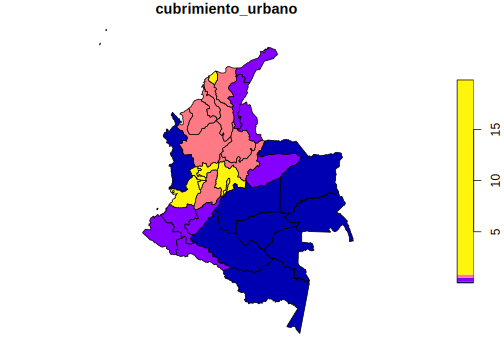
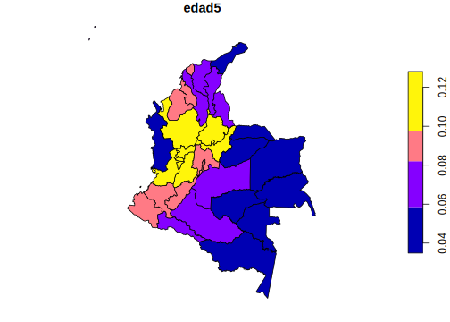
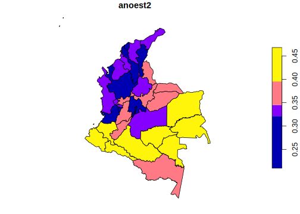
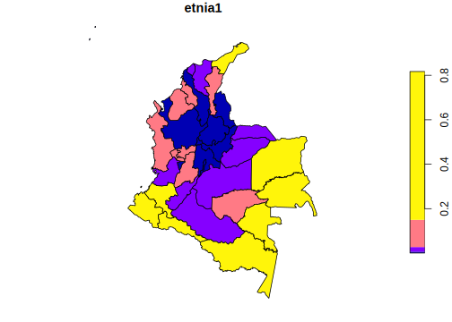
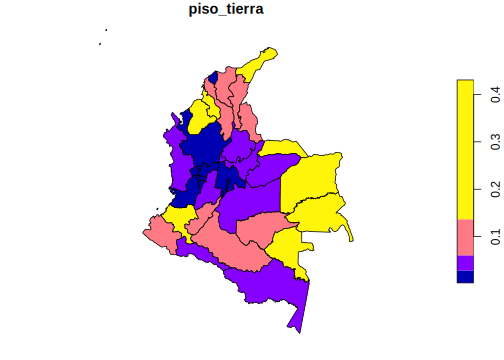

# Día 1 - Sesión 2- Censo e información satelital


## Uso de imágenes satelitales y SAE

Uno de los artículo pioneros de estimación de áreas pequeñas fue el artículo de Singh, R, et. al. (2002) el cual abordó la estimación del rendimiento de cultivos para los tehsil (unidad subadministrativa)  del distriyo Rohtak district en Haryana (India). 


Las imágenes raster representan el mundo mediante un conjunto de celdas contiguas igualmente espaciadas conocidas como pixeles, estas imágenes tienen información como un sistema de información geográfico, Un sistema de referencia de coordenadas. Las imágenes almacenan un identificador, un valor en cada pixel (o un vector con diferentes valores) y cada celda tiene asociada una escala de colores.

Las imágenes pueden obtenerse crudas y procesadas, estas primeras contienen solamente las capas de colores, las segundas contienen también valores que han sido procesados en cada celda (índices de vegetación, intensidad lumínica, tipo de vegetación). 

La información cruda puede utilizarse para entrenar características que se desean entrenar (carreteras, tipo de cultivo, bosque / no bosque), afortunadamente en Google Earth Engine encontramos muchos indicadores  procesadas asociadas a un pixel. Estos indicadores pueden agregarse a nivel de un área geográfica.


### Fuentes de datos de imágenes satelitales

Algunas de las principales fuentes de imágenes satelitales son: 

  * http://earthexplorer.usgs.gov/

  * https://lpdaacsvc.cr.usgs.gov/appeears/

  * https://search.earthdata.nasa.gov/search

  * https://scihub.coGTMnicus.eu/

  * https://aws.amazon.com/public-data-sets/landsat/

Sin embargo la mayor parte de estas fuentes están centralizadas en **Google Earth Engine** que permite buscar fuentes de datos provenientes de imágenes satelitales. GEE se puede manejar por medio de APIS en diferentes lenguajes de programación: Javascript (por defecto), Python y R (paquete rgee).


## Google Earth Eninge


Crear una cuenta en [link](https://earthengine.google.com/), una vez que se ingrese a la cuenta puede buscarse los conjuntos de datos de interés:


* Una vez se busque el conjunto de datos se puede abrir un editor de código brindado por google en  Javascript. 

*  Copiar y pegar la sintaxis que brinda el buscador de conjunto de datos para visualizar la imagen raster y disponer de sentencias que GTMmitan la obtención  del conjunto de datos de interés posteriormente en R


## Instalación de rgee

*  Descargar e instalar anaconda o conda. (<https://www.anaconda.com/products/individual>)

*  Abrir Anaconda prompt y configurar ambiente de trabajo (ambiente python rgee_py) con las siguientes sentencias:


```python
conda create -n rgee_py python=3.9
activate rgee_py
pip install google-api-python-client
pip install earthengine-api
pip install numpy
```

*  Listar los ambientes de Python disponibles en anaconda prompt


```python
conda env list
```


*   Una vez identificado la ruta del ambiente ambiente rgee_py definirla en R (**no se debe olvidar cambiar \\ por /**). 
*   Instalar `reticulate` y `rgee`, cargar paquetes para procesamiento espacial y configurar el ambiente de trabajo como sigue:


```r
library(reticulate) # Conexión con Python
library(rgee) # Conexión con Google Earth Engine
library(sf) # Paquete para manejar datos geográficos
library(dplyr) # Paquete para procesamiento de datos

rgee_environment_dir = "C://Users//sguerrero//Anaconda3//envs//rgee_py//python.exe"

# Configurar python (Algunas veces no es detectado y se debe reiniciar R)
reticulate::use_python(rgee_environment_dir, required=T)

rgee::ee_install_set_pyenv(py_path = rgee_environment_dir, py_env = "rgee_py")

Sys.setenv(RETICULATE_PYTHON = rgee_environment_dir)
Sys.setenv(EARTHENGINE_PYTHON = rgee_environment_dir)
```

*  Una vez configurado el ambiente puede iniciarlizarse una sesión de Google Earth Engine como sigue:


```r
rgee::ee_Initialize(drive = T)
```


**Notas:** 

-   Se debe inicializar cada sesión con el comando `rgee::ee_Initialize(drive = T)`. 

-   Los comandos de javascript que invoquen métodos con "." se sustituyen por signo peso ($), por ejemplo:


```r
ee.ImageCollection().filterDate()  # Javascript
ee$ImageCollection()$filterDate()  # R
```

### Descargar información satelital

*   **Paso 1**: disponer de los shapefile 


```r
# shape <- read_sf("Shape/COL_dam2.shp")
shape <- read_sf("Recursos/Día1/Sesion3/Shape/COL.shp")
plot(shape["geometry"])
```


*   **Paso 2**: Seleccionar el archivo de imágenes  que desea procesar, para nuestro ejemplo **luces nocturnas**.  


```r
luces <- ee$ImageCollection("NOAA/DMSP-OLS/NIGHTTIME_LIGHTS") %>%
  ee$ImageCollection$filterDate("2013-01-01", "2014-01-01") %>%
  ee$ImageCollection$map(function(x) x$select("stable_lights")) %>%
  ee$ImageCollection$toBands()
```

* **Paso 3**: Descargar la información


```r
## Tiempo 10 minutos 
shape_luces <- map(unique(shape$dam),
                 ~tryCatch(ee_extract(
                   x = luces,
                   y = shape["dam"] %>% filter(dam == .x),
                   ee$Reducer$mean(),
                   sf = FALSE
                 ) %>% mutate(dam = .x),
                 error = function(e)data.frame(dam = .x)))

shape_luces %<>% bind_rows()

tba(shape_luces, cap = "Promedio de luces nocturnasa")
```

Repetir la rutina para: 

-   Tipo de suelo: **crops-coverfraction** (Porcentaje de cubrimiento cultivos) y **urban-coverfraction** (Porcentaje de cobertura urbana) disponibles en <https://develoGTMs.google.com/earth-engine/datasets/catalog/COGTMNICUS_Landcover_100m_Proba-V-C3_Global#description> 


- Tiempo de viaje al hospital o clínica más cercana (**accessibility**) y tiempo de viaje al hospital o clínica más cercana utilizando transporte no motorizado (**accessibility_walking_only**) información disponible en <https://develoGTMs.google.com/earth-engine/datasets/catalog/Oxford_MAP_accessibility_to_healthcare_2019> 

- Modificación humana, donde se consideran los asentamiento humano, la agricultura, el transporte, la minería y producción de energía e infraestructura eléctrica. En el siguiente link encuentra la información satelital  <https://develoGTMs.google.com/earth-engine/datasets/catalog/CSP_HM_GlobalHumanModification#description>


* **Paso 4**  consolidar la información. 

<table class="table table-striped lightable-classic" style="width: auto !important; margin-left: auto; margin-right: auto; font-family: Arial Narrow; width: auto !important; margin-left: auto; margin-right: auto;">
 <thead>
  <tr>
   <th style="text-align:left;"> dam </th>
   <th style="text-align:right;"> luces_nocturnas </th>
   <th style="text-align:right;"> cubrimiento_cultivo </th>
   <th style="text-align:right;"> cubrimiento_urbano </th>
   <th style="text-align:right;"> modificacion_humana </th>
   <th style="text-align:right;"> accesibilidad_hospitales </th>
   <th style="text-align:right;"> accesibilidad_hosp_caminado </th>
  </tr>
 </thead>
<tbody>
  <tr>
   <td style="text-align:left;"> 05 </td>
   <td style="text-align:right;"> 2.3809 </td>
   <td style="text-align:right;"> 1.2755 </td>
   <td style="text-align:right;"> 0.6900 </td>
   <td style="text-align:right;"> 0.2947 </td>
   <td style="text-align:right;"> 181.1119 </td>
   <td style="text-align:right;"> 420.4946 </td>
  </tr>
  <tr>
   <td style="text-align:left;"> 08 </td>
   <td style="text-align:right;"> 13.0102 </td>
   <td style="text-align:right;"> 9.7734 </td>
   <td style="text-align:right;"> 4.7396 </td>
   <td style="text-align:right;"> 0.4943 </td>
   <td style="text-align:right;"> 28.2639 </td>
   <td style="text-align:right;"> 154.5701 </td>
  </tr>
  <tr>
   <td style="text-align:left;"> 11 </td>
   <td style="text-align:right;"> 21.5163 </td>
   <td style="text-align:right;"> 9.7879 </td>
   <td style="text-align:right;"> 19.8337 </td>
   <td style="text-align:right;"> 0.5509 </td>
   <td style="text-align:right;"> 60.7259 </td>
   <td style="text-align:right;"> 267.8848 </td>
  </tr>
  <tr>
   <td style="text-align:left;"> 13 </td>
   <td style="text-align:right;"> 1.9374 </td>
   <td style="text-align:right;"> 1.9246 </td>
   <td style="text-align:right;"> 0.6285 </td>
   <td style="text-align:right;"> 0.2911 </td>
   <td style="text-align:right;"> 216.2115 </td>
   <td style="text-align:right;"> 501.9515 </td>
  </tr>
  <tr>
   <td style="text-align:left;"> 15 </td>
   <td style="text-align:right;"> 2.6495 </td>
   <td style="text-align:right;"> 13.8033 </td>
   <td style="text-align:right;"> 0.5758 </td>
   <td style="text-align:right;"> 0.2965 </td>
   <td style="text-align:right;"> 115.8310 </td>
   <td style="text-align:right;"> 309.3832 </td>
  </tr>
  <tr>
   <td style="text-align:left;"> 17 </td>
   <td style="text-align:right;"> 4.4541 </td>
   <td style="text-align:right;"> 2.5939 </td>
   <td style="text-align:right;"> 0.8696 </td>
   <td style="text-align:right;"> 0.3639 </td>
   <td style="text-align:right;"> 62.2349 </td>
   <td style="text-align:right;"> 228.6569 </td>
  </tr>
  <tr>
   <td style="text-align:left;"> 18 </td>
   <td style="text-align:right;"> 0.0877 </td>
   <td style="text-align:right;"> 0.2771 </td>
   <td style="text-align:right;"> 0.0456 </td>
   <td style="text-align:right;"> 0.1248 </td>
   <td style="text-align:right;"> 1218.6141 </td>
   <td style="text-align:right;"> 2505.8205 </td>
  </tr>
  <tr>
   <td style="text-align:left;"> 19 </td>
   <td style="text-align:right;"> 1.4020 </td>
   <td style="text-align:right;"> 4.0623 </td>
   <td style="text-align:right;"> 0.3414 </td>
   <td style="text-align:right;"> 0.2231 </td>
   <td style="text-align:right;"> 214.3356 </td>
   <td style="text-align:right;"> 406.7882 </td>
  </tr>
  <tr>
   <td style="text-align:left;"> 20 </td>
   <td style="text-align:right;"> 2.6586 </td>
   <td style="text-align:right;"> 10.6343 </td>
   <td style="text-align:right;"> 0.4973 </td>
   <td style="text-align:right;"> 0.3349 </td>
   <td style="text-align:right;"> 99.1499 </td>
   <td style="text-align:right;"> 365.6516 </td>
  </tr>
  <tr>
   <td style="text-align:left;"> 23 </td>
   <td style="text-align:right;"> 2.2205 </td>
   <td style="text-align:right;"> 10.5568 </td>
   <td style="text-align:right;"> 0.5211 </td>
   <td style="text-align:right;"> 0.3331 </td>
   <td style="text-align:right;"> 141.3763 </td>
   <td style="text-align:right;"> 441.9516 </td>
  </tr>
</tbody>
</table>

Los resultados se muestran en los siguientes mapas


### Luces nocturnas 


### Cubrimiento cultivos 


### Cubrimiento urbanos




### Modificación humana 


### Tiempo promedio al hospital 


### Tiempo promedio al hospital en vehiculo no motorizado


## Censos de población y vivienda

Es necesario definir las variables del país con los que se desea trabajar. De acuerdo a esto, como primer paso se debe tener acceso al censo del país, para ello puede acceder desde el siguiente enlace <https://redatam.org/en/microdata> en el cual dispondrá de un archivo *.zip* con los microdatos del país. Ahora bien, para leer el conjunto de datos, es necesario emplear la función redatam.open de la librería `redatam`, la cual depende directamente del diccionario censal del software REDATAM, este es un archivo con extensión dicx y que debe encontrarse en la carpeta sobre los datos que se están leyendo. Así, es como se crea un objeto dentro de `R` que hace la respectiva unión del diccionario con los microdatos de la base de datos censal. La siguiente sintaxis muestra la lectura del diccionario en `R` y los cálculos iniciales

 


```r
library(redatam)
colombia <-  redatam.open( "UNFPA/D6/Data/cpv2018col-cde.dicX")

CONTEOS <- redatam.query(colombia, "freq DEPTO.REDCODEN
                      by CLASE.AREA
                      by PERSONA.P_SEXO
                      by PERSONA.P_EDAD
                      by PERSONA.UnidasR
                      by PERSONA.EDUCA
                      by PERSONA.PBLOPER
                      ", tot.omit = FALSE)
# Eliminando totales de la tabla
CONTEOS2 <- CONTEOS %>% filter_at(vars(matches("_label")),all_vars(. !=  "__tot__"))
```

Después de realizar algunas validaciones se estandarizan las variables como muestra el siguiente código.


```r
censo_mrp <- CONTEOS2 %>%
  transmute(dam =str_pad(string = REDCODEN1_value, width = 2, pad = "0"),
            area = case_when(AREA2_value == 1 ~ "1", # 1 = Urbana
                             TRUE ~ "0"),
            sexo = as.character(P_SEXO3_value),
            edad = case_when(
              P_EDAD4_value %in% 0:14 ~ "1", # 0 a 14
              P_EDAD4_value %in% 15:29 ~ "2", # 15 a 29
              P_EDAD4_value %in% 30:44 ~ "3", # 30 a 44
              P_EDAD4_value %in% 45:64~ "4", # 45 a 64
              TRUE ~ "5"), # 65 o mas
            etnia = case_when(
               PBLOPER5_value %in% c(1) ~ "1", # Indigena
               PBLOPER5_value %in% c(2)~ "2",  # Afro
               TRUE ~ "3"), # Otro

            anoest = case_when(
              P_EDAD4_value < 6 | is.na(ANEST6_value) ~ "98",     # No aplica
              ANEST6_value == 99 ~ "99", #NS/NR
              ANEST6_value %in% 0 ~ "1",  # Sin educacion
              ANEST6_value %in% c(1:6) ~ "2",  # 1-6
              ANEST6_value %in% c(7:12) ~ "3",  # 7-12
              ANEST6_value > 12 ~ "4" ,  # 12 o mas
              TRUE ~ "Error"
            ),
            value) %>%
  group_by(dam, area, sexo, edad, etnia, anoest) %>%
  summarise(n = sum(value), .groups = "drop")
```

A partir de la base estandarizada es posible construir algunas covariables para el departamento. 


```r
censo_mrp <- readRDS("Recursos/Día1/Sesion3/Data/censo_mrp_dam.rds")
tasa_censo <- model.matrix(dam ~ -1 +.,
                           data = censo_mrp %>% select(-n)) %>% 
  data.frame() %>%
  mutate(dam = censo_mrp$dam, 
         n = censo_mrp$n) %>% 
  group_by(dam) %>%
  summarise_all(~weighted.mean(x = .,w = n)) %>%
  mutate(etnia1 = 1-etnia3-etnia2) %>% 
  select(-area0,-anoest99, -anoest98,-etnia3,-n) 
tba(tasa_censo)
```

<table class="table table-striped lightable-classic" style="margin-left: auto; margin-right: auto; font-family: Arial Narrow; margin-left: auto; margin-right: auto;">
 <thead>
  <tr>
   <th style="text-align:left;"> dam </th>
   <th style="text-align:right;"> area1 </th>
   <th style="text-align:right;"> sexo2 </th>
   <th style="text-align:right;"> edad2 </th>
   <th style="text-align:right;"> edad3 </th>
   <th style="text-align:right;"> edad4 </th>
   <th style="text-align:right;"> edad5 </th>
   <th style="text-align:right;"> etnia2 </th>
   <th style="text-align:right;"> anoest2 </th>
   <th style="text-align:right;"> anoest3 </th>
   <th style="text-align:right;"> anoest4 </th>
   <th style="text-align:right;"> etnia1 </th>
  </tr>
 </thead>
<tbody>
  <tr>
   <td style="text-align:left;"> 05 </td>
   <td style="text-align:right;"> 0.8000 </td>
   <td style="text-align:right;"> 0.5171 </td>
   <td style="text-align:right;"> 0.2620 </td>
   <td style="text-align:right;"> 0.2159 </td>
   <td style="text-align:right;"> 0.2273 </td>
   <td style="text-align:right;"> 0.0976 </td>
   <td style="text-align:right;"> 0.0522 </td>
   <td style="text-align:right;"> 0.3148 </td>
   <td style="text-align:right;"> 0.3802 </td>
   <td style="text-align:right;"> 0.1780 </td>
   <td style="text-align:right;"> 0.0063 </td>
  </tr>
  <tr>
   <td style="text-align:left;"> 08 </td>
   <td style="text-align:right;"> 0.9503 </td>
   <td style="text-align:right;"> 0.5131 </td>
   <td style="text-align:right;"> 0.2613 </td>
   <td style="text-align:right;"> 0.2108 </td>
   <td style="text-align:right;"> 0.2059 </td>
   <td style="text-align:right;"> 0.0843 </td>
   <td style="text-align:right;"> 0.0598 </td>
   <td style="text-align:right;"> 0.2556 </td>
   <td style="text-align:right;"> 0.4169 </td>
   <td style="text-align:right;"> 0.1847 </td>
   <td style="text-align:right;"> 0.0167 </td>
  </tr>
  <tr>
   <td style="text-align:left;"> 11 </td>
   <td style="text-align:right;"> 0.9979 </td>
   <td style="text-align:right;"> 0.5219 </td>
   <td style="text-align:right;"> 0.2690 </td>
   <td style="text-align:right;"> 0.2316 </td>
   <td style="text-align:right;"> 0.2251 </td>
   <td style="text-align:right;"> 0.0886 </td>
   <td style="text-align:right;"> 0.0093 </td>
   <td style="text-align:right;"> 0.2098 </td>
   <td style="text-align:right;"> 0.3810 </td>
   <td style="text-align:right;"> 0.2938 </td>
   <td style="text-align:right;"> 0.0027 </td>
  </tr>
  <tr>
   <td style="text-align:left;"> 13 </td>
   <td style="text-align:right;"> 0.7529 </td>
   <td style="text-align:right;"> 0.5037 </td>
   <td style="text-align:right;"> 0.2600 </td>
   <td style="text-align:right;"> 0.1988 </td>
   <td style="text-align:right;"> 0.1915 </td>
   <td style="text-align:right;"> 0.0806 </td>
   <td style="text-align:right;"> 0.1673 </td>
   <td style="text-align:right;"> 0.3149 </td>
   <td style="text-align:right;"> 0.3749 </td>
   <td style="text-align:right;"> 0.1334 </td>
   <td style="text-align:right;"> 0.0027 </td>
  </tr>
  <tr>
   <td style="text-align:left;"> 15 </td>
   <td style="text-align:right;"> 0.6017 </td>
   <td style="text-align:right;"> 0.5077 </td>
   <td style="text-align:right;"> 0.2390 </td>
   <td style="text-align:right;"> 0.2018 </td>
   <td style="text-align:right;"> 0.2224 </td>
   <td style="text-align:right;"> 0.1136 </td>
   <td style="text-align:right;"> 0.0037 </td>
   <td style="text-align:right;"> 0.3712 </td>
   <td style="text-align:right;"> 0.3368 </td>
   <td style="text-align:right;"> 0.1487 </td>
   <td style="text-align:right;"> 0.0063 </td>
  </tr>
  <tr>
   <td style="text-align:left;"> 17 </td>
   <td style="text-align:right;"> 0.7535 </td>
   <td style="text-align:right;"> 0.5154 </td>
   <td style="text-align:right;"> 0.2374 </td>
   <td style="text-align:right;"> 0.2013 </td>
   <td style="text-align:right;"> 0.2518 </td>
   <td style="text-align:right;"> 0.1243 </td>
   <td style="text-align:right;"> 0.0159 </td>
   <td style="text-align:right;"> 0.3569 </td>
   <td style="text-align:right;"> 0.3664 </td>
   <td style="text-align:right;"> 0.1562 </td>
   <td style="text-align:right;"> 0.0604 </td>
  </tr>
  <tr>
   <td style="text-align:left;"> 18 </td>
   <td style="text-align:right;"> 0.6764 </td>
   <td style="text-align:right;"> 0.4928 </td>
   <td style="text-align:right;"> 0.2813 </td>
   <td style="text-align:right;"> 0.1962 </td>
   <td style="text-align:right;"> 0.1708 </td>
   <td style="text-align:right;"> 0.0643 </td>
   <td style="text-align:right;"> 0.0141 </td>
   <td style="text-align:right;"> 0.4132 </td>
   <td style="text-align:right;"> 0.3170 </td>
   <td style="text-align:right;"> 0.0834 </td>
   <td style="text-align:right;"> 0.0245 </td>
  </tr>
  <tr>
   <td style="text-align:left;"> 19 </td>
   <td style="text-align:right;"> 0.3958 </td>
   <td style="text-align:right;"> 0.5048 </td>
   <td style="text-align:right;"> 0.2688 </td>
   <td style="text-align:right;"> 0.2081 </td>
   <td style="text-align:right;"> 0.1867 </td>
   <td style="text-align:right;"> 0.0890 </td>
   <td style="text-align:right;"> 0.1973 </td>
   <td style="text-align:right;"> 0.4067 </td>
   <td style="text-align:right;"> 0.3344 </td>
   <td style="text-align:right;"> 0.0992 </td>
   <td style="text-align:right;"> 0.2481 </td>
  </tr>
  <tr>
   <td style="text-align:left;"> 20 </td>
   <td style="text-align:right;"> 0.7591 </td>
   <td style="text-align:right;"> 0.5050 </td>
   <td style="text-align:right;"> 0.2707 </td>
   <td style="text-align:right;"> 0.2000 </td>
   <td style="text-align:right;"> 0.1684 </td>
   <td style="text-align:right;"> 0.0645 </td>
   <td style="text-align:right;"> 0.1297 </td>
   <td style="text-align:right;"> 0.3214 </td>
   <td style="text-align:right;"> 0.3528 </td>
   <td style="text-align:right;"> 0.1227 </td>
   <td style="text-align:right;"> 0.0466 </td>
  </tr>
  <tr>
   <td style="text-align:left;"> 23 </td>
   <td style="text-align:right;"> 0.5617 </td>
   <td style="text-align:right;"> 0.5022 </td>
   <td style="text-align:right;"> 0.2570 </td>
   <td style="text-align:right;"> 0.1944 </td>
   <td style="text-align:right;"> 0.1939 </td>
   <td style="text-align:right;"> 0.0839 </td>
   <td style="text-align:right;"> 0.0659 </td>
   <td style="text-align:right;"> 0.3384 </td>
   <td style="text-align:right;"> 0.3469 </td>
   <td style="text-align:right;"> 0.1164 </td>
   <td style="text-align:right;"> 0.1303 </td>
  </tr>
  <tr>
   <td style="text-align:left;"> 25 </td>
   <td style="text-align:right;"> 0.7312 </td>
   <td style="text-align:right;"> 0.5059 </td>
   <td style="text-align:right;"> 0.2557 </td>
   <td style="text-align:right;"> 0.2162 </td>
   <td style="text-align:right;"> 0.2155 </td>
   <td style="text-align:right;"> 0.0924 </td>
   <td style="text-align:right;"> 0.0047 </td>
   <td style="text-align:right;"> 0.3181 </td>
   <td style="text-align:right;"> 0.3904 </td>
   <td style="text-align:right;"> 0.1622 </td>
   <td style="text-align:right;"> 0.0036 </td>
  </tr>
  <tr>
   <td style="text-align:left;"> 27 </td>
   <td style="text-align:right;"> 0.4934 </td>
   <td style="text-align:right;"> 0.5060 </td>
   <td style="text-align:right;"> 0.2709 </td>
   <td style="text-align:right;"> 0.1841 </td>
   <td style="text-align:right;"> 0.1463 </td>
   <td style="text-align:right;"> 0.0568 </td>
   <td style="text-align:right;"> 0.7383 </td>
   <td style="text-align:right;"> 0.3450 </td>
   <td style="text-align:right;"> 0.2785 </td>
   <td style="text-align:right;"> 0.0889 </td>
   <td style="text-align:right;"> 0.1496 </td>
  </tr>
  <tr>
   <td style="text-align:left;"> 41 </td>
   <td style="text-align:right;"> 0.6101 </td>
   <td style="text-align:right;"> 0.5010 </td>
   <td style="text-align:right;"> 0.2636 </td>
   <td style="text-align:right;"> 0.2005 </td>
   <td style="text-align:right;"> 0.1985 </td>
   <td style="text-align:right;"> 0.0852 </td>
   <td style="text-align:right;"> 0.0051 </td>
   <td style="text-align:right;"> 0.3953 </td>
   <td style="text-align:right;"> 0.3379 </td>
   <td style="text-align:right;"> 0.1094 </td>
   <td style="text-align:right;"> 0.0121 </td>
  </tr>
  <tr>
   <td style="text-align:left;"> 44 </td>
   <td style="text-align:right;"> 0.4748 </td>
   <td style="text-align:right;"> 0.5103 </td>
   <td style="text-align:right;"> 0.2799 </td>
   <td style="text-align:right;"> 0.1846 </td>
   <td style="text-align:right;"> 0.1381 </td>
   <td style="text-align:right;"> 0.0498 </td>
   <td style="text-align:right;"> 0.0733 </td>
   <td style="text-align:right;"> 0.3395 </td>
   <td style="text-align:right;"> 0.2769 </td>
   <td style="text-align:right;"> 0.0934 </td>
   <td style="text-align:right;"> 0.4782 </td>
  </tr>
  <tr>
   <td style="text-align:left;"> 47 </td>
   <td style="text-align:right;"> 0.7110 </td>
   <td style="text-align:right;"> 0.4995 </td>
   <td style="text-align:right;"> 0.2640 </td>
   <td style="text-align:right;"> 0.1937 </td>
   <td style="text-align:right;"> 0.1812 </td>
   <td style="text-align:right;"> 0.0739 </td>
   <td style="text-align:right;"> 0.0841 </td>
   <td style="text-align:right;"> 0.3273 </td>
   <td style="text-align:right;"> 0.3707 </td>
   <td style="text-align:right;"> 0.1085 </td>
   <td style="text-align:right;"> 0.0166 </td>
  </tr>
  <tr>
   <td style="text-align:left;"> 50 </td>
   <td style="text-align:right;"> 0.7655 </td>
   <td style="text-align:right;"> 0.4942 </td>
   <td style="text-align:right;"> 0.2656 </td>
   <td style="text-align:right;"> 0.2152 </td>
   <td style="text-align:right;"> 0.1973 </td>
   <td style="text-align:right;"> 0.0726 </td>
   <td style="text-align:right;"> 0.0096 </td>
   <td style="text-align:right;"> 0.3374 </td>
   <td style="text-align:right;"> 0.3630 </td>
   <td style="text-align:right;"> 0.1418 </td>
   <td style="text-align:right;"> 0.0223 </td>
  </tr>
  <tr>
   <td style="text-align:left;"> 52 </td>
   <td style="text-align:right;"> 0.4849 </td>
   <td style="text-align:right;"> 0.5105 </td>
   <td style="text-align:right;"> 0.2670 </td>
   <td style="text-align:right;"> 0.2134 </td>
   <td style="text-align:right;"> 0.1984 </td>
   <td style="text-align:right;"> 0.0975 </td>
   <td style="text-align:right;"> 0.1745 </td>
   <td style="text-align:right;"> 0.4223 </td>
   <td style="text-align:right;"> 0.3120 </td>
   <td style="text-align:right;"> 0.1045 </td>
   <td style="text-align:right;"> 0.1546 </td>
  </tr>
  <tr>
   <td style="text-align:left;"> 54 </td>
   <td style="text-align:right;"> 0.7904 </td>
   <td style="text-align:right;"> 0.5069 </td>
   <td style="text-align:right;"> 0.2654 </td>
   <td style="text-align:right;"> 0.2100 </td>
   <td style="text-align:right;"> 0.2001 </td>
   <td style="text-align:right;"> 0.0820 </td>
   <td style="text-align:right;"> 0.0041 </td>
   <td style="text-align:right;"> 0.3633 </td>
   <td style="text-align:right;"> 0.3482 </td>
   <td style="text-align:right;"> 0.1253 </td>
   <td style="text-align:right;"> 0.0034 </td>
  </tr>
  <tr>
   <td style="text-align:left;"> 63 </td>
   <td style="text-align:right;"> 0.8807 </td>
   <td style="text-align:right;"> 0.5180 </td>
   <td style="text-align:right;"> 0.2416 </td>
   <td style="text-align:right;"> 0.2015 </td>
   <td style="text-align:right;"> 0.2518 </td>
   <td style="text-align:right;"> 0.1281 </td>
   <td style="text-align:right;"> 0.0119 </td>
   <td style="text-align:right;"> 0.3136 </td>
   <td style="text-align:right;"> 0.4014 </td>
   <td style="text-align:right;"> 0.1668 </td>
   <td style="text-align:right;"> 0.0057 </td>
  </tr>
  <tr>
   <td style="text-align:left;"> 66 </td>
   <td style="text-align:right;"> 0.7832 </td>
   <td style="text-align:right;"> 0.5215 </td>
   <td style="text-align:right;"> 0.2442 </td>
   <td style="text-align:right;"> 0.2068 </td>
   <td style="text-align:right;"> 0.2394 </td>
   <td style="text-align:right;"> 0.1169 </td>
   <td style="text-align:right;"> 0.0199 </td>
   <td style="text-align:right;"> 0.3370 </td>
   <td style="text-align:right;"> 0.3782 </td>
   <td style="text-align:right;"> 0.1631 </td>
   <td style="text-align:right;"> 0.0356 </td>
  </tr>
  <tr>
   <td style="text-align:left;"> 68 </td>
   <td style="text-align:right;"> 0.7680 </td>
   <td style="text-align:right;"> 0.5104 </td>
   <td style="text-align:right;"> 0.2497 </td>
   <td style="text-align:right;"> 0.2125 </td>
   <td style="text-align:right;"> 0.2215 </td>
   <td style="text-align:right;"> 0.0981 </td>
   <td style="text-align:right;"> 0.0113 </td>
   <td style="text-align:right;"> 0.3281 </td>
   <td style="text-align:right;"> 0.3594 </td>
   <td style="text-align:right;"> 0.1743 </td>
   <td style="text-align:right;"> 0.0006 </td>
  </tr>
  <tr>
   <td style="text-align:left;"> 70 </td>
   <td style="text-align:right;"> 0.6502 </td>
   <td style="text-align:right;"> 0.4972 </td>
   <td style="text-align:right;"> 0.2557 </td>
   <td style="text-align:right;"> 0.1946 </td>
   <td style="text-align:right;"> 0.1948 </td>
   <td style="text-align:right;"> 0.0873 </td>
   <td style="text-align:right;"> 0.1190 </td>
   <td style="text-align:right;"> 0.3367 </td>
   <td style="text-align:right;"> 0.3459 </td>
   <td style="text-align:right;"> 0.1099 </td>
   <td style="text-align:right;"> 0.1214 </td>
  </tr>
  <tr>
   <td style="text-align:left;"> 73 </td>
   <td style="text-align:right;"> 0.7096 </td>
   <td style="text-align:right;"> 0.5044 </td>
   <td style="text-align:right;"> 0.2388 </td>
   <td style="text-align:right;"> 0.1927 </td>
   <td style="text-align:right;"> 0.2308 </td>
   <td style="text-align:right;"> 0.1173 </td>
   <td style="text-align:right;"> 0.0042 </td>
   <td style="text-align:right;"> 0.3655 </td>
   <td style="text-align:right;"> 0.3575 </td>
   <td style="text-align:right;"> 0.1324 </td>
   <td style="text-align:right;"> 0.0368 </td>
  </tr>
  <tr>
   <td style="text-align:left;"> 76 </td>
   <td style="text-align:right;"> 0.8555 </td>
   <td style="text-align:right;"> 0.5249 </td>
   <td style="text-align:right;"> 0.2461 </td>
   <td style="text-align:right;"> 0.2114 </td>
   <td style="text-align:right;"> 0.2369 </td>
   <td style="text-align:right;"> 0.1124 </td>
   <td style="text-align:right;"> 0.1709 </td>
   <td style="text-align:right;"> 0.2927 </td>
   <td style="text-align:right;"> 0.4084 </td>
   <td style="text-align:right;"> 0.1809 </td>
   <td style="text-align:right;"> 0.0081 </td>
  </tr>
  <tr>
   <td style="text-align:left;"> 81 </td>
   <td style="text-align:right;"> 0.6687 </td>
   <td style="text-align:right;"> 0.4945 </td>
   <td style="text-align:right;"> 0.2825 </td>
   <td style="text-align:right;"> 0.2065 </td>
   <td style="text-align:right;"> 0.1701 </td>
   <td style="text-align:right;"> 0.0585 </td>
   <td style="text-align:right;"> 0.0420 </td>
   <td style="text-align:right;"> 0.3898 </td>
   <td style="text-align:right;"> 0.3237 </td>
   <td style="text-align:right;"> 0.1002 </td>
   <td style="text-align:right;"> 0.0274 </td>
  </tr>
  <tr>
   <td style="text-align:left;"> 85 </td>
   <td style="text-align:right;"> 0.7266 </td>
   <td style="text-align:right;"> 0.4945 </td>
   <td style="text-align:right;"> 0.2749 </td>
   <td style="text-align:right;"> 0.2257 </td>
   <td style="text-align:right;"> 0.1782 </td>
   <td style="text-align:right;"> 0.0550 </td>
   <td style="text-align:right;"> 0.0161 </td>
   <td style="text-align:right;"> 0.3602 </td>
   <td style="text-align:right;"> 0.3617 </td>
   <td style="text-align:right;"> 0.1170 </td>
   <td style="text-align:right;"> 0.0181 </td>
  </tr>
  <tr>
   <td style="text-align:left;"> 86 </td>
   <td style="text-align:right;"> 0.5602 </td>
   <td style="text-align:right;"> 0.4954 </td>
   <td style="text-align:right;"> 0.2915 </td>
   <td style="text-align:right;"> 0.2098 </td>
   <td style="text-align:right;"> 0.1660 </td>
   <td style="text-align:right;"> 0.0625 </td>
   <td style="text-align:right;"> 0.0362 </td>
   <td style="text-align:right;"> 0.3967 </td>
   <td style="text-align:right;"> 0.3516 </td>
   <td style="text-align:right;"> 0.0913 </td>
   <td style="text-align:right;"> 0.1790 </td>
  </tr>
  <tr>
   <td style="text-align:left;"> 88 </td>
   <td style="text-align:right;"> 0.6658 </td>
   <td style="text-align:right;"> 0.5171 </td>
   <td style="text-align:right;"> 0.2415 </td>
   <td style="text-align:right;"> 0.2124 </td>
   <td style="text-align:right;"> 0.2561 </td>
   <td style="text-align:right;"> 0.0752 </td>
   <td style="text-align:right;"> 0.5564 </td>
   <td style="text-align:right;"> 0.2161 </td>
   <td style="text-align:right;"> 0.4525 </td>
   <td style="text-align:right;"> 0.2167 </td>
   <td style="text-align:right;"> 0.0004 </td>
  </tr>
  <tr>
   <td style="text-align:left;"> 91 </td>
   <td style="text-align:right;"> 0.5237 </td>
   <td style="text-align:right;"> 0.4789 </td>
   <td style="text-align:right;"> 0.2933 </td>
   <td style="text-align:right;"> 0.1792 </td>
   <td style="text-align:right;"> 0.1313 </td>
   <td style="text-align:right;"> 0.0428 </td>
   <td style="text-align:right;"> 0.0074 </td>
   <td style="text-align:right;"> 0.3517 </td>
   <td style="text-align:right;"> 0.3615 </td>
   <td style="text-align:right;"> 0.0734 </td>
   <td style="text-align:right;"> 0.5772 </td>
  </tr>
  <tr>
   <td style="text-align:left;"> 94 </td>
   <td style="text-align:right;"> 0.4350 </td>
   <td style="text-align:right;"> 0.4775 </td>
   <td style="text-align:right;"> 0.2902 </td>
   <td style="text-align:right;"> 0.1595 </td>
   <td style="text-align:right;"> 0.1182 </td>
   <td style="text-align:right;"> 0.0353 </td>
   <td style="text-align:right;"> 0.0104 </td>
   <td style="text-align:right;"> 0.4679 </td>
   <td style="text-align:right;"> 0.2266 </td>
   <td style="text-align:right;"> 0.0589 </td>
   <td style="text-align:right;"> 0.7490 </td>
  </tr>
  <tr>
   <td style="text-align:left;"> 95 </td>
   <td style="text-align:right;"> 0.5939 </td>
   <td style="text-align:right;"> 0.4653 </td>
   <td style="text-align:right;"> 0.2859 </td>
   <td style="text-align:right;"> 0.1972 </td>
   <td style="text-align:right;"> 0.1780 </td>
   <td style="text-align:right;"> 0.0524 </td>
   <td style="text-align:right;"> 0.0409 </td>
   <td style="text-align:right;"> 0.4169 </td>
   <td style="text-align:right;"> 0.3011 </td>
   <td style="text-align:right;"> 0.0917 </td>
   <td style="text-align:right;"> 0.0938 </td>
  </tr>
  <tr>
   <td style="text-align:left;"> 97 </td>
   <td style="text-align:right;"> 0.3066 </td>
   <td style="text-align:right;"> 0.4748 </td>
   <td style="text-align:right;"> 0.2743 </td>
   <td style="text-align:right;"> 0.1330 </td>
   <td style="text-align:right;"> 0.1129 </td>
   <td style="text-align:right;"> 0.0380 </td>
   <td style="text-align:right;"> 0.0076 </td>
   <td style="text-align:right;"> 0.4650 </td>
   <td style="text-align:right;"> 0.2663 </td>
   <td style="text-align:right;"> 0.0525 </td>
   <td style="text-align:right;"> 0.8168 </td>
  </tr>
  <tr>
   <td style="text-align:left;"> 99 </td>
   <td style="text-align:right;"> 0.3204 </td>
   <td style="text-align:right;"> 0.4690 </td>
   <td style="text-align:right;"> 0.2877 </td>
   <td style="text-align:right;"> 0.1697 </td>
   <td style="text-align:right;"> 0.1250 </td>
   <td style="text-align:right;"> 0.0349 </td>
   <td style="text-align:right;"> 0.0076 </td>
   <td style="text-align:right;"> 0.4315 </td>
   <td style="text-align:right;"> 0.2250 </td>
   <td style="text-align:right;"> 0.0526 </td>
   <td style="text-align:right;"> 0.5816 </td>
  </tr>
</tbody>
</table>

El indicador es posible definirlo a partir de una variable del censo, haciendo que el proceso seá hace más corto, para este caso es empleada la variable `VIVIENDA.VC_ALC`, agregada por departamento. 

En el primer bloque que código usando la función `redatam.query()` se realiza el conteo de viviendas que tienen el servicio de acueducto. Seguido de esto, eliminamos los registros que no son de interés, por ejemplo, el total en el departamento o total nacional, los cuales se identifican dentro de la base con la etiqueta `__tot__`. 

El siguiente paso es contar el número de viviendas por departamento que *NO* cuentan con acueducto en el censo (`Pobx`) y el total de viviendas que respondieron a la pregunta (`PobT`), para finalmente realizar el cociente de estas dos preguntas.  


```r
CONTEOS <- redatam.query(Colombia,
                         "freq DEPTO.REDCODEN
                          by VIVIENDA.VB_ACU",
                         tot.omit = FALSE)

ACUEDUCTO <- CONTEOS %>% 
  filter_at(vars(matches("_label")),
            all_vars(!. %in%  c("__tot__") ))
# 1 = Si
# 2 = No
tasa_agua <- ACUEDUCTO %>%
  mutate(Pobx = ifelse(!VB_ACU2_value %in% c(1), value, 0),
         PobT = value) %>%
  group_by(
    dam = str_pad(string = REDCODEN1_value, width = 2, pad = "0")
  ) %>%
  summarise(PobT = sum(PobT),
            Pobx = sum(Pobx)) %>% 
  transmute(dam,
            tiene_acueducto = Pobx/PobT)
```
La tabla resultante se muestra a continuación. 
<table class="table table-striped lightable-classic" style="margin-left: auto; margin-right: auto; font-family: Arial Narrow; margin-left: auto; margin-right: auto;">
 <thead>
  <tr>
   <th style="text-align:left;"> dam </th>
   <th style="text-align:right;"> tiene_acueducto </th>
  </tr>
 </thead>
<tbody>
  <tr>
   <td style="text-align:left;"> 05 </td>
   <td style="text-align:right;"> 0.2508 </td>
  </tr>
  <tr>
   <td style="text-align:left;"> 08 </td>
   <td style="text-align:right;"> 0.1543 </td>
  </tr>
  <tr>
   <td style="text-align:left;"> 11 </td>
   <td style="text-align:right;"> 0.0759 </td>
  </tr>
  <tr>
   <td style="text-align:left;"> 13 </td>
   <td style="text-align:right;"> 0.3312 </td>
  </tr>
  <tr>
   <td style="text-align:left;"> 15 </td>
   <td style="text-align:right;"> 0.3930 </td>
  </tr>
  <tr>
   <td style="text-align:left;"> 17 </td>
   <td style="text-align:right;"> 0.2757 </td>
  </tr>
  <tr>
   <td style="text-align:left;"> 18 </td>
   <td style="text-align:right;"> 0.4201 </td>
  </tr>
  <tr>
   <td style="text-align:left;"> 19 </td>
   <td style="text-align:right;"> 0.4776 </td>
  </tr>
  <tr>
   <td style="text-align:left;"> 20 </td>
   <td style="text-align:right;"> 0.2930 </td>
  </tr>
  <tr>
   <td style="text-align:left;"> 23 </td>
   <td style="text-align:right;"> 0.3979 </td>
  </tr>
  <tr>
   <td style="text-align:left;"> 25 </td>
   <td style="text-align:right;"> 0.2825 </td>
  </tr>
  <tr>
   <td style="text-align:left;"> 27 </td>
   <td style="text-align:right;"> 0.7639 </td>
  </tr>
  <tr>
   <td style="text-align:left;"> 41 </td>
   <td style="text-align:right;"> 0.3443 </td>
  </tr>
  <tr>
   <td style="text-align:left;"> 44 </td>
   <td style="text-align:right;"> 0.5824 </td>
  </tr>
  <tr>
   <td style="text-align:left;"> 47 </td>
   <td style="text-align:right;"> 0.4155 </td>
  </tr>
  <tr>
   <td style="text-align:left;"> 50 </td>
   <td style="text-align:right;"> 0.3881 </td>
  </tr>
  <tr>
   <td style="text-align:left;"> 52 </td>
   <td style="text-align:right;"> 0.3873 </td>
  </tr>
  <tr>
   <td style="text-align:left;"> 54 </td>
   <td style="text-align:right;"> 0.3328 </td>
  </tr>
  <tr>
   <td style="text-align:left;"> 63 </td>
   <td style="text-align:right;"> 0.1720 </td>
  </tr>
  <tr>
   <td style="text-align:left;"> 66 </td>
   <td style="text-align:right;"> 0.2503 </td>
  </tr>
  <tr>
   <td style="text-align:left;"> 68 </td>
   <td style="text-align:right;"> 0.3330 </td>
  </tr>
  <tr>
   <td style="text-align:left;"> 70 </td>
   <td style="text-align:right;"> 0.2716 </td>
  </tr>
  <tr>
   <td style="text-align:left;"> 73 </td>
   <td style="text-align:right;"> 0.3293 </td>
  </tr>
  <tr>
   <td style="text-align:left;"> 76 </td>
   <td style="text-align:right;"> 0.1900 </td>
  </tr>
  <tr>
   <td style="text-align:left;"> 81 </td>
   <td style="text-align:right;"> 0.4102 </td>
  </tr>
  <tr>
   <td style="text-align:left;"> 85 </td>
   <td style="text-align:right;"> 0.3558 </td>
  </tr>
  <tr>
   <td style="text-align:left;"> 86 </td>
   <td style="text-align:right;"> 0.5738 </td>
  </tr>
  <tr>
   <td style="text-align:left;"> 91 </td>
   <td style="text-align:right;"> 0.6481 </td>
  </tr>
  <tr>
   <td style="text-align:left;"> 94 </td>
   <td style="text-align:right;"> 0.8221 </td>
  </tr>
  <tr>
   <td style="text-align:left;"> 95 </td>
   <td style="text-align:right;"> 0.6513 </td>
  </tr>
  <tr>
   <td style="text-align:left;"> 97 </td>
   <td style="text-align:right;"> 0.6797 </td>
  </tr>
  <tr>
   <td style="text-align:left;"> 99 </td>
   <td style="text-align:right;"> 0.6887 </td>
  </tr>
  <tr>
   <td style="text-align:left;"> 88 </td>
   <td style="text-align:right;"> 0.6776 </td>
  </tr>
</tbody>
</table>


El proceso se repite con otras preguntas del censo hasta consolidar la tabla siguiente. 


```r
predictors_censo_dam <- readRDS("Recursos/Día1/Sesion3/Data/predictors_censo_dam.rds")
tba(predictors_censo_dam)
```

<table class="table table-striped lightable-classic" style="margin-left: auto; margin-right: auto; font-family: Arial Narrow; margin-left: auto; margin-right: auto;">
 <thead>
  <tr>
   <th style="text-align:left;"> dam </th>
   <th style="text-align:right;"> area1 </th>
   <th style="text-align:right;"> sexo2 </th>
   <th style="text-align:right;"> edad2 </th>
   <th style="text-align:right;"> edad3 </th>
   <th style="text-align:right;"> edad4 </th>
   <th style="text-align:right;"> edad5 </th>
   <th style="text-align:right;"> etnia2 </th>
   <th style="text-align:right;"> anoest2 </th>
   <th style="text-align:right;"> anoest3 </th>
   <th style="text-align:right;"> anoest4 </th>
   <th style="text-align:right;"> etnia1 </th>
   <th style="text-align:right;"> tiene_acueducto </th>
   <th style="text-align:right;"> piso_tierra </th>
   <th style="text-align:right;"> alfabeta </th>
   <th style="text-align:right;"> hacinamiento </th>
   <th style="text-align:right;"> tasa_desocupacion </th>
  </tr>
 </thead>
<tbody>
  <tr>
   <td style="text-align:left;"> 05 </td>
   <td style="text-align:right;"> 0.8000 </td>
   <td style="text-align:right;"> 0.5171 </td>
   <td style="text-align:right;"> 0.2620 </td>
   <td style="text-align:right;"> 0.2159 </td>
   <td style="text-align:right;"> 0.2273 </td>
   <td style="text-align:right;"> 0.0976 </td>
   <td style="text-align:right;"> 0.0522 </td>
   <td style="text-align:right;"> 0.3148 </td>
   <td style="text-align:right;"> 0.3802 </td>
   <td style="text-align:right;"> 0.1780 </td>
   <td style="text-align:right;"> 0.0063 </td>
   <td style="text-align:right;"> 0.2508 </td>
   <td style="text-align:right;"> 0.0286 </td>
   <td style="text-align:right;"> 0.0447 </td>
   <td style="text-align:right;"> 0.1159 </td>
   <td style="text-align:right;"> 0.0904 </td>
  </tr>
  <tr>
   <td style="text-align:left;"> 08 </td>
   <td style="text-align:right;"> 0.9503 </td>
   <td style="text-align:right;"> 0.5131 </td>
   <td style="text-align:right;"> 0.2613 </td>
   <td style="text-align:right;"> 0.2108 </td>
   <td style="text-align:right;"> 0.2059 </td>
   <td style="text-align:right;"> 0.0843 </td>
   <td style="text-align:right;"> 0.0598 </td>
   <td style="text-align:right;"> 0.2556 </td>
   <td style="text-align:right;"> 0.4169 </td>
   <td style="text-align:right;"> 0.1847 </td>
   <td style="text-align:right;"> 0.0167 </td>
   <td style="text-align:right;"> 0.1543 </td>
   <td style="text-align:right;"> 0.0211 </td>
   <td style="text-align:right;"> 0.0367 </td>
   <td style="text-align:right;"> 0.2359 </td>
   <td style="text-align:right;"> 0.1359 </td>
  </tr>
  <tr>
   <td style="text-align:left;"> 11 </td>
   <td style="text-align:right;"> 0.9979 </td>
   <td style="text-align:right;"> 0.5219 </td>
   <td style="text-align:right;"> 0.2690 </td>
   <td style="text-align:right;"> 0.2316 </td>
   <td style="text-align:right;"> 0.2251 </td>
   <td style="text-align:right;"> 0.0886 </td>
   <td style="text-align:right;"> 0.0093 </td>
   <td style="text-align:right;"> 0.2098 </td>
   <td style="text-align:right;"> 0.3810 </td>
   <td style="text-align:right;"> 0.2938 </td>
   <td style="text-align:right;"> 0.0027 </td>
   <td style="text-align:right;"> 0.0759 </td>
   <td style="text-align:right;"> 0.0024 </td>
   <td style="text-align:right;"> 0.0131 </td>
   <td style="text-align:right;"> 0.0848 </td>
   <td style="text-align:right;"> 0.0889 </td>
  </tr>
  <tr>
   <td style="text-align:left;"> 13 </td>
   <td style="text-align:right;"> 0.7529 </td>
   <td style="text-align:right;"> 0.5037 </td>
   <td style="text-align:right;"> 0.2600 </td>
   <td style="text-align:right;"> 0.1988 </td>
   <td style="text-align:right;"> 0.1915 </td>
   <td style="text-align:right;"> 0.0806 </td>
   <td style="text-align:right;"> 0.1673 </td>
   <td style="text-align:right;"> 0.3149 </td>
   <td style="text-align:right;"> 0.3749 </td>
   <td style="text-align:right;"> 0.1334 </td>
   <td style="text-align:right;"> 0.0027 </td>
   <td style="text-align:right;"> 0.3312 </td>
   <td style="text-align:right;"> 0.1367 </td>
   <td style="text-align:right;"> 0.0787 </td>
   <td style="text-align:right;"> 0.2872 </td>
   <td style="text-align:right;"> 0.1448 </td>
  </tr>
  <tr>
   <td style="text-align:left;"> 15 </td>
   <td style="text-align:right;"> 0.6017 </td>
   <td style="text-align:right;"> 0.5077 </td>
   <td style="text-align:right;"> 0.2390 </td>
   <td style="text-align:right;"> 0.2018 </td>
   <td style="text-align:right;"> 0.2224 </td>
   <td style="text-align:right;"> 0.1136 </td>
   <td style="text-align:right;"> 0.0037 </td>
   <td style="text-align:right;"> 0.3712 </td>
   <td style="text-align:right;"> 0.3368 </td>
   <td style="text-align:right;"> 0.1487 </td>
   <td style="text-align:right;"> 0.0063 </td>
   <td style="text-align:right;"> 0.3930 </td>
   <td style="text-align:right;"> 0.0562 </td>
   <td style="text-align:right;"> 0.0587 </td>
   <td style="text-align:right;"> 0.1323 </td>
   <td style="text-align:right;"> 0.1039 </td>
  </tr>
  <tr>
   <td style="text-align:left;"> 17 </td>
   <td style="text-align:right;"> 0.7535 </td>
   <td style="text-align:right;"> 0.5154 </td>
   <td style="text-align:right;"> 0.2374 </td>
   <td style="text-align:right;"> 0.2013 </td>
   <td style="text-align:right;"> 0.2518 </td>
   <td style="text-align:right;"> 0.1243 </td>
   <td style="text-align:right;"> 0.0159 </td>
   <td style="text-align:right;"> 0.3569 </td>
   <td style="text-align:right;"> 0.3664 </td>
   <td style="text-align:right;"> 0.1562 </td>
   <td style="text-align:right;"> 0.0604 </td>
   <td style="text-align:right;"> 0.2757 </td>
   <td style="text-align:right;"> 0.0150 </td>
   <td style="text-align:right;"> 0.0511 </td>
   <td style="text-align:right;"> 0.0996 </td>
   <td style="text-align:right;"> 0.0763 </td>
  </tr>
  <tr>
   <td style="text-align:left;"> 18 </td>
   <td style="text-align:right;"> 0.6764 </td>
   <td style="text-align:right;"> 0.4928 </td>
   <td style="text-align:right;"> 0.2813 </td>
   <td style="text-align:right;"> 0.1962 </td>
   <td style="text-align:right;"> 0.1708 </td>
   <td style="text-align:right;"> 0.0643 </td>
   <td style="text-align:right;"> 0.0141 </td>
   <td style="text-align:right;"> 0.4132 </td>
   <td style="text-align:right;"> 0.3170 </td>
   <td style="text-align:right;"> 0.0834 </td>
   <td style="text-align:right;"> 0.0245 </td>
   <td style="text-align:right;"> 0.4201 </td>
   <td style="text-align:right;"> 0.0801 </td>
   <td style="text-align:right;"> 0.0689 </td>
   <td style="text-align:right;"> 0.1773 </td>
   <td style="text-align:right;"> 0.0928 </td>
  </tr>
  <tr>
   <td style="text-align:left;"> 19 </td>
   <td style="text-align:right;"> 0.3958 </td>
   <td style="text-align:right;"> 0.5048 </td>
   <td style="text-align:right;"> 0.2688 </td>
   <td style="text-align:right;"> 0.2081 </td>
   <td style="text-align:right;"> 0.1867 </td>
   <td style="text-align:right;"> 0.0890 </td>
   <td style="text-align:right;"> 0.1973 </td>
   <td style="text-align:right;"> 0.4067 </td>
   <td style="text-align:right;"> 0.3344 </td>
   <td style="text-align:right;"> 0.0992 </td>
   <td style="text-align:right;"> 0.2481 </td>
   <td style="text-align:right;"> 0.4776 </td>
   <td style="text-align:right;"> 0.2088 </td>
   <td style="text-align:right;"> 0.0760 </td>
   <td style="text-align:right;"> 0.1692 </td>
   <td style="text-align:right;"> 0.1207 </td>
  </tr>
  <tr>
   <td style="text-align:left;"> 20 </td>
   <td style="text-align:right;"> 0.7591 </td>
   <td style="text-align:right;"> 0.5050 </td>
   <td style="text-align:right;"> 0.2707 </td>
   <td style="text-align:right;"> 0.2000 </td>
   <td style="text-align:right;"> 0.1684 </td>
   <td style="text-align:right;"> 0.0645 </td>
   <td style="text-align:right;"> 0.1297 </td>
   <td style="text-align:right;"> 0.3214 </td>
   <td style="text-align:right;"> 0.3528 </td>
   <td style="text-align:right;"> 0.1227 </td>
   <td style="text-align:right;"> 0.0466 </td>
   <td style="text-align:right;"> 0.2930 </td>
   <td style="text-align:right;"> 0.1125 </td>
   <td style="text-align:right;"> 0.0880 </td>
   <td style="text-align:right;"> 0.3177 </td>
   <td style="text-align:right;"> 0.1445 </td>
  </tr>
  <tr>
   <td style="text-align:left;"> 23 </td>
   <td style="text-align:right;"> 0.5617 </td>
   <td style="text-align:right;"> 0.5022 </td>
   <td style="text-align:right;"> 0.2570 </td>
   <td style="text-align:right;"> 0.1944 </td>
   <td style="text-align:right;"> 0.1939 </td>
   <td style="text-align:right;"> 0.0839 </td>
   <td style="text-align:right;"> 0.0659 </td>
   <td style="text-align:right;"> 0.3384 </td>
   <td style="text-align:right;"> 0.3469 </td>
   <td style="text-align:right;"> 0.1164 </td>
   <td style="text-align:right;"> 0.1303 </td>
   <td style="text-align:right;"> 0.3979 </td>
   <td style="text-align:right;"> 0.2975 </td>
   <td style="text-align:right;"> 0.1174 </td>
   <td style="text-align:right;"> 0.2971 </td>
   <td style="text-align:right;"> 0.1143 </td>
  </tr>
  <tr>
   <td style="text-align:left;"> 25 </td>
   <td style="text-align:right;"> 0.7312 </td>
   <td style="text-align:right;"> 0.5059 </td>
   <td style="text-align:right;"> 0.2557 </td>
   <td style="text-align:right;"> 0.2162 </td>
   <td style="text-align:right;"> 0.2155 </td>
   <td style="text-align:right;"> 0.0924 </td>
   <td style="text-align:right;"> 0.0047 </td>
   <td style="text-align:right;"> 0.3181 </td>
   <td style="text-align:right;"> 0.3904 </td>
   <td style="text-align:right;"> 0.1622 </td>
   <td style="text-align:right;"> 0.0036 </td>
   <td style="text-align:right;"> 0.2825 </td>
   <td style="text-align:right;"> 0.0204 </td>
   <td style="text-align:right;"> 0.0337 </td>
   <td style="text-align:right;"> 0.1152 </td>
   <td style="text-align:right;"> 0.0797 </td>
  </tr>
  <tr>
   <td style="text-align:left;"> 27 </td>
   <td style="text-align:right;"> 0.4934 </td>
   <td style="text-align:right;"> 0.5060 </td>
   <td style="text-align:right;"> 0.2709 </td>
   <td style="text-align:right;"> 0.1841 </td>
   <td style="text-align:right;"> 0.1463 </td>
   <td style="text-align:right;"> 0.0568 </td>
   <td style="text-align:right;"> 0.7383 </td>
   <td style="text-align:right;"> 0.3450 </td>
   <td style="text-align:right;"> 0.2785 </td>
   <td style="text-align:right;"> 0.0889 </td>
   <td style="text-align:right;"> 0.1496 </td>
   <td style="text-align:right;"> 0.7639 </td>
   <td style="text-align:right;"> 0.0560 </td>
   <td style="text-align:right;"> 0.1451 </td>
   <td style="text-align:right;"> 0.2189 </td>
   <td style="text-align:right;"> 0.1419 </td>
  </tr>
  <tr>
   <td style="text-align:left;"> 41 </td>
   <td style="text-align:right;"> 0.6101 </td>
   <td style="text-align:right;"> 0.5010 </td>
   <td style="text-align:right;"> 0.2636 </td>
   <td style="text-align:right;"> 0.2005 </td>
   <td style="text-align:right;"> 0.1985 </td>
   <td style="text-align:right;"> 0.0852 </td>
   <td style="text-align:right;"> 0.0051 </td>
   <td style="text-align:right;"> 0.3953 </td>
   <td style="text-align:right;"> 0.3379 </td>
   <td style="text-align:right;"> 0.1094 </td>
   <td style="text-align:right;"> 0.0121 </td>
   <td style="text-align:right;"> 0.3443 </td>
   <td style="text-align:right;"> 0.0741 </td>
   <td style="text-align:right;"> 0.0565 </td>
   <td style="text-align:right;"> 0.1689 </td>
   <td style="text-align:right;"> 0.0914 </td>
  </tr>
  <tr>
   <td style="text-align:left;"> 44 </td>
   <td style="text-align:right;"> 0.4748 </td>
   <td style="text-align:right;"> 0.5103 </td>
   <td style="text-align:right;"> 0.2799 </td>
   <td style="text-align:right;"> 0.1846 </td>
   <td style="text-align:right;"> 0.1381 </td>
   <td style="text-align:right;"> 0.0498 </td>
   <td style="text-align:right;"> 0.0733 </td>
   <td style="text-align:right;"> 0.3395 </td>
   <td style="text-align:right;"> 0.2769 </td>
   <td style="text-align:right;"> 0.0934 </td>
   <td style="text-align:right;"> 0.4782 </td>
   <td style="text-align:right;"> 0.5824 </td>
   <td style="text-align:right;"> 0.3918 </td>
   <td style="text-align:right;"> 0.1716 </td>
   <td style="text-align:right;"> 0.4535 </td>
   <td style="text-align:right;"> 0.1931 </td>
  </tr>
  <tr>
   <td style="text-align:left;"> 47 </td>
   <td style="text-align:right;"> 0.7110 </td>
   <td style="text-align:right;"> 0.4995 </td>
   <td style="text-align:right;"> 0.2640 </td>
   <td style="text-align:right;"> 0.1937 </td>
   <td style="text-align:right;"> 0.1812 </td>
   <td style="text-align:right;"> 0.0739 </td>
   <td style="text-align:right;"> 0.0841 </td>
   <td style="text-align:right;"> 0.3273 </td>
   <td style="text-align:right;"> 0.3707 </td>
   <td style="text-align:right;"> 0.1085 </td>
   <td style="text-align:right;"> 0.0166 </td>
   <td style="text-align:right;"> 0.4155 </td>
   <td style="text-align:right;"> 0.1320 </td>
   <td style="text-align:right;"> 0.0924 </td>
   <td style="text-align:right;"> 0.3424 </td>
   <td style="text-align:right;"> 0.1404 </td>
  </tr>
  <tr>
   <td style="text-align:left;"> 50 </td>
   <td style="text-align:right;"> 0.7655 </td>
   <td style="text-align:right;"> 0.4942 </td>
   <td style="text-align:right;"> 0.2656 </td>
   <td style="text-align:right;"> 0.2152 </td>
   <td style="text-align:right;"> 0.1973 </td>
   <td style="text-align:right;"> 0.0726 </td>
   <td style="text-align:right;"> 0.0096 </td>
   <td style="text-align:right;"> 0.3374 </td>
   <td style="text-align:right;"> 0.3630 </td>
   <td style="text-align:right;"> 0.1418 </td>
   <td style="text-align:right;"> 0.0223 </td>
   <td style="text-align:right;"> 0.3881 </td>
   <td style="text-align:right;"> 0.0514 </td>
   <td style="text-align:right;"> 0.0423 </td>
   <td style="text-align:right;"> 0.1368 </td>
   <td style="text-align:right;"> 0.1101 </td>
  </tr>
  <tr>
   <td style="text-align:left;"> 52 </td>
   <td style="text-align:right;"> 0.4849 </td>
   <td style="text-align:right;"> 0.5105 </td>
   <td style="text-align:right;"> 0.2670 </td>
   <td style="text-align:right;"> 0.2134 </td>
   <td style="text-align:right;"> 0.1984 </td>
   <td style="text-align:right;"> 0.0975 </td>
   <td style="text-align:right;"> 0.1745 </td>
   <td style="text-align:right;"> 0.4223 </td>
   <td style="text-align:right;"> 0.3120 </td>
   <td style="text-align:right;"> 0.1045 </td>
   <td style="text-align:right;"> 0.1546 </td>
   <td style="text-align:right;"> 0.3873 </td>
   <td style="text-align:right;"> 0.1362 </td>
   <td style="text-align:right;"> 0.0841 </td>
   <td style="text-align:right;"> 0.2128 </td>
   <td style="text-align:right;"> 0.1418 </td>
  </tr>
  <tr>
   <td style="text-align:left;"> 54 </td>
   <td style="text-align:right;"> 0.7904 </td>
   <td style="text-align:right;"> 0.5069 </td>
   <td style="text-align:right;"> 0.2654 </td>
   <td style="text-align:right;"> 0.2100 </td>
   <td style="text-align:right;"> 0.2001 </td>
   <td style="text-align:right;"> 0.0820 </td>
   <td style="text-align:right;"> 0.0041 </td>
   <td style="text-align:right;"> 0.3633 </td>
   <td style="text-align:right;"> 0.3482 </td>
   <td style="text-align:right;"> 0.1253 </td>
   <td style="text-align:right;"> 0.0034 </td>
   <td style="text-align:right;"> 0.3328 </td>
   <td style="text-align:right;"> 0.0688 </td>
   <td style="text-align:right;"> 0.0645 </td>
   <td style="text-align:right;"> 0.2450 </td>
   <td style="text-align:right;"> 0.1194 </td>
  </tr>
  <tr>
   <td style="text-align:left;"> 63 </td>
   <td style="text-align:right;"> 0.8807 </td>
   <td style="text-align:right;"> 0.5180 </td>
   <td style="text-align:right;"> 0.2416 </td>
   <td style="text-align:right;"> 0.2015 </td>
   <td style="text-align:right;"> 0.2518 </td>
   <td style="text-align:right;"> 0.1281 </td>
   <td style="text-align:right;"> 0.0119 </td>
   <td style="text-align:right;"> 0.3136 </td>
   <td style="text-align:right;"> 0.4014 </td>
   <td style="text-align:right;"> 0.1668 </td>
   <td style="text-align:right;"> 0.0057 </td>
   <td style="text-align:right;"> 0.1720 </td>
   <td style="text-align:right;"> 0.0077 </td>
   <td style="text-align:right;"> 0.0441 </td>
   <td style="text-align:right;"> 0.0853 </td>
   <td style="text-align:right;"> 0.1048 </td>
  </tr>
  <tr>
   <td style="text-align:left;"> 66 </td>
   <td style="text-align:right;"> 0.7832 </td>
   <td style="text-align:right;"> 0.5215 </td>
   <td style="text-align:right;"> 0.2442 </td>
   <td style="text-align:right;"> 0.2068 </td>
   <td style="text-align:right;"> 0.2394 </td>
   <td style="text-align:right;"> 0.1169 </td>
   <td style="text-align:right;"> 0.0199 </td>
   <td style="text-align:right;"> 0.3370 </td>
   <td style="text-align:right;"> 0.3782 </td>
   <td style="text-align:right;"> 0.1631 </td>
   <td style="text-align:right;"> 0.0356 </td>
   <td style="text-align:right;"> 0.2503 </td>
   <td style="text-align:right;"> 0.0065 </td>
   <td style="text-align:right;"> 0.0448 </td>
   <td style="text-align:right;"> 0.0916 </td>
   <td style="text-align:right;"> 0.0816 </td>
  </tr>
  <tr>
   <td style="text-align:left;"> 68 </td>
   <td style="text-align:right;"> 0.7680 </td>
   <td style="text-align:right;"> 0.5104 </td>
   <td style="text-align:right;"> 0.2497 </td>
   <td style="text-align:right;"> 0.2125 </td>
   <td style="text-align:right;"> 0.2215 </td>
   <td style="text-align:right;"> 0.0981 </td>
   <td style="text-align:right;"> 0.0113 </td>
   <td style="text-align:right;"> 0.3281 </td>
   <td style="text-align:right;"> 0.3594 </td>
   <td style="text-align:right;"> 0.1743 </td>
   <td style="text-align:right;"> 0.0006 </td>
   <td style="text-align:right;"> 0.3330 </td>
   <td style="text-align:right;"> 0.0413 </td>
   <td style="text-align:right;"> 0.0438 </td>
   <td style="text-align:right;"> 0.1414 </td>
   <td style="text-align:right;"> 0.1096 </td>
  </tr>
  <tr>
   <td style="text-align:left;"> 70 </td>
   <td style="text-align:right;"> 0.6502 </td>
   <td style="text-align:right;"> 0.4972 </td>
   <td style="text-align:right;"> 0.2557 </td>
   <td style="text-align:right;"> 0.1946 </td>
   <td style="text-align:right;"> 0.1948 </td>
   <td style="text-align:right;"> 0.0873 </td>
   <td style="text-align:right;"> 0.1190 </td>
   <td style="text-align:right;"> 0.3367 </td>
   <td style="text-align:right;"> 0.3459 </td>
   <td style="text-align:right;"> 0.1099 </td>
   <td style="text-align:right;"> 0.1214 </td>
   <td style="text-align:right;"> 0.2716 </td>
   <td style="text-align:right;"> 0.2175 </td>
   <td style="text-align:right;"> 0.1257 </td>
   <td style="text-align:right;"> 0.3204 </td>
   <td style="text-align:right;"> 0.1379 </td>
  </tr>
  <tr>
   <td style="text-align:left;"> 73 </td>
   <td style="text-align:right;"> 0.7096 </td>
   <td style="text-align:right;"> 0.5044 </td>
   <td style="text-align:right;"> 0.2388 </td>
   <td style="text-align:right;"> 0.1927 </td>
   <td style="text-align:right;"> 0.2308 </td>
   <td style="text-align:right;"> 0.1173 </td>
   <td style="text-align:right;"> 0.0042 </td>
   <td style="text-align:right;"> 0.3655 </td>
   <td style="text-align:right;"> 0.3575 </td>
   <td style="text-align:right;"> 0.1324 </td>
   <td style="text-align:right;"> 0.0368 </td>
   <td style="text-align:right;"> 0.3293 </td>
   <td style="text-align:right;"> 0.0539 </td>
   <td style="text-align:right;"> 0.0611 </td>
   <td style="text-align:right;"> 0.1430 </td>
   <td style="text-align:right;"> 0.0932 </td>
  </tr>
  <tr>
   <td style="text-align:left;"> 76 </td>
   <td style="text-align:right;"> 0.8555 </td>
   <td style="text-align:right;"> 0.5249 </td>
   <td style="text-align:right;"> 0.2461 </td>
   <td style="text-align:right;"> 0.2114 </td>
   <td style="text-align:right;"> 0.2369 </td>
   <td style="text-align:right;"> 0.1124 </td>
   <td style="text-align:right;"> 0.1709 </td>
   <td style="text-align:right;"> 0.2927 </td>
   <td style="text-align:right;"> 0.4084 </td>
   <td style="text-align:right;"> 0.1809 </td>
   <td style="text-align:right;"> 0.0081 </td>
   <td style="text-align:right;"> 0.1900 </td>
   <td style="text-align:right;"> 0.0080 </td>
   <td style="text-align:right;"> 0.0347 </td>
   <td style="text-align:right;"> 0.0910 </td>
   <td style="text-align:right;"> 0.0953 </td>
  </tr>
  <tr>
   <td style="text-align:left;"> 81 </td>
   <td style="text-align:right;"> 0.6687 </td>
   <td style="text-align:right;"> 0.4945 </td>
   <td style="text-align:right;"> 0.2825 </td>
   <td style="text-align:right;"> 0.2065 </td>
   <td style="text-align:right;"> 0.1701 </td>
   <td style="text-align:right;"> 0.0585 </td>
   <td style="text-align:right;"> 0.0420 </td>
   <td style="text-align:right;"> 0.3898 </td>
   <td style="text-align:right;"> 0.3237 </td>
   <td style="text-align:right;"> 0.1002 </td>
   <td style="text-align:right;"> 0.0274 </td>
   <td style="text-align:right;"> 0.4102 </td>
   <td style="text-align:right;"> 0.1742 </td>
   <td style="text-align:right;"> 0.0669 </td>
   <td style="text-align:right;"> 0.2458 </td>
   <td style="text-align:right;"> 0.1455 </td>
  </tr>
  <tr>
   <td style="text-align:left;"> 85 </td>
   <td style="text-align:right;"> 0.7266 </td>
   <td style="text-align:right;"> 0.4945 </td>
   <td style="text-align:right;"> 0.2749 </td>
   <td style="text-align:right;"> 0.2257 </td>
   <td style="text-align:right;"> 0.1782 </td>
   <td style="text-align:right;"> 0.0550 </td>
   <td style="text-align:right;"> 0.0161 </td>
   <td style="text-align:right;"> 0.3602 </td>
   <td style="text-align:right;"> 0.3617 </td>
   <td style="text-align:right;"> 0.1170 </td>
   <td style="text-align:right;"> 0.0181 </td>
   <td style="text-align:right;"> 0.3558 </td>
   <td style="text-align:right;"> 0.0605 </td>
   <td style="text-align:right;"> 0.0500 </td>
   <td style="text-align:right;"> 0.1934 </td>
   <td style="text-align:right;"> 0.1572 </td>
  </tr>
  <tr>
   <td style="text-align:left;"> 86 </td>
   <td style="text-align:right;"> 0.5602 </td>
   <td style="text-align:right;"> 0.4954 </td>
   <td style="text-align:right;"> 0.2915 </td>
   <td style="text-align:right;"> 0.2098 </td>
   <td style="text-align:right;"> 0.1660 </td>
   <td style="text-align:right;"> 0.0625 </td>
   <td style="text-align:right;"> 0.0362 </td>
   <td style="text-align:right;"> 0.3967 </td>
   <td style="text-align:right;"> 0.3516 </td>
   <td style="text-align:right;"> 0.0913 </td>
   <td style="text-align:right;"> 0.1790 </td>
   <td style="text-align:right;"> 0.5738 </td>
   <td style="text-align:right;"> 0.0303 </td>
   <td style="text-align:right;"> 0.0604 </td>
   <td style="text-align:right;"> 0.1764 </td>
   <td style="text-align:right;"> 0.1316 </td>
  </tr>
  <tr>
   <td style="text-align:left;"> 91 </td>
   <td style="text-align:right;"> 0.5237 </td>
   <td style="text-align:right;"> 0.4789 </td>
   <td style="text-align:right;"> 0.2933 </td>
   <td style="text-align:right;"> 0.1792 </td>
   <td style="text-align:right;"> 0.1313 </td>
   <td style="text-align:right;"> 0.0428 </td>
   <td style="text-align:right;"> 0.0074 </td>
   <td style="text-align:right;"> 0.3517 </td>
   <td style="text-align:right;"> 0.3615 </td>
   <td style="text-align:right;"> 0.0734 </td>
   <td style="text-align:right;"> 0.5772 </td>
   <td style="text-align:right;"> 0.6481 </td>
   <td style="text-align:right;"> 0.0470 </td>
   <td style="text-align:right;"> 0.0565 </td>
   <td style="text-align:right;"> 0.3585 </td>
   <td style="text-align:right;"> 0.0782 </td>
  </tr>
  <tr>
   <td style="text-align:left;"> 94 </td>
   <td style="text-align:right;"> 0.4350 </td>
   <td style="text-align:right;"> 0.4775 </td>
   <td style="text-align:right;"> 0.2902 </td>
   <td style="text-align:right;"> 0.1595 </td>
   <td style="text-align:right;"> 0.1182 </td>
   <td style="text-align:right;"> 0.0353 </td>
   <td style="text-align:right;"> 0.0104 </td>
   <td style="text-align:right;"> 0.4679 </td>
   <td style="text-align:right;"> 0.2266 </td>
   <td style="text-align:right;"> 0.0589 </td>
   <td style="text-align:right;"> 0.7490 </td>
   <td style="text-align:right;"> 0.8221 </td>
   <td style="text-align:right;"> 0.3130 </td>
   <td style="text-align:right;"> 0.0872 </td>
   <td style="text-align:right;"> 0.3781 </td>
   <td style="text-align:right;"> 0.1196 </td>
  </tr>
  <tr>
   <td style="text-align:left;"> 95 </td>
   <td style="text-align:right;"> 0.5939 </td>
   <td style="text-align:right;"> 0.4653 </td>
   <td style="text-align:right;"> 0.2859 </td>
   <td style="text-align:right;"> 0.1972 </td>
   <td style="text-align:right;"> 0.1780 </td>
   <td style="text-align:right;"> 0.0524 </td>
   <td style="text-align:right;"> 0.0409 </td>
   <td style="text-align:right;"> 0.4169 </td>
   <td style="text-align:right;"> 0.3011 </td>
   <td style="text-align:right;"> 0.0917 </td>
   <td style="text-align:right;"> 0.0938 </td>
   <td style="text-align:right;"> 0.6513 </td>
   <td style="text-align:right;"> 0.1052 </td>
   <td style="text-align:right;"> 0.0635 </td>
   <td style="text-align:right;"> 0.1645 </td>
   <td style="text-align:right;"> 0.0799 </td>
  </tr>
  <tr>
   <td style="text-align:left;"> 97 </td>
   <td style="text-align:right;"> 0.3066 </td>
   <td style="text-align:right;"> 0.4748 </td>
   <td style="text-align:right;"> 0.2743 </td>
   <td style="text-align:right;"> 0.1330 </td>
   <td style="text-align:right;"> 0.1129 </td>
   <td style="text-align:right;"> 0.0380 </td>
   <td style="text-align:right;"> 0.0076 </td>
   <td style="text-align:right;"> 0.4650 </td>
   <td style="text-align:right;"> 0.2663 </td>
   <td style="text-align:right;"> 0.0525 </td>
   <td style="text-align:right;"> 0.8168 </td>
   <td style="text-align:right;"> 0.6797 </td>
   <td style="text-align:right;"> 0.3105 </td>
   <td style="text-align:right;"> 0.1008 </td>
   <td style="text-align:right;"> 0.4443 </td>
   <td style="text-align:right;"> 0.1040 </td>
  </tr>
  <tr>
   <td style="text-align:left;"> 99 </td>
   <td style="text-align:right;"> 0.3204 </td>
   <td style="text-align:right;"> 0.4690 </td>
   <td style="text-align:right;"> 0.2877 </td>
   <td style="text-align:right;"> 0.1697 </td>
   <td style="text-align:right;"> 0.1250 </td>
   <td style="text-align:right;"> 0.0349 </td>
   <td style="text-align:right;"> 0.0076 </td>
   <td style="text-align:right;"> 0.4315 </td>
   <td style="text-align:right;"> 0.2250 </td>
   <td style="text-align:right;"> 0.0526 </td>
   <td style="text-align:right;"> 0.5816 </td>
   <td style="text-align:right;"> 0.6887 </td>
   <td style="text-align:right;"> 0.4305 </td>
   <td style="text-align:right;"> 0.1137 </td>
   <td style="text-align:right;"> 0.4338 </td>
   <td style="text-align:right;"> 0.1838 </td>
  </tr>
  <tr>
   <td style="text-align:left;"> 88 </td>
   <td style="text-align:right;"> 0.6658 </td>
   <td style="text-align:right;"> 0.5171 </td>
   <td style="text-align:right;"> 0.2415 </td>
   <td style="text-align:right;"> 0.2124 </td>
   <td style="text-align:right;"> 0.2561 </td>
   <td style="text-align:right;"> 0.0752 </td>
   <td style="text-align:right;"> 0.5564 </td>
   <td style="text-align:right;"> 0.2161 </td>
   <td style="text-align:right;"> 0.4525 </td>
   <td style="text-align:right;"> 0.2167 </td>
   <td style="text-align:right;"> 0.0004 </td>
   <td style="text-align:right;"> 0.6776 </td>
   <td style="text-align:right;"> 0.0107 </td>
   <td style="text-align:right;"> 0.0122 </td>
   <td style="text-align:right;"> 0.1879 </td>
   <td style="text-align:right;"> 0.0358 </td>
  </tr>
</tbody>
</table>


### Mapas de las variables con información censal. 


```r
temp2 <- inner_join(shape["dam"], predictors_censo_dam) 
for(ii in names(predictors_censo_dam[,-1])){
  plot(
    temp2[ii], 
       key.pos = 4, 
       breaks = quantile(temp2[[ii]]))
}
```



