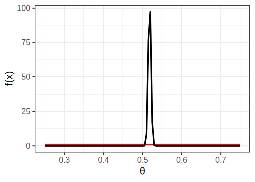
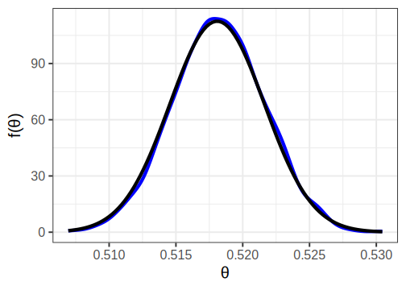
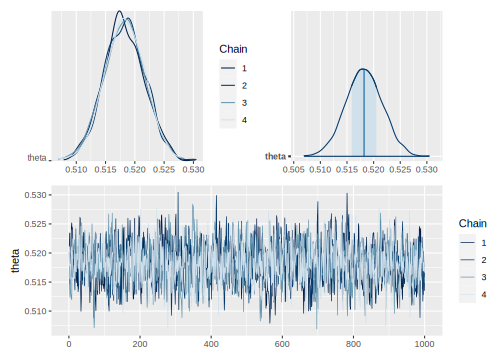
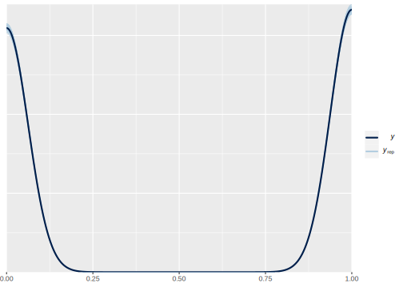
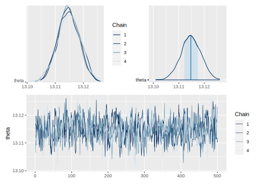
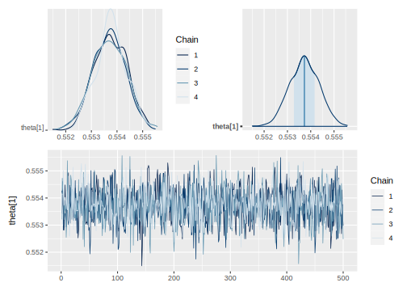
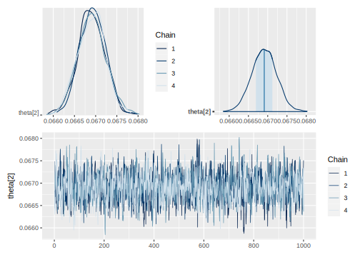
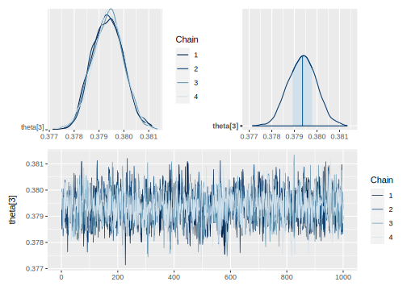
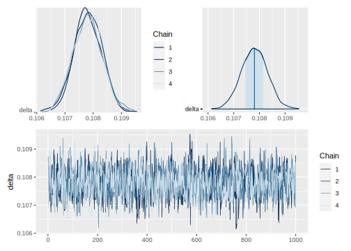

# Fundamentos de la inferencia Bayesiana en R y STAN


## Regla de Bayes

En términos de inferencia para $\boldsymbol{\theta}$, es necesario encontrar la distribución de los parámetros condicionada a la observación de los datos. Para este fin, es necesario definir la distribución conjunta de la variable de interés con el vector de parámetros.

$$
p(\boldsymbol{\theta},\mathbf{Y})=p(\boldsymbol{\theta})p(\mathbf{Y} \mid \boldsymbol{\theta})
$$

-   La distribución $p(\boldsymbol{\theta})$ se le conoce con el nombre de distribución previa.

-   El término $p(\mathbf{Y} \mid \boldsymbol{\theta})$ es la distribución de muestreo, verosimilitud o distribución de los datos.

-   La distribución del vector de parámetros condicionada a los datos observados está dada por

    $$
    p(\boldsymbol{\theta} \mid \mathbf{Y})=\frac{p(\boldsymbol{\theta},\mathbf{Y})}{p(\mathbf{Y})}=\frac{p(\boldsymbol{\theta})p(\mathbf{Y} \mid \boldsymbol{\theta})}{p(\mathbf{Y})}
    $$

-   A la distribución $p(\boldsymbol{\theta} \mid \mathbf{Y})$ se le conoce con el nombre de distribución ***posterior***. Nótese que el denominador no depende del vector de parámetros y considerando a los datos observados como fijos, corresponde a una constante y puede ser obviada. Por lo tanto, otra representación de la regla de Bayes está dada por

    $$
    p(\boldsymbol{\theta} \mid \mathbf{Y})\propto p(\mathbf{Y} \mid \boldsymbol{\theta})p(\boldsymbol{\theta})
    $$

## Inferencia Bayesiana.

En términos de estimación, inferencia y predicción, el enfoque Bayesiano supone dos momentos o etapas:

1.  **Antes de la recolección de las datos**, en donde el investigador propone, basado en su conocimiento, experiencia o fuentes externas, una distribución de probabilidad previa para el parámetro de interés.
2.  **Después de la recolección de los datos.** Siguiendo el teorema de Bayes, el investigador actualiza su conocimiento acerca del comportamiento probabilístico del parámetro de interés mediante la distribución posterior de este.

## Modelos uniparamétricos

Los modelos que están definidos en términos de un solo parámetro que pertenece al conjunto de los números reales se definen como modelos *uniparamétricos*.

## Modelo Bernoulli

Suponga que $Y$ es una variable aleatoria con distribución Bernoulli dada por:

$$
p(Y \mid \theta)=\theta^y(1-\theta)^{1-y}I_{\{0,1\}}(y)
$$

Como el parámetro $\theta$ está restringido al espacio $\Theta=[0,1]$, entonces es posible formular varias opciones para la distribución previa del parámetro. En particular, la distribución uniforme restringida al intervalo $[0,1]$ o la distribución Beta parecen ser buenas opciones. Puesto que la distribución uniforme es un caso particular de la distribución Beta. Por lo tanto la distribución previa del parámetro $\theta$ estará dada por

$$
\begin{equation}
p(\theta \mid \alpha,\beta)=
\frac{1}{Beta(\alpha,\beta)}\theta^{\alpha-1}(1-\theta)^{\beta-1}I_{[0,1]}(\theta).
\end{equation}
$$

y la distribución posterior del parámetro $\theta$ sigue una distribución

$$
\begin{equation*}
\theta \mid Y \sim Beta(y+\alpha,\beta-y+1)
\end{equation*}
$$

Cuando se tiene una muestra aleatoria $Y_1,\ldots,Y_n$ de variables con distribución Bernoulli de parámetro $\theta$, entonces la distribución posterior del parámetro de interés es

$$
\begin{equation*}
\theta \mid Y_1,\ldots,Y_n \sim Beta\left(\sum_{i=1}^ny_i+\alpha,\beta-\sum_{i=1}^ny_i+n\right)
\end{equation*}
$$

### Práctica en **R**


```r
library(tidyverse)
encuesta <- readRDS("Recursos/Día1/Sesion4/Data/encuestaCOL18N1.rds") 
```

Sea $Y$ la variable aleatoria

$$
Y_{i}=\begin{cases}
1 & ingreso<lp\\
0 & ingreso\geq lp
\end{cases}
$$


El tamaño de la muestra es de 19877 Indígena


```r
datay <- encuesta %>% filter(etnia_ee == 1) %>% 
  transmute(y = ifelse(ingcorte < lp, 1,0))
addmargins(table(datay$y))
```


<table>
 <thead>
  <tr>
   <th style="text-align:right;"> 0 </th>
   <th style="text-align:right;"> 1 </th>
   <th style="text-align:right;"> Sum </th>
  </tr>
 </thead>
<tbody>
  <tr>
   <td style="text-align:right;"> 9579 </td>
   <td style="text-align:right;"> 10298 </td>
   <td style="text-align:right;"> 19877 </td>
  </tr>
</tbody>
</table>


Un grupo de estadístico experto decide utilizar una distribución previa Beta, definiendo los parámetros de la distribución previa como $Beta(\alpha=1, \beta=1)$. La distribución posterior del parámetro de interés, que representa la probabilidad de estar por debajo de la linea de pobreza, es $Beta(1.0298\times 10^{4} + 1, 1 - 1.0298\times 10^{4} + 19877)=Beta(1.0299\times 10^{4}, 9580)$

<div class="figure">

<p class="caption">(\#fig:BernoEj1)Distribución previa (línea roja) y distribución posterior (línea negra)</p>
</div>

La estimación del parámetro estaría dado por:

$$
E(X) = \frac{\alpha}{\alpha + \beta} = \frac{1.0299\times 10^{4}}{1.0299\times 10^{4}+ 9580} = 0.5180844
$$

luego, el intervalo de credibilidad para la distribución posterior es.


```r
n = length(datay$y)
n1 = sum(datay$y)
qbeta(c(0.025, 0.975),
      shape1 = 1 + n1,
      shape2 = 1 - n1 + n)
```

```
## [1] 0.5111369 0.5250285
```

### Práctica en **STAN**

En `STAN` es posible obtener el mismo tipo de inferencia creando cuatro cadenas cuya distribución de probabilidad coincide con la distribución posterior del ejemplo.


```r
## Definir el modelo
data {                         // Entrada el modelo 
  int<lower=0> n;              // Numero de observaciones  
  int y[n];                    // Vector de longitud n
  real a;
  real b;
}
parameters {                   // Definir parámetro
  real<lower=0, upper=1> theta;
}
model {                        // Definir modelo
  y ~ bernoulli(theta);
  theta ~ beta(a, b);      // Distribución previa 
}
generated quantities {
    real ypred[n];                    // vector de longitud n
    for (ii in 1:n){
    ypred[ii] = bernoulli_rng(theta);
    }
}
```

Para compilar *STAN* debemos definir los parámetros de entrada


```r
    sample_data <- list(n = nrow(datay),
                        y = datay$y,
                        a = 1,
                        b = 1)
```

Para ejecutar `STAN` en R tenemos la librería *cmdstanr*


```r
library(cmdstanr)
library(rstan)
# file.edit("Recursos/Día1/Sesion4/Data/modelosStan/1Bernoulli.stan")
# Bernoulli <- cmdstan_model(stan_file = "Recursos/Día1/Sesion4/Data/modelosStan/1Bernoulli.stan") 
Bernoulli <- "Recursos/Día1/Sesion4/Data/modelosStan/1Bernoulli.stan"
```


```r
# model_Bernoulli <- Bernoulli$sample(data = sample_data, 
#                  chains = 4,
#                  parallel_chains = 4,
#                  seed = 1234,
#                  refresh = 1000)
options(mc.cores = parallel::detectCores())
model_Bernoulli <- stan(
  file = Bernoulli,  # Stan program
  data = sample_data,    # named list of data
  verbose = FALSE,
  warmup = 500,          # number of warmup iterations per chain
  iter = 1000,            # total number of iterations per chain
  cores = 4,              # number of cores (could use one per chain)
)
```

La estimación del parámetro $\theta$ es:


```r
# model_Bernoulli$summary(variables = "theta") %>%
#   select(variable:q95) %>% tba()
summary(model_Bernoulli, pars = "theta")$summary %>% tba()
```

<table class="table table-striped lightable-classic" style="width: auto !important; margin-left: auto; margin-right: auto; font-family: Arial Narrow; width: auto !important; margin-left: auto; margin-right: auto;">
 <thead>
  <tr>
   <th style="text-align:left;">   </th>
   <th style="text-align:right;"> mean </th>
   <th style="text-align:right;"> se_mean </th>
   <th style="text-align:right;"> sd </th>
   <th style="text-align:right;"> 2.5% </th>
   <th style="text-align:right;"> 25% </th>
   <th style="text-align:right;"> 50% </th>
   <th style="text-align:right;"> 75% </th>
   <th style="text-align:right;"> 97.5% </th>
   <th style="text-align:right;"> n_eff </th>
   <th style="text-align:right;"> Rhat </th>
  </tr>
 </thead>
<tbody>
  <tr>
   <td style="text-align:left;"> theta </td>
   <td style="text-align:right;"> 0.5182 </td>
   <td style="text-align:right;"> 1e-04 </td>
   <td style="text-align:right;"> 0.0034 </td>
   <td style="text-align:right;"> 0.5115 </td>
   <td style="text-align:right;"> 0.516 </td>
   <td style="text-align:right;"> 0.5182 </td>
   <td style="text-align:right;"> 0.5206 </td>
   <td style="text-align:right;"> 0.5243 </td>
   <td style="text-align:right;"> 740.5358 </td>
   <td style="text-align:right;"> 1.0028 </td>
  </tr>
</tbody>
</table>

Para observar las cadenas compilamos las lineas de código


```r
library(posterior) 
library(ggplot2)
#temp <- as_draws_df(model_Bernoulli$draws(variables = "theta"))
temp <- as_draws_df(as.array(model_Bernoulli,pars = "theta"))

ggplot(data = temp, aes(x = theta))+ 
  geom_density(color = "blue", size = 2) +
  stat_function(fun = posterior1,
                args = list(y = datay$y),
                size = 2) + 
  theme_bw(base_size = 20) + 
  labs(x = latex2exp::TeX("\\theta"),
       y = latex2exp::TeX("f(\\theta)"))
```

<div class="figure">

<p class="caption">(\#fig:unnamed-chunk-11)Resultado con STAN (línea azul) y posterior teórica (línea negra)</p>
</div>

Para validar las cadenas


```r
library(bayesplot)
# (mcmc_dens_chains(model_Bernoulli$draws("theta")) +
# mcmc_areas(model_Bernoulli$draws("theta")))/ 
# mcmc_trace(model_Bernoulli$draws("theta")) 

posterior_theta <- as.array(model_Bernoulli, pars = "theta")
(mcmc_dens_chains(posterior_theta) +
    mcmc_areas(posterior_theta) ) / 
  mcmc_trace(posterior_theta)
```



Predicción de $Y$ en cada una de las iteraciones de las cadenas.


```r
# y_pred_B <- model_Bernoulli$draws(variables = "ypred", format = "matrix")
y_pred_B <- as.array(model_Bernoulli, pars = "ypred") %>% 
  as_draws_matrix()

rowsrandom <- sample(nrow(y_pred_B), 100)
y_pred2 <- y_pred_B[rowsrandom, 1:n]
ppc_dens_overlay(y = datay$y, y_pred2)
```



## Modelo Binomial

Cuando se dispone de una muestra aleatoria de variables con distribución Bernoulli $Y_1,\ldots,Y_n$, la inferencia Bayesiana se puede llevar a cabo usando la distribución Binomial, puesto que es bien sabido que la suma de variables aleatorias Bernoulli

$$
\begin{equation*}
S=\sum_{i=1}^nY_i
\end{equation*}
$$

sigue una distribución Binomial. Es decir:

$$
\begin{equation}
p(S \mid \theta)=\binom{n}{s}\theta^s(1-\theta)^{n-s}I_{\{0,1,\ldots,n\}}(s),
\end{equation}
$$

Nótese que la distribución Binomial es un caso general para la distribución Bernoulli, cuando $n=1$. Por lo tanto es natural suponer que distribución previa del parámetro $\theta$ estará dada por

$$
\begin{equation}
p(\theta \mid \alpha,\beta)=
\frac{1}{Beta(\alpha,\beta)}\theta^{\alpha-1}(1-\theta)^{\beta-1}I_{[0,1]}(\theta).
\end{equation}
$$

La distribución posterior del parámetro $\theta$ sigue una distribución

$$
\begin{equation*}
\theta \mid S \sim Beta(s+\alpha,\beta-s+n)
\end{equation*}
$$

Ahora, cuando se tiene una sucesión de variables aleatorias $S_1,\ldots,S_i, \ldots,S_k$ independientes y con distribución $Binomial(n_i,\theta_i)$ para $i=1,\ldots,k$, entonces la distribución posterior del parámetro de interés $\theta_i$ es

$$
\begin{equation*}
\theta_i \mid s_i \sim Beta\left(s_i+\alpha,\ \beta+ n_i- s_i\right)
\end{equation*}
$$

### Práctica en **STAN**

Sea $S_k$ el conteo de personas en condición de pobreza en el $k-ésimo$ departamento en la muestra.


```r
dataS <- encuesta %>% 
  transmute(
    dam = dam_ee,
    y = ifelse(ingcorte < lp, 1,0)
  ) %>% group_by(dam) %>% 
  summarise(nd = n(),   #Número de ensayos 
            Sd = sum(y) #Número de éxito 
            )
tba(dataS)
```

<table class="table table-striped lightable-classic" style="width: auto !important; margin-left: auto; margin-right: auto; font-family: Arial Narrow; width: auto !important; margin-left: auto; margin-right: auto;">
 <thead>
  <tr>
   <th style="text-align:left;"> dam </th>
   <th style="text-align:right;"> nd </th>
   <th style="text-align:right;"> Sd </th>
  </tr>
 </thead>
<tbody>
  <tr>
   <td style="text-align:left;"> 05 </td>
   <td style="text-align:right;"> 45467 </td>
   <td style="text-align:right;"> 7301 </td>
  </tr>
  <tr>
   <td style="text-align:left;"> 08 </td>
   <td style="text-align:right;"> 44321 </td>
   <td style="text-align:right;"> 10297 </td>
  </tr>
  <tr>
   <td style="text-align:left;"> 11 </td>
   <td style="text-align:right;"> 32213 </td>
   <td style="text-align:right;"> 4128 </td>
  </tr>
  <tr>
   <td style="text-align:left;"> 13 </td>
   <td style="text-align:right;"> 35610 </td>
   <td style="text-align:right;"> 10560 </td>
  </tr>
  <tr>
   <td style="text-align:left;"> 15 </td>
   <td style="text-align:right;"> 26485 </td>
   <td style="text-align:right;"> 5717 </td>
  </tr>
  <tr>
   <td style="text-align:left;"> 17 </td>
   <td style="text-align:right;"> 30764 </td>
   <td style="text-align:right;"> 4524 </td>
  </tr>
  <tr>
   <td style="text-align:left;"> 18 </td>
   <td style="text-align:right;"> 28842 </td>
   <td style="text-align:right;"> 11134 </td>
  </tr>
  <tr>
   <td style="text-align:left;"> 19 </td>
   <td style="text-align:right;"> 34357 </td>
   <td style="text-align:right;"> 12348 </td>
  </tr>
  <tr>
   <td style="text-align:left;"> 20 </td>
   <td style="text-align:right;"> 32454 </td>
   <td style="text-align:right;"> 12203 </td>
  </tr>
  <tr>
   <td style="text-align:left;"> 23 </td>
   <td style="text-align:right;"> 31986 </td>
   <td style="text-align:right;"> 10528 </td>
  </tr>
  <tr>
   <td style="text-align:left;"> 25 </td>
   <td style="text-align:right;"> 9068 </td>
   <td style="text-align:right;"> 1516 </td>
  </tr>
  <tr>
   <td style="text-align:left;"> 27 </td>
   <td style="text-align:right;"> 26828 </td>
   <td style="text-align:right;"> 12934 </td>
  </tr>
  <tr>
   <td style="text-align:left;"> 41 </td>
   <td style="text-align:right;"> 30728 </td>
   <td style="text-align:right;"> 8188 </td>
  </tr>
  <tr>
   <td style="text-align:left;"> 44 </td>
   <td style="text-align:right;"> 35618 </td>
   <td style="text-align:right;"> 16412 </td>
  </tr>
  <tr>
   <td style="text-align:left;"> 47 </td>
   <td style="text-align:right;"> 37634 </td>
   <td style="text-align:right;"> 13500 </td>
  </tr>
  <tr>
   <td style="text-align:left;"> 50 </td>
   <td style="text-align:right;"> 29317 </td>
   <td style="text-align:right;"> 6653 </td>
  </tr>
  <tr>
   <td style="text-align:left;"> 52 </td>
   <td style="text-align:right;"> 28927 </td>
   <td style="text-align:right;"> 8949 </td>
  </tr>
  <tr>
   <td style="text-align:left;"> 54 </td>
   <td style="text-align:right;"> 31384 </td>
   <td style="text-align:right;"> 12663 </td>
  </tr>
  <tr>
   <td style="text-align:left;"> 63 </td>
   <td style="text-align:right;"> 28276 </td>
   <td style="text-align:right;"> 6195 </td>
  </tr>
  <tr>
   <td style="text-align:left;"> 66 </td>
   <td style="text-align:right;"> 29199 </td>
   <td style="text-align:right;"> 4664 </td>
  </tr>
  <tr>
   <td style="text-align:left;"> 68 </td>
   <td style="text-align:right;"> 31778 </td>
   <td style="text-align:right;"> 5127 </td>
  </tr>
  <tr>
   <td style="text-align:left;"> 70 </td>
   <td style="text-align:right;"> 35525 </td>
   <td style="text-align:right;"> 11881 </td>
  </tr>
  <tr>
   <td style="text-align:left;"> 73 </td>
   <td style="text-align:right;"> 28416 </td>
   <td style="text-align:right;"> 6295 </td>
  </tr>
  <tr>
   <td style="text-align:left;"> 76 </td>
   <td style="text-align:right;"> 37556 </td>
   <td style="text-align:right;"> 7073 </td>
  </tr>
</tbody>
</table>

Creando código de `STAN`


```r
data {
  int<lower=0> K;                 // Número de provincia  
  int<lower=0> n[K];              // Número de ensayos 
  int<lower=0> s[K];              // Número de éxitos
  real a;
  real b;
}
parameters {
  real<lower=0, upper=1> theta[K]; // theta_d|s_d
}
model {
  for(kk in 1:K) {
  s[kk] ~ binomial(n[kk], theta[kk]);
  }
  to_vector(theta) ~ beta(a, b);
}

generated quantities {
    real spred[K];                    // vector de longitud K
    for(kk in 1:K){
    spred[kk] = binomial_rng(n[kk],theta[kk]);
}
}
```

Preparando el código de `STAN`


```r
## Definir el modelo
# file.edit("Recursos/Día1/Sesion4/Data/modelosStan/3Binomial.stan")
# Binomial2 <- cmdstan_model(stan_file = "Recursos/Día1/Sesion4/Data/modelosStan/3Binomial.stan") 
Binomial2 <- "Recursos/Día1/Sesion4/Data/modelosStan/3Binomial.stan"
```

Organizando datos para `STAN`


```r
sample_data <- list(K = nrow(dataS),
                    s = dataS$Sd,
                    n = dataS$nd,
                    a = 1,
                    b = 1)
```

Para ejecutar `STAN` en R tenemos la librería *cmdstanr*


```r
# model_Binomial2 <- Binomial2$sample(data = sample_data, 
#                  chains = 4,
#                  parallel_chains = 4,
#                  seed = 1234,
#                  refresh = 1000)
options(mc.cores = parallel::detectCores())
model_Binomial2 <- stan(
  file = Binomial2,  # Stan program
  data = sample_data,    # named list of data
  verbose = FALSE,
  warmup = 500,          # number of warmup iterations per chain
  iter = 1000,            # total number of iterations per chain
  cores = 4,              # number of cores (could use one per chain)
)
```

La estimación del parámetro $\theta$ es:


```r
# model_Binomial2$summary(variables = "theta") %>% 
#   select(variable:q95) %>% tba()
summary(model_Binomial2, pars = "theta")$summary %>% tba()
```

<table class="table table-striped lightable-classic" style="width: auto !important; margin-left: auto; margin-right: auto; font-family: Arial Narrow; width: auto !important; margin-left: auto; margin-right: auto;">
 <thead>
  <tr>
   <th style="text-align:left;">   </th>
   <th style="text-align:right;"> mean </th>
   <th style="text-align:right;"> se_mean </th>
   <th style="text-align:right;"> sd </th>
   <th style="text-align:right;"> 2.5% </th>
   <th style="text-align:right;"> 25% </th>
   <th style="text-align:right;"> 50% </th>
   <th style="text-align:right;"> 75% </th>
   <th style="text-align:right;"> 97.5% </th>
   <th style="text-align:right;"> n_eff </th>
   <th style="text-align:right;"> Rhat </th>
  </tr>
 </thead>
<tbody>
  <tr>
   <td style="text-align:left;"> theta[1] </td>
   <td style="text-align:right;"> 0.1606 </td>
   <td style="text-align:right;"> 0e+00 </td>
   <td style="text-align:right;"> 0.0018 </td>
   <td style="text-align:right;"> 0.1572 </td>
   <td style="text-align:right;"> 0.1593 </td>
   <td style="text-align:right;"> 0.1606 </td>
   <td style="text-align:right;"> 0.1618 </td>
   <td style="text-align:right;"> 0.1641 </td>
   <td style="text-align:right;"> 4995.662 </td>
   <td style="text-align:right;"> 0.9987 </td>
  </tr>
  <tr>
   <td style="text-align:left;"> theta[2] </td>
   <td style="text-align:right;"> 0.2323 </td>
   <td style="text-align:right;"> 0e+00 </td>
   <td style="text-align:right;"> 0.0020 </td>
   <td style="text-align:right;"> 0.2285 </td>
   <td style="text-align:right;"> 0.2309 </td>
   <td style="text-align:right;"> 0.2323 </td>
   <td style="text-align:right;"> 0.2338 </td>
   <td style="text-align:right;"> 0.2362 </td>
   <td style="text-align:right;"> 5068.657 </td>
   <td style="text-align:right;"> 0.9991 </td>
  </tr>
  <tr>
   <td style="text-align:left;"> theta[3] </td>
   <td style="text-align:right;"> 0.1281 </td>
   <td style="text-align:right;"> 0e+00 </td>
   <td style="text-align:right;"> 0.0019 </td>
   <td style="text-align:right;"> 0.1246 </td>
   <td style="text-align:right;"> 0.1269 </td>
   <td style="text-align:right;"> 0.1281 </td>
   <td style="text-align:right;"> 0.1294 </td>
   <td style="text-align:right;"> 0.1318 </td>
   <td style="text-align:right;"> 4302.302 </td>
   <td style="text-align:right;"> 0.9989 </td>
  </tr>
  <tr>
   <td style="text-align:left;"> theta[4] </td>
   <td style="text-align:right;"> 0.2965 </td>
   <td style="text-align:right;"> 0e+00 </td>
   <td style="text-align:right;"> 0.0023 </td>
   <td style="text-align:right;"> 0.2920 </td>
   <td style="text-align:right;"> 0.2949 </td>
   <td style="text-align:right;"> 0.2965 </td>
   <td style="text-align:right;"> 0.2981 </td>
   <td style="text-align:right;"> 0.3009 </td>
   <td style="text-align:right;"> 5872.753 </td>
   <td style="text-align:right;"> 0.9982 </td>
  </tr>
  <tr>
   <td style="text-align:left;"> theta[5] </td>
   <td style="text-align:right;"> 0.2159 </td>
   <td style="text-align:right;"> 0e+00 </td>
   <td style="text-align:right;"> 0.0026 </td>
   <td style="text-align:right;"> 0.2109 </td>
   <td style="text-align:right;"> 0.2141 </td>
   <td style="text-align:right;"> 0.2158 </td>
   <td style="text-align:right;"> 0.2176 </td>
   <td style="text-align:right;"> 0.2210 </td>
   <td style="text-align:right;"> 4494.272 </td>
   <td style="text-align:right;"> 0.9993 </td>
  </tr>
  <tr>
   <td style="text-align:left;"> theta[6] </td>
   <td style="text-align:right;"> 0.1471 </td>
   <td style="text-align:right;"> 0e+00 </td>
   <td style="text-align:right;"> 0.0019 </td>
   <td style="text-align:right;"> 0.1433 </td>
   <td style="text-align:right;"> 0.1458 </td>
   <td style="text-align:right;"> 0.1471 </td>
   <td style="text-align:right;"> 0.1484 </td>
   <td style="text-align:right;"> 0.1509 </td>
   <td style="text-align:right;"> 6398.598 </td>
   <td style="text-align:right;"> 0.9992 </td>
  </tr>
  <tr>
   <td style="text-align:left;"> theta[7] </td>
   <td style="text-align:right;"> 0.3861 </td>
   <td style="text-align:right;"> 0e+00 </td>
   <td style="text-align:right;"> 0.0028 </td>
   <td style="text-align:right;"> 0.3807 </td>
   <td style="text-align:right;"> 0.3842 </td>
   <td style="text-align:right;"> 0.3861 </td>
   <td style="text-align:right;"> 0.3880 </td>
   <td style="text-align:right;"> 0.3914 </td>
   <td style="text-align:right;"> 5415.280 </td>
   <td style="text-align:right;"> 0.9986 </td>
  </tr>
  <tr>
   <td style="text-align:left;"> theta[8] </td>
   <td style="text-align:right;"> 0.3594 </td>
   <td style="text-align:right;"> 0e+00 </td>
   <td style="text-align:right;"> 0.0025 </td>
   <td style="text-align:right;"> 0.3547 </td>
   <td style="text-align:right;"> 0.3577 </td>
   <td style="text-align:right;"> 0.3594 </td>
   <td style="text-align:right;"> 0.3612 </td>
   <td style="text-align:right;"> 0.3642 </td>
   <td style="text-align:right;"> 4735.259 </td>
   <td style="text-align:right;"> 0.9985 </td>
  </tr>
  <tr>
   <td style="text-align:left;"> theta[9] </td>
   <td style="text-align:right;"> 0.3760 </td>
   <td style="text-align:right;"> 0e+00 </td>
   <td style="text-align:right;"> 0.0027 </td>
   <td style="text-align:right;"> 0.3708 </td>
   <td style="text-align:right;"> 0.3741 </td>
   <td style="text-align:right;"> 0.3760 </td>
   <td style="text-align:right;"> 0.3779 </td>
   <td style="text-align:right;"> 0.3814 </td>
   <td style="text-align:right;"> 4213.212 </td>
   <td style="text-align:right;"> 0.9986 </td>
  </tr>
  <tr>
   <td style="text-align:left;"> theta[10] </td>
   <td style="text-align:right;"> 0.3292 </td>
   <td style="text-align:right;"> 0e+00 </td>
   <td style="text-align:right;"> 0.0025 </td>
   <td style="text-align:right;"> 0.3243 </td>
   <td style="text-align:right;"> 0.3275 </td>
   <td style="text-align:right;"> 0.3292 </td>
   <td style="text-align:right;"> 0.3308 </td>
   <td style="text-align:right;"> 0.3341 </td>
   <td style="text-align:right;"> 5643.390 </td>
   <td style="text-align:right;"> 0.9989 </td>
  </tr>
  <tr>
   <td style="text-align:left;"> theta[11] </td>
   <td style="text-align:right;"> 0.1673 </td>
   <td style="text-align:right;"> 1e-04 </td>
   <td style="text-align:right;"> 0.0039 </td>
   <td style="text-align:right;"> 0.1600 </td>
   <td style="text-align:right;"> 0.1647 </td>
   <td style="text-align:right;"> 0.1673 </td>
   <td style="text-align:right;"> 0.1699 </td>
   <td style="text-align:right;"> 0.1751 </td>
   <td style="text-align:right;"> 4524.756 </td>
   <td style="text-align:right;"> 0.9998 </td>
  </tr>
  <tr>
   <td style="text-align:left;"> theta[12] </td>
   <td style="text-align:right;"> 0.4821 </td>
   <td style="text-align:right;"> 0e+00 </td>
   <td style="text-align:right;"> 0.0030 </td>
   <td style="text-align:right;"> 0.4760 </td>
   <td style="text-align:right;"> 0.4802 </td>
   <td style="text-align:right;"> 0.4820 </td>
   <td style="text-align:right;"> 0.4841 </td>
   <td style="text-align:right;"> 0.4883 </td>
   <td style="text-align:right;"> 6602.060 </td>
   <td style="text-align:right;"> 0.9987 </td>
  </tr>
  <tr>
   <td style="text-align:left;"> theta[13] </td>
   <td style="text-align:right;"> 0.2665 </td>
   <td style="text-align:right;"> 0e+00 </td>
   <td style="text-align:right;"> 0.0025 </td>
   <td style="text-align:right;"> 0.2615 </td>
   <td style="text-align:right;"> 0.2647 </td>
   <td style="text-align:right;"> 0.2665 </td>
   <td style="text-align:right;"> 0.2683 </td>
   <td style="text-align:right;"> 0.2715 </td>
   <td style="text-align:right;"> 6158.453 </td>
   <td style="text-align:right;"> 0.9989 </td>
  </tr>
  <tr>
   <td style="text-align:left;"> theta[14] </td>
   <td style="text-align:right;"> 0.4608 </td>
   <td style="text-align:right;"> 0e+00 </td>
   <td style="text-align:right;"> 0.0027 </td>
   <td style="text-align:right;"> 0.4555 </td>
   <td style="text-align:right;"> 0.4590 </td>
   <td style="text-align:right;"> 0.4608 </td>
   <td style="text-align:right;"> 0.4626 </td>
   <td style="text-align:right;"> 0.4661 </td>
   <td style="text-align:right;"> 5894.068 </td>
   <td style="text-align:right;"> 0.9983 </td>
  </tr>
  <tr>
   <td style="text-align:left;"> theta[15] </td>
   <td style="text-align:right;"> 0.3587 </td>
   <td style="text-align:right;"> 0e+00 </td>
   <td style="text-align:right;"> 0.0025 </td>
   <td style="text-align:right;"> 0.3539 </td>
   <td style="text-align:right;"> 0.3570 </td>
   <td style="text-align:right;"> 0.3587 </td>
   <td style="text-align:right;"> 0.3605 </td>
   <td style="text-align:right;"> 0.3637 </td>
   <td style="text-align:right;"> 5052.024 </td>
   <td style="text-align:right;"> 0.9988 </td>
  </tr>
  <tr>
   <td style="text-align:left;"> theta[16] </td>
   <td style="text-align:right;"> 0.2270 </td>
   <td style="text-align:right;"> 0e+00 </td>
   <td style="text-align:right;"> 0.0025 </td>
   <td style="text-align:right;"> 0.2221 </td>
   <td style="text-align:right;"> 0.2253 </td>
   <td style="text-align:right;"> 0.2271 </td>
   <td style="text-align:right;"> 0.2287 </td>
   <td style="text-align:right;"> 0.2317 </td>
   <td style="text-align:right;"> 4553.205 </td>
   <td style="text-align:right;"> 0.9985 </td>
  </tr>
  <tr>
   <td style="text-align:left;"> theta[17] </td>
   <td style="text-align:right;"> 0.3094 </td>
   <td style="text-align:right;"> 0e+00 </td>
   <td style="text-align:right;"> 0.0028 </td>
   <td style="text-align:right;"> 0.3040 </td>
   <td style="text-align:right;"> 0.3075 </td>
   <td style="text-align:right;"> 0.3093 </td>
   <td style="text-align:right;"> 0.3113 </td>
   <td style="text-align:right;"> 0.3148 </td>
   <td style="text-align:right;"> 5761.156 </td>
   <td style="text-align:right;"> 0.9983 </td>
  </tr>
  <tr>
   <td style="text-align:left;"> theta[18] </td>
   <td style="text-align:right;"> 0.4035 </td>
   <td style="text-align:right;"> 0e+00 </td>
   <td style="text-align:right;"> 0.0028 </td>
   <td style="text-align:right;"> 0.3978 </td>
   <td style="text-align:right;"> 0.4015 </td>
   <td style="text-align:right;"> 0.4035 </td>
   <td style="text-align:right;"> 0.4055 </td>
   <td style="text-align:right;"> 0.4091 </td>
   <td style="text-align:right;"> 4766.386 </td>
   <td style="text-align:right;"> 0.9999 </td>
  </tr>
  <tr>
   <td style="text-align:left;"> theta[19] </td>
   <td style="text-align:right;"> 0.2191 </td>
   <td style="text-align:right;"> 0e+00 </td>
   <td style="text-align:right;"> 0.0024 </td>
   <td style="text-align:right;"> 0.2144 </td>
   <td style="text-align:right;"> 0.2174 </td>
   <td style="text-align:right;"> 0.2190 </td>
   <td style="text-align:right;"> 0.2207 </td>
   <td style="text-align:right;"> 0.2240 </td>
   <td style="text-align:right;"> 5580.557 </td>
   <td style="text-align:right;"> 0.9987 </td>
  </tr>
  <tr>
   <td style="text-align:left;"> theta[20] </td>
   <td style="text-align:right;"> 0.1597 </td>
   <td style="text-align:right;"> 0e+00 </td>
   <td style="text-align:right;"> 0.0022 </td>
   <td style="text-align:right;"> 0.1553 </td>
   <td style="text-align:right;"> 0.1583 </td>
   <td style="text-align:right;"> 0.1598 </td>
   <td style="text-align:right;"> 0.1612 </td>
   <td style="text-align:right;"> 0.1640 </td>
   <td style="text-align:right;"> 4125.715 </td>
   <td style="text-align:right;"> 0.9988 </td>
  </tr>
  <tr>
   <td style="text-align:left;"> theta[21] </td>
   <td style="text-align:right;"> 0.1614 </td>
   <td style="text-align:right;"> 0e+00 </td>
   <td style="text-align:right;"> 0.0020 </td>
   <td style="text-align:right;"> 0.1574 </td>
   <td style="text-align:right;"> 0.1601 </td>
   <td style="text-align:right;"> 0.1614 </td>
   <td style="text-align:right;"> 0.1627 </td>
   <td style="text-align:right;"> 0.1653 </td>
   <td style="text-align:right;"> 5438.808 </td>
   <td style="text-align:right;"> 0.9990 </td>
  </tr>
  <tr>
   <td style="text-align:left;"> theta[22] </td>
   <td style="text-align:right;"> 0.3345 </td>
   <td style="text-align:right;"> 0e+00 </td>
   <td style="text-align:right;"> 0.0024 </td>
   <td style="text-align:right;"> 0.3297 </td>
   <td style="text-align:right;"> 0.3329 </td>
   <td style="text-align:right;"> 0.3344 </td>
   <td style="text-align:right;"> 0.3361 </td>
   <td style="text-align:right;"> 0.3395 </td>
   <td style="text-align:right;"> 4989.644 </td>
   <td style="text-align:right;"> 0.9994 </td>
  </tr>
  <tr>
   <td style="text-align:left;"> theta[23] </td>
   <td style="text-align:right;"> 0.2216 </td>
   <td style="text-align:right;"> 0e+00 </td>
   <td style="text-align:right;"> 0.0024 </td>
   <td style="text-align:right;"> 0.2168 </td>
   <td style="text-align:right;"> 0.2200 </td>
   <td style="text-align:right;"> 0.2216 </td>
   <td style="text-align:right;"> 0.2232 </td>
   <td style="text-align:right;"> 0.2263 </td>
   <td style="text-align:right;"> 4874.975 </td>
   <td style="text-align:right;"> 0.9993 </td>
  </tr>
  <tr>
   <td style="text-align:left;"> theta[24] </td>
   <td style="text-align:right;"> 0.1883 </td>
   <td style="text-align:right;"> 0e+00 </td>
   <td style="text-align:right;"> 0.0020 </td>
   <td style="text-align:right;"> 0.1844 </td>
   <td style="text-align:right;"> 0.1870 </td>
   <td style="text-align:right;"> 0.1883 </td>
   <td style="text-align:right;"> 0.1896 </td>
   <td style="text-align:right;"> 0.1922 </td>
   <td style="text-align:right;"> 4294.990 </td>
   <td style="text-align:right;"> 0.9984 </td>
  </tr>
</tbody>
</table>

Para validar las cadenas


```r
# mcmc_areas(model_Binomial2$draws("theta"))
mcmc_areas(as.array(model_Binomial2, pars = "theta"))
```


```r
# mcmc_trace(model_Binomial2$draws("theta")) 
mcmc_trace(as.array(model_Binomial2, pars = "theta"))
```


```r
# y_pred_B <- model_Binomial2$draws(variables = "spred", format = "matrix")

y_pred_B <- as.array(model_Binomial2, pars = "spred") %>% 
  as_draws_matrix()

rowsrandom <- sample(nrow(y_pred_B), 200)
y_pred2 <- y_pred_B[rowsrandom, ]
g1 <- ggplot(data = dataS, aes(x = Sd))+
  geom_histogram(aes(y = ..density..)) +
  geom_density(size = 2, color = "blue") +
  labs(y = "")+
  theme_bw(20) 
g2 <- ppc_dens_overlay(y = dataS$Sd, y_pred2) 
g1/g2
```


## Modelo Normal con media desconocida

Suponga que $Y_1,\cdots,Y_n$ son variables independientes e idénticamente distribuidos con distribución $Normal(\theta,\sigma^2)$ con $\theta$ desconocido pero $\sigma^2$ conocido. De esta forma, la función de verosimilitud de los datos está dada por

$$
\begin{align*}
p(\mathbf{Y} \mid \theta)
&=\prod_{i=1}^n\frac{1}{\sqrt{2\pi\sigma^2}}\exp\left\{-\frac{1}{2\sigma^2}(y_i-\theta)^2\right\}I_\mathbb{R}(y) \\
&=(2\pi\sigma^2)^{-n/2}\exp\left\{-\frac{1}{2\sigma^2}\sum_{i=1}^n(y_i-\theta)^2\right\}
\end{align*}
$$

Como el parámetro $\theta$ puede tomar cualquier valor en los reales, es posible asignarle una distribución previa $\theta \sim Normal(\mu,\tau^2)$. Bajo este marco de referencia se tienen los siguientes resultados

La distribución posterior del parámetro de interés $\theta$ sigue una distribución

$$
\begin{equation*}
\theta|\mathbf{Y} \sim Normal(\mu_n,\tau^2_n)
\end{equation*}
$$

En donde

$$
\begin{equation}
\mu_n=\frac{\frac{n}{\sigma^2}\bar{Y}+\frac{1}{\tau^2}\mu}{\frac{n}{\sigma^2}+\frac{1}{\tau^2}}
\ \ \ \ \ \ \ \text{y} \ \ \ \ \ \ \
\tau_n^2=\left(\frac{n}{\sigma^2}+\frac{1}{\tau^2}\right)^{-1}
\end{equation}
$$

### Práctica en **STAN**

Sea $Y$ el logaritmo del ingreso


```r
dataNormal <- encuesta %>%
    transmute(
     dam_ee ,
  logIngreso = log(ingcorte +1)) %>% 
  filter(dam_ee == "08")
#3
media <- mean(dataNormal$logIngreso)
Sd <- sd(dataNormal$logIngreso)

g1 <- ggplot(dataNormal,aes(x = logIngreso))+ 
  geom_density(size =2, color = "blue") +
  stat_function(fun =dnorm, 
                args = list(mean = media, sd = Sd),
                size =2) +
  theme_bw(base_size = 20) + 
  labs(y = "", x = ("Log(Ingreso)"))

g2 <- ggplot(dataNormal, aes(sample = logIngreso)) +
     stat_qq() + stat_qq_line() +
  theme_bw(base_size = 20) 
g1|g2
```

<div class="figure">

<p class="caption">(\#fig:unnamed-chunk-23)Resultado en la muestra (línea azul) y distribución teórica (línea negra)</p>
</div>

Creando código de `STAN`


```r
data {
  int<lower=0> n;     // Número de observaciones
  real y[n];          // LogIngreso 
  real <lower=0> Sigma;  // Desviación estándar   
}
parameters {
  real theta;
}
model {
  y ~ normal(theta, Sigma);
  theta ~ normal(0, 1000); // Distribución previa
}
generated quantities {
    real ypred[n];                    // Vector de longitud n
    for(kk in 1:n){
    ypred[kk] = normal_rng(theta,Sigma);
}
}
```

Preparando el código de `STAN`


```r
# file.edit("Recursos/Día1/Sesion4/Data/modelosStan/4NormalMedia.stan")
# NormalMedia <- cmdstan_model(stan_file = "Recursos/Día1/Sesion4/Data/modelosStan/4NormalMedia.stan") 

NormalMedia <- "Recursos/Día1/Sesion4/Data/modelosStan/4NormalMedia.stan" 
```

Organizando datos para `STAN`


```r
sample_data <- list(n = nrow(dataNormal),
                    Sigma = sd(dataNormal$logIngreso),
                    y = dataNormal$logIngreso)
```

Para ejecutar `STAN` en R tenemos la librería *cmdstanr*


```r
# model_NormalMedia <- NormalMedia$sample(data = sample_data, 
#                  chains = 4,
#                  parallel_chains = 4,
#                  seed = 1234,
#                  refresh = 1000
#                  )
options(mc.cores = parallel::detectCores())
model_NormalMedia <- stan(
  file = NormalMedia,  
  data = sample_data,   
  verbose = FALSE,
  warmup = 500,         
  iter = 1000,            
  cores = 4              
)
```

La estimación del parámetro $\theta$ es:


```r
# model_NormalMedia$summary(variables = "theta")%>%
#   select(variable:q95) %>% tba()
summary(model_NormalMedia, pars = "theta")$summary %>% tba()
```

<table class="table table-striped lightable-classic" style="width: auto !important; margin-left: auto; margin-right: auto; font-family: Arial Narrow; width: auto !important; margin-left: auto; margin-right: auto;">
 <thead>
  <tr>
   <th style="text-align:left;">   </th>
   <th style="text-align:right;"> mean </th>
   <th style="text-align:right;"> se_mean </th>
   <th style="text-align:right;"> sd </th>
   <th style="text-align:right;"> 2.5% </th>
   <th style="text-align:right;"> 25% </th>
   <th style="text-align:right;"> 50% </th>
   <th style="text-align:right;"> 75% </th>
   <th style="text-align:right;"> 97.5% </th>
   <th style="text-align:right;"> n_eff </th>
   <th style="text-align:right;"> Rhat </th>
  </tr>
 </thead>
<tbody>
  <tr>
   <td style="text-align:left;"> theta </td>
   <td style="text-align:right;"> 13.1148 </td>
   <td style="text-align:right;"> 1e-04 </td>
   <td style="text-align:right;"> 0.0039 </td>
   <td style="text-align:right;"> 13.1071 </td>
   <td style="text-align:right;"> 13.1122 </td>
   <td style="text-align:right;"> 13.1147 </td>
   <td style="text-align:right;"> 13.1175 </td>
   <td style="text-align:right;"> 13.1224 </td>
   <td style="text-align:right;"> 694.8215 </td>
   <td style="text-align:right;"> 1.0002 </td>
  </tr>
</tbody>
</table>


```r
# (mcmc_dens_chains(model_NormalMedia$draws("theta")) +
# mcmc_areas(model_NormalMedia$draws("theta")))/ 
# mcmc_trace(model_NormalMedia$draws("theta")) 

posterior_theta <- as.array(model_NormalMedia, pars = "theta")
(mcmc_dens_chains(posterior_theta) +
    mcmc_areas(posterior_theta) ) / 
  mcmc_trace(posterior_theta)
```




```r
# y_pred_B <- model_NormalMedia$draws(variables = "ypred", format = "matrix")

y_pred_B <- as.array(model_NormalMedia, pars = "ypred") %>% 
  as_draws_matrix()

rowsrandom <- sample(nrow(y_pred_B), 100)
y_pred2 <- y_pred_B[rowsrandom, ]
ppc_dens_overlay(y = as.numeric(dataNormal$logIngreso), y_pred2)/
ppc_dens_overlay(y = exp(as.numeric(dataNormal$logIngreso))-1, exp(y_pred2)-1) + xlim(0,5000000)
```


# Modelos multiparamétricos

-   La distribución normal univariada que tiene dos parámetros: la media $\theta$ y la varianza $\sigma^2$.
-   La distribución multinomial cuyo parámetro es un vector de probabilidades $\boldsymbol{\theta}$.

## Modelo Normal con media y varianza desconocida

Supongamos que se dispone de realizaciones de un conjunto de variables independientes e idénticamente distribuidas $Y_1,\cdots,Y_n\sim N(\theta,\sigma^2)$. Cuando se desconoce tanto la media como la varianza de la distribución es necesario plantear diversos enfoques y situarse en el más conveniente, según el contexto del problema. En términos de la asignación de las distribuciones previas para $\theta$ y $\sigma^2$ es posible:

-   Suponer que la distribución previa $p(\theta)$ es independiente de la distribución previa $p(\sigma^2)$ y que ambas distribuciones son informativas.
-   Suponer que la distribución previa $p(\theta)$ es independiente de la distribución previa $p(\sigma^2)$ y que ambas distribuciones son no informativas.
-   Suponer que la distribución previa para $\theta$ depende de $\sigma^2$ y escribirla como $p(\theta \mid \sigma^2)$, mientras que la distribución previa de $\sigma^2$ no depende de $\theta$ y se puede escribir como $p(\sigma^2)$.

## Parámetros independientes

La distribución previa para el parámetro $\theta$ será

$$
\begin{equation*}
\theta \sim Normal(\mu,\tau^2)
\end{equation*}
$$

Y la distribución previa para el parámetro $\sigma^2$ será

$$
\begin{equation*}
\sigma^2 \sim Inversa-Gamma(n_0/2,n_0\sigma^2_0/2)
\end{equation*}
$$

Asumiendo independencia previa, la distribución previa conjunta estará dada por

$$
\begin{equation}
p(\theta,\sigma^2)\propto (\sigma^2)^{-n_0/2-1}\exp\left\{-\dfrac{n_0\sigma^2_0}{2\sigma^2}\right\}
\exp\left\{-\frac{1}{2\tau^2}(\theta-\mu)^2\right\}
\end{equation}
$$

La distribución posterior conjunta de los parámetros de interés está dada por

$$
\begin{align}
p(\theta,\sigma^2 \mid \mathbf{Y})&\propto (\sigma^2)^{-(n+n_0)/2-1} \notag \\
&\times
\exp\left\{-\frac{1}{2\sigma^2}\left[n_0\sigma^2_0+(n-1)S^2+n(\bar{y}-\theta)^2\right]-\frac{1}{2\tau^2}(\theta-\mu)^2\right\}
\end{align}
$$

La distribución posterior condicional de $\theta$ es

$$
\begin{equation}
\theta  \mid  \sigma^2,\mathbf{Y} \sim Normal(\mu_n,\tau_n^2)
\end{equation}
$$

En donde las expresiones para $\mu_n$ y $\tau_n^2$ están dados previamente. Por otro lado, la distribución posterior condicional de $\sigma^2$ es

$$
\begin{equation}
\sigma^2  \mid  \theta,\mathbf{Y} \sim Inversa-Gamma\left(\dfrac{n_0+n}{2},\dfrac{v_0}{2}\right)
\end{equation}
$$

con $v_0=n_0\sigma^2_0+(n-1)S^2+n(\bar{y}-\theta)^2$.

### Práctica en **STAN**

Sea $Y$ el logaritmo del ingreso


```r
dataNormal <- encuesta %>%
    transmute(dam_ee,
      logIngreso = log(ingcorte +1)) %>% 
  filter(dam_ee == "08")
```


Creando código de `STAN`


```r
data {
  int<lower=0> n;
  real y[n];
}
parameters {
  real sigma;
  real theta;
}
transformed parameters {
  real sigma2;
  sigma2 = pow(sigma, 2);
}
model {
  y ~ normal(theta, sigma);
  theta ~ normal(0, 1000);
  sigma2 ~ inv_gamma(0.001, 0.001);
}
generated quantities {
    real ypred[n];                    // vector de longitud n
    for(kk in 1:n){
    ypred[kk] = normal_rng(theta,sigma);
}
}
```

Preparando el código de `STAN`


```r
# file.edit("Recursos/Día1/Sesion4/Data/modelosStan/5NormalMeanVar.stan")
# NormalMeanVar  <- cmdstan_model(stan_file = "Recursos/Día1/Sesion4/Data/modelosStan/5NormalMeanVar.stan") 
NormalMeanVar  <- "Recursos/Día1/Sesion4/Data/modelosStan/5NormalMeanVar.stan" 
```

Organizando datos para `STAN`


```r
sample_data <- list(n = nrow(dataNormal),
                    y = dataNormal$logIngreso)
```

Para ejecutar `STAN` en R tenemos la librería *cmdstanr*


```r
# model_NormalMedia <- NormalMeanVar$sample(data = sample_data, 
#                  chains = 4,
#                  parallel_chains = 4,
#                   seed = 1234,
#                  refresh = 1000)

options(mc.cores = parallel::detectCores())
model_NormalMedia <- stan(
  file = NormalMeanVar,  
  data = sample_data,   
  verbose = FALSE,
  warmup = 500,         
  iter = 1000,            
  cores = 4              
)
```

La estimación del parámetro $\theta$ y $\sigma^2$ es:


```r
# model_NormalMedia$summary(variables = c("theta", "sigma2", "sigma")) %>%
#   select(variable:q95) %>% tba()
summary(model_NormalMedia, 
        pars = c("theta", "sigma2", "sigma"))$summary %>%
  tba()
```

<table class="table table-striped lightable-classic" style="width: auto !important; margin-left: auto; margin-right: auto; font-family: Arial Narrow; width: auto !important; margin-left: auto; margin-right: auto;">
 <thead>
  <tr>
   <th style="text-align:left;">   </th>
   <th style="text-align:right;"> mean </th>
   <th style="text-align:right;"> se_mean </th>
   <th style="text-align:right;"> sd </th>
   <th style="text-align:right;"> 2.5% </th>
   <th style="text-align:right;"> 25% </th>
   <th style="text-align:right;"> 50% </th>
   <th style="text-align:right;"> 75% </th>
   <th style="text-align:right;"> 97.5% </th>
   <th style="text-align:right;"> n_eff </th>
   <th style="text-align:right;"> Rhat </th>
  </tr>
 </thead>
<tbody>
  <tr>
   <td style="text-align:left;"> theta </td>
   <td style="text-align:right;"> 13.1147 </td>
   <td style="text-align:right;"> 1e-04 </td>
   <td style="text-align:right;"> 0.0041 </td>
   <td style="text-align:right;"> 13.1067 </td>
   <td style="text-align:right;"> 13.1119 </td>
   <td style="text-align:right;"> 13.1148 </td>
   <td style="text-align:right;"> 13.1175 </td>
   <td style="text-align:right;"> 13.1226 </td>
   <td style="text-align:right;"> 1127.412 </td>
   <td style="text-align:right;"> 1.0010 </td>
  </tr>
  <tr>
   <td style="text-align:left;"> sigma2 </td>
   <td style="text-align:right;"> 0.6987 </td>
   <td style="text-align:right;"> 1e-04 </td>
   <td style="text-align:right;"> 0.0046 </td>
   <td style="text-align:right;"> 0.6898 </td>
   <td style="text-align:right;"> 0.6955 </td>
   <td style="text-align:right;"> 0.6987 </td>
   <td style="text-align:right;"> 0.7016 </td>
   <td style="text-align:right;"> 0.7078 </td>
   <td style="text-align:right;"> 1612.814 </td>
   <td style="text-align:right;"> 1.0017 </td>
  </tr>
  <tr>
   <td style="text-align:left;"> sigma </td>
   <td style="text-align:right;"> 0.8359 </td>
   <td style="text-align:right;"> 1e-04 </td>
   <td style="text-align:right;"> 0.0028 </td>
   <td style="text-align:right;"> 0.8305 </td>
   <td style="text-align:right;"> 0.8340 </td>
   <td style="text-align:right;"> 0.8359 </td>
   <td style="text-align:right;"> 0.8376 </td>
   <td style="text-align:right;"> 0.8413 </td>
   <td style="text-align:right;"> 1613.833 </td>
   <td style="text-align:right;"> 1.0017 </td>
  </tr>
</tbody>
</table>


```r
# (mcmc_dens_chains(model_NormalMedia$draws("theta")) +
# mcmc_areas(model_NormalMedia$draws("theta")))/ 
# mcmc_trace(model_NormalMedia$draws("theta")) 
posterior_theta <- as.array(model_NormalMedia, pars = "theta")
(mcmc_dens_chains(posterior_theta) +
    mcmc_areas(posterior_theta) ) / 
  mcmc_trace(posterior_theta)
```


```r
# (mcmc_dens_chains(model_NormalMedia$draws("sigma2")) +
# mcmc_areas(model_NormalMedia$draws("sigma2")))/ 
# mcmc_trace(model_NormalMedia$draws("sigma2")) 
posterior_sigma2 <- as.array(model_NormalMedia, pars = "sigma2")
(mcmc_dens_chains(posterior_sigma2) +
    mcmc_areas(posterior_sigma2) ) / 
  mcmc_trace(posterior_sigma2)
```


```r
# (mcmc_dens_chains(model_NormalMedia$draws("sigma")) +
# mcmc_areas(model_NormalMedia$draws("sigma")))/ 
# mcmc_trace(model_NormalMedia$draws("sigma")) 

posterior_sigma <- as.array(model_NormalMedia, pars = "sigma")
(mcmc_dens_chains(posterior_sigma) +
    mcmc_areas(posterior_sigma) ) / 
  mcmc_trace(posterior_sigma)
```


```r
# y_pred_B <- model_NormalMedia$draws(variables = "ypred", 
#                                     format = "matrix")
y_pred_B <- as.array(model_NormalMedia, pars = "ypred") %>% 
  as_draws_matrix()
rowsrandom <- sample(nrow(y_pred_B), 100)
y_pred2 <- y_pred_B[rowsrandom, ]
ppc_dens_overlay(y = as.numeric(exp(dataNormal$logIngreso)-1), y_pred2) +   xlim(0,5000000)
```


## Modelo Multinomial

En esta sección discutimos el modelamiento bayesiano de datos provenientes de una distribución multinomial que corresponde a una extensión multivariada de la distribución binomial. Suponga que $\textbf{Y}=(Y_1,\ldots,Y_p)'$ es un vector aleatorio con distribución multinomial, así, su distribución está parametrizada por el vector $\boldsymbol{\theta}=(\theta_1,\ldots,\theta_p)'$ y está dada por la siguiente expresión

$$
\begin{equation}
p(\mathbf{Y} \mid \boldsymbol{\theta})=\binom{n}{y_1,\ldots,y_p}\prod_{i=1}^p\theta_i^{y_i} \ \ \ \ \ \theta_i>0 \texttt{ , }  \sum_{i=1}^py_i=n \texttt{ y } \sum_{i=1}^p\theta_i=1
\end{equation}
$$ Donde

$$
\begin{equation*}
\binom{n}{y_1,\ldots,y_p}=\frac{n!}{y_1!\cdots y_p!}.
\end{equation*}
$$

Como cada parámetro $\theta_i$ está restringido al espacio $\Theta=[0,1]$, entonces es posible asignar a la distribución de Dirichlet como la distribución previa del vector de parámetros. Por lo tanto la distribución previa del vector de parámetros $\boldsymbol{\theta}$, parametrizada por el vector de hiperparámetros $\boldsymbol{\alpha}=(\alpha_1,\ldots,\alpha_p)'$, está dada por

$$
\begin{equation}
p(\boldsymbol{\theta} \mid \boldsymbol{\alpha})=\frac{\Gamma(\alpha_1+\cdots+\alpha_p)}{\Gamma(\alpha_1)\cdots\Gamma(\alpha_p)}
  \prod_{i=1}^p\theta_i^{\alpha_i-1} \ \ \ \ \ \alpha_i>0 \texttt{ y } \sum_{i=1}^p\theta_i=1
\end{equation}
$$

La distribución posterior del parámetro $\boldsymbol{\theta}$ sigue una distribución $Dirichlet(y_1+\alpha_1,\ldots,y_p+\alpha_p)$

### Práctica en **STAN**

Sea $Y$ condición de actividad laboral


```r
dataMult <- encuesta %>% filter(condact3 %in% 1:3) %>% 
  transmute(
   empleo = as_factor(condact3)) %>% 
  group_by(empleo) %>%  tally() %>% 
  mutate(theta = n/sum(n))
tba(dataMult)
```

<table class="table table-striped lightable-classic" style="width: auto !important; margin-left: auto; margin-right: auto; font-family: Arial Narrow; width: auto !important; margin-left: auto; margin-right: auto;">
 <thead>
  <tr>
   <th style="text-align:left;"> empleo </th>
   <th style="text-align:right;"> n </th>
   <th style="text-align:right;"> theta </th>
  </tr>
 </thead>
<tbody>
  <tr>
   <td style="text-align:left;"> 1 </td>
   <td style="text-align:right;"> 348015 </td>
   <td style="text-align:right;"> 0.5537 </td>
  </tr>
  <tr>
   <td style="text-align:left;"> 2 </td>
   <td style="text-align:right;"> 42045 </td>
   <td style="text-align:right;"> 0.0669 </td>
  </tr>
  <tr>
   <td style="text-align:left;"> 3 </td>
   <td style="text-align:right;"> 238426 </td>
   <td style="text-align:right;"> 0.3794 </td>
  </tr>
</tbody>
</table>

donde  *1*  corresponde a **Ocupado**, *2* son los **Desocupado** y *3* son **Inactivo**

Creando código de `STAN`


```r
data {
  int<lower=0> k;  // Número de cátegoria 
  int y[k];        // Número de exitos 
  vector[k] alpha; // Parámetro de las distribción previa 
}
parameters {
  simplex[k] theta;
}
transformed parameters {
  real delta;                              // Tasa de desocupación
  delta = theta[2]/ (theta[2] + theta[1]); // (Desocupado)/(Desocupado + Ocupado)
}
model {
  y ~ multinomial(theta);
  theta ~ dirichlet(alpha);
}
generated quantities {
  int ypred[k];
  ypred = multinomial_rng(theta, sum(y));
}
```

Preparando el código de `STAN`


```r
# file.edit("Recursos/Día1/Sesion4/Data/modelosStan/6Multinom.stan")
# Multinom  <- cmdstan_model(stan_file = "Recursos/Día1/Sesion4/Data/modelosStan/6Multinom.stan") 
Multinom  <- "Recursos/Día1/Sesion4/Data/modelosStan/6Multinom.stan" 
```

Organizando datos para `STAN`


```r
sample_data <- list(k = nrow(dataMult),
                    y = dataMult$n,
                    alpha = c(0.5, 0.5, 0.5))
```

Para ejecutar `STAN` en R tenemos la librería *cmdstanr*


```r
# model_Multinom <- Multinom$sample(data = sample_data, 
#                  chains = 4,
#                  parallel_chains = 4,
#                  seed = 1234,
#                  refresh = 1000)
options(mc.cores = parallel::detectCores())
model_Multinom <- stan(
  file = Multinom,  
  data = sample_data,   
  verbose = FALSE,
  warmup = 500,         
  iter = 1000,            
  cores = 4              
)
```


La estimación del parámetro $\theta$ y $\delta$ es:


```r
# model_Multinom$summary(variables = c("delta", "theta"))%>%
#   select(variable:q95) %>% tba()
summary(model_Multinom, pars = c("delta", "theta"))$summary %>% tba()
```

<table class="table table-striped lightable-classic" style="width: auto !important; margin-left: auto; margin-right: auto; font-family: Arial Narrow; width: auto !important; margin-left: auto; margin-right: auto;">
 <thead>
  <tr>
   <th style="text-align:left;">   </th>
   <th style="text-align:right;"> mean </th>
   <th style="text-align:right;"> se_mean </th>
   <th style="text-align:right;"> sd </th>
   <th style="text-align:right;"> 2.5% </th>
   <th style="text-align:right;"> 25% </th>
   <th style="text-align:right;"> 50% </th>
   <th style="text-align:right;"> 75% </th>
   <th style="text-align:right;"> 97.5% </th>
   <th style="text-align:right;"> n_eff </th>
   <th style="text-align:right;"> Rhat </th>
  </tr>
 </thead>
<tbody>
  <tr>
   <td style="text-align:left;"> delta </td>
   <td style="text-align:right;"> 0.1078 </td>
   <td style="text-align:right;"> 0 </td>
   <td style="text-align:right;"> 5e-04 </td>
   <td style="text-align:right;"> 0.1068 </td>
   <td style="text-align:right;"> 0.1075 </td>
   <td style="text-align:right;"> 0.1078 </td>
   <td style="text-align:right;"> 0.1082 </td>
   <td style="text-align:right;"> 0.1088 </td>
   <td style="text-align:right;"> 1097.4077 </td>
   <td style="text-align:right;"> 1.0019 </td>
  </tr>
  <tr>
   <td style="text-align:left;"> theta[1] </td>
   <td style="text-align:right;"> 0.5537 </td>
   <td style="text-align:right;"> 0 </td>
   <td style="text-align:right;"> 6e-04 </td>
   <td style="text-align:right;"> 0.5525 </td>
   <td style="text-align:right;"> 0.5533 </td>
   <td style="text-align:right;"> 0.5537 </td>
   <td style="text-align:right;"> 0.5542 </td>
   <td style="text-align:right;"> 0.5549 </td>
   <td style="text-align:right;"> 1978.4575 </td>
   <td style="text-align:right;"> 1.0006 </td>
  </tr>
  <tr>
   <td style="text-align:left;"> theta[2] </td>
   <td style="text-align:right;"> 0.0669 </td>
   <td style="text-align:right;"> 0 </td>
   <td style="text-align:right;"> 3e-04 </td>
   <td style="text-align:right;"> 0.0663 </td>
   <td style="text-align:right;"> 0.0667 </td>
   <td style="text-align:right;"> 0.0669 </td>
   <td style="text-align:right;"> 0.0671 </td>
   <td style="text-align:right;"> 0.0675 </td>
   <td style="text-align:right;"> 993.4809 </td>
   <td style="text-align:right;"> 1.0020 </td>
  </tr>
  <tr>
   <td style="text-align:left;"> theta[3] </td>
   <td style="text-align:right;"> 0.3794 </td>
   <td style="text-align:right;"> 0 </td>
   <td style="text-align:right;"> 6e-04 </td>
   <td style="text-align:right;"> 0.3782 </td>
   <td style="text-align:right;"> 0.3789 </td>
   <td style="text-align:right;"> 0.3794 </td>
   <td style="text-align:right;"> 0.3798 </td>
   <td style="text-align:right;"> 0.3806 </td>
   <td style="text-align:right;"> 1556.6998 </td>
   <td style="text-align:right;"> 1.0007 </td>
  </tr>
</tbody>
</table>


```r
# (mcmc_dens_chains(model_Multinom$draws("theta[1]")) +
# mcmc_areas(model_Multinom$draws("theta[1]")))/ 
# mcmc_trace(model_Multinom$draws("theta[1]")) 
posterior_theta1 <- as.array(model_Multinom, pars = "theta[1]")
(mcmc_dens_chains(posterior_theta1) +
    mcmc_areas(posterior_theta1) ) / 
  mcmc_trace(posterior_theta1)
```




```r
# (mcmc_dens_chains(model_Multinom$draws("theta[2]")) +
# mcmc_areas(model_Multinom$draws("theta[2]")))/ 
# mcmc_trace(model_Multinom$draws("theta[2]")) 
posterior_theta2 <- as.array(model_Multinom, pars = "theta[2]")
(mcmc_dens_chains(posterior_theta2) +
    mcmc_areas(posterior_theta2) ) / 
  mcmc_trace(posterior_theta2)
```




```r
# (mcmc_dens_chains(model_Multinom$draws("theta[3]")) +
# mcmc_areas(model_Multinom$draws("theta[3]")))/ 
# mcmc_trace(model_Multinom$draws("theta[3]")) 
posterior_theta3 <- as.array(model_Multinom, pars = "theta[3]")
(mcmc_dens_chains(posterior_theta3) +
    mcmc_areas(posterior_theta3) ) / 
  mcmc_trace(posterior_theta3)
```




```r
# (mcmc_dens_chains(model_Multinom$draws("delta")) +
# mcmc_areas(model_Multinom$draws("delta")))/ 
# mcmc_trace(model_Multinom$draws("delta")) 
posterior_delta <- as.array(model_Multinom, pars = "delta")
(mcmc_dens_chains(posterior_delta) +
    mcmc_areas(posterior_delta) ) / 
  mcmc_trace(posterior_delta)
```




```r
n <- nrow(dataMult)
# y_pred_B <- model_Multinom$draws(variables = "ypred", format = "matrix")
y_pred_B <- as.array(model_Multinom, pars = "ypred") %>% 
  as_draws_matrix()

rowsrandom <- sample(nrow(y_pred_B), 100)
y_pred2 <- y_pred_B[, 1:n]
ppc_dens_overlay(y = as.numeric(dataMult$n), y_pred2)
```


