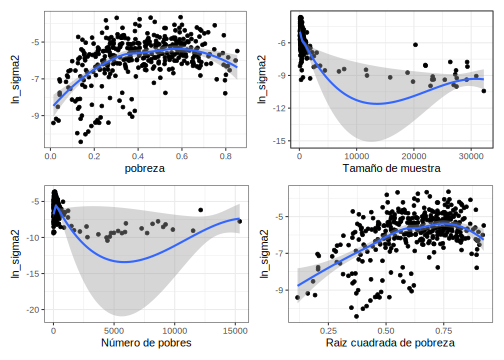

# Día 2 - Sesión 1- Estimaciones GEIH y Función Generalizada de Varianza


Uno de los insumos más importantes en el modelo de áreas es la 
varianza del estimador directo, a nivel de dominio, la cual no puede calcularse de ningún modo. En correspondencia, este valor debe estimarse desde los datos recolectados en cada dominio. Sin embargo, 
en dominios en las que se cuenta con un tamaño de muestra muy pequeño, estas estimaciones no tendrán un buen comportamiento. Por ende, es muy útil utilizar un modelo de **suavizamiento** de las varianzas para 
eliminar el ruido y la volatilidad de estas estimaciones y extraer la verdadera señal del proceso

Hidiroglou (2019) afirma que $E_{mp}\left(\hat{\theta}^{dir}_d\right)=\boldsymbol{x}_{d}\boldsymbol{\beta}$ y $V_{mp}\left(\hat{\theta}^{dir}_d\right)=\sigma_{u}^2+\tilde{\psi}^2_{d}$, en donde el subíndice  $mp$ hace referencia a la inferencia doble que se debe tener en cuenta en este tipo de ajustes y define la medida de probabilidad conjunta entre el modelo y el diseño de muestreo.  

-   $m$ hace referencia a la medida de probabilidad inducida por el modelamiento y la inclusión de las covariables auxiliares ($\boldsymbol{x}_{d}$).

-   $p$ hacer referencia a la medida de probabilidad inducida por el diseño de muestreo complejo que 
induce las estimaciones directas. 

La solución que acá se plantea se conoce con el nombre de Función Generalizada de Varianza, la cual consiste en ajustar un modelo log-lineal a la varianza directa estimada. Partiendo del hecho de que
se tiene acceso a un estimador insesgado de $\psi^2$, denotado por $\hat{\psi}^2$ se tiene que:
$$
E_{mp}\left(\hat{\psi}_{d}^{2}\right)=E_{m}\left(E_{p}\left(\psi_{d}^{2}\right)\right)=E_{m}\left(\psi_{d}^{2}\right)=\tilde{\psi}_{d}^{2}
$$

La anterior igualdad puede interpretarse como que un estimador insesgado y simple de $\tilde{\psi}_{d}^{2}$ puede ser $\hat{\psi}_{d}^{2}$. Sin embargo, este estimador de muestreo es inestable cuando el tamaño de muestra es pequeño, que es justo el paradigma dominante en la estimación de áreas pequeñas. Rivest and Belmonte (2000) consideran modelos de suavizamiento para la estimación de las varianzas directas definidos de la siguiente manera:

$$
\log\left(\hat{\psi}_{d}^{2}\right)=\boldsymbol{z}_{d}^{t}\boldsymbol{\alpha}+\boldsymbol{\varepsilon}_{d}
$$

En donde $\boldsymbol{z}_{d}$ es un vector de covariables explicativas que son funciones de $\boldsymbol{x}_{d}$, $\boldsymbol{\alpha}$ es un vector de parámetros que deben ser estimados, $\boldsymbol{\varepsilon}_{d}$ son errores aleatorios con media cero y varianza constante, que se asumen idénticamente distribuidos condicionalmente sobre $\boldsymbol{z}_{d}$. Del anterior modelo, la
estimación suavizada de la varianza de muestreo está dada por:
$$
\tilde{\psi}_{d}^{2}=E_{mp}\left(\psi_{d}^{2}\right)=\exp\left(\boldsymbol{z}_{d}^{t}\boldsymbol{\alpha}\right)\times\Delta
$$

En donde, $E_{mp}\left(\varepsilon_{d}\right)=\Delta$. No hay necesidad de especificar una distribución paramétrica para los
errores de este modelo. Al utilizar el método de los momentos, se tiene el siguiente estimador insesgado para $\Delta$: 
$$
\hat{\Delta}=\frac{\sum_{d=1}^{D}\hat{\psi}_{d}^{2}}{\sum_{d=1}^{D}\exp\left(\boldsymbol{z}_{d}^{t}\boldsymbol{\alpha}\right)}
$$

De la misma forma, al utilizar los procedimientos estándar en una regresión lineal, la estimación del coeficiente de parámetros de regresión está dada por la siguiente expresión:

$$
\hat{\boldsymbol{\alpha}}=\left(\sum_{d=1}^{D}\boldsymbol{z}_{d}\boldsymbol{z}_{d}^{t}\right)^{-1}\sum_{d=1}^{D}\boldsymbol{z}_{d}\log\left(\hat{\psi}_{d}^{2}\right)
$$

Por último, el estimador suavizado de la varianza muestral está definido por:

$$
\hat{\tilde{\psi}}_{d}^{2}=\exp\left(\boldsymbol{z}_{d}^{t}\hat{\boldsymbol{\alpha}}\right)\hat{\Delta}
$$

## Datos de la encuesta


```r
library(tidyverse)
library(magrittr)
source("Recursos/Día2/Sesion1/0Recursos/0Source_FH.R")

encuesta <- readRDS("Recursos/Día2/Sesion1/Data/encuestaCOL18N1.rds") %>% 
  transmute(
    dam = dam_ee,
    dam2,
    wkx = `_fep`, 
    upm = segmento,
    estrato = paste0(dam, haven::as_factor(area_ee,levels = "values")),
    pobreza = ifelse(ingcorte < lp, 1 , 0))
```

-   *dam*: Corresponde al código asignado a la división administrativa mayor del país.

-   *dam2*: Corresponde al código asignado a la segunda división administrativa del país.

-   *lp* linea de pobreza definida por CEPAL. 

-   Factor de expansión por persona (*fep*)


<table class="table table-striped lightable-classic" style="width: auto !important; margin-left: auto; margin-right: auto; font-family: Arial Narrow; width: auto !important; margin-left: auto; margin-right: auto;">
 <thead>
  <tr>
   <th style="text-align:left;"> dam </th>
   <th style="text-align:left;"> dam2 </th>
   <th style="text-align:right;"> wkx </th>
   <th style="text-align:left;"> upm </th>
   <th style="text-align:left;"> estrato </th>
   <th style="text-align:right;"> pobreza </th>
  </tr>
 </thead>
<tbody>
  <tr>
   <td style="text-align:left;"> 05 </td>
   <td style="text-align:left;"> 05360 </td>
   <td style="text-align:right;"> 127.2220 </td>
   <td style="text-align:left;"> 010126005360 </td>
   <td style="text-align:left;"> 051 </td>
   <td style="text-align:right;"> 0 </td>
  </tr>
  <tr>
   <td style="text-align:left;"> 05 </td>
   <td style="text-align:left;"> 05360 </td>
   <td style="text-align:right;"> 127.2220 </td>
   <td style="text-align:left;"> 010126005360 </td>
   <td style="text-align:left;"> 051 </td>
   <td style="text-align:right;"> 0 </td>
  </tr>
  <tr>
   <td style="text-align:left;"> 05 </td>
   <td style="text-align:left;"> 05360 </td>
   <td style="text-align:right;"> 127.2220 </td>
   <td style="text-align:left;"> 010126005360 </td>
   <td style="text-align:left;"> 051 </td>
   <td style="text-align:right;"> 0 </td>
  </tr>
  <tr>
   <td style="text-align:left;"> 05 </td>
   <td style="text-align:left;"> 05360 </td>
   <td style="text-align:right;"> 127.2220 </td>
   <td style="text-align:left;"> 010126005360 </td>
   <td style="text-align:left;"> 051 </td>
   <td style="text-align:right;"> 0 </td>
  </tr>
  <tr>
   <td style="text-align:left;"> 05 </td>
   <td style="text-align:left;"> 05360 </td>
   <td style="text-align:right;"> 127.2220 </td>
   <td style="text-align:left;"> 010126005360 </td>
   <td style="text-align:left;"> 051 </td>
   <td style="text-align:right;"> 0 </td>
  </tr>
  <tr>
   <td style="text-align:left;"> 05 </td>
   <td style="text-align:left;"> 05360 </td>
   <td style="text-align:right;"> 125.7202 </td>
   <td style="text-align:left;"> 010126005360 </td>
   <td style="text-align:left;"> 051 </td>
   <td style="text-align:right;"> 1 </td>
  </tr>
  <tr>
   <td style="text-align:left;"> 05 </td>
   <td style="text-align:left;"> 05360 </td>
   <td style="text-align:right;"> 125.7202 </td>
   <td style="text-align:left;"> 010126005360 </td>
   <td style="text-align:left;"> 051 </td>
   <td style="text-align:right;"> 1 </td>
  </tr>
  <tr>
   <td style="text-align:left;"> 05 </td>
   <td style="text-align:left;"> 05360 </td>
   <td style="text-align:right;"> 125.7202 </td>
   <td style="text-align:left;"> 010126005360 </td>
   <td style="text-align:left;"> 051 </td>
   <td style="text-align:right;"> 1 </td>
  </tr>
  <tr>
   <td style="text-align:left;"> 05 </td>
   <td style="text-align:left;"> 05360 </td>
   <td style="text-align:right;"> 125.7202 </td>
   <td style="text-align:left;"> 010126005360 </td>
   <td style="text-align:left;"> 051 </td>
   <td style="text-align:right;"> 1 </td>
  </tr>
  <tr>
   <td style="text-align:left;"> 05 </td>
   <td style="text-align:left;"> 05360 </td>
   <td style="text-align:right;"> 115.8661 </td>
   <td style="text-align:left;"> 010126005360 </td>
   <td style="text-align:left;"> 051 </td>
   <td style="text-align:right;"> 1 </td>
  </tr>
</tbody>
</table>

Definir el diseño muestral haciendo uso de las librerías `srvyr` y `survey`


```r
library(survey)
library(srvyr)
options(survey.lonely.psu = "adjust")

diseno <-
  as_survey_design(
    ids = upm,
    weights = wkx,
    strata = estrato,
    nest = TRUE,
    .data = encuesta
  )
summary(diseno)
```

```
## Stratified 1 - level Cluster Sampling design (with replacement)
## With (21869) clusters.
## Called via srvyr
## Probabilities:
##     Min.  1st Qu.   Median     Mean  3rd Qu.     Max. 
## 0.001089 0.012313 0.037623 0.057119 0.080947 0.783027 
## Stratum Sizes: 
##              051  052   081  082   111 112   131  132   151  152   171  172
## obs        41761 3706 43299 1022 32177  36 32757 2853 23299 3186 27959 2805
## design.PSU  1247  123   926   29   972   1   828   83   762  131   905  101
## actual.PSU  1247  123   926   29   972   1   828   83   762  131   905  101
##              181  182   191  192   201  202   231  232  251  252   271  272
## obs        23698 5144 28826 5531 30225 2229 29181 2805 6271 2797 22812 4016
## design.PSU   760  130   852  180   832   81   650   83  181  106   699  140
## actual.PSU   760  130   852  180   832   81   650   83  181  106   699  140
##              411  412   441  442   471  472   501  502   521  522   541  542
## obs        27446 3282 32062 3556 34690 2944 26381 2936 24656 4271 27554 3830
## design.PSU   866  105   790  120   889   84   803   96   734  131   793  134
## actual.PSU   866  105   790  120   889   84   803   96   734  131   793  134
##              631  632   661  662   681  682   701  702   731  732   761  762
## obs        26616 1660 25945 3254 28390 3388 32471 3054 25315 3101 35065 2491
## design.PSU   864   55   818  103   749  108   737   96   788   91  1027   86
## actual.PSU   864   55   818  103   749  108   737   96   788   91  1027   86
## Data variables:
## [1] "dam"     "dam2"    "wkx"     "upm"     "estrato" "pobreza"
```

Para la estimación directa de la proporción se emplea la función `direct.supr`, disponible en el archivo `0Source_FH.R`, dando como resultado.


```r
directodam2 <- direct.supr(design.base = diseno,
                             variable = pobreza, 
                             group = dam2,
                             upm = upm,
                             estrato = estrato)


directodam2 %>%
  group_by(Flag) %>%
  summarise(n = n()) %>% 
  arrange(n) %>% tba()
```

<table class="table table-striped lightable-classic" style="width: auto !important; margin-left: auto; margin-right: auto; font-family: Arial Narrow; width: auto !important; margin-left: auto; margin-right: auto;">
 <thead>
  <tr>
   <th style="text-align:left;"> Flag </th>
   <th style="text-align:right;"> n </th>
  </tr>
 </thead>
<tbody>
  <tr>
   <td style="text-align:left;"> Excluir </td>
   <td style="text-align:right;"> 59 </td>
  </tr>
  <tr>
   <td style="text-align:left;"> Incluir </td>
   <td style="text-align:right;"> 379 </td>
  </tr>
</tbody>
</table>

Para los dominios que no son excluidos se hace la transformación arcoseno, calculo del *DEFF* y varianza 


```r
base_sae <- directodam2 %>% 
  filter(Flag != "Excluir") %>%
  transmute(
    dam2 = dam2,             # Id para los dominios
    nd = n,                    # Número de observaciones por dominios
    n_effec = n.eff,           # n efectivo. 
    pobreza = p,               # Estimación de la variable
    pobreza_T = asin(sqrt(pobreza)), # Transformación arcoseno 
    vardir = ee ^ 2,                 # Estimación de la varianza directa 
    cv = CV,                       
    var_zd = 1 / (4 * n_effec),      # Varianza para la tranformación arcsin
    deff_dam2 = deff                # Deff por dominio
  )

# View(base_sae)
tba(head(base_sae))
```

<table class="table table-striped lightable-classic" style="width: auto !important; margin-left: auto; margin-right: auto; font-family: Arial Narrow; width: auto !important; margin-left: auto; margin-right: auto;">
 <thead>
  <tr>
   <th style="text-align:left;"> dam2 </th>
   <th style="text-align:right;"> nd </th>
   <th style="text-align:right;"> n_effec </th>
   <th style="text-align:right;"> pobreza </th>
   <th style="text-align:right;"> pobreza_T </th>
   <th style="text-align:right;"> vardir </th>
   <th style="text-align:right;"> cv </th>
   <th style="text-align:right;"> var_zd </th>
   <th style="text-align:right;"> deff_dam2 </th>
  </tr>
 </thead>
<tbody>
  <tr>
   <td style="text-align:left;"> 05001 </td>
   <td style="text-align:right;"> 27432 </td>
   <td style="text-align:right;"> 1914.8077 </td>
   <td style="text-align:right;"> 0.1597 </td>
   <td style="text-align:right;"> 0.4111 </td>
   <td style="text-align:right;"> 0.0000 </td>
   <td style="text-align:right;"> 4.1932 </td>
   <td style="text-align:right;"> 0.0001 </td>
   <td style="text-align:right;"> 14.3262 </td>
  </tr>
  <tr>
   <td style="text-align:left;"> 05002 </td>
   <td style="text-align:right;"> 257 </td>
   <td style="text-align:right;"> 21.3006 </td>
   <td style="text-align:right;"> 0.4049 </td>
   <td style="text-align:right;"> 0.6897 </td>
   <td style="text-align:right;"> 0.0032 </td>
   <td style="text-align:right;"> 14.0276 </td>
   <td style="text-align:right;"> 0.0117 </td>
   <td style="text-align:right;"> 12.0654 </td>
  </tr>
  <tr>
   <td style="text-align:left;"> 05031 </td>
   <td style="text-align:right;"> 199 </td>
   <td style="text-align:right;"> 7.8051 </td>
   <td style="text-align:right;"> 0.3817 </td>
   <td style="text-align:right;"> 0.6660 </td>
   <td style="text-align:right;"> 0.0042 </td>
   <td style="text-align:right;"> 17.0554 </td>
   <td style="text-align:right;"> 0.0320 </td>
   <td style="text-align:right;"> 25.4963 </td>
  </tr>
  <tr>
   <td style="text-align:left;"> 05034 </td>
   <td style="text-align:right;"> 223 </td>
   <td style="text-align:right;"> 25.8934 </td>
   <td style="text-align:right;"> 0.4731 </td>
   <td style="text-align:right;"> 0.7585 </td>
   <td style="text-align:right;"> 0.0018 </td>
   <td style="text-align:right;"> 8.8997 </td>
   <td style="text-align:right;"> 0.0097 </td>
   <td style="text-align:right;"> 8.6122 </td>
  </tr>
  <tr>
   <td style="text-align:left;"> 05045 </td>
   <td style="text-align:right;"> 480 </td>
   <td style="text-align:right;"> 5.0044 </td>
   <td style="text-align:right;"> 0.2876 </td>
   <td style="text-align:right;"> 0.5661 </td>
   <td style="text-align:right;"> 0.0064 </td>
   <td style="text-align:right;"> 27.9009 </td>
   <td style="text-align:right;"> 0.0500 </td>
   <td style="text-align:right;"> 95.9148 </td>
  </tr>
  <tr>
   <td style="text-align:left;"> 05079 </td>
   <td style="text-align:right;"> 191 </td>
   <td style="text-align:right;"> 22.5008 </td>
   <td style="text-align:right;"> 0.4001 </td>
   <td style="text-align:right;"> 0.6848 </td>
   <td style="text-align:right;"> 0.0063 </td>
   <td style="text-align:right;"> 19.8514 </td>
   <td style="text-align:right;"> 0.0111 </td>
   <td style="text-align:right;"> 8.4886 </td>
  </tr>
</tbody>
</table>

Seleccionando las variables de interés para la FGV. 


```r
baseFGV <-  base_sae %>% 
  select(dam2, pobreza, nd, vardir) %>%
  mutate(ln_sigma2 = log(vardir))
```

## Análisis gráfico


```r
theme_set(theme_bw())

# pobreza vs Ln_sigma2 #

p1 <- ggplot(baseFGV, aes(x = pobreza, y = ln_sigma2)) +
  geom_point() +
  geom_smooth(method = "loess") +
  xlab("pobreza")

# Tamaño de muestra vs Ln_sigma2 #

p2 <- ggplot(baseFGV, aes(x = nd, y = ln_sigma2)) + 
  geom_point() +
  geom_smooth(method = "loess") + 
  xlab("Tamaño de muestra")

# Número de pobres vs Ln_sigma2 #

p3 <- ggplot(baseFGV, 
             aes(x = pobreza * nd, y = ln_sigma2)) + 
  geom_point() +
  geom_smooth(method = "loess") + 
  xlab("Número de pobres")

# Raiz_pobreza vs Ln_sigma2 #

p4 <- ggplot(baseFGV, 
             aes(x = sqrt(pobreza), y = ln_sigma2)) + 
  geom_point() +
  geom_smooth(method = "loess") + 
  xlab("Raiz cuadrada de pobreza")

library(patchwork)
(p1 | p2) / (p3 | p4)
```



## Modelo para la varianza


```r
library(gtsummary)
FGV1 <- lm(ln_sigma2 ~ pobreza + I(nd^2) + I(sqrt(pobreza)),
     data = baseFGV)

tbl_regression(FGV1) %>% 
  add_glance_table(include = c(r.squared, adj.r.squared))
```

```{=html}
<div id="srxmuctavx" style="padding-left:0px;padding-right:0px;padding-top:10px;padding-bottom:10px;overflow-x:auto;overflow-y:auto;width:auto;height:auto;">
<style>html {
  font-family: -apple-system, BlinkMacSystemFont, 'Segoe UI', Roboto, Oxygen, Ubuntu, Cantarell, 'Helvetica Neue', 'Fira Sans', 'Droid Sans', Arial, sans-serif;
}

#srxmuctavx .gt_table {
  display: table;
  border-collapse: collapse;
  margin-left: auto;
  margin-right: auto;
  color: #333333;
  font-size: 16px;
  font-weight: normal;
  font-style: normal;
  background-color: #FFFFFF;
  width: auto;
  border-top-style: solid;
  border-top-width: 2px;
  border-top-color: #A8A8A8;
  border-right-style: none;
  border-right-width: 2px;
  border-right-color: #D3D3D3;
  border-bottom-style: solid;
  border-bottom-width: 2px;
  border-bottom-color: #A8A8A8;
  border-left-style: none;
  border-left-width: 2px;
  border-left-color: #D3D3D3;
}

#srxmuctavx .gt_heading {
  background-color: #FFFFFF;
  text-align: center;
  border-bottom-color: #FFFFFF;
  border-left-style: none;
  border-left-width: 1px;
  border-left-color: #D3D3D3;
  border-right-style: none;
  border-right-width: 1px;
  border-right-color: #D3D3D3;
}

#srxmuctavx .gt_caption {
  padding-top: 4px;
  padding-bottom: 4px;
}

#srxmuctavx .gt_title {
  color: #333333;
  font-size: 125%;
  font-weight: initial;
  padding-top: 4px;
  padding-bottom: 4px;
  padding-left: 5px;
  padding-right: 5px;
  border-bottom-color: #FFFFFF;
  border-bottom-width: 0;
}

#srxmuctavx .gt_subtitle {
  color: #333333;
  font-size: 85%;
  font-weight: initial;
  padding-top: 0;
  padding-bottom: 6px;
  padding-left: 5px;
  padding-right: 5px;
  border-top-color: #FFFFFF;
  border-top-width: 0;
}

#srxmuctavx .gt_bottom_border {
  border-bottom-style: solid;
  border-bottom-width: 2px;
  border-bottom-color: #D3D3D3;
}

#srxmuctavx .gt_col_headings {
  border-top-style: solid;
  border-top-width: 2px;
  border-top-color: #D3D3D3;
  border-bottom-style: solid;
  border-bottom-width: 2px;
  border-bottom-color: #D3D3D3;
  border-left-style: none;
  border-left-width: 1px;
  border-left-color: #D3D3D3;
  border-right-style: none;
  border-right-width: 1px;
  border-right-color: #D3D3D3;
}

#srxmuctavx .gt_col_heading {
  color: #333333;
  background-color: #FFFFFF;
  font-size: 100%;
  font-weight: normal;
  text-transform: inherit;
  border-left-style: none;
  border-left-width: 1px;
  border-left-color: #D3D3D3;
  border-right-style: none;
  border-right-width: 1px;
  border-right-color: #D3D3D3;
  vertical-align: bottom;
  padding-top: 5px;
  padding-bottom: 6px;
  padding-left: 5px;
  padding-right: 5px;
  overflow-x: hidden;
}

#srxmuctavx .gt_column_spanner_outer {
  color: #333333;
  background-color: #FFFFFF;
  font-size: 100%;
  font-weight: normal;
  text-transform: inherit;
  padding-top: 0;
  padding-bottom: 0;
  padding-left: 4px;
  padding-right: 4px;
}

#srxmuctavx .gt_column_spanner_outer:first-child {
  padding-left: 0;
}

#srxmuctavx .gt_column_spanner_outer:last-child {
  padding-right: 0;
}

#srxmuctavx .gt_column_spanner {
  border-bottom-style: solid;
  border-bottom-width: 2px;
  border-bottom-color: #D3D3D3;
  vertical-align: bottom;
  padding-top: 5px;
  padding-bottom: 5px;
  overflow-x: hidden;
  display: inline-block;
  width: 100%;
}

#srxmuctavx .gt_group_heading {
  padding-top: 8px;
  padding-bottom: 8px;
  padding-left: 5px;
  padding-right: 5px;
  color: #333333;
  background-color: #FFFFFF;
  font-size: 100%;
  font-weight: initial;
  text-transform: inherit;
  border-top-style: solid;
  border-top-width: 2px;
  border-top-color: #D3D3D3;
  border-bottom-style: solid;
  border-bottom-width: 2px;
  border-bottom-color: #D3D3D3;
  border-left-style: none;
  border-left-width: 1px;
  border-left-color: #D3D3D3;
  border-right-style: none;
  border-right-width: 1px;
  border-right-color: #D3D3D3;
  vertical-align: middle;
  text-align: left;
}

#srxmuctavx .gt_empty_group_heading {
  padding: 0.5px;
  color: #333333;
  background-color: #FFFFFF;
  font-size: 100%;
  font-weight: initial;
  border-top-style: solid;
  border-top-width: 2px;
  border-top-color: #D3D3D3;
  border-bottom-style: solid;
  border-bottom-width: 2px;
  border-bottom-color: #D3D3D3;
  vertical-align: middle;
}

#srxmuctavx .gt_from_md > :first-child {
  margin-top: 0;
}

#srxmuctavx .gt_from_md > :last-child {
  margin-bottom: 0;
}

#srxmuctavx .gt_row {
  padding-top: 8px;
  padding-bottom: 8px;
  padding-left: 5px;
  padding-right: 5px;
  margin: 10px;
  border-top-style: solid;
  border-top-width: 1px;
  border-top-color: #D3D3D3;
  border-left-style: none;
  border-left-width: 1px;
  border-left-color: #D3D3D3;
  border-right-style: none;
  border-right-width: 1px;
  border-right-color: #D3D3D3;
  vertical-align: middle;
  overflow-x: hidden;
}

#srxmuctavx .gt_stub {
  color: #333333;
  background-color: #FFFFFF;
  font-size: 100%;
  font-weight: initial;
  text-transform: inherit;
  border-right-style: solid;
  border-right-width: 2px;
  border-right-color: #D3D3D3;
  padding-left: 5px;
  padding-right: 5px;
}

#srxmuctavx .gt_stub_row_group {
  color: #333333;
  background-color: #FFFFFF;
  font-size: 100%;
  font-weight: initial;
  text-transform: inherit;
  border-right-style: solid;
  border-right-width: 2px;
  border-right-color: #D3D3D3;
  padding-left: 5px;
  padding-right: 5px;
  vertical-align: top;
}

#srxmuctavx .gt_row_group_first td {
  border-top-width: 2px;
}

#srxmuctavx .gt_summary_row {
  color: #333333;
  background-color: #FFFFFF;
  text-transform: inherit;
  padding-top: 8px;
  padding-bottom: 8px;
  padding-left: 5px;
  padding-right: 5px;
}

#srxmuctavx .gt_first_summary_row {
  border-top-style: solid;
  border-top-color: #D3D3D3;
}

#srxmuctavx .gt_first_summary_row.thick {
  border-top-width: 2px;
}

#srxmuctavx .gt_last_summary_row {
  padding-top: 8px;
  padding-bottom: 8px;
  padding-left: 5px;
  padding-right: 5px;
  border-bottom-style: solid;
  border-bottom-width: 2px;
  border-bottom-color: #D3D3D3;
}

#srxmuctavx .gt_grand_summary_row {
  color: #333333;
  background-color: #FFFFFF;
  text-transform: inherit;
  padding-top: 8px;
  padding-bottom: 8px;
  padding-left: 5px;
  padding-right: 5px;
}

#srxmuctavx .gt_first_grand_summary_row {
  padding-top: 8px;
  padding-bottom: 8px;
  padding-left: 5px;
  padding-right: 5px;
  border-top-style: double;
  border-top-width: 6px;
  border-top-color: #D3D3D3;
}

#srxmuctavx .gt_striped {
  background-color: rgba(128, 128, 128, 0.05);
}

#srxmuctavx .gt_table_body {
  border-top-style: solid;
  border-top-width: 2px;
  border-top-color: #D3D3D3;
  border-bottom-style: solid;
  border-bottom-width: 2px;
  border-bottom-color: #D3D3D3;
}

#srxmuctavx .gt_footnotes {
  color: #333333;
  background-color: #FFFFFF;
  border-bottom-style: none;
  border-bottom-width: 2px;
  border-bottom-color: #D3D3D3;
  border-left-style: none;
  border-left-width: 2px;
  border-left-color: #D3D3D3;
  border-right-style: none;
  border-right-width: 2px;
  border-right-color: #D3D3D3;
}

#srxmuctavx .gt_footnote {
  margin: 0px;
  font-size: 90%;
  padding-left: 4px;
  padding-right: 4px;
  padding-left: 5px;
  padding-right: 5px;
}

#srxmuctavx .gt_sourcenotes {
  color: #333333;
  background-color: #FFFFFF;
  border-bottom-style: none;
  border-bottom-width: 2px;
  border-bottom-color: #D3D3D3;
  border-left-style: none;
  border-left-width: 2px;
  border-left-color: #D3D3D3;
  border-right-style: none;
  border-right-width: 2px;
  border-right-color: #D3D3D3;
}

#srxmuctavx .gt_sourcenote {
  font-size: 90%;
  padding-top: 4px;
  padding-bottom: 4px;
  padding-left: 5px;
  padding-right: 5px;
}

#srxmuctavx .gt_left {
  text-align: left;
}

#srxmuctavx .gt_center {
  text-align: center;
}

#srxmuctavx .gt_right {
  text-align: right;
  font-variant-numeric: tabular-nums;
}

#srxmuctavx .gt_font_normal {
  font-weight: normal;
}

#srxmuctavx .gt_font_bold {
  font-weight: bold;
}

#srxmuctavx .gt_font_italic {
  font-style: italic;
}

#srxmuctavx .gt_super {
  font-size: 65%;
}

#srxmuctavx .gt_footnote_marks {
  font-style: italic;
  font-weight: normal;
  font-size: 75%;
  vertical-align: 0.4em;
}

#srxmuctavx .gt_asterisk {
  font-size: 100%;
  vertical-align: 0;
}

#srxmuctavx .gt_indent_1 {
  text-indent: 5px;
}

#srxmuctavx .gt_indent_2 {
  text-indent: 10px;
}

#srxmuctavx .gt_indent_3 {
  text-indent: 15px;
}

#srxmuctavx .gt_indent_4 {
  text-indent: 20px;
}

#srxmuctavx .gt_indent_5 {
  text-indent: 25px;
}
</style>
<table class="gt_table">
  
  <thead class="gt_col_headings">
    <tr>
      <th class="gt_col_heading gt_columns_bottom_border gt_left" rowspan="1" colspan="1" scope="col" id="&lt;strong&gt;Characteristic&lt;/strong&gt;"><strong>Characteristic</strong></th>
      <th class="gt_col_heading gt_columns_bottom_border gt_center" rowspan="1" colspan="1" scope="col" id="&lt;strong&gt;Beta&lt;/strong&gt;"><strong>Beta</strong></th>
      <th class="gt_col_heading gt_columns_bottom_border gt_center" rowspan="1" colspan="1" scope="col" id="&lt;strong&gt;95% CI&lt;/strong&gt;&lt;sup class=&quot;gt_footnote_marks&quot;&gt;1&lt;/sup&gt;"><strong>95% CI</strong><sup class="gt_footnote_marks">1</sup></th>
      <th class="gt_col_heading gt_columns_bottom_border gt_center" rowspan="1" colspan="1" scope="col" id="&lt;strong&gt;p-value&lt;/strong&gt;"><strong>p-value</strong></th>
    </tr>
  </thead>
  <tbody class="gt_table_body">
    <tr><td headers="label" class="gt_row gt_left">pobreza</td>
<td headers="estimate" class="gt_row gt_center">-12</td>
<td headers="ci" class="gt_row gt_center">-14, -9.5</td>
<td headers="p.value" class="gt_row gt_center"><0.001</td></tr>
    <tr><td headers="label" class="gt_row gt_left">I(nd^2)</td>
<td headers="estimate" class="gt_row gt_center">0.00</td>
<td headers="ci" class="gt_row gt_center">0.00, 0.00</td>
<td headers="p.value" class="gt_row gt_center"><0.001</td></tr>
    <tr><td headers="label" class="gt_row gt_left">I(sqrt(pobreza))</td>
<td headers="estimate" class="gt_row gt_center">16</td>
<td headers="ci" class="gt_row gt_center">14, 19</td>
<td headers="p.value" class="gt_row gt_center"><0.001</td></tr>
    <tr><td headers="label" class="gt_row gt_left" style="border-top-width: 2px; border-top-style: solid; border-top-color: #D3D3D3;">R²</td>
<td headers="estimate" class="gt_row gt_center" style="border-top-width: 2px; border-top-style: solid; border-top-color: #D3D3D3;">0.608</td>
<td headers="ci" class="gt_row gt_center" style="border-top-width: 2px; border-top-style: solid; border-top-color: #D3D3D3;"></td>
<td headers="p.value" class="gt_row gt_center" style="border-top-width: 2px; border-top-style: solid; border-top-color: #D3D3D3;"></td></tr>
    <tr><td headers="label" class="gt_row gt_left">Adjusted R²</td>
<td headers="estimate" class="gt_row gt_center">0.604</td>
<td headers="ci" class="gt_row gt_center"></td>
<td headers="p.value" class="gt_row gt_center"></td></tr>
  </tbody>
  
  <tfoot class="gt_footnotes">
    <tr>
      <td class="gt_footnote" colspan="4"><sup class="gt_footnote_marks">1</sup> CI = Confidence Interval</td>
    </tr>
  </tfoot>
</table>
</div>
```

Ponderador FGV


```r
delta.hat = sum(baseFGV$vardir) / 
  sum(exp(fitted.values(FGV1)))
delta.hat
```

```
## [1] 1.303171
```

Varianza suavizada para los dominios observados


```r
hat.sigma <- 
  data.frame(dam2 = baseFGV$dam2,
             hat_var = delta.hat * exp(fitted.values(FGV1)))

baseFGV <- left_join(baseFGV, hat.sigma)
tba(head(baseFGV, 10))
```

<table class="table table-striped lightable-classic" style="width: auto !important; margin-left: auto; margin-right: auto; font-family: Arial Narrow; width: auto !important; margin-left: auto; margin-right: auto;">
 <thead>
  <tr>
   <th style="text-align:left;"> dam2 </th>
   <th style="text-align:right;"> pobreza </th>
   <th style="text-align:right;"> nd </th>
   <th style="text-align:right;"> vardir </th>
   <th style="text-align:right;"> ln_sigma2 </th>
   <th style="text-align:right;"> hat_var </th>
  </tr>
 </thead>
<tbody>
  <tr>
   <td style="text-align:left;"> 05001 </td>
   <td style="text-align:right;"> 0.1597 </td>
   <td style="text-align:right;"> 27432 </td>
   <td style="text-align:right;"> 0.0000 </td>
   <td style="text-align:right;"> -10.0123 </td>
   <td style="text-align:right;"> 0.0001 </td>
  </tr>
  <tr>
   <td style="text-align:left;"> 05002 </td>
   <td style="text-align:right;"> 0.4049 </td>
   <td style="text-align:right;"> 257 </td>
   <td style="text-align:right;"> 0.0032 </td>
   <td style="text-align:right;"> -5.7366 </td>
   <td style="text-align:right;"> 0.0060 </td>
  </tr>
  <tr>
   <td style="text-align:left;"> 05031 </td>
   <td style="text-align:right;"> 0.3817 </td>
   <td style="text-align:right;"> 199 </td>
   <td style="text-align:right;"> 0.0042 </td>
   <td style="text-align:right;"> -5.4635 </td>
   <td style="text-align:right;"> 0.0058 </td>
  </tr>
  <tr>
   <td style="text-align:left;"> 05034 </td>
   <td style="text-align:right;"> 0.4731 </td>
   <td style="text-align:right;"> 223 </td>
   <td style="text-align:right;"> 0.0018 </td>
   <td style="text-align:right;"> -6.3351 </td>
   <td style="text-align:right;"> 0.0062 </td>
  </tr>
  <tr>
   <td style="text-align:left;"> 05045 </td>
   <td style="text-align:right;"> 0.2876 </td>
   <td style="text-align:right;"> 480 </td>
   <td style="text-align:right;"> 0.0064 </td>
   <td style="text-align:right;"> -5.0451 </td>
   <td style="text-align:right;"> 0.0047 </td>
  </tr>
  <tr>
   <td style="text-align:left;"> 05079 </td>
   <td style="text-align:right;"> 0.4001 </td>
   <td style="text-align:right;"> 191 </td>
   <td style="text-align:right;"> 0.0063 </td>
   <td style="text-align:right;"> -5.0660 </td>
   <td style="text-align:right;"> 0.0060 </td>
  </tr>
  <tr>
   <td style="text-align:left;"> 05088 </td>
   <td style="text-align:right;"> 0.1314 </td>
   <td style="text-align:right;"> 4457 </td>
   <td style="text-align:right;"> 0.0002 </td>
   <td style="text-align:right;"> -8.5360 </td>
   <td style="text-align:right;"> 0.0016 </td>
  </tr>
  <tr>
   <td style="text-align:left;"> 05093 </td>
   <td style="text-align:right;"> 0.3273 </td>
   <td style="text-align:right;"> 168 </td>
   <td style="text-align:right;"> 0.0063 </td>
   <td style="text-align:right;"> -5.0724 </td>
   <td style="text-align:right;"> 0.0052 </td>
  </tr>
  <tr>
   <td style="text-align:left;"> 05120 </td>
   <td style="text-align:right;"> 0.7049 </td>
   <td style="text-align:right;"> 180 </td>
   <td style="text-align:right;"> 0.0061 </td>
   <td style="text-align:right;"> -5.0921 </td>
   <td style="text-align:right;"> 0.0048 </td>
  </tr>
  <tr>
   <td style="text-align:left;"> 05129 </td>
   <td style="text-align:right;"> 0.1140 </td>
   <td style="text-align:right;"> 554 </td>
   <td style="text-align:right;"> 0.0014 </td>
   <td style="text-align:right;"> -6.5515 </td>
   <td style="text-align:right;"> 0.0014 </td>
  </tr>
</tbody>
</table>

 Validación del modelo para la FGV


```r
par(mfrow = c(2, 2))
plot(FGV1)
```


 Comparación entre varianza estimada con pronosticada por la FGV


```r
ggplot(baseFGV , 
       aes(y = vardir, x = hat_var)) + 
  geom_point() +
  geom_smooth(method = "loess") + 
    labs(x = "FGV", y = "VarDirEst") +
  ylab("Varianza del Estimador Directo")
```


Predicción de la varianza suavizada


```r
base_sae <- base_sae %>%  left_join(hat.sigma, by = "dam2")
```

Organizando la información para exportar, realizamos validaciones adicionales sobre el deff


```r
base_FH <- base_sae %>%
  mutate(
    deff_dam2 = ifelse(is.nan(deff_dam2), 1,
                         deff_dam2),
    deff_FGV = ifelse(
      vardir == 0 ,
      1,
      hat_var / (vardir / deff_dam2)
    ),
    # Criterio MDS para regularizar el DeffFGV
    deff_FGV = ifelse(deff_FGV < 1, 1, deff_FGV),
    n_eff_FGV = nd / deff_FGV
  )

saveRDS(object = base_FH, "Recursos/Día2/Sesion1/Data/base_FH_2018.rds")
```


