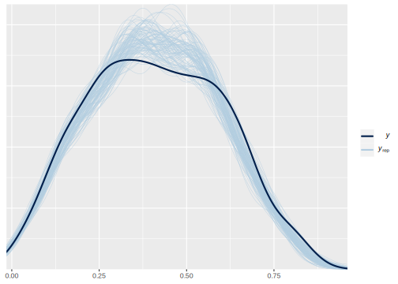
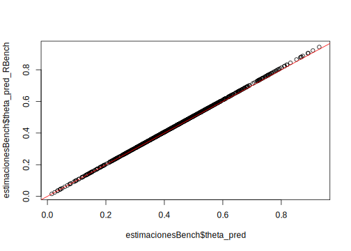

# Modelo de Fay Herriot respuesta normal. 


El modelo de Fay Herriot FH, propuesto por Fay y Herriot (1979), es un modelo estadístico de área y es el más comúnmente utilizado, cabe tener en cuenta, que dentro de la metodología de estimación en áreas pequeñas, los modelos de área son los de mayor aplicación, ya que lo más factible es no contar con la información a nivel de individuo, pero si encontrar no solo los datos a nivel de área, sino también información auxiliar asociada a estos datos. Este modelo lineal mixto, fue el primero en incluir efectos aleatorios a nivel de área, lo que implica que la mayoría de la información que se introduce al modelo corresponde a agregaciaciones usualmente, departamentos, regiones, provincias, municipios entre otros, donde las estimaciones que se logran con el modelo se obtienen sobre estas agregaciones o subpoblaciones.


-   El modelo FH enlaza indicadores de las áreas $\delta_d$, $d = 1, \cdots , D$, asumiendo que varían respeto a un vector de $p$ covariables, $\boldsymbol{x}_d$ , de forma constante. El modelo esta dado por la ecuación

$$
\delta_d = \boldsymbol{x^T}_d\boldsymbol{\beta} + u_d ,\ \ \ \ \  d = 1, \cdots , D
$$ 

- $u_d$ es el término de error, o el efecto aleatorio, diferente para cada área dado por

$$
\begin{eqnarray*}
u_{d} & \stackrel{iid}{\sim} & \left(0,\sigma_{u}^{2}\right)
\end{eqnarray*}
$$

-   Sin embargo, los verdaderos valores de los indicadores $\delta_d$ no son observables. Entonces, usamos el estimador directo $\hat{\delta}^{DIR}_d$ para $\delta_d$ , lo que conlleva un error debido al muestro.

-   $\hat{\delta}^{DIR}_d$ todavía se considera insesgado bajo el diseño muestral.

-   Podemos definir, entonces, 

$$
\hat{\delta}^{DIR}_d = \delta_d + e_d, \ \ \ \ \ \ d = 1, \cdots , D 
$$ 
    
donde $e_d$ es el error debido al muestreo, $e_{d} \stackrel{ind}{\sim} \left(0,\psi\right)$

-   Dichas varianzas $\psi_d = var_{\pi}\left(\hat{\delta}^{DIR}_d\mid\delta_d\right)$, $d = 1,\cdots,D$ se estiman con los microdatos de la encuesta.

-   Por tanto, el modelo se hace, $$
    \hat{\delta}^{DIR}_d = \boldsymbol{x^T}_d\boldsymbol{\beta} + u_d + e_d, \ \ \ \ \ \ d = 1, \cdots , D
    $$

-   El BLUP (best linear unbiased predictor) bajo el modelo FH de $\delta_d$ viene dado por

$$
    \begin{eqnarray*}
    \tilde{\delta}_{d}^{FH} & = & \boldsymbol{x_d}^{T}\tilde{\boldsymbol{\beta}}+\tilde{u}_{d}
    \end{eqnarray*}
$$

-   Si sustituimos $\tilde{u}_d = \gamma_d\left(\hat{\delta}^{DIR}_d - \boldsymbol{x_d}^{T}\tilde{\boldsymbol{\beta}} \right)$ en el BLUP bajo el modelo FH, obtenemos $$
    \begin{eqnarray*}
    \tilde{\delta}_{d}^{FH} & = & \gamma_d\hat{\delta}^{DIR}_{d}+(1-\gamma_d)\boldsymbol{x_d}^{T}\tilde{\boldsymbol{\beta}}
    \end{eqnarray*}
    $$ siendo $\gamma_d=\frac{\sigma^2_u}{\sigma^2_u + \psi_d}$.

-   Habitualmente, no sabemos el verdadero valor de $\sigma^2_u$ efectos aleatorios $u_d$.

-   Sea $\hat{\sigma}^2_u$ un estimador consistente para $\sigma^2_u$. Entonces, obtenemos el BLUP empírico (empirical BLUP, EBLUP) de $\delta_d$ ,

$$
    \begin{eqnarray*}
    \tilde{\delta}_{d}^{FH} & = & \hat{\gamma_d}\hat{\delta}^{DIR}_{d}+(1-\hat{\gamma_d})\boldsymbol{x_d}^{T}\hat{\boldsymbol{\beta}}
    \end{eqnarray*}
$$

donde $\hat{\gamma_d}=\frac{\hat{\sigma}^2_u}{\hat{\sigma}^2_u + \psi_d}$.

-  
$$
\begin{eqnarray*}
Y\mid\mu,\sigma_{e} & \sim & N\left(\mu,\sigma_{e}\right)\\
\mu & = & \boldsymbol{X\beta}+V
\end{eqnarray*}
$$

donde $V \sim N(0 , \sigma_v)$.

Las distribuciones previas para $\boldsymbol{\beta}$ y $\sigma^2_v$

$$
\begin{eqnarray*}
\beta_k & \sim   & N(\mu_0, \tau^2_0)\\
\sigma^2_v &\sim & IG(\alpha_1,\alpha_2)
\end{eqnarray*}
$$


## Procesamiento en R

Lectura de la base de datos que resultó en el paso anterior y selección de las columnas de interés

```r
library(tidyverse)
library(magrittr)

base_FH <- readRDS("Recursos/Día2/Sesion2/Data/base_FH_2018.rds") %>% 
  select(dam2, nd,  pobreza, vardir, hat_var)
```

Lectura de las covariables, las cuales son obtenidas previamente. Dado la diferencia entre las escalas de las variables  es necesario hacer un ajuste a estas. 


```r
statelevel_predictors_df <- readRDS("Recursos/Día2/Sesion2/Data/statelevel_predictors_df_dam2.rds") %>% 
    mutate_at(.vars = c("luces_nocturnas",
                      "cubrimiento_cultivo",
                      "cubrimiento_urbano",
                      "modificacion_humana",
                      "accesibilidad_hospitales",
                      "accesibilidad_hosp_caminado"),
            function(x) as.numeric(scale(x)))
```

Uniendo las dos bases de datos. 


```r
base_FH <- full_join(base_FH, statelevel_predictors_df, by = "dam2" )
tba(base_FH[1:10,1:8])
```

<table class="table table-striped lightable-classic" style="width: auto !important; margin-left: auto; margin-right: auto; font-family: Arial Narrow; width: auto !important; margin-left: auto; margin-right: auto;">
 <thead>
  <tr>
   <th style="text-align:left;"> dam2 </th>
   <th style="text-align:right;"> nd </th>
   <th style="text-align:right;"> pobreza </th>
   <th style="text-align:right;"> vardir </th>
   <th style="text-align:right;"> hat_var </th>
   <th style="text-align:left;"> dam </th>
   <th style="text-align:right;"> area1 </th>
   <th style="text-align:right;"> sexo2 </th>
  </tr>
 </thead>
<tbody>
  <tr>
   <td style="text-align:left;"> 05001 </td>
   <td style="text-align:right;"> 27432 </td>
   <td style="text-align:right;"> 0.1597 </td>
   <td style="text-align:right;"> 0.0000 </td>
   <td style="text-align:right;"> 0.0001 </td>
   <td style="text-align:left;"> 05 </td>
   <td style="text-align:right;"> 0.9832 </td>
   <td style="text-align:right;"> 0.5299 </td>
  </tr>
  <tr>
   <td style="text-align:left;"> 05002 </td>
   <td style="text-align:right;"> 257 </td>
   <td style="text-align:right;"> 0.4049 </td>
   <td style="text-align:right;"> 0.0032 </td>
   <td style="text-align:right;"> 0.0060 </td>
   <td style="text-align:left;"> 05 </td>
   <td style="text-align:right;"> 0.3953 </td>
   <td style="text-align:right;"> 0.4807 </td>
  </tr>
  <tr>
   <td style="text-align:left;"> 05031 </td>
   <td style="text-align:right;"> 199 </td>
   <td style="text-align:right;"> 0.3817 </td>
   <td style="text-align:right;"> 0.0042 </td>
   <td style="text-align:right;"> 0.0058 </td>
   <td style="text-align:left;"> 05 </td>
   <td style="text-align:right;"> 0.5766 </td>
   <td style="text-align:right;"> 0.4978 </td>
  </tr>
  <tr>
   <td style="text-align:left;"> 05034 </td>
   <td style="text-align:right;"> 223 </td>
   <td style="text-align:right;"> 0.4731 </td>
   <td style="text-align:right;"> 0.0018 </td>
   <td style="text-align:right;"> 0.0062 </td>
   <td style="text-align:left;"> 05 </td>
   <td style="text-align:right;"> 0.5029 </td>
   <td style="text-align:right;"> 0.4815 </td>
  </tr>
  <tr>
   <td style="text-align:left;"> 05045 </td>
   <td style="text-align:right;"> 480 </td>
   <td style="text-align:right;"> 0.2876 </td>
   <td style="text-align:right;"> 0.0064 </td>
   <td style="text-align:right;"> 0.0047 </td>
   <td style="text-align:left;"> 05 </td>
   <td style="text-align:right;"> 0.8091 </td>
   <td style="text-align:right;"> 0.5078 </td>
  </tr>
  <tr>
   <td style="text-align:left;"> 05079 </td>
   <td style="text-align:right;"> 191 </td>
   <td style="text-align:right;"> 0.4001 </td>
   <td style="text-align:right;"> 0.0063 </td>
   <td style="text-align:right;"> 0.0060 </td>
   <td style="text-align:left;"> 05 </td>
   <td style="text-align:right;"> 0.4821 </td>
   <td style="text-align:right;"> 0.5038 </td>
  </tr>
  <tr>
   <td style="text-align:left;"> 05088 </td>
   <td style="text-align:right;"> 4457 </td>
   <td style="text-align:right;"> 0.1314 </td>
   <td style="text-align:right;"> 0.0002 </td>
   <td style="text-align:right;"> 0.0016 </td>
   <td style="text-align:left;"> 05 </td>
   <td style="text-align:right;"> 0.9569 </td>
   <td style="text-align:right;"> 0.5186 </td>
  </tr>
  <tr>
   <td style="text-align:left;"> 05093 </td>
   <td style="text-align:right;"> 168 </td>
   <td style="text-align:right;"> 0.3273 </td>
   <td style="text-align:right;"> 0.0063 </td>
   <td style="text-align:right;"> 0.0052 </td>
   <td style="text-align:left;"> 05 </td>
   <td style="text-align:right;"> 0.2776 </td>
   <td style="text-align:right;"> 0.4862 </td>
  </tr>
  <tr>
   <td style="text-align:left;"> 05120 </td>
   <td style="text-align:right;"> 180 </td>
   <td style="text-align:right;"> 0.7049 </td>
   <td style="text-align:right;"> 0.0061 </td>
   <td style="text-align:right;"> 0.0048 </td>
   <td style="text-align:left;"> 05 </td>
   <td style="text-align:right;"> 0.1989 </td>
   <td style="text-align:right;"> 0.4787 </td>
  </tr>
  <tr>
   <td style="text-align:left;"> 05129 </td>
   <td style="text-align:right;"> 554 </td>
   <td style="text-align:right;"> 0.1140 </td>
   <td style="text-align:right;"> 0.0014 </td>
   <td style="text-align:right;"> 0.0014 </td>
   <td style="text-align:left;"> 05 </td>
   <td style="text-align:right;"> 0.8065 </td>
   <td style="text-align:right;"> 0.5202 </td>
  </tr>
</tbody>
</table>

```r
# View(base_FH)
```

# Preparando los insumos para `STAN`

Dividir la base de datos en dominios observados y no observados

### Dominios observados.

```r
data_dir <- base_FH %>% filter(!is.na(pobreza))
```

### Dominios NO observados.

```r
data_syn <-
  base_FH %>% anti_join(data_dir %>% select(dam2))
tba(data_syn[1:10,1:8])
```

<table class="table table-striped lightable-classic" style="width: auto !important; margin-left: auto; margin-right: auto; font-family: Arial Narrow; width: auto !important; margin-left: auto; margin-right: auto;">
 <thead>
  <tr>
   <th style="text-align:left;"> dam2 </th>
   <th style="text-align:right;"> nd </th>
   <th style="text-align:right;"> pobreza </th>
   <th style="text-align:right;"> vardir </th>
   <th style="text-align:right;"> hat_var </th>
   <th style="text-align:left;"> dam </th>
   <th style="text-align:right;"> area1 </th>
   <th style="text-align:right;"> sexo2 </th>
  </tr>
 </thead>
<tbody>
  <tr>
   <td style="text-align:left;"> 05004 </td>
   <td style="text-align:right;"> NA </td>
   <td style="text-align:right;"> NA </td>
   <td style="text-align:right;"> NA </td>
   <td style="text-align:right;"> NA </td>
   <td style="text-align:left;"> 05 </td>
   <td style="text-align:right;"> 0.3279 </td>
   <td style="text-align:right;"> 0.4576 </td>
  </tr>
  <tr>
   <td style="text-align:left;"> 05021 </td>
   <td style="text-align:right;"> NA </td>
   <td style="text-align:right;"> NA </td>
   <td style="text-align:right;"> NA </td>
   <td style="text-align:right;"> NA </td>
   <td style="text-align:left;"> 05 </td>
   <td style="text-align:right;"> 0.5770 </td>
   <td style="text-align:right;"> 0.5020 </td>
  </tr>
  <tr>
   <td style="text-align:left;"> 05030 </td>
   <td style="text-align:right;"> NA </td>
   <td style="text-align:right;"> NA </td>
   <td style="text-align:right;"> NA </td>
   <td style="text-align:right;"> NA </td>
   <td style="text-align:left;"> 05 </td>
   <td style="text-align:right;"> 0.4859 </td>
   <td style="text-align:right;"> 0.5063 </td>
  </tr>
  <tr>
   <td style="text-align:left;"> 05036 </td>
   <td style="text-align:right;"> NA </td>
   <td style="text-align:right;"> NA </td>
   <td style="text-align:right;"> NA </td>
   <td style="text-align:right;"> NA </td>
   <td style="text-align:left;"> 05 </td>
   <td style="text-align:right;"> 0.3931 </td>
   <td style="text-align:right;"> 0.4951 </td>
  </tr>
  <tr>
   <td style="text-align:left;"> 05038 </td>
   <td style="text-align:right;"> NA </td>
   <td style="text-align:right;"> NA </td>
   <td style="text-align:right;"> NA </td>
   <td style="text-align:right;"> NA </td>
   <td style="text-align:left;"> 05 </td>
   <td style="text-align:right;"> 0.2256 </td>
   <td style="text-align:right;"> 0.4927 </td>
  </tr>
  <tr>
   <td style="text-align:left;"> 05040 </td>
   <td style="text-align:right;"> NA </td>
   <td style="text-align:right;"> NA </td>
   <td style="text-align:right;"> NA </td>
   <td style="text-align:right;"> NA </td>
   <td style="text-align:left;"> 05 </td>
   <td style="text-align:right;"> 0.4858 </td>
   <td style="text-align:right;"> 0.4826 </td>
  </tr>
  <tr>
   <td style="text-align:left;"> 05042 </td>
   <td style="text-align:right;"> NA </td>
   <td style="text-align:right;"> NA </td>
   <td style="text-align:right;"> NA </td>
   <td style="text-align:right;"> NA </td>
   <td style="text-align:left;"> 05 </td>
   <td style="text-align:right;"> 0.6688 </td>
   <td style="text-align:right;"> 0.5031 </td>
  </tr>
  <tr>
   <td style="text-align:left;"> 05044 </td>
   <td style="text-align:right;"> NA </td>
   <td style="text-align:right;"> NA </td>
   <td style="text-align:right;"> NA </td>
   <td style="text-align:right;"> NA </td>
   <td style="text-align:left;"> 05 </td>
   <td style="text-align:right;"> 0.1847 </td>
   <td style="text-align:right;"> 0.4828 </td>
  </tr>
  <tr>
   <td style="text-align:left;"> 05051 </td>
   <td style="text-align:right;"> NA </td>
   <td style="text-align:right;"> NA </td>
   <td style="text-align:right;"> NA </td>
   <td style="text-align:right;"> NA </td>
   <td style="text-align:left;"> 05 </td>
   <td style="text-align:right;"> 0.3660 </td>
   <td style="text-align:right;"> 0.4970 </td>
  </tr>
  <tr>
   <td style="text-align:left;"> 05055 </td>
   <td style="text-align:right;"> NA </td>
   <td style="text-align:right;"> NA </td>
   <td style="text-align:right;"> NA </td>
   <td style="text-align:right;"> NA </td>
   <td style="text-align:left;"> 05 </td>
   <td style="text-align:right;"> 0.4431 </td>
   <td style="text-align:right;"> 0.4825 </td>
  </tr>
</tbody>
</table>

### Matrix de covariables (Efectos fijos) 


```r
formula_mod  <- formula(~ sexo2 + 
                         anoest2 +
                         anoest3 +
                         anoest4 + 
                         edad2 +
                         edad3  +
                         edad4  +
                         edad5 +
                         etnia1 +
                         etnia2 +
                         tasa_desocupacion +
                         luces_nocturnas +
                         cubrimiento_cultivo +
                         alfabeta)
## Dominios observados
Xdat <- model.matrix(formula_mod, data = data_dir)

## Dominios no observados
Xs <- model.matrix(formula_mod, data = data_syn)
```

Para realizar la predicción del modelo es necesario validar que $X$ y $Xs$ deben tener la mismas columnas en el mismo orden.


```r
temp <- setdiff(colnames(Xdat),colnames(Xs))

temp <- matrix(
  0,
  nrow = nrow(Xs),
  ncol = length(temp),
  dimnames = list(1:nrow(Xs), temp)
)

Xs <- cbind(Xs,temp)[,colnames(Xdat)]
```


Creando lista de parámetros para `STAN`


```r
sample_data <- list(
  N1 = nrow(Xdat),   # Observados.
  N2 = nrow(Xs),   # NO Observados.
  p  = ncol(Xdat),       # Número de regresores.
  X  = as.matrix(Xdat),  # Covariables Observados.
  Xs = as.matrix(Xs),    # Covariables NO Observados
  y  = as.numeric(data_dir$pobreza), # Estimación directa
  sigma_e = sqrt(data_dir$hat_var)   # Error de estimación
)
```

Rutina implementada en `STAN`


```r
data {
  int<lower=0> N1;   // number of data items
  int<lower=0> N2;   // number of data items for prediction
  int<lower=0> p;   // number of predictors
  matrix[N1, p] X;   // predictor matrix
  matrix[N2, p] Xs;   // predictor matrix
  vector[N1] y;      // predictor matrix 
  vector[N1] sigma_e; // known variances
}

// The parameters accepted by the model. Our model
// accepts two parameters 'mu' and 'sigma'.
parameters {
  vector[p] beta;       // coefficients for predictors
  real<lower=0> sigma2_v;
  vector[N1] v;
}

transformed parameters{
  vector[N1] theta;         
  vector[N1] thetaSyn;
  vector[N1] thetaFH;
  vector[N1] gammaj;
  
  real<lower=0> sigma_v;
  thetaSyn = X * beta;
  theta = thetaSyn + v;
  sigma_v = sqrt(sigma2_v);
  
  gammaj =  to_vector(sigma_v ./ (sigma_v + sigma_e));
  
  thetaFH = (gammaj) .* y + (1-gammaj).*thetaSyn; 
}

model {
  // likelihood
  y ~ normal(theta, sigma_e); 
  // priors
  beta ~ normal(0, 100);
  v ~ normal(0, sigma_v);
  sigma2_v ~ inv_gamma(0.0001, 0.0001);
}

generated quantities{
  vector[N2] y_pred;
  for(j in 1:N2) {
    y_pred[j] = normal_rng(Xs[j] * beta, sigma_v);
  }
}
```


 Compilando el modelo en `STAN`

```r
library(cmdstanr)
# file.edit("Data/modelosStan/17FH_normal.stan")
fit_FH_normal <- cmdstan_model("Recursos/Día2/Sesion2/Data/modelosStan/17FH_normal.stan")

model_FH_normal <-
  fit_FH_normal$sample(
    data = sample_data,
    chains = 4,
    parallel_chains = 4,
    iter_warmup = 2000,
    iter_sampling = 1000,
    seed = 1234,
    refresh = 1000
  )
```

```
## Running MCMC with 4 parallel chains...
## 
## Chain 1 Iteration:    1 / 3000 [  0%]  (Warmup) 
## Chain 2 Iteration:    1 / 3000 [  0%]  (Warmup) 
## Chain 3 Iteration:    1 / 3000 [  0%]  (Warmup) 
## Chain 4 Iteration:    1 / 3000 [  0%]  (Warmup) 
## Chain 1 Iteration: 1000 / 3000 [ 33%]  (Warmup) 
## Chain 3 Iteration: 1000 / 3000 [ 33%]  (Warmup) 
## Chain 2 Iteration: 1000 / 3000 [ 33%]  (Warmup) 
## Chain 4 Iteration: 1000 / 3000 [ 33%]  (Warmup) 
## Chain 1 Iteration: 2000 / 3000 [ 66%]  (Warmup) 
## Chain 1 Iteration: 2001 / 3000 [ 66%]  (Sampling) 
## Chain 2 Iteration: 2000 / 3000 [ 66%]  (Warmup) 
## Chain 2 Iteration: 2001 / 3000 [ 66%]  (Sampling) 
## Chain 3 Iteration: 2000 / 3000 [ 66%]  (Warmup) 
## Chain 3 Iteration: 2001 / 3000 [ 66%]  (Sampling) 
## Chain 4 Iteration: 2000 / 3000 [ 66%]  (Warmup) 
## Chain 4 Iteration: 2001 / 3000 [ 66%]  (Sampling) 
## Chain 1 Iteration: 3000 / 3000 [100%]  (Sampling) 
## Chain 1 finished in 554.6 seconds.
## Chain 2 Iteration: 3000 / 3000 [100%]  (Sampling) 
## Chain 2 finished in 556.1 seconds.
## Chain 3 Iteration: 3000 / 3000 [100%]  (Sampling) 
## Chain 3 finished in 555.9 seconds.
## Chain 4 Iteration: 3000 / 3000 [100%]  (Sampling) 
## Chain 4 finished in 556.4 seconds.
## 
## All 4 chains finished successfully.
## Mean chain execution time: 555.8 seconds.
## Total execution time: 558.5 seconds.
```

### Resultados del modelo para los dominios observados. 


```r
library(bayesplot)
library(patchwork)
y_pred_B <- model_FH_normal$draws(variables = "theta", format = "matrix")
rowsrandom <- sample(nrow(y_pred_B), 100)
y_pred2 <- y_pred_B[rowsrandom, ]
ppc_dens_overlay(y = as.numeric(data_dir$pobreza), y_pred2)
```



Análisis gráfico de la convergencia de las cadenas. 


```r
(mcmc_dens_chains(model_FH_normal$draws("sigma2_v")) +
    mcmc_areas(model_FH_normal$draws("sigma2_v")))/ 
  mcmc_trace(model_FH_normal$draws("sigma2_v"))
```


comparando los resultados obtenidos en `STAN`


```r
theta <- model_FH_normal$summary(variables =  "theta")
thetaSyn <- model_FH_normal$summary(variables =  "thetaSyn")
theta_FH <- model_FH_normal$summary(variables =  "thetaFH")

data_dir %<>% mutate(
            thetadir = pobreza,
            theta_pred = theta$mean,
            thetaSyn = thetaSyn$mean,
            thetaFH = theta_FH$mean,
            theta_pred_EE = theta$sd,
            Cv_theta_pred = theta_pred_EE/theta_pred
            ) 
# Estimación predicción del modelo vs ecuación ponderada de FH 
p11 <- ggplot(data_dir, aes(x = theta_pred, y = thetaFH)) +
  geom_point() + 
  geom_abline(slope = 1,intercept = 0, colour = "red") +
  theme_bw(10) 

# Estimación con la ecuación ponderada de FH Vs estimación sintética
p12 <- ggplot(data_dir, aes(x = thetaSyn, y = thetaFH)) +
  geom_point() + 
  geom_abline(slope = 1,intercept = 0, colour = "red") +
  theme_bw(10) 

# Estimación con la ecuación ponderada de FH Vs estimación directa

p21 <- ggplot(data_dir, aes(x = thetadir, y = thetaFH)) +
  geom_point() + 
  geom_abline(slope = 1,intercept = 0, colour = "red") +
  theme_bw(10) 

# Estimación directa Vs estimación sintética

p22 <- ggplot(data_dir, aes(x = thetadir, y = thetaSyn)) +
  geom_point() + 
  geom_abline(slope = 1,intercept = 0, colour = "red") +
  theme_bw(10) 

(p11+p12)/(p21+p22)
```


Estimación del FH de la pobreza en los dominios NO observados. 


```r
theta_syn_pred <- model_FH_normal$summary(variables =  "y_pred")

data_syn <- data_syn %>% 
  mutate(
    theta_pred = theta_syn_pred$mean,
    thetaSyn = theta_pred,
    thetaFH = theta_pred,
    theta_pred_EE = theta_syn_pred$sd,
    Cv_theta_pred = theta_pred_EE/theta_pred)

tba(data_syn %>% slice(1:10) %>%
      select(dam2:hat_var,theta_pred:Cv_theta_pred))
```

<table class="table table-striped lightable-classic" style="width: auto !important; margin-left: auto; margin-right: auto; font-family: Arial Narrow; width: auto !important; margin-left: auto; margin-right: auto;">
 <thead>
  <tr>
   <th style="text-align:left;"> dam2 </th>
   <th style="text-align:right;"> nd </th>
   <th style="text-align:right;"> pobreza </th>
   <th style="text-align:right;"> vardir </th>
   <th style="text-align:right;"> hat_var </th>
   <th style="text-align:right;"> theta_pred </th>
   <th style="text-align:right;"> thetaSyn </th>
   <th style="text-align:right;"> thetaFH </th>
   <th style="text-align:right;"> theta_pred_EE </th>
   <th style="text-align:right;"> Cv_theta_pred </th>
  </tr>
 </thead>
<tbody>
  <tr>
   <td style="text-align:left;"> 05004 </td>
   <td style="text-align:right;"> NA </td>
   <td style="text-align:right;"> NA </td>
   <td style="text-align:right;"> NA </td>
   <td style="text-align:right;"> NA </td>
   <td style="text-align:right;"> 0.3531 </td>
   <td style="text-align:right;"> 0.3531 </td>
   <td style="text-align:right;"> 0.3531 </td>
   <td style="text-align:right;"> 0.1049 </td>
   <td style="text-align:right;"> 0.2972 </td>
  </tr>
  <tr>
   <td style="text-align:left;"> 05021 </td>
   <td style="text-align:right;"> NA </td>
   <td style="text-align:right;"> NA </td>
   <td style="text-align:right;"> NA </td>
   <td style="text-align:right;"> NA </td>
   <td style="text-align:right;"> 0.4315 </td>
   <td style="text-align:right;"> 0.4315 </td>
   <td style="text-align:right;"> 0.4315 </td>
   <td style="text-align:right;"> 0.1038 </td>
   <td style="text-align:right;"> 0.2406 </td>
  </tr>
  <tr>
   <td style="text-align:left;"> 05030 </td>
   <td style="text-align:right;"> NA </td>
   <td style="text-align:right;"> NA </td>
   <td style="text-align:right;"> NA </td>
   <td style="text-align:right;"> NA </td>
   <td style="text-align:right;"> 0.2889 </td>
   <td style="text-align:right;"> 0.2889 </td>
   <td style="text-align:right;"> 0.2889 </td>
   <td style="text-align:right;"> 0.1036 </td>
   <td style="text-align:right;"> 0.3585 </td>
  </tr>
  <tr>
   <td style="text-align:left;"> 05036 </td>
   <td style="text-align:right;"> NA </td>
   <td style="text-align:right;"> NA </td>
   <td style="text-align:right;"> NA </td>
   <td style="text-align:right;"> NA </td>
   <td style="text-align:right;"> 0.3798 </td>
   <td style="text-align:right;"> 0.3798 </td>
   <td style="text-align:right;"> 0.3798 </td>
   <td style="text-align:right;"> 0.1046 </td>
   <td style="text-align:right;"> 0.2754 </td>
  </tr>
  <tr>
   <td style="text-align:left;"> 05038 </td>
   <td style="text-align:right;"> NA </td>
   <td style="text-align:right;"> NA </td>
   <td style="text-align:right;"> NA </td>
   <td style="text-align:right;"> NA </td>
   <td style="text-align:right;"> 0.5240 </td>
   <td style="text-align:right;"> 0.5240 </td>
   <td style="text-align:right;"> 0.5240 </td>
   <td style="text-align:right;"> 0.1037 </td>
   <td style="text-align:right;"> 0.1980 </td>
  </tr>
  <tr>
   <td style="text-align:left;"> 05040 </td>
   <td style="text-align:right;"> NA </td>
   <td style="text-align:right;"> NA </td>
   <td style="text-align:right;"> NA </td>
   <td style="text-align:right;"> NA </td>
   <td style="text-align:right;"> 0.5458 </td>
   <td style="text-align:right;"> 0.5458 </td>
   <td style="text-align:right;"> 0.5458 </td>
   <td style="text-align:right;"> 0.1054 </td>
   <td style="text-align:right;"> 0.1931 </td>
  </tr>
  <tr>
   <td style="text-align:left;"> 05042 </td>
   <td style="text-align:right;"> NA </td>
   <td style="text-align:right;"> NA </td>
   <td style="text-align:right;"> NA </td>
   <td style="text-align:right;"> NA </td>
   <td style="text-align:right;"> 0.3851 </td>
   <td style="text-align:right;"> 0.3851 </td>
   <td style="text-align:right;"> 0.3851 </td>
   <td style="text-align:right;"> 0.1041 </td>
   <td style="text-align:right;"> 0.2703 </td>
  </tr>
  <tr>
   <td style="text-align:left;"> 05044 </td>
   <td style="text-align:right;"> NA </td>
   <td style="text-align:right;"> NA </td>
   <td style="text-align:right;"> NA </td>
   <td style="text-align:right;"> NA </td>
   <td style="text-align:right;"> 0.5314 </td>
   <td style="text-align:right;"> 0.5314 </td>
   <td style="text-align:right;"> 0.5314 </td>
   <td style="text-align:right;"> 0.1026 </td>
   <td style="text-align:right;"> 0.1931 </td>
  </tr>
  <tr>
   <td style="text-align:left;"> 05051 </td>
   <td style="text-align:right;"> NA </td>
   <td style="text-align:right;"> NA </td>
   <td style="text-align:right;"> NA </td>
   <td style="text-align:right;"> NA </td>
   <td style="text-align:right;"> 0.5089 </td>
   <td style="text-align:right;"> 0.5089 </td>
   <td style="text-align:right;"> 0.5089 </td>
   <td style="text-align:right;"> 0.1038 </td>
   <td style="text-align:right;"> 0.2040 </td>
  </tr>
  <tr>
   <td style="text-align:left;"> 05055 </td>
   <td style="text-align:right;"> NA </td>
   <td style="text-align:right;"> NA </td>
   <td style="text-align:right;"> NA </td>
   <td style="text-align:right;"> NA </td>
   <td style="text-align:right;"> 0.4955 </td>
   <td style="text-align:right;"> 0.4955 </td>
   <td style="text-align:right;"> 0.4955 </td>
   <td style="text-align:right;"> 0.1035 </td>
   <td style="text-align:right;"> 0.2089 </td>
  </tr>
</tbody>
</table>

consolidando las bases de estimaciones para dominios observados y NO observados. 


```r
estimacionesPre <- bind_rows(data_dir, data_syn) %>% 
  select(dam, dam2, theta_pred)
```


## Proceso de Benchmark 

1. Del censo extraer el total de personas por DAM2 


```r
total_pp <- readRDS(file = "Recursos/Día2/Sesion2/Data/total_personas_dam2.rds")

N_dam_pp <- total_pp %>%   ungroup() %>%  
            mutate(dam_pp = sum(total_pp) ) 

tba(N_dam_pp %>% slice(1:20))
```

<table class="table table-striped lightable-classic" style="width: auto !important; margin-left: auto; margin-right: auto; font-family: Arial Narrow; width: auto !important; margin-left: auto; margin-right: auto;">
 <thead>
  <tr>
   <th style="text-align:left;"> dam </th>
   <th style="text-align:left;"> dam2 </th>
   <th style="text-align:right;"> total_pp </th>
   <th style="text-align:right;"> dam_pp </th>
  </tr>
 </thead>
<tbody>
  <tr>
   <td style="text-align:left;"> 05 </td>
   <td style="text-align:left;"> 05001 </td>
   <td style="text-align:right;"> 2372330 </td>
   <td style="text-align:right;"> 44164417 </td>
  </tr>
  <tr>
   <td style="text-align:left;"> 05 </td>
   <td style="text-align:left;"> 05002 </td>
   <td style="text-align:right;"> 17599 </td>
   <td style="text-align:right;"> 44164417 </td>
  </tr>
  <tr>
   <td style="text-align:left;"> 05 </td>
   <td style="text-align:left;"> 05004 </td>
   <td style="text-align:right;"> 2159 </td>
   <td style="text-align:right;"> 44164417 </td>
  </tr>
  <tr>
   <td style="text-align:left;"> 05 </td>
   <td style="text-align:left;"> 05021 </td>
   <td style="text-align:right;"> 3839 </td>
   <td style="text-align:right;"> 44164417 </td>
  </tr>
  <tr>
   <td style="text-align:left;"> 05 </td>
   <td style="text-align:left;"> 05030 </td>
   <td style="text-align:right;"> 26821 </td>
   <td style="text-align:right;"> 44164417 </td>
  </tr>
  <tr>
   <td style="text-align:left;"> 05 </td>
   <td style="text-align:left;"> 05031 </td>
   <td style="text-align:right;"> 20265 </td>
   <td style="text-align:right;"> 44164417 </td>
  </tr>
  <tr>
   <td style="text-align:left;"> 05 </td>
   <td style="text-align:left;"> 05034 </td>
   <td style="text-align:right;"> 38144 </td>
   <td style="text-align:right;"> 44164417 </td>
  </tr>
  <tr>
   <td style="text-align:left;"> 05 </td>
   <td style="text-align:left;"> 05036 </td>
   <td style="text-align:right;"> 5027 </td>
   <td style="text-align:right;"> 44164417 </td>
  </tr>
  <tr>
   <td style="text-align:left;"> 05 </td>
   <td style="text-align:left;"> 05038 </td>
   <td style="text-align:right;"> 10500 </td>
   <td style="text-align:right;"> 44164417 </td>
  </tr>
  <tr>
   <td style="text-align:left;"> 05 </td>
   <td style="text-align:left;"> 05040 </td>
   <td style="text-align:right;"> 14502 </td>
   <td style="text-align:right;"> 44164417 </td>
  </tr>
  <tr>
   <td style="text-align:left;"> 05 </td>
   <td style="text-align:left;"> 05042 </td>
   <td style="text-align:right;"> 23216 </td>
   <td style="text-align:right;"> 44164417 </td>
  </tr>
  <tr>
   <td style="text-align:left;"> 05 </td>
   <td style="text-align:left;"> 05044 </td>
   <td style="text-align:right;"> 6388 </td>
   <td style="text-align:right;"> 44164417 </td>
  </tr>
  <tr>
   <td style="text-align:left;"> 05 </td>
   <td style="text-align:left;"> 05045 </td>
   <td style="text-align:right;"> 113469 </td>
   <td style="text-align:right;"> 44164417 </td>
  </tr>
  <tr>
   <td style="text-align:left;"> 05 </td>
   <td style="text-align:left;"> 05051 </td>
   <td style="text-align:right;"> 26289 </td>
   <td style="text-align:right;"> 44164417 </td>
  </tr>
  <tr>
   <td style="text-align:left;"> 05 </td>
   <td style="text-align:left;"> 05055 </td>
   <td style="text-align:right;"> 6752 </td>
   <td style="text-align:right;"> 44164417 </td>
  </tr>
  <tr>
   <td style="text-align:left;"> 05 </td>
   <td style="text-align:left;"> 05059 </td>
   <td style="text-align:right;"> 3819 </td>
   <td style="text-align:right;"> 44164417 </td>
  </tr>
  <tr>
   <td style="text-align:left;"> 05 </td>
   <td style="text-align:left;"> 05079 </td>
   <td style="text-align:right;"> 44757 </td>
   <td style="text-align:right;"> 44164417 </td>
  </tr>
  <tr>
   <td style="text-align:left;"> 05 </td>
   <td style="text-align:left;"> 05086 </td>
   <td style="text-align:right;"> 5349 </td>
   <td style="text-align:right;"> 44164417 </td>
  </tr>
  <tr>
   <td style="text-align:left;"> 05 </td>
   <td style="text-align:left;"> 05088 </td>
   <td style="text-align:right;"> 481901 </td>
   <td style="text-align:right;"> 44164417 </td>
  </tr>
  <tr>
   <td style="text-align:left;"> 05 </td>
   <td style="text-align:left;"> 05091 </td>
   <td style="text-align:right;"> 8589 </td>
   <td style="text-align:right;"> 44164417 </td>
  </tr>
</tbody>
</table>

2. Obtener las estimaciones directa por DAM o el nivel de agregación en el cual la encuesta es representativa. 


```r
encuesta <- readRDS("Recursos/Día2/Sesion2/Data/encuestaCOL18N1.rds")%>% 
  transmute(
    dam = dam_ee,
    dam2,
    wkx = `_fep`, 
    upm = segmento,
    estrato = paste0(dam, haven::as_factor(area_ee,levels = "values")),
    pobreza = ifelse(ingcorte < lp, 1 , 0))
#--- Estimación directa por dam ---#

library(survey)
library(srvyr)
options(survey.lonely.psu = "adjust")

diseno <-
  as_survey_design(
    ids = upm,
    weights = wkx,
    strata = estrato,
    nest = TRUE,
    .data = encuesta
  )

directoDam <- diseno %>% 
   group_by(Agregado = "Nacional") %>% 
  summarise(
    theta_dir = survey_mean(pobreza, vartype = c("ci"))
    )
tba(directoDam)
```

<table class="table table-striped lightable-classic" style="width: auto !important; margin-left: auto; margin-right: auto; font-family: Arial Narrow; width: auto !important; margin-left: auto; margin-right: auto;">
 <thead>
  <tr>
   <th style="text-align:left;"> Agregado </th>
   <th style="text-align:right;"> theta_dir </th>
   <th style="text-align:right;"> theta_dir_low </th>
   <th style="text-align:right;"> theta_dir_upp </th>
  </tr>
 </thead>
<tbody>
  <tr>
   <td style="text-align:left;"> Nacional </td>
   <td style="text-align:right;"> 0.2986 </td>
   <td style="text-align:right;"> 0.2935 </td>
   <td style="text-align:right;"> 0.3038 </td>
  </tr>
</tbody>
</table>


3. Realizar el consolidando información obtenida en *1* y *2*.  


```r
temp <- estimacionesPre %>%
  inner_join(N_dam_pp ) %>% 
  mutate(theta_dir = directoDam$theta_dir )

tba(temp %>% slice(1:10))
```

<table class="table table-striped lightable-classic" style="width: auto !important; margin-left: auto; margin-right: auto; font-family: Arial Narrow; width: auto !important; margin-left: auto; margin-right: auto;">
 <thead>
  <tr>
   <th style="text-align:left;"> dam </th>
   <th style="text-align:left;"> dam2 </th>
   <th style="text-align:right;"> theta_pred </th>
   <th style="text-align:right;"> total_pp </th>
   <th style="text-align:right;"> dam_pp </th>
   <th style="text-align:right;"> theta_dir </th>
  </tr>
 </thead>
<tbody>
  <tr>
   <td style="text-align:left;"> 05 </td>
   <td style="text-align:left;"> 05001 </td>
   <td style="text-align:right;"> 0.1598 </td>
   <td style="text-align:right;"> 2372330 </td>
   <td style="text-align:right;"> 44164417 </td>
   <td style="text-align:right;"> 0.2986 </td>
  </tr>
  <tr>
   <td style="text-align:left;"> 05 </td>
   <td style="text-align:left;"> 05002 </td>
   <td style="text-align:right;"> 0.4152 </td>
   <td style="text-align:right;"> 17599 </td>
   <td style="text-align:right;"> 44164417 </td>
   <td style="text-align:right;"> 0.2986 </td>
  </tr>
  <tr>
   <td style="text-align:left;"> 05 </td>
   <td style="text-align:left;"> 05031 </td>
   <td style="text-align:right;"> 0.4099 </td>
   <td style="text-align:right;"> 20265 </td>
   <td style="text-align:right;"> 44164417 </td>
   <td style="text-align:right;"> 0.2986 </td>
  </tr>
  <tr>
   <td style="text-align:left;"> 05 </td>
   <td style="text-align:left;"> 05034 </td>
   <td style="text-align:right;"> 0.4436 </td>
   <td style="text-align:right;"> 38144 </td>
   <td style="text-align:right;"> 44164417 </td>
   <td style="text-align:right;"> 0.2986 </td>
  </tr>
  <tr>
   <td style="text-align:left;"> 05 </td>
   <td style="text-align:left;"> 05045 </td>
   <td style="text-align:right;"> 0.3106 </td>
   <td style="text-align:right;"> 113469 </td>
   <td style="text-align:right;"> 44164417 </td>
   <td style="text-align:right;"> 0.2986 </td>
  </tr>
  <tr>
   <td style="text-align:left;"> 05 </td>
   <td style="text-align:left;"> 05079 </td>
   <td style="text-align:right;"> 0.3456 </td>
   <td style="text-align:right;"> 44757 </td>
   <td style="text-align:right;"> 44164417 </td>
   <td style="text-align:right;"> 0.2986 </td>
  </tr>
  <tr>
   <td style="text-align:left;"> 05 </td>
   <td style="text-align:left;"> 05088 </td>
   <td style="text-align:right;"> 0.1329 </td>
   <td style="text-align:right;"> 481901 </td>
   <td style="text-align:right;"> 44164417 </td>
   <td style="text-align:right;"> 0.2986 </td>
  </tr>
  <tr>
   <td style="text-align:left;"> 05 </td>
   <td style="text-align:left;"> 05093 </td>
   <td style="text-align:right;"> 0.3904 </td>
   <td style="text-align:right;"> 15097 </td>
   <td style="text-align:right;"> 44164417 </td>
   <td style="text-align:right;"> 0.2986 </td>
  </tr>
  <tr>
   <td style="text-align:left;"> 05 </td>
   <td style="text-align:left;"> 05120 </td>
   <td style="text-align:right;"> 0.6743 </td>
   <td style="text-align:right;"> 26460 </td>
   <td style="text-align:right;"> 44164417 </td>
   <td style="text-align:right;"> 0.2986 </td>
  </tr>
  <tr>
   <td style="text-align:left;"> 05 </td>
   <td style="text-align:left;"> 05129 </td>
   <td style="text-align:right;"> 0.1184 </td>
   <td style="text-align:right;"> 76260 </td>
   <td style="text-align:right;"> 44164417 </td>
   <td style="text-align:right;"> 0.2986 </td>
  </tr>
</tbody>
</table>

4. Con la información organizada realizar el calculo de los pesos para el Benchmark


```r
R_dam2 <- temp %>% 
  summarise(
  R_dam_RB = unique(theta_dir) / sum((total_pp  / dam_pp) * theta_pred),
  R_dam_DB = unique(theta_dir) - sum((total_pp  / dam_pp) * theta_pred)
) 

tba(R_dam2)
```

<table class="table table-striped lightable-classic" style="width: auto !important; margin-left: auto; margin-right: auto; font-family: Arial Narrow; width: auto !important; margin-left: auto; margin-right: auto;">
 <thead>
  <tr>
   <th style="text-align:right;"> R_dam_RB </th>
   <th style="text-align:right;"> R_dam_DB </th>
  </tr>
 </thead>
<tbody>
  <tr>
   <td style="text-align:right;"> 1.0148 </td>
   <td style="text-align:right;"> 0.0044 </td>
  </tr>
</tbody>
</table>
calculando los pesos para cada dominio.


```r
pesos <- temp %>% 
  mutate(W_i = total_pp / dam_pp) %>% 
  select(dam2, W_i)
tba(pesos %>% slice(1:10))
```

<table class="table table-striped lightable-classic" style="width: auto !important; margin-left: auto; margin-right: auto; font-family: Arial Narrow; width: auto !important; margin-left: auto; margin-right: auto;">
 <thead>
  <tr>
   <th style="text-align:left;"> dam2 </th>
   <th style="text-align:right;"> W_i </th>
  </tr>
 </thead>
<tbody>
  <tr>
   <td style="text-align:left;"> 05001 </td>
   <td style="text-align:right;"> 0.0537 </td>
  </tr>
  <tr>
   <td style="text-align:left;"> 05002 </td>
   <td style="text-align:right;"> 0.0004 </td>
  </tr>
  <tr>
   <td style="text-align:left;"> 05031 </td>
   <td style="text-align:right;"> 0.0005 </td>
  </tr>
  <tr>
   <td style="text-align:left;"> 05034 </td>
   <td style="text-align:right;"> 0.0009 </td>
  </tr>
  <tr>
   <td style="text-align:left;"> 05045 </td>
   <td style="text-align:right;"> 0.0026 </td>
  </tr>
  <tr>
   <td style="text-align:left;"> 05079 </td>
   <td style="text-align:right;"> 0.0010 </td>
  </tr>
  <tr>
   <td style="text-align:left;"> 05088 </td>
   <td style="text-align:right;"> 0.0109 </td>
  </tr>
  <tr>
   <td style="text-align:left;"> 05093 </td>
   <td style="text-align:right;"> 0.0003 </td>
  </tr>
  <tr>
   <td style="text-align:left;"> 05120 </td>
   <td style="text-align:right;"> 0.0006 </td>
  </tr>
  <tr>
   <td style="text-align:left;"> 05129 </td>
   <td style="text-align:right;"> 0.0017 </td>
  </tr>
</tbody>
</table>


5. Realizar la estimación FH  Benchmark 


```r
estimacionesBench <- estimacionesPre %>%
  mutate(R_dam_RB = R_dam2$R_dam_RB) %>%
  mutate(theta_pred_RBench = R_dam_RB * theta_pred) %>%
  left_join(pesos) %>% 
  select(dam, dam2, W_i, theta_pred, theta_pred_RBench)  

  tba(estimacionesBench %>% slice(1:10))
```

<table class="table table-striped lightable-classic" style="width: auto !important; margin-left: auto; margin-right: auto; font-family: Arial Narrow; width: auto !important; margin-left: auto; margin-right: auto;">
 <thead>
  <tr>
   <th style="text-align:left;"> dam </th>
   <th style="text-align:left;"> dam2 </th>
   <th style="text-align:right;"> W_i </th>
   <th style="text-align:right;"> theta_pred </th>
   <th style="text-align:right;"> theta_pred_RBench </th>
  </tr>
 </thead>
<tbody>
  <tr>
   <td style="text-align:left;"> 05 </td>
   <td style="text-align:left;"> 05001 </td>
   <td style="text-align:right;"> 0.0537 </td>
   <td style="text-align:right;"> 0.1598 </td>
   <td style="text-align:right;"> 0.1622 </td>
  </tr>
  <tr>
   <td style="text-align:left;"> 05 </td>
   <td style="text-align:left;"> 05002 </td>
   <td style="text-align:right;"> 0.0004 </td>
   <td style="text-align:right;"> 0.4152 </td>
   <td style="text-align:right;"> 0.4213 </td>
  </tr>
  <tr>
   <td style="text-align:left;"> 05 </td>
   <td style="text-align:left;"> 05031 </td>
   <td style="text-align:right;"> 0.0005 </td>
   <td style="text-align:right;"> 0.4099 </td>
   <td style="text-align:right;"> 0.4160 </td>
  </tr>
  <tr>
   <td style="text-align:left;"> 05 </td>
   <td style="text-align:left;"> 05034 </td>
   <td style="text-align:right;"> 0.0009 </td>
   <td style="text-align:right;"> 0.4436 </td>
   <td style="text-align:right;"> 0.4502 </td>
  </tr>
  <tr>
   <td style="text-align:left;"> 05 </td>
   <td style="text-align:left;"> 05045 </td>
   <td style="text-align:right;"> 0.0026 </td>
   <td style="text-align:right;"> 0.3106 </td>
   <td style="text-align:right;"> 0.3152 </td>
  </tr>
  <tr>
   <td style="text-align:left;"> 05 </td>
   <td style="text-align:left;"> 05079 </td>
   <td style="text-align:right;"> 0.0010 </td>
   <td style="text-align:right;"> 0.3456 </td>
   <td style="text-align:right;"> 0.3507 </td>
  </tr>
  <tr>
   <td style="text-align:left;"> 05 </td>
   <td style="text-align:left;"> 05088 </td>
   <td style="text-align:right;"> 0.0109 </td>
   <td style="text-align:right;"> 0.1329 </td>
   <td style="text-align:right;"> 0.1348 </td>
  </tr>
  <tr>
   <td style="text-align:left;"> 05 </td>
   <td style="text-align:left;"> 05093 </td>
   <td style="text-align:right;"> 0.0003 </td>
   <td style="text-align:right;"> 0.3904 </td>
   <td style="text-align:right;"> 0.3962 </td>
  </tr>
  <tr>
   <td style="text-align:left;"> 05 </td>
   <td style="text-align:left;"> 05120 </td>
   <td style="text-align:right;"> 0.0006 </td>
   <td style="text-align:right;"> 0.6743 </td>
   <td style="text-align:right;"> 0.6843 </td>
  </tr>
  <tr>
   <td style="text-align:left;"> 05 </td>
   <td style="text-align:left;"> 05129 </td>
   <td style="text-align:right;"> 0.0017 </td>
   <td style="text-align:right;"> 0.1184 </td>
   <td style="text-align:right;"> 0.1201 </td>
  </tr>
</tbody>
</table>

6. Validación: Estimación FH con Benchmark


```r
estimacionesBench %>% 
  summarise(theta_reg_RB = sum(W_i * theta_pred_RBench)) %>% 
  mutate(theta_dir = directoDam$theta_dir)
```


<table>
 <thead>
  <tr>
   <th style="text-align:right;"> theta_reg_RB </th>
   <th style="text-align:right;"> theta_dir </th>
  </tr>
 </thead>
<tbody>
  <tr>
   <td style="text-align:right;"> 0.2986344 </td>
   <td style="text-align:right;"> 0.2986344 </td>
  </tr>
</tbody>
</table>

## Validación gráfica de los resultados. 


```r
temp <- estimacionesBench %>% left_join(
bind_rows(
data_dir %>% select(dam2, thetaSyn, thetaFH),
data_syn %>% select(dam2, thetaSyn, thetaFH))) %>% 
summarise(thetaSyn = sum(W_i * thetaSyn),
          thetaFH = sum(W_i * theta_pred),
          theta_RBench = sum(W_i * theta_pred_RBench)
          ) %>% 
 mutate(theta_dir = directoDam$theta_dir,
        theta_dir_low =directoDam$theta_dir_low, 
        theta_dir_upp = directoDam$theta_dir_upp)

temp %<>% gather(key = "Metodo",value = "Estimacion", -theta_dir_low,-theta_dir_upp)
tba(temp)
```

<table class="table table-striped lightable-classic" style="width: auto !important; margin-left: auto; margin-right: auto; font-family: Arial Narrow; width: auto !important; margin-left: auto; margin-right: auto;">
 <thead>
  <tr>
   <th style="text-align:right;"> theta_dir_low </th>
   <th style="text-align:right;"> theta_dir_upp </th>
   <th style="text-align:left;"> Metodo </th>
   <th style="text-align:right;"> Estimacion </th>
  </tr>
 </thead>
<tbody>
  <tr>
   <td style="text-align:right;"> 0.2935 </td>
   <td style="text-align:right;"> 0.3038 </td>
   <td style="text-align:left;"> thetaSyn </td>
   <td style="text-align:right;"> 0.2964 </td>
  </tr>
  <tr>
   <td style="text-align:right;"> 0.2935 </td>
   <td style="text-align:right;"> 0.3038 </td>
   <td style="text-align:left;"> thetaFH </td>
   <td style="text-align:right;"> 0.2943 </td>
  </tr>
  <tr>
   <td style="text-align:right;"> 0.2935 </td>
   <td style="text-align:right;"> 0.3038 </td>
   <td style="text-align:left;"> theta_RBench </td>
   <td style="text-align:right;"> 0.2986 </td>
  </tr>
  <tr>
   <td style="text-align:right;"> 0.2935 </td>
   <td style="text-align:right;"> 0.3038 </td>
   <td style="text-align:left;"> theta_dir </td>
   <td style="text-align:right;"> 0.2986 </td>
  </tr>
</tbody>
</table>


```r
plot(estimacionesBench$theta_pred,estimacionesBench$theta_pred_RBench)
abline(a = 0, b= 1, col = "red")
```




# Mapa de pobreza


```r
library(sp)
library(sf)
library(tmap)

estimacionesBench %<>% left_join(
bind_rows(
data_dir %>% select(dam2, theta_pred_EE , Cv_theta_pred),
data_syn %>% select(dam2, theta_pred_EE , Cv_theta_pred)))

## Leer Shapefile del país
ShapeSAE <- read_sf("Recursos/Día2/Sesion2/Shape/COL_dam2.shp")


mapa <- tm_shape(ShapeSAE %>%
                   left_join(estimacionesBench,  by = "dam2"))

brks_lp <- c(0,0.1,0.15, 0.2, 0.3, 0.4, 0.6, 1)
tmap_options(check.and.fix = TRUE)
Mapa_lp <-
  mapa + tm_polygons(
    c("theta_pred_RBench"),
    breaks = brks_lp,
    title = "Mapa de pobreza",
    palette = "YlOrRd",
    colorNA = "white"
  ) + tm_layout(asp = 1.5)

Mapa_lp
```


