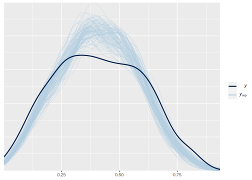
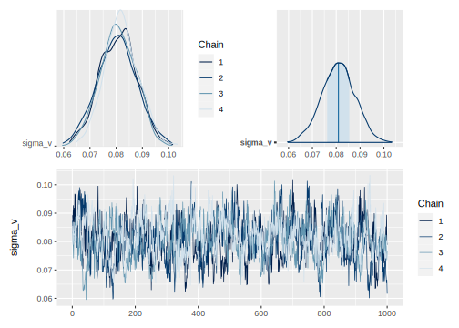

# Día 2 - Sesión 2- Modelos de área - Estimación de la pobreza y la transformación ArcoSeno.


En su concepción más básica, el modelo de **Fay-Herriot** es una combinación lineal de covariables. Sin embargo, el resultado de esta combinación pueden tomar valores que se salen del rango aceptable en el que puede estar una proporción; es decir, en general el estimador de Fay-Herriot $\theta \in R$, mientras que el estimador directo $\theta \in (0,1)$. La transformación arcoseno esta dada por: 

$$
\hat{z}_d = arcsin\left( \sqrt{ \hat{\theta}_d} \right)
$$ donde

$$
Var\left( \hat{z}_d \right) = \frac{\widehat{DEFF}_d}{4\times n_d} = \frac{1}{4\times n_{d,efectivo} }
$$

El modelo de Fay-Herriot  estaría definido de la siguiente forma:

$$
\begin{eqnarray*}
Z \mid \mu,\sigma_e &  \sim  & N(\mu, \sigma_e)\\
\mu & = & \boldsymbol{X\beta} + V \\
\theta & = &  \left(sin(\mu)\right)^2
\end{eqnarray*}
$$ donde $V \sim N(0 , \sigma_v)$.


Suponga de las distribuciones previas para 
$\boldsymbol{\beta}$ y $\sigma_{v}^{2}$ son dadas por 
$$
\begin{eqnarray*}
\boldsymbol{\beta}	\sim	N\left(0,1000\right)\\
\sigma_{v}^{2}	\sim	IG\left(0.0001,0.0001}\right)
\end{eqnarray*}
$$

## Procedimiento de estimación

Lectura de la base de datos que resultó en el paso anterior y selección de las columnas de interés

```r
library(tidyverse)
library(magrittr)

base_FH <- readRDS("Recursos/Día2/Sesion3/Data/base_FH_2018.rds") %>% 
  transmute(dam2,                            ## id dominios
            pobreza,
            T_pobreza = asin(sqrt(pobreza)),  ## creando zd
            n_effec = n_eff_FGV,              ## n efectivo
            varhat = 1/(4*n_effec)            ## varianza para zd
            )
```

Lectura de las covariables, las cuales son obtenidas previamente. Dado la diferencia entre las escalas de las variables  es necesario hacer un ajuste a estas. 


```r
statelevel_predictors_df <- readRDS("Recursos/Día2/Sesion3/Data/statelevel_predictors_df_dam2.rds") %>% 
    mutate_at(.vars = c("luces_nocturnas",
                      "cubrimiento_cultivo",
                      "cubrimiento_urbano",
                      "modificacion_humana",
                      "accesibilidad_hospitales",
                      "accesibilidad_hosp_caminado"),
            function(x) as.numeric(scale(x)))
```

Uniendo las dos bases de datos. 


```r
base_FH <- full_join(base_FH, statelevel_predictors_df, by = "dam2" )
tba(base_FH[,1:8] %>% head(10))
```

<table class="table table-striped lightable-classic" style="width: auto !important; margin-left: auto; margin-right: auto; font-family: Arial Narrow; width: auto !important; margin-left: auto; margin-right: auto;">
 <thead>
  <tr>
   <th style="text-align:left;"> dam2 </th>
   <th style="text-align:right;"> pobreza </th>
   <th style="text-align:right;"> T_pobreza </th>
   <th style="text-align:right;"> n_effec </th>
   <th style="text-align:right;"> varhat </th>
   <th style="text-align:left;"> dam </th>
   <th style="text-align:right;"> area1 </th>
   <th style="text-align:right;"> sexo2 </th>
  </tr>
 </thead>
<tbody>
  <tr>
   <td style="text-align:left;"> 05001 </td>
   <td style="text-align:right;"> 0.1597 </td>
   <td style="text-align:right;"> 0.4111 </td>
   <td style="text-align:right;"> 1150.9156 </td>
   <td style="text-align:right;"> 0.0002 </td>
   <td style="text-align:left;"> 05 </td>
   <td style="text-align:right;"> 0.9832 </td>
   <td style="text-align:right;"> 0.5299 </td>
  </tr>
  <tr>
   <td style="text-align:left;"> 05002 </td>
   <td style="text-align:right;"> 0.4049 </td>
   <td style="text-align:right;"> 0.6897 </td>
   <td style="text-align:right;"> 11.4884 </td>
   <td style="text-align:right;"> 0.0218 </td>
   <td style="text-align:left;"> 05 </td>
   <td style="text-align:right;"> 0.3953 </td>
   <td style="text-align:right;"> 0.4807 </td>
  </tr>
  <tr>
   <td style="text-align:left;"> 05031 </td>
   <td style="text-align:right;"> 0.3817 </td>
   <td style="text-align:right;"> 0.6660 </td>
   <td style="text-align:right;"> 5.6901 </td>
   <td style="text-align:right;"> 0.0439 </td>
   <td style="text-align:left;"> 05 </td>
   <td style="text-align:right;"> 0.5766 </td>
   <td style="text-align:right;"> 0.4978 </td>
  </tr>
  <tr>
   <td style="text-align:left;"> 05034 </td>
   <td style="text-align:right;"> 0.4731 </td>
   <td style="text-align:right;"> 0.7585 </td>
   <td style="text-align:right;"> 7.4016 </td>
   <td style="text-align:right;"> 0.0338 </td>
   <td style="text-align:left;"> 05 </td>
   <td style="text-align:right;"> 0.5029 </td>
   <td style="text-align:right;"> 0.4815 </td>
  </tr>
  <tr>
   <td style="text-align:left;"> 05045 </td>
   <td style="text-align:right;"> 0.2876 </td>
   <td style="text-align:right;"> 0.5661 </td>
   <td style="text-align:right;"> 6.9301 </td>
   <td style="text-align:right;"> 0.0361 </td>
   <td style="text-align:left;"> 05 </td>
   <td style="text-align:right;"> 0.8091 </td>
   <td style="text-align:right;"> 0.5078 </td>
  </tr>
  <tr>
   <td style="text-align:left;"> 05079 </td>
   <td style="text-align:right;"> 0.4001 </td>
   <td style="text-align:right;"> 0.6848 </td>
   <td style="text-align:right;"> 23.8486 </td>
   <td style="text-align:right;"> 0.0105 </td>
   <td style="text-align:left;"> 05 </td>
   <td style="text-align:right;"> 0.4821 </td>
   <td style="text-align:right;"> 0.5038 </td>
  </tr>
  <tr>
   <td style="text-align:left;"> 05088 </td>
   <td style="text-align:right;"> 0.1314 </td>
   <td style="text-align:right;"> 0.3709 </td>
   <td style="text-align:right;"> 48.7553 </td>
   <td style="text-align:right;"> 0.0051 </td>
   <td style="text-align:left;"> 05 </td>
   <td style="text-align:right;"> 0.9569 </td>
   <td style="text-align:right;"> 0.5186 </td>
  </tr>
  <tr>
   <td style="text-align:left;"> 05093 </td>
   <td style="text-align:right;"> 0.3273 </td>
   <td style="text-align:right;"> 0.6091 </td>
   <td style="text-align:right;"> 6.0577 </td>
   <td style="text-align:right;"> 0.0413 </td>
   <td style="text-align:left;"> 05 </td>
   <td style="text-align:right;"> 0.2776 </td>
   <td style="text-align:right;"> 0.4862 </td>
  </tr>
  <tr>
   <td style="text-align:left;"> 05120 </td>
   <td style="text-align:right;"> 0.7049 </td>
   <td style="text-align:right;"> 0.9965 </td>
   <td style="text-align:right;"> 11.8232 </td>
   <td style="text-align:right;"> 0.0211 </td>
   <td style="text-align:left;"> 05 </td>
   <td style="text-align:right;"> 0.1989 </td>
   <td style="text-align:right;"> 0.4787 </td>
  </tr>
  <tr>
   <td style="text-align:left;"> 05129 </td>
   <td style="text-align:right;"> 0.1140 </td>
   <td style="text-align:right;"> 0.3444 </td>
   <td style="text-align:right;"> 47.8247 </td>
   <td style="text-align:right;"> 0.0052 </td>
   <td style="text-align:left;"> 05 </td>
   <td style="text-align:right;"> 0.8065 </td>
   <td style="text-align:right;"> 0.5202 </td>
  </tr>
</tbody>
</table>

Seleccionando las covariables para el modelo. 


```r
names_cov <- c(
  "sexo2" ,
  "anoest2" ,
  "anoest3",
  "anoest4",
  "edad2" ,
  "edad3" ,
  "edad4" ,
  "edad5" ,
  "etnia1",
  "etnia2" ,
  "tasa_desocupacion" ,
  "luces_nocturnas" ,
  "cubrimiento_cultivo" ,
  "alfabeta"
)
```

## Preparando los insumos para `STAN`

  1.    Dividir la base de datos en dominios observados y no observados

Dominios observados.

```r
data_dir <- base_FH %>% filter(!is.na(T_pobreza))
```

Dominios NO observados.

```r
data_syn <-
  base_FH %>% anti_join(data_dir %>% select(dam2))
tba(data_syn[,1:8] %>% slice(1:10))
```

<table class="table table-striped lightable-classic" style="width: auto !important; margin-left: auto; margin-right: auto; font-family: Arial Narrow; width: auto !important; margin-left: auto; margin-right: auto;">
 <thead>
  <tr>
   <th style="text-align:left;"> dam2 </th>
   <th style="text-align:right;"> pobreza </th>
   <th style="text-align:right;"> T_pobreza </th>
   <th style="text-align:right;"> n_effec </th>
   <th style="text-align:right;"> varhat </th>
   <th style="text-align:left;"> dam </th>
   <th style="text-align:right;"> area1 </th>
   <th style="text-align:right;"> sexo2 </th>
  </tr>
 </thead>
<tbody>
  <tr>
   <td style="text-align:left;"> 05004 </td>
   <td style="text-align:right;"> NA </td>
   <td style="text-align:right;"> NA </td>
   <td style="text-align:right;"> NA </td>
   <td style="text-align:right;"> NA </td>
   <td style="text-align:left;"> 05 </td>
   <td style="text-align:right;"> 0.3279 </td>
   <td style="text-align:right;"> 0.4576 </td>
  </tr>
  <tr>
   <td style="text-align:left;"> 05021 </td>
   <td style="text-align:right;"> NA </td>
   <td style="text-align:right;"> NA </td>
   <td style="text-align:right;"> NA </td>
   <td style="text-align:right;"> NA </td>
   <td style="text-align:left;"> 05 </td>
   <td style="text-align:right;"> 0.5770 </td>
   <td style="text-align:right;"> 0.5020 </td>
  </tr>
  <tr>
   <td style="text-align:left;"> 05030 </td>
   <td style="text-align:right;"> NA </td>
   <td style="text-align:right;"> NA </td>
   <td style="text-align:right;"> NA </td>
   <td style="text-align:right;"> NA </td>
   <td style="text-align:left;"> 05 </td>
   <td style="text-align:right;"> 0.4859 </td>
   <td style="text-align:right;"> 0.5063 </td>
  </tr>
  <tr>
   <td style="text-align:left;"> 05036 </td>
   <td style="text-align:right;"> NA </td>
   <td style="text-align:right;"> NA </td>
   <td style="text-align:right;"> NA </td>
   <td style="text-align:right;"> NA </td>
   <td style="text-align:left;"> 05 </td>
   <td style="text-align:right;"> 0.3931 </td>
   <td style="text-align:right;"> 0.4951 </td>
  </tr>
  <tr>
   <td style="text-align:left;"> 05038 </td>
   <td style="text-align:right;"> NA </td>
   <td style="text-align:right;"> NA </td>
   <td style="text-align:right;"> NA </td>
   <td style="text-align:right;"> NA </td>
   <td style="text-align:left;"> 05 </td>
   <td style="text-align:right;"> 0.2256 </td>
   <td style="text-align:right;"> 0.4927 </td>
  </tr>
  <tr>
   <td style="text-align:left;"> 05040 </td>
   <td style="text-align:right;"> NA </td>
   <td style="text-align:right;"> NA </td>
   <td style="text-align:right;"> NA </td>
   <td style="text-align:right;"> NA </td>
   <td style="text-align:left;"> 05 </td>
   <td style="text-align:right;"> 0.4858 </td>
   <td style="text-align:right;"> 0.4826 </td>
  </tr>
  <tr>
   <td style="text-align:left;"> 05042 </td>
   <td style="text-align:right;"> NA </td>
   <td style="text-align:right;"> NA </td>
   <td style="text-align:right;"> NA </td>
   <td style="text-align:right;"> NA </td>
   <td style="text-align:left;"> 05 </td>
   <td style="text-align:right;"> 0.6688 </td>
   <td style="text-align:right;"> 0.5031 </td>
  </tr>
  <tr>
   <td style="text-align:left;"> 05044 </td>
   <td style="text-align:right;"> NA </td>
   <td style="text-align:right;"> NA </td>
   <td style="text-align:right;"> NA </td>
   <td style="text-align:right;"> NA </td>
   <td style="text-align:left;"> 05 </td>
   <td style="text-align:right;"> 0.1847 </td>
   <td style="text-align:right;"> 0.4828 </td>
  </tr>
  <tr>
   <td style="text-align:left;"> 05051 </td>
   <td style="text-align:right;"> NA </td>
   <td style="text-align:right;"> NA </td>
   <td style="text-align:right;"> NA </td>
   <td style="text-align:right;"> NA </td>
   <td style="text-align:left;"> 05 </td>
   <td style="text-align:right;"> 0.3660 </td>
   <td style="text-align:right;"> 0.4970 </td>
  </tr>
  <tr>
   <td style="text-align:left;"> 05055 </td>
   <td style="text-align:right;"> NA </td>
   <td style="text-align:right;"> NA </td>
   <td style="text-align:right;"> NA </td>
   <td style="text-align:right;"> NA </td>
   <td style="text-align:left;"> 05 </td>
   <td style="text-align:right;"> 0.4431 </td>
   <td style="text-align:right;"> 0.4825 </td>
  </tr>
</tbody>
</table>


  2.    Definir matriz de efectos fijos.
  


```r
## Dominios observados
Xdat <- cbind(inter = 1,data_dir[,names_cov])

## Dominios no observados
Xs <-  cbind(inter = 1,data_syn[,names_cov])
```

  3.    Creando lista de parámetros para `STAN`


```r
sample_data <- list(
  N1 = nrow(Xdat),       # Observados.
  N2 = nrow(Xs),         # NO Observados.
  p  = ncol(Xdat),       # Número de regresores.
  X  = as.matrix(Xdat),  # Covariables Observados.
  Xs = as.matrix(Xs),    # Covariables NO Observados
  y  = as.numeric(data_dir$T_pobreza),
  sigma_e = sqrt(data_dir$varhat)
)
```

  4.    Compilando el modelo en `STAN`
  

```r
# library(cmdstanr)
# # file.edit("Data/modelosStan/15FH_arcsin_normal.stan")
# fit_FH_arcoseno <- cmdstan_model("Recursos/Día2/Sesion3/Data/modelosStan/15FH_arcsin_normal.stan")
# 
# model_FH_arcoseno <-
#   fit_FH_arcoseno$sample(
#     data = sample_data,
#     chains = 4,
#     parallel_chains = 4,
#     iter_warmup = 2000,
#     iter_sampling = 1000,
#     seed = 1234,
#     refresh = 1000
#   )

library(rstan)
fit_FH_arcoseno <- "Recursos/Día2/Sesion3/Data/modelosStan/15FH_arcsin_normal.stan"
options(mc.cores = parallel::detectCores())
model_FH_arcoseno <- stan(
  file = fit_FH_arcoseno,  
  data = sample_data,   
  verbose = FALSE,
  warmup = 500,         
  iter = 1000,            
  cores = 4              
)
```

### Resultados del modelo para los dominios observados. 

En este código, se cargan las librerías `bayesplot`, `posterior` y `patchwork`, que se utilizan para realizar gráficos y visualizaciones de los resultados del modelo.

A continuación, se utiliza la función `as.array()` y `as_draws_matrix()` para extraer las muestras de la distribución posterior del parámetro `theta` del modelo, y se seleccionan aleatoriamente 100 filas de estas muestras utilizando la función `sample()`, lo que resulta en la matriz `y_pred2.`

Finalmente, se utiliza la función `ppc_dens_overlay()` de `bayesplot` para graficar una comparación entre la distribución empírica de la variable observada pobreza en los datos (`data_dir$pobreza`) y las distribuciones predictivas posteriores simuladas para la misma variable (`y_pred2`). La función `ppc_dens_overlay()` produce un gráfico de densidad para ambas distribuciones, lo que permite visualizar cómo se comparan.


```r
library(bayesplot)
library(patchwork)
library(posterior)
# y_pred_B <- model_FH_arcoseno$draws(variables = "theta", format = "matrix")
y_pred_B <- as.array(model_FH_arcoseno, pars = "theta") %>% 
  as_draws_matrix()
rowsrandom <- sample(nrow(y_pred_B), 100)

y_pred2 <- y_pred_B[rowsrandom, ]
ppc_dens_overlay(y = as.numeric(data_dir$pobreza), y_pred2)
```



Análisis gráfico de la convergencia de las cadenas de $\sigma^2_V$. 


```r
# (mcmc_dens_chains(model_FH_arcoseno$draws("sigma_v")) +
#     mcmc_areas(model_FH_arcoseno$draws("sigma_v")))/ 
#   mcmc_trace(model_FH_arcoseno$draws("sigma_v"))

posterior_sigma2_v <- as.array(model_FH_arcoseno, pars = "sigma2_v")
(mcmc_dens_chains(posterior_sigma2_v) +
    mcmc_areas(posterior_sigma2_v) ) / 
  mcmc_trace(posterior_sigma2_v)
```



Estimación del FH de la pobreza en los dominios observados. 


```r
# theta_FH <- model_FH_arcoseno$summary(variables =  "theta")
theta_FH <-   summary(model_FH_arcoseno,pars =  "theta")$summary %>%
  data.frame()
data_dir %<>% mutate(pred_arcoseno = theta_FH$mean, 
                     pred_arcoseno_EE = theta_FH$sd,
                     Cv_pred = pred_arcoseno_EE/pred_arcoseno)
```

Estimación del FH de la pobreza en los dominios NO observados. 


```r
# theta_FH_pred <- model_FH_arcoseno$summary(variables =  "theta_pred")
theta_FH_pred <- summary(model_FH_arcoseno,pars =  "theta_pred")$summary %>%
  data.frame()
data_syn <- data_syn %>% 
  mutate(pred_arcoseno = theta_FH_pred$mean,
         pred_arcoseno_EE = theta_FH_pred$sd,
         Cv_pred = pred_arcoseno_EE/pred_arcoseno)
```

## Mapa de pobreza


```r
library(sp)
library(sf)
library(tmap)

data_map <- rbind(data_dir, data_syn) %>% 
  select(dam2, pobreza, pred_arcoseno, pred_arcoseno_EE,Cv_pred ) 


## Leer Shapefile del país
ShapeSAE <- read_sf("Recursos/Día2/Sesion3/Shape/COL_dam2.shp") 

mapa <- tm_shape(ShapeSAE %>%
                   left_join(data_map,  by = "dam2"))

brks_lp <- c(0,0.15, 0.3, 0.45, 0.6, 1)
tmap_options(check.and.fix = TRUE)
Mapa_lp <-
  mapa + tm_polygons(
    c("pobreza", "pred_arcoseno"),
    breaks = brks_lp,
    title = "Mapa de pobreza",
    palette = "YlOrRd",
    colorNA = "white"
  ) + tm_layout(asp = 1.5)

Mapa_lp
```


Coeficiente de variación.  


```r
Mapa_cv <-
  mapa + tm_polygons(
    c("Cv_pred"),
     title = "Mapa de pobreza(cv)",
    palette = "YlOrRd",
    colorNA = "white"
  ) + tm_layout(asp = 2.5)

Mapa_cv
```


