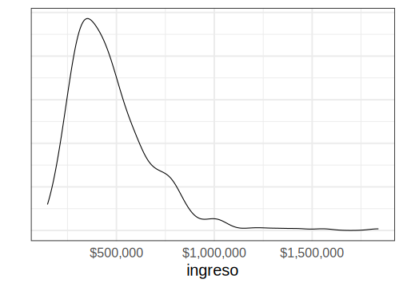
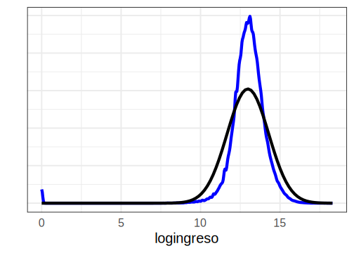
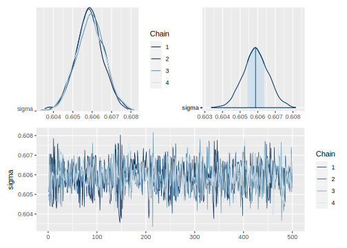
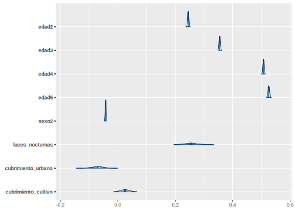
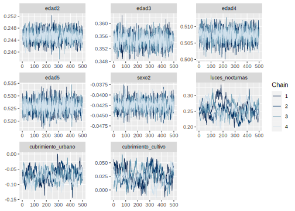
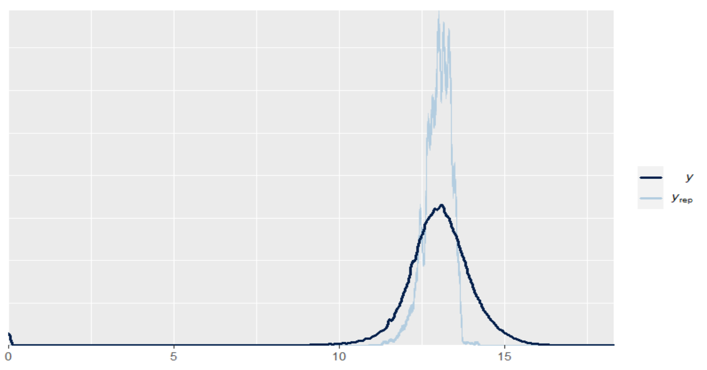
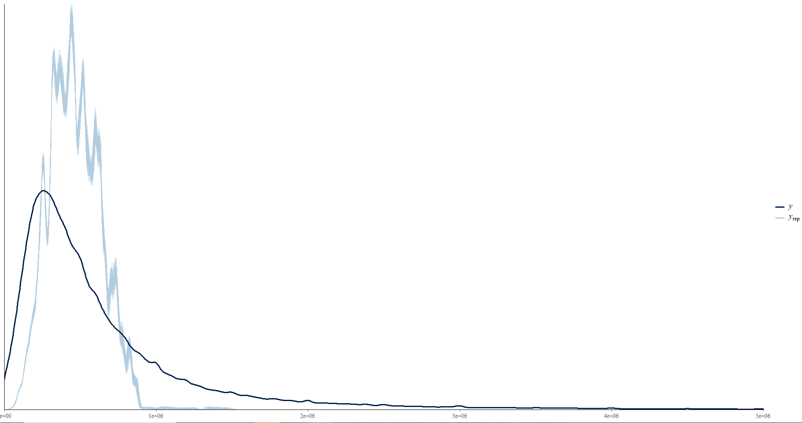
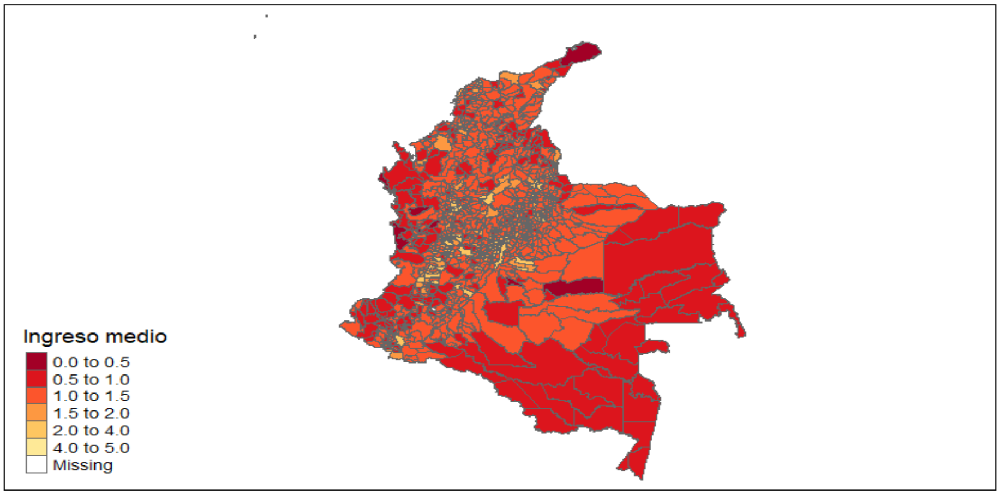

# Día 3 - Sesión 1- Modelo de unidad para la estimación del ingreso medio


Uno de los primeros problemas a los que debemos enfrentarnos es la estimación del ingreso medio, la cual en una variable no simétrica que toma valores en los positivos. Sin embargo, empleando los métodos Bayesiano es posible obtener estimaciones de esta sin realizar una transformación 

<div class="figure">

<p class="caption">(\#fig:unnamed-chunk-1)Distribución del ingreso medio por dam2</p>
</div>

## Modelo bayesiano.

Para realizar la predicción del ingreso medio en dam2s no observadas se asume que: 

$$
\begin{eqnarray*}
Y_{di} &\sim & N\left(\mu_{di},\sigma_y^{2}\right)\\
\mu_{di}&=&\boldsymbol{X}_{di}^{T}\boldsymbol{\beta}+u_{d}+e_{di} 
\end{eqnarray*}
$$


Donde $Y_{di}$ representa el ingreso medio de la $i-ésima$ persona en el $d-ésimo$ domino, $\boldsymbol{X}$ es la información disponible para la $i-ésima$ persona del $d-ésimo$ domino, $\boldsymbol{\beta}$ es el vector de parámetros $u_d$ es el efecto introducido por el $d-ésimo$ dominio y $e_{di}$ es el error de estimación para la $i-ésima$ personas del $d-ésimo$ dominio.

Note, que $u_{d}\sim N\left(0,\sigma_{u}\right)$ y $e_{di}\sim N\left(0,\sigma_{e}^{2}\right)$.

Para este caso se asumen las distribuciones previas

$$
\begin{eqnarray*}
\beta_k & \sim   & N(\mu_0, \tau^2_0)\\
\sigma^2_y &\sim & Inversa-Gamma(\alpha_1,\alpha_2)
\end{eqnarray*}
$$ las cuales se toman no informativas.

A continuación se muestra el proceso realizado para la obtención de la predicción del ingreso medio en dominios no observados.

## Proceso de estimación en `R`

Para desarrollar la metodología se hace uso de las siguientes librerías.


```r
# Interprete de STAN en R
library(rstan)
library(rstanarm)
# Manejo de bases de datos.
library(tidyverse)
# Gráficas de los modelos. 
library(bayesplot)
library(patchwork)
# Organizar la presentación de las tablas
library(kableExtra)
library(printr)
```

Un conjunto de funciones desarrolladas para realizar de forma simplificada los procesos están consignadas en la siguiente rutina.


```r
source("Recursos/Día3/Sesion1/0Recursos/funciones_mrp.R")
```

Entre las funciones incluidas en el archivo encuentra

-   *plot_interaction*: Esta crea un diagrama de lineas donde se estudia la interacción entre las variables, en el caso de presentar un traslape de las lineas se recomienda incluir el interacción en el modelo.

-   *Plot_Compare* Puesto que es necesario realizar una homologar la información del censo y la encuesta es conveniente llevar a cabo una validación de las variables que han sido homologadas, por tanto, se espera que las proporciones resultantes del censo y la encuesta estén cercanas entre sí.

-   *Aux_Agregado*: Esta es función permite obtener estimaciones a diferentes niveles de agregación, toma mucha relevancia cuando se realiza un proceso repetitivo.

**Las funciones están diseñada específicamente  para este  proceso**

### Encuesta de hogares

Los datos empleados en esta ocasión corresponden a la ultima encuesta de hogares, la cual ha sido estandarizada por *CEPAL* y se encuentra disponible en *BADEHOG*


```r
encuesta <- readRDS("Recursos/Día3/Sesion1/Data/encuestaCOL18N1.rds")

encuesta_mrp <- encuesta %>% 
  transmute(
  dam = dam_ee,
  dam2,  
  ingreso = ingcorte, lp, li,
  area = haven::as_factor(area_ee,levels  = "values"),
  area = case_when(area == 1 ~ "1", TRUE ~ "0"),
  logingreso = log(ingcorte + 1),
  sexo = as.character(sexo),
  anoest = case_when(
    edad < 5 | anoest == -1   ~ "98"  , #No aplica
    anoest == 99 | (edad>=7 & is.na(anoest)) ~ "99", #NS/NR
    anoest == 0  ~ "1", # Sin educación
    anoest %in% c(1:6) ~ "2",       # 1 - 6
    anoest %in% c(7:12) ~ "3",      # 7 - 12
    anoest > 12 ~ "4",      # mas de 12
    TRUE ~ "Error"  ),
  edad = case_when(
    edad < 15 ~ "1",
    edad < 30 ~ "2",
    edad < 45 ~ "3",
    edad < 65 ~ "4",
    TRUE ~ "5"),
  
  etnia = case_when(
    etnia_ee == 1 ~ "1", # Indígena
    etnia_ee == 2 ~ "2",   # Afro
    TRUE ~ "3"         # Otra
  ),
fep = `_fep`
) 

tba(encuesta_mrp %>% head(10)) 
```

<table class="table table-striped lightable-classic" style="width: auto !important; margin-left: auto; margin-right: auto; font-family: Arial Narrow; width: auto !important; margin-left: auto; margin-right: auto;">
 <thead>
  <tr>
   <th style="text-align:left;"> dam </th>
   <th style="text-align:left;"> dam2 </th>
   <th style="text-align:right;"> ingreso </th>
   <th style="text-align:right;"> lp </th>
   <th style="text-align:right;"> li </th>
   <th style="text-align:left;"> area </th>
   <th style="text-align:right;"> logingreso </th>
   <th style="text-align:left;"> sexo </th>
   <th style="text-align:left;"> anoest </th>
   <th style="text-align:left;"> edad </th>
   <th style="text-align:left;"> etnia </th>
   <th style="text-align:right;"> fep </th>
  </tr>
 </thead>
<tbody>
  <tr>
   <td style="text-align:left;"> 05 </td>
   <td style="text-align:left;"> 05360 </td>
   <td style="text-align:right;"> 581666.1 </td>
   <td style="text-align:right;"> 296845 </td>
   <td style="text-align:right;"> 147169 </td>
   <td style="text-align:left;"> 1 </td>
   <td style="text-align:right;"> 13.2737 </td>
   <td style="text-align:left;"> 1 </td>
   <td style="text-align:left;"> 3 </td>
   <td style="text-align:left;"> 3 </td>
   <td style="text-align:left;"> 2 </td>
   <td style="text-align:right;"> 127.2220 </td>
  </tr>
  <tr>
   <td style="text-align:left;"> 05 </td>
   <td style="text-align:left;"> 05360 </td>
   <td style="text-align:right;"> 581666.1 </td>
   <td style="text-align:right;"> 296845 </td>
   <td style="text-align:right;"> 147169 </td>
   <td style="text-align:left;"> 1 </td>
   <td style="text-align:right;"> 13.2737 </td>
   <td style="text-align:left;"> 2 </td>
   <td style="text-align:left;"> 2 </td>
   <td style="text-align:left;"> 3 </td>
   <td style="text-align:left;"> 3 </td>
   <td style="text-align:right;"> 127.2220 </td>
  </tr>
  <tr>
   <td style="text-align:left;"> 05 </td>
   <td style="text-align:left;"> 05360 </td>
   <td style="text-align:right;"> 581666.1 </td>
   <td style="text-align:right;"> 296845 </td>
   <td style="text-align:right;"> 147169 </td>
   <td style="text-align:left;"> 1 </td>
   <td style="text-align:right;"> 13.2737 </td>
   <td style="text-align:left;"> 1 </td>
   <td style="text-align:left;"> 2 </td>
   <td style="text-align:left;"> 1 </td>
   <td style="text-align:left;"> 2 </td>
   <td style="text-align:right;"> 127.2220 </td>
  </tr>
  <tr>
   <td style="text-align:left;"> 05 </td>
   <td style="text-align:left;"> 05360 </td>
   <td style="text-align:right;"> 581666.1 </td>
   <td style="text-align:right;"> 296845 </td>
   <td style="text-align:right;"> 147169 </td>
   <td style="text-align:left;"> 1 </td>
   <td style="text-align:right;"> 13.2737 </td>
   <td style="text-align:left;"> 1 </td>
   <td style="text-align:left;"> 98 </td>
   <td style="text-align:left;"> 1 </td>
   <td style="text-align:left;"> 2 </td>
   <td style="text-align:right;"> 127.2220 </td>
  </tr>
  <tr>
   <td style="text-align:left;"> 05 </td>
   <td style="text-align:left;"> 05360 </td>
   <td style="text-align:right;"> 581666.1 </td>
   <td style="text-align:right;"> 296845 </td>
   <td style="text-align:right;"> 147169 </td>
   <td style="text-align:left;"> 1 </td>
   <td style="text-align:right;"> 13.2737 </td>
   <td style="text-align:left;"> 1 </td>
   <td style="text-align:left;"> 98 </td>
   <td style="text-align:left;"> 1 </td>
   <td style="text-align:left;"> 2 </td>
   <td style="text-align:right;"> 127.2220 </td>
  </tr>
  <tr>
   <td style="text-align:left;"> 05 </td>
   <td style="text-align:left;"> 05360 </td>
   <td style="text-align:right;"> 248750.0 </td>
   <td style="text-align:right;"> 296845 </td>
   <td style="text-align:right;"> 147169 </td>
   <td style="text-align:left;"> 1 </td>
   <td style="text-align:right;"> 12.4242 </td>
   <td style="text-align:left;"> 1 </td>
   <td style="text-align:left;"> 4 </td>
   <td style="text-align:left;"> 3 </td>
   <td style="text-align:left;"> 2 </td>
   <td style="text-align:right;"> 125.7202 </td>
  </tr>
  <tr>
   <td style="text-align:left;"> 05 </td>
   <td style="text-align:left;"> 05360 </td>
   <td style="text-align:right;"> 248750.0 </td>
   <td style="text-align:right;"> 296845 </td>
   <td style="text-align:right;"> 147169 </td>
   <td style="text-align:left;"> 1 </td>
   <td style="text-align:right;"> 12.4242 </td>
   <td style="text-align:left;"> 2 </td>
   <td style="text-align:left;"> 3 </td>
   <td style="text-align:left;"> 3 </td>
   <td style="text-align:left;"> 2 </td>
   <td style="text-align:right;"> 125.7202 </td>
  </tr>
  <tr>
   <td style="text-align:left;"> 05 </td>
   <td style="text-align:left;"> 05360 </td>
   <td style="text-align:right;"> 248750.0 </td>
   <td style="text-align:right;"> 296845 </td>
   <td style="text-align:right;"> 147169 </td>
   <td style="text-align:left;"> 1 </td>
   <td style="text-align:right;"> 12.4242 </td>
   <td style="text-align:left;"> 2 </td>
   <td style="text-align:left;"> 2 </td>
   <td style="text-align:left;"> 1 </td>
   <td style="text-align:left;"> 2 </td>
   <td style="text-align:right;"> 125.7202 </td>
  </tr>
  <tr>
   <td style="text-align:left;"> 05 </td>
   <td style="text-align:left;"> 05360 </td>
   <td style="text-align:right;"> 248750.0 </td>
   <td style="text-align:right;"> 296845 </td>
   <td style="text-align:right;"> 147169 </td>
   <td style="text-align:left;"> 1 </td>
   <td style="text-align:right;"> 12.4242 </td>
   <td style="text-align:left;"> 1 </td>
   <td style="text-align:left;"> 1 </td>
   <td style="text-align:left;"> 1 </td>
   <td style="text-align:left;"> 2 </td>
   <td style="text-align:right;"> 125.7202 </td>
  </tr>
  <tr>
   <td style="text-align:left;"> 05 </td>
   <td style="text-align:left;"> 05360 </td>
   <td style="text-align:right;"> 161250.0 </td>
   <td style="text-align:right;"> 296845 </td>
   <td style="text-align:right;"> 147169 </td>
   <td style="text-align:left;"> 1 </td>
   <td style="text-align:right;"> 11.9907 </td>
   <td style="text-align:left;"> 1 </td>
   <td style="text-align:left;"> 2 </td>
   <td style="text-align:left;"> 4 </td>
   <td style="text-align:left;"> 2 </td>
   <td style="text-align:right;"> 115.8661 </td>
  </tr>
</tbody>
</table>

La base de datos de la encuesta tiene la siguientes columnas: 

-   *dam*: Corresponde al código asignado a la división administrativa mayor del país.

-   *dam2*: Corresponde al código asignado a la segunda división administrativa del país.

-   *lp* y *li* lineas de pobreza y pobreza extrema definidas por CEPAL. 

-   *área* división geográfica (Urbano y Rural). 

-   *sexo* Hombre y Mujer. 

-   *etnia* En estas variable se definen tres grupos:  afrodescendientes, indígenas y Otros. 

-   Años de escolaridad (*anoest*) 

-   Rangos de edad (*edad*) 

-   Factor de expansión por persona (*fep*)


Ahora, inspeccionamos el comportamiento de la variable de interés: 


```r
media <- mean(encuesta_mrp$logingreso)
Sd <- sd(encuesta_mrp$logingreso)

ggplot(data = encuesta_mrp, aes(x = logingreso)) +
  geom_density(size =2, color = "blue") + labs(y = "") +
  stat_function(fun = dnorm, 
                args = list(mean = media, sd = Sd),
                size =2) +
  theme_bw(base_size = 20) +
  theme(axis.text.y = element_blank(),
        axis.ticks = element_blank())
```

<div class="figure">

<p class="caption">(\#fig:unnamed-chunk-5)Distribuición del ingreso de las personas encuestadas</p>
</div>


La información auxiliar disponible ha sido extraída del censo  e imágenes satelitales


```r
statelevel_predictors_df <-
  readRDS("Recursos/Día3/Sesion1/Data/statelevel_predictors_df_dam2.rds") %>% 
    mutate_at(.vars = c("luces_nocturnas",
                      "cubrimiento_cultivo",
                      "cubrimiento_urbano",
                      "modificacion_humana",
                      "accesibilidad_hospitales",
                      "accesibilidad_hosp_caminado"),
            function(x) as.numeric(scale(x)))
tba(statelevel_predictors_df  %>%  head(10))
```

<table class="table table-striped lightable-classic" style="width: auto !important; margin-left: auto; margin-right: auto; font-family: Arial Narrow; width: auto !important; margin-left: auto; margin-right: auto;">
 <thead>
  <tr>
   <th style="text-align:left;"> dam </th>
   <th style="text-align:left;"> dam2 </th>
   <th style="text-align:right;"> area1 </th>
   <th style="text-align:right;"> sexo2 </th>
   <th style="text-align:right;"> edad2 </th>
   <th style="text-align:right;"> edad3 </th>
   <th style="text-align:right;"> edad4 </th>
   <th style="text-align:right;"> edad5 </th>
   <th style="text-align:right;"> etnia2 </th>
   <th style="text-align:right;"> anoest2 </th>
   <th style="text-align:right;"> anoest3 </th>
   <th style="text-align:right;"> anoest4 </th>
   <th style="text-align:right;"> etnia1 </th>
   <th style="text-align:right;"> tiene_acueducto </th>
   <th style="text-align:right;"> piso_tierra </th>
   <th style="text-align:right;"> alfabeta </th>
   <th style="text-align:right;"> hacinamiento </th>
   <th style="text-align:right;"> tasa_desocupacion </th>
   <th style="text-align:right;"> luces_nocturnas </th>
   <th style="text-align:right;"> cubrimiento_cultivo </th>
   <th style="text-align:right;"> cubrimiento_urbano </th>
   <th style="text-align:right;"> modificacion_humana </th>
   <th style="text-align:right;"> accesibilidad_hospitales </th>
   <th style="text-align:right;"> accesibilidad_hosp_caminado </th>
  </tr>
 </thead>
<tbody>
  <tr>
   <td style="text-align:left;"> 05 </td>
   <td style="text-align:left;"> 05001 </td>
   <td style="text-align:right;"> 0.9832 </td>
   <td style="text-align:right;"> 0.5299 </td>
   <td style="text-align:right;"> 0.2671 </td>
   <td style="text-align:right;"> 0.2201 </td>
   <td style="text-align:right;"> 0.2355 </td>
   <td style="text-align:right;"> 0.1060 </td>
   <td style="text-align:right;"> 0.0251 </td>
   <td style="text-align:right;"> 0.2598 </td>
   <td style="text-align:right;"> 0.4048 </td>
   <td style="text-align:right;"> 0.2287 </td>
   <td style="text-align:right;"> 0.0009 </td>
   <td style="text-align:right;"> 0.0354 </td>
   <td style="text-align:right;"> 0.0024 </td>
   <td style="text-align:right;"> 0.0258 </td>
   <td style="text-align:right;"> 0.0833 </td>
   <td style="text-align:right;"> 0.0062 </td>
   <td style="text-align:right;"> 4.9762 </td>
   <td style="text-align:right;"> -0.5072 </td>
   <td style="text-align:right;"> 7.2903 </td>
   <td style="text-align:right;"> 2.8648 </td>
   <td style="text-align:right;"> -0.3953 </td>
   <td style="text-align:right;"> -0.5248 </td>
  </tr>
  <tr>
   <td style="text-align:left;"> 05 </td>
   <td style="text-align:left;"> 05002 </td>
   <td style="text-align:right;"> 0.3953 </td>
   <td style="text-align:right;"> 0.4807 </td>
   <td style="text-align:right;"> 0.2229 </td>
   <td style="text-align:right;"> 0.1977 </td>
   <td style="text-align:right;"> 0.2497 </td>
   <td style="text-align:right;"> 0.1281 </td>
   <td style="text-align:right;"> 0.0035 </td>
   <td style="text-align:right;"> 0.5644 </td>
   <td style="text-align:right;"> 0.2393 </td>
   <td style="text-align:right;"> 0.0473 </td>
   <td style="text-align:right;"> 0.0001 </td>
   <td style="text-align:right;"> 0.3416 </td>
   <td style="text-align:right;"> 0.0160 </td>
   <td style="text-align:right;"> 0.1139 </td>
   <td style="text-align:right;"> 0.1395 </td>
   <td style="text-align:right;"> 0.0000 </td>
   <td style="text-align:right;"> -0.3246 </td>
   <td style="text-align:right;"> -0.5749 </td>
   <td style="text-align:right;"> -0.1807 </td>
   <td style="text-align:right;"> -0.0439 </td>
   <td style="text-align:right;"> -0.3439 </td>
   <td style="text-align:right;"> -0.4224 </td>
  </tr>
  <tr>
   <td style="text-align:left;"> 05 </td>
   <td style="text-align:left;"> 05004 </td>
   <td style="text-align:right;"> 0.3279 </td>
   <td style="text-align:right;"> 0.4576 </td>
   <td style="text-align:right;"> 0.2376 </td>
   <td style="text-align:right;"> 0.2075 </td>
   <td style="text-align:right;"> 0.2316 </td>
   <td style="text-align:right;"> 0.1218 </td>
   <td style="text-align:right;"> 0.0199 </td>
   <td style="text-align:right;"> 0.4470 </td>
   <td style="text-align:right;"> 0.3460 </td>
   <td style="text-align:right;"> 0.0723 </td>
   <td style="text-align:right;"> 0.0000 </td>
   <td style="text-align:right;"> 0.3694 </td>
   <td style="text-align:right;"> 0.0325 </td>
   <td style="text-align:right;"> 0.0787 </td>
   <td style="text-align:right;"> 0.1557 </td>
   <td style="text-align:right;"> 0.0000 </td>
   <td style="text-align:right;"> -0.6111 </td>
   <td style="text-align:right;"> -0.5475 </td>
   <td style="text-align:right;"> -0.2991 </td>
   <td style="text-align:right;"> -0.8159 </td>
   <td style="text-align:right;"> 0.0619 </td>
   <td style="text-align:right;"> -0.0654 </td>
  </tr>
  <tr>
   <td style="text-align:left;"> 05 </td>
   <td style="text-align:left;"> 05021 </td>
   <td style="text-align:right;"> 0.5770 </td>
   <td style="text-align:right;"> 0.5020 </td>
   <td style="text-align:right;"> 0.2191 </td>
   <td style="text-align:right;"> 0.1946 </td>
   <td style="text-align:right;"> 0.2357 </td>
   <td style="text-align:right;"> 0.1274 </td>
   <td style="text-align:right;"> 0.0031 </td>
   <td style="text-align:right;"> 0.5038 </td>
   <td style="text-align:right;"> 0.2727 </td>
   <td style="text-align:right;"> 0.0716 </td>
   <td style="text-align:right;"> 0.0000 </td>
   <td style="text-align:right;"> 0.2785 </td>
   <td style="text-align:right;"> 0.0255 </td>
   <td style="text-align:right;"> 0.0959 </td>
   <td style="text-align:right;"> 0.1025 </td>
   <td style="text-align:right;"> 0.0000 </td>
   <td style="text-align:right;"> -0.4532 </td>
   <td style="text-align:right;"> -0.6694 </td>
   <td style="text-align:right;"> -0.1852 </td>
   <td style="text-align:right;"> -0.3570 </td>
   <td style="text-align:right;"> -0.2956 </td>
   <td style="text-align:right;"> -0.3104 </td>
  </tr>
  <tr>
   <td style="text-align:left;"> 05 </td>
   <td style="text-align:left;"> 05030 </td>
   <td style="text-align:right;"> 0.4859 </td>
   <td style="text-align:right;"> 0.5063 </td>
   <td style="text-align:right;"> 0.2571 </td>
   <td style="text-align:right;"> 0.2047 </td>
   <td style="text-align:right;"> 0.2507 </td>
   <td style="text-align:right;"> 0.0997 </td>
   <td style="text-align:right;"> 0.0048 </td>
   <td style="text-align:right;"> 0.4130 </td>
   <td style="text-align:right;"> 0.3756 </td>
   <td style="text-align:right;"> 0.0828 </td>
   <td style="text-align:right;"> 0.0003 </td>
   <td style="text-align:right;"> 0.0775 </td>
   <td style="text-align:right;"> 0.0143 </td>
   <td style="text-align:right;"> 0.0844 </td>
   <td style="text-align:right;"> 0.1176 </td>
   <td style="text-align:right;"> 0.0000 </td>
   <td style="text-align:right;"> 1.1636 </td>
   <td style="text-align:right;"> -0.5002 </td>
   <td style="text-align:right;"> 0.7336 </td>
   <td style="text-align:right;"> 1.4706 </td>
   <td style="text-align:right;"> -0.3670 </td>
   <td style="text-align:right;"> -0.4265 </td>
  </tr>
  <tr>
   <td style="text-align:left;"> 05 </td>
   <td style="text-align:left;"> 05031 </td>
   <td style="text-align:right;"> 0.5766 </td>
   <td style="text-align:right;"> 0.4978 </td>
   <td style="text-align:right;"> 0.2695 </td>
   <td style="text-align:right;"> 0.1961 </td>
   <td style="text-align:right;"> 0.2047 </td>
   <td style="text-align:right;"> 0.0850 </td>
   <td style="text-align:right;"> 0.0050 </td>
   <td style="text-align:right;"> 0.4618 </td>
   <td style="text-align:right;"> 0.2981 </td>
   <td style="text-align:right;"> 0.0585 </td>
   <td style="text-align:right;"> 0.0001 </td>
   <td style="text-align:right;"> 0.4010 </td>
   <td style="text-align:right;"> 0.0970 </td>
   <td style="text-align:right;"> 0.1200 </td>
   <td style="text-align:right;"> 0.1417 </td>
   <td style="text-align:right;"> 0.0000 </td>
   <td style="text-align:right;"> -0.5077 </td>
   <td style="text-align:right;"> -0.6806 </td>
   <td style="text-align:right;"> -0.2532 </td>
   <td style="text-align:right;"> -0.6818 </td>
   <td style="text-align:right;"> 0.0167 </td>
   <td style="text-align:right;"> 0.2017 </td>
  </tr>
  <tr>
   <td style="text-align:left;"> 05 </td>
   <td style="text-align:left;"> 05034 </td>
   <td style="text-align:right;"> 0.5029 </td>
   <td style="text-align:right;"> 0.4815 </td>
   <td style="text-align:right;"> 0.2530 </td>
   <td style="text-align:right;"> 0.2052 </td>
   <td style="text-align:right;"> 0.2324 </td>
   <td style="text-align:right;"> 0.1042 </td>
   <td style="text-align:right;"> 0.0060 </td>
   <td style="text-align:right;"> 0.4731 </td>
   <td style="text-align:right;"> 0.2976 </td>
   <td style="text-align:right;"> 0.0634 </td>
   <td style="text-align:right;"> 0.0065 </td>
   <td style="text-align:right;"> 0.3435 </td>
   <td style="text-align:right;"> 0.0069 </td>
   <td style="text-align:right;"> 0.1089 </td>
   <td style="text-align:right;"> 0.1301 </td>
   <td style="text-align:right;"> 0.0000 </td>
   <td style="text-align:right;"> -0.2580 </td>
   <td style="text-align:right;"> -0.5573 </td>
   <td style="text-align:right;"> -0.2197 </td>
   <td style="text-align:right;"> 0.2265 </td>
   <td style="text-align:right;"> -0.0293 </td>
   <td style="text-align:right;"> -0.2376 </td>
  </tr>
  <tr>
   <td style="text-align:left;"> 05 </td>
   <td style="text-align:left;"> 05036 </td>
   <td style="text-align:right;"> 0.3931 </td>
   <td style="text-align:right;"> 0.4951 </td>
   <td style="text-align:right;"> 0.2447 </td>
   <td style="text-align:right;"> 0.1955 </td>
   <td style="text-align:right;"> 0.2435 </td>
   <td style="text-align:right;"> 0.1142 </td>
   <td style="text-align:right;"> 0.0054 </td>
   <td style="text-align:right;"> 0.4808 </td>
   <td style="text-align:right;"> 0.3010 </td>
   <td style="text-align:right;"> 0.0591 </td>
   <td style="text-align:right;"> 0.0006 </td>
   <td style="text-align:right;"> 0.1341 </td>
   <td style="text-align:right;"> 0.0227 </td>
   <td style="text-align:right;"> 0.1100 </td>
   <td style="text-align:right;"> 0.1561 </td>
   <td style="text-align:right;"> 0.0000 </td>
   <td style="text-align:right;"> 0.7139 </td>
   <td style="text-align:right;"> -0.5957 </td>
   <td style="text-align:right;"> -0.2053 </td>
   <td style="text-align:right;"> 1.0807 </td>
   <td style="text-align:right;"> -0.3818 </td>
   <td style="text-align:right;"> -0.5131 </td>
  </tr>
  <tr>
   <td style="text-align:left;"> 05 </td>
   <td style="text-align:left;"> 05038 </td>
   <td style="text-align:right;"> 0.2256 </td>
   <td style="text-align:right;"> 0.4927 </td>
   <td style="text-align:right;"> 0.2659 </td>
   <td style="text-align:right;"> 0.1984 </td>
   <td style="text-align:right;"> 0.2049 </td>
   <td style="text-align:right;"> 0.0904 </td>
   <td style="text-align:right;"> 0.0050 </td>
   <td style="text-align:right;"> 0.5162 </td>
   <td style="text-align:right;"> 0.2696 </td>
   <td style="text-align:right;"> 0.0281 </td>
   <td style="text-align:right;"> 0.0000 </td>
   <td style="text-align:right;"> 0.2768 </td>
   <td style="text-align:right;"> 0.1011 </td>
   <td style="text-align:right;"> 0.1544 </td>
   <td style="text-align:right;"> 0.2247 </td>
   <td style="text-align:right;"> 0.0000 </td>
   <td style="text-align:right;"> -0.4100 </td>
   <td style="text-align:right;"> -0.5108 </td>
   <td style="text-align:right;"> -0.2644 </td>
   <td style="text-align:right;"> -0.1709 </td>
   <td style="text-align:right;"> -0.3398 </td>
   <td style="text-align:right;"> -0.3666 </td>
  </tr>
  <tr>
   <td style="text-align:left;"> 05 </td>
   <td style="text-align:left;"> 05040 </td>
   <td style="text-align:right;"> 0.4858 </td>
   <td style="text-align:right;"> 0.4826 </td>
   <td style="text-align:right;"> 0.2859 </td>
   <td style="text-align:right;"> 0.1982 </td>
   <td style="text-align:right;"> 0.1678 </td>
   <td style="text-align:right;"> 0.0641 </td>
   <td style="text-align:right;"> 0.0168 </td>
   <td style="text-align:right;"> 0.4928 </td>
   <td style="text-align:right;"> 0.2738 </td>
   <td style="text-align:right;"> 0.0361 </td>
   <td style="text-align:right;"> 0.0117 </td>
   <td style="text-align:right;"> 0.4961 </td>
   <td style="text-align:right;"> 0.0824 </td>
   <td style="text-align:right;"> 0.1253 </td>
   <td style="text-align:right;"> 0.1948 </td>
   <td style="text-align:right;"> 0.0000 </td>
   <td style="text-align:right;"> -0.5447 </td>
   <td style="text-align:right;"> -0.6866 </td>
   <td style="text-align:right;"> -0.2954 </td>
   <td style="text-align:right;"> -0.9040 </td>
   <td style="text-align:right;"> 0.0470 </td>
   <td style="text-align:right;"> 0.1783 </td>
  </tr>
</tbody>
</table>


### Niveles de agregación para colapsar la encuesta

Después de realizar una investigación en la literatura especializada y realizar estudios de simulación fue posible evidenciar que las predicciones obtenidas con la muestra sin agregar y la muestra agregada convergen a la media del dominio. Sin embargo, el realizar estas estimaciones con la muestra agregada reduce el tiempo computacional necesario para la convergencia de las cadenas MCMC.  Con esto en mente se se realiza la identificación de las variables por las cuales se agregará la encuesta.


```r
byAgrega <- c("dam", "dam2",  "area", 
              "sexo",   "anoest", "edad",   "etnia" )
```

### Creando base con la encuesta agregada

El resultado de agregar la base de dato se muestra a continuación:


```r
encuesta_df_agg <-
  encuesta_mrp %>%                    # Encuesta  
  group_by_at(all_of(byAgrega)) %>%   # Agrupar por el listado de variables
  summarise(n = n(),                  # Número de observaciones
  # Ingreso medio de las personas con características similares.           
             logingreso = mean(logingreso), 
            .groups = "drop") %>%     
  arrange(desc(n))                    # Ordenar la base.
```

La tabla obtenida es la siguiente: 

<table class="table table-striped lightable-classic" style="width: auto !important; margin-left: auto; margin-right: auto; font-family: Arial Narrow; width: auto !important; margin-left: auto; margin-right: auto;">
 <thead>
  <tr>
   <th style="text-align:left;"> dam </th>
   <th style="text-align:left;"> dam2 </th>
   <th style="text-align:left;"> area </th>
   <th style="text-align:left;"> sexo </th>
   <th style="text-align:left;"> anoest </th>
   <th style="text-align:left;"> edad </th>
   <th style="text-align:left;"> etnia </th>
   <th style="text-align:right;"> n </th>
   <th style="text-align:right;"> logingreso </th>
  </tr>
 </thead>
<tbody>
  <tr>
   <td style="text-align:left;"> 47 </td>
   <td style="text-align:left;"> 47001 </td>
   <td style="text-align:left;"> 1 </td>
   <td style="text-align:left;"> 2 </td>
   <td style="text-align:left;"> 3 </td>
   <td style="text-align:left;"> 2 </td>
   <td style="text-align:left;"> 3 </td>
   <td style="text-align:right;"> 2636 </td>
   <td style="text-align:right;"> 12.7161 </td>
  </tr>
  <tr>
   <td style="text-align:left;"> 11 </td>
   <td style="text-align:left;"> 11001 </td>
   <td style="text-align:left;"> 1 </td>
   <td style="text-align:left;"> 1 </td>
   <td style="text-align:left;"> 3 </td>
   <td style="text-align:left;"> 2 </td>
   <td style="text-align:left;"> 3 </td>
   <td style="text-align:right;"> 2616 </td>
   <td style="text-align:right;"> 13.2541 </td>
  </tr>
  <tr>
   <td style="text-align:left;"> 47 </td>
   <td style="text-align:left;"> 47001 </td>
   <td style="text-align:left;"> 1 </td>
   <td style="text-align:left;"> 1 </td>
   <td style="text-align:left;"> 3 </td>
   <td style="text-align:left;"> 2 </td>
   <td style="text-align:left;"> 3 </td>
   <td style="text-align:right;"> 2550 </td>
   <td style="text-align:right;"> 12.8214 </td>
  </tr>
  <tr>
   <td style="text-align:left;"> 23 </td>
   <td style="text-align:left;"> 23001 </td>
   <td style="text-align:left;"> 1 </td>
   <td style="text-align:left;"> 2 </td>
   <td style="text-align:left;"> 3 </td>
   <td style="text-align:left;"> 2 </td>
   <td style="text-align:left;"> 3 </td>
   <td style="text-align:right;"> 2530 </td>
   <td style="text-align:right;"> 12.7668 </td>
  </tr>
  <tr>
   <td style="text-align:left;"> 11 </td>
   <td style="text-align:left;"> 11001 </td>
   <td style="text-align:left;"> 1 </td>
   <td style="text-align:left;"> 2 </td>
   <td style="text-align:left;"> 3 </td>
   <td style="text-align:left;"> 2 </td>
   <td style="text-align:left;"> 3 </td>
   <td style="text-align:right;"> 2441 </td>
   <td style="text-align:right;"> 13.1631 </td>
  </tr>
  <tr>
   <td style="text-align:left;"> 08 </td>
   <td style="text-align:left;"> 08001 </td>
   <td style="text-align:left;"> 1 </td>
   <td style="text-align:left;"> 1 </td>
   <td style="text-align:left;"> 3 </td>
   <td style="text-align:left;"> 2 </td>
   <td style="text-align:left;"> 3 </td>
   <td style="text-align:right;"> 2284 </td>
   <td style="text-align:right;"> 13.0227 </td>
  </tr>
  <tr>
   <td style="text-align:left;"> 23 </td>
   <td style="text-align:left;"> 23001 </td>
   <td style="text-align:left;"> 1 </td>
   <td style="text-align:left;"> 1 </td>
   <td style="text-align:left;"> 3 </td>
   <td style="text-align:left;"> 2 </td>
   <td style="text-align:left;"> 3 </td>
   <td style="text-align:right;"> 2281 </td>
   <td style="text-align:right;"> 12.8609 </td>
  </tr>
  <tr>
   <td style="text-align:left;"> 20 </td>
   <td style="text-align:left;"> 20001 </td>
   <td style="text-align:left;"> 1 </td>
   <td style="text-align:left;"> 2 </td>
   <td style="text-align:left;"> 3 </td>
   <td style="text-align:left;"> 2 </td>
   <td style="text-align:left;"> 3 </td>
   <td style="text-align:right;"> 2211 </td>
   <td style="text-align:right;"> 12.4981 </td>
  </tr>
  <tr>
   <td style="text-align:left;"> 08 </td>
   <td style="text-align:left;"> 08001 </td>
   <td style="text-align:left;"> 1 </td>
   <td style="text-align:left;"> 2 </td>
   <td style="text-align:left;"> 3 </td>
   <td style="text-align:left;"> 2 </td>
   <td style="text-align:left;"> 3 </td>
   <td style="text-align:right;"> 2150 </td>
   <td style="text-align:right;"> 12.9589 </td>
  </tr>
  <tr>
   <td style="text-align:left;"> 05 </td>
   <td style="text-align:left;"> 05001 </td>
   <td style="text-align:left;"> 1 </td>
   <td style="text-align:left;"> 1 </td>
   <td style="text-align:left;"> 3 </td>
   <td style="text-align:left;"> 2 </td>
   <td style="text-align:left;"> 3 </td>
   <td style="text-align:right;"> 2130 </td>
   <td style="text-align:right;"> 13.2175 </td>
  </tr>
</tbody>
</table>
El paso a seguir es unificar las tablas creadas. 


```r
encuesta_df_agg <- inner_join(encuesta_df_agg, statelevel_predictors_df)
```

### Definiendo el modelo multinivel.

Después de haber ordenado la encuesta, podemos pasar a la definición del modelo.


```r
options(MC.cores=parallel::detectCores()) # Permite procesar en paralelo. 
fit <- stan_lmer(
  logingreso ~                               # Ingreso medio (Y)
    (1 | dam2) +                          # Efecto aleatorio (ud)
    edad +                               # Efecto fijo (Variables X)
    sexo  + 
    tasa_desocupacion +
    luces_nocturnas + 
    cubrimiento_cultivo +
    cubrimiento_urbano ,
                  weights = n,            # Número de observaciones. 
                  data = encuesta_df_agg, # Encuesta agregada 
                  verbose = TRUE,         # Muestre el avance del proceso
                  chains = 4,             # Número de cadenas.
                 iter = 1000              # Número de realizaciones de la cadena
                )
saveRDS(fit, file = "Data/fit_ingresos.rds")
```

Después de esperar un tiempo prudente se obtiene el siguiente modelo.


```r
fit <- readRDS("Recursos/Día3/Sesion1/Data/fit_ingresos.rds")
tba(coef(fit)$dam2 %>% head(10))
```

<table class="table table-striped lightable-classic" style="width: auto !important; margin-left: auto; margin-right: auto; font-family: Arial Narrow; width: auto !important; margin-left: auto; margin-right: auto;">
 <thead>
  <tr>
   <th style="text-align:left;">   </th>
   <th style="text-align:right;"> (Intercept) </th>
   <th style="text-align:right;"> edad2 </th>
   <th style="text-align:right;"> edad3 </th>
   <th style="text-align:right;"> edad4 </th>
   <th style="text-align:right;"> edad5 </th>
   <th style="text-align:right;"> sexo2 </th>
   <th style="text-align:right;"> tasa_desocupacion </th>
   <th style="text-align:right;"> luces_nocturnas </th>
   <th style="text-align:right;"> cubrimiento_cultivo </th>
   <th style="text-align:right;"> cubrimiento_urbano </th>
  </tr>
 </thead>
<tbody>
  <tr>
   <td style="text-align:left;"> 05001 </td>
   <td style="text-align:right;"> 12.0223 </td>
   <td style="text-align:right;"> 0.2453 </td>
   <td style="text-align:right;"> 0.3546 </td>
   <td style="text-align:right;"> 0.5073 </td>
   <td style="text-align:right;"> 0.5256 </td>
   <td style="text-align:right;"> -0.0424 </td>
   <td style="text-align:right;"> 44.0822 </td>
   <td style="text-align:right;"> 0.2547 </td>
   <td style="text-align:right;"> 0.0249 </td>
   <td style="text-align:right;"> -0.07 </td>
  </tr>
  <tr>
   <td style="text-align:left;"> 05002 </td>
   <td style="text-align:right;"> 12.1978 </td>
   <td style="text-align:right;"> 0.2453 </td>
   <td style="text-align:right;"> 0.3546 </td>
   <td style="text-align:right;"> 0.5073 </td>
   <td style="text-align:right;"> 0.5256 </td>
   <td style="text-align:right;"> -0.0424 </td>
   <td style="text-align:right;"> 44.0822 </td>
   <td style="text-align:right;"> 0.2547 </td>
   <td style="text-align:right;"> 0.0249 </td>
   <td style="text-align:right;"> -0.07 </td>
  </tr>
  <tr>
   <td style="text-align:left;"> 05031 </td>
   <td style="text-align:right;"> 12.2646 </td>
   <td style="text-align:right;"> 0.2453 </td>
   <td style="text-align:right;"> 0.3546 </td>
   <td style="text-align:right;"> 0.5073 </td>
   <td style="text-align:right;"> 0.5256 </td>
   <td style="text-align:right;"> -0.0424 </td>
   <td style="text-align:right;"> 44.0822 </td>
   <td style="text-align:right;"> 0.2547 </td>
   <td style="text-align:right;"> 0.0249 </td>
   <td style="text-align:right;"> -0.07 </td>
  </tr>
  <tr>
   <td style="text-align:left;"> 05034 </td>
   <td style="text-align:right;"> 12.3924 </td>
   <td style="text-align:right;"> 0.2453 </td>
   <td style="text-align:right;"> 0.3546 </td>
   <td style="text-align:right;"> 0.5073 </td>
   <td style="text-align:right;"> 0.5256 </td>
   <td style="text-align:right;"> -0.0424 </td>
   <td style="text-align:right;"> 44.0822 </td>
   <td style="text-align:right;"> 0.2547 </td>
   <td style="text-align:right;"> 0.0249 </td>
   <td style="text-align:right;"> -0.07 </td>
  </tr>
  <tr>
   <td style="text-align:left;"> 05045 </td>
   <td style="text-align:right;"> 12.5292 </td>
   <td style="text-align:right;"> 0.2453 </td>
   <td style="text-align:right;"> 0.3546 </td>
   <td style="text-align:right;"> 0.5073 </td>
   <td style="text-align:right;"> 0.5256 </td>
   <td style="text-align:right;"> -0.0424 </td>
   <td style="text-align:right;"> 44.0822 </td>
   <td style="text-align:right;"> 0.2547 </td>
   <td style="text-align:right;"> 0.0249 </td>
   <td style="text-align:right;"> -0.07 </td>
  </tr>
  <tr>
   <td style="text-align:left;"> 05079 </td>
   <td style="text-align:right;"> 11.6356 </td>
   <td style="text-align:right;"> 0.2453 </td>
   <td style="text-align:right;"> 0.3546 </td>
   <td style="text-align:right;"> 0.5073 </td>
   <td style="text-align:right;"> 0.5256 </td>
   <td style="text-align:right;"> -0.0424 </td>
   <td style="text-align:right;"> 44.0822 </td>
   <td style="text-align:right;"> 0.2547 </td>
   <td style="text-align:right;"> 0.0249 </td>
   <td style="text-align:right;"> -0.07 </td>
  </tr>
  <tr>
   <td style="text-align:left;"> 05088 </td>
   <td style="text-align:right;"> 12.2333 </td>
   <td style="text-align:right;"> 0.2453 </td>
   <td style="text-align:right;"> 0.3546 </td>
   <td style="text-align:right;"> 0.5073 </td>
   <td style="text-align:right;"> 0.5256 </td>
   <td style="text-align:right;"> -0.0424 </td>
   <td style="text-align:right;"> 44.0822 </td>
   <td style="text-align:right;"> 0.2547 </td>
   <td style="text-align:right;"> 0.0249 </td>
   <td style="text-align:right;"> -0.07 </td>
  </tr>
  <tr>
   <td style="text-align:left;"> 05093 </td>
   <td style="text-align:right;"> 12.4130 </td>
   <td style="text-align:right;"> 0.2453 </td>
   <td style="text-align:right;"> 0.3546 </td>
   <td style="text-align:right;"> 0.5073 </td>
   <td style="text-align:right;"> 0.5256 </td>
   <td style="text-align:right;"> -0.0424 </td>
   <td style="text-align:right;"> 44.0822 </td>
   <td style="text-align:right;"> 0.2547 </td>
   <td style="text-align:right;"> 0.0249 </td>
   <td style="text-align:right;"> -0.07 </td>
  </tr>
  <tr>
   <td style="text-align:left;"> 05120 </td>
   <td style="text-align:right;"> 11.7266 </td>
   <td style="text-align:right;"> 0.2453 </td>
   <td style="text-align:right;"> 0.3546 </td>
   <td style="text-align:right;"> 0.5073 </td>
   <td style="text-align:right;"> 0.5256 </td>
   <td style="text-align:right;"> -0.0424 </td>
   <td style="text-align:right;"> 44.0822 </td>
   <td style="text-align:right;"> 0.2547 </td>
   <td style="text-align:right;"> 0.0249 </td>
   <td style="text-align:right;"> -0.07 </td>
  </tr>
  <tr>
   <td style="text-align:left;"> 05129 </td>
   <td style="text-align:right;"> 12.9505 </td>
   <td style="text-align:right;"> 0.2453 </td>
   <td style="text-align:right;"> 0.3546 </td>
   <td style="text-align:right;"> 0.5073 </td>
   <td style="text-align:right;"> 0.5256 </td>
   <td style="text-align:right;"> -0.0424 </td>
   <td style="text-align:right;"> 44.0822 </td>
   <td style="text-align:right;"> 0.2547 </td>
   <td style="text-align:right;"> 0.0249 </td>
   <td style="text-align:right;"> -0.07 </td>
  </tr>
</tbody>
</table>

Validación del modelo 


```r
library(posterior)
library(bayesplot)
(mcmc_dens_chains(fit,pars = "sigma") +
    mcmc_areas(fit,pars = "sigma"))/
  mcmc_trace(fit,pars = "sigma")
```




```r
var_names <- c("edad2",  "edad3",  "edad4", "edad5", "sexo2",
               "luces_nocturnas", "cubrimiento_urbano","cubrimiento_cultivo")
mcmc_areas(fit,pars = var_names)
```




```r
mcmc_trace(fit,pars = var_names)
```




```r
encuesta_mrp2 <- inner_join(encuesta_mrp, statelevel_predictors_df)
y_pred_B <- posterior_epred(fit, newdata = encuesta_mrp2)
rowsrandom <- sample(nrow(y_pred_B), 100)
y_pred2 <- y_pred_B[rowsrandom, ]

ppc_dens_overlay(y = as.numeric(encuesta_mrp2$logingreso),
                 y_pred2)/
ppc_dens_overlay(y = exp(as.numeric(encuesta_mrp2$logingreso))-1,
                 (exp(y_pred2)-1))  
```



## Proceso de estimación y predicción

Obtener el modelo es solo un paso más, ahora se debe realizar la predicción en el censo, el cual a sido previamente estandarizado y homologado con la encuesta. 


```r
poststrat_df <- readRDS("Recursos/Día3/Sesion1/Data/censo_dam2.rds") %>% 
     left_join(statelevel_predictors_df) 
tba( poststrat_df %>% arrange(desc(n)) %>% head(10))
```

<table class="table table-striped lightable-classic" style="width: auto !important; margin-left: auto; margin-right: auto; font-family: Arial Narrow; width: auto !important; margin-left: auto; margin-right: auto;">
 <thead>
  <tr>
   <th style="text-align:left;"> dam </th>
   <th style="text-align:left;"> dam2 </th>
   <th style="text-align:left;"> area </th>
   <th style="text-align:left;"> sexo </th>
   <th style="text-align:left;"> edad </th>
   <th style="text-align:left;"> etnia </th>
   <th style="text-align:left;"> anoest </th>
   <th style="text-align:right;"> n </th>
   <th style="text-align:right;"> area1 </th>
   <th style="text-align:right;"> sexo2 </th>
   <th style="text-align:right;"> edad2 </th>
   <th style="text-align:right;"> edad3 </th>
   <th style="text-align:right;"> edad4 </th>
   <th style="text-align:right;"> edad5 </th>
   <th style="text-align:right;"> etnia2 </th>
   <th style="text-align:right;"> anoest2 </th>
   <th style="text-align:right;"> anoest3 </th>
   <th style="text-align:right;"> anoest4 </th>
   <th style="text-align:right;"> etnia1 </th>
   <th style="text-align:right;"> tiene_acueducto </th>
   <th style="text-align:right;"> piso_tierra </th>
   <th style="text-align:right;"> alfabeta </th>
   <th style="text-align:right;"> hacinamiento </th>
   <th style="text-align:right;"> tasa_desocupacion </th>
   <th style="text-align:right;"> luces_nocturnas </th>
   <th style="text-align:right;"> cubrimiento_cultivo </th>
   <th style="text-align:right;"> cubrimiento_urbano </th>
   <th style="text-align:right;"> modificacion_humana </th>
   <th style="text-align:right;"> accesibilidad_hospitales </th>
   <th style="text-align:right;"> accesibilidad_hosp_caminado </th>
  </tr>
 </thead>
<tbody>
  <tr>
   <td style="text-align:left;"> 11 </td>
   <td style="text-align:left;"> 11001 </td>
   <td style="text-align:left;"> 1 </td>
   <td style="text-align:left;"> 1 </td>
   <td style="text-align:left;"> 2 </td>
   <td style="text-align:left;"> 3 </td>
   <td style="text-align:left;"> 3 </td>
   <td style="text-align:right;"> 602093 </td>
   <td style="text-align:right;"> 0.9979 </td>
   <td style="text-align:right;"> 0.5219 </td>
   <td style="text-align:right;"> 0.269 </td>
   <td style="text-align:right;"> 0.2316 </td>
   <td style="text-align:right;"> 0.2251 </td>
   <td style="text-align:right;"> 0.0886 </td>
   <td style="text-align:right;"> 0.0093 </td>
   <td style="text-align:right;"> 0.2098 </td>
   <td style="text-align:right;"> 0.381 </td>
   <td style="text-align:right;"> 0.2938 </td>
   <td style="text-align:right;"> 0.0027 </td>
   <td style="text-align:right;"> 0.0219 </td>
   <td style="text-align:right;"> 0.0026 </td>
   <td style="text-align:right;"> 0.0143 </td>
   <td style="text-align:right;"> 0.0848 </td>
   <td style="text-align:right;"> 0.0176 </td>
   <td style="text-align:right;"> 2.0576 </td>
   <td style="text-align:right;"> 0.1112 </td>
   <td style="text-align:right;"> 4.7003 </td>
   <td style="text-align:right;"> 1.9002 </td>
   <td style="text-align:right;"> -0.2644 </td>
   <td style="text-align:right;"> -0.2257 </td>
  </tr>
  <tr>
   <td style="text-align:left;"> 11 </td>
   <td style="text-align:left;"> 11001 </td>
   <td style="text-align:left;"> 1 </td>
   <td style="text-align:left;"> 2 </td>
   <td style="text-align:left;"> 2 </td>
   <td style="text-align:left;"> 3 </td>
   <td style="text-align:left;"> 3 </td>
   <td style="text-align:right;"> 538416 </td>
   <td style="text-align:right;"> 0.9979 </td>
   <td style="text-align:right;"> 0.5219 </td>
   <td style="text-align:right;"> 0.269 </td>
   <td style="text-align:right;"> 0.2316 </td>
   <td style="text-align:right;"> 0.2251 </td>
   <td style="text-align:right;"> 0.0886 </td>
   <td style="text-align:right;"> 0.0093 </td>
   <td style="text-align:right;"> 0.2098 </td>
   <td style="text-align:right;"> 0.381 </td>
   <td style="text-align:right;"> 0.2938 </td>
   <td style="text-align:right;"> 0.0027 </td>
   <td style="text-align:right;"> 0.0219 </td>
   <td style="text-align:right;"> 0.0026 </td>
   <td style="text-align:right;"> 0.0143 </td>
   <td style="text-align:right;"> 0.0848 </td>
   <td style="text-align:right;"> 0.0176 </td>
   <td style="text-align:right;"> 2.0576 </td>
   <td style="text-align:right;"> 0.1112 </td>
   <td style="text-align:right;"> 4.7003 </td>
   <td style="text-align:right;"> 1.9002 </td>
   <td style="text-align:right;"> -0.2644 </td>
   <td style="text-align:right;"> -0.2257 </td>
  </tr>
  <tr>
   <td style="text-align:left;"> 11 </td>
   <td style="text-align:left;"> 11001 </td>
   <td style="text-align:left;"> 1 </td>
   <td style="text-align:left;"> 2 </td>
   <td style="text-align:left;"> 3 </td>
   <td style="text-align:left;"> 3 </td>
   <td style="text-align:left;"> 4 </td>
   <td style="text-align:right;"> 435396 </td>
   <td style="text-align:right;"> 0.9979 </td>
   <td style="text-align:right;"> 0.5219 </td>
   <td style="text-align:right;"> 0.269 </td>
   <td style="text-align:right;"> 0.2316 </td>
   <td style="text-align:right;"> 0.2251 </td>
   <td style="text-align:right;"> 0.0886 </td>
   <td style="text-align:right;"> 0.0093 </td>
   <td style="text-align:right;"> 0.2098 </td>
   <td style="text-align:right;"> 0.381 </td>
   <td style="text-align:right;"> 0.2938 </td>
   <td style="text-align:right;"> 0.0027 </td>
   <td style="text-align:right;"> 0.0219 </td>
   <td style="text-align:right;"> 0.0026 </td>
   <td style="text-align:right;"> 0.0143 </td>
   <td style="text-align:right;"> 0.0848 </td>
   <td style="text-align:right;"> 0.0176 </td>
   <td style="text-align:right;"> 2.0576 </td>
   <td style="text-align:right;"> 0.1112 </td>
   <td style="text-align:right;"> 4.7003 </td>
   <td style="text-align:right;"> 1.9002 </td>
   <td style="text-align:right;"> -0.2644 </td>
   <td style="text-align:right;"> -0.2257 </td>
  </tr>
  <tr>
   <td style="text-align:left;"> 11 </td>
   <td style="text-align:left;"> 11001 </td>
   <td style="text-align:left;"> 1 </td>
   <td style="text-align:left;"> 2 </td>
   <td style="text-align:left;"> 2 </td>
   <td style="text-align:left;"> 3 </td>
   <td style="text-align:left;"> 4 </td>
   <td style="text-align:right;"> 406654 </td>
   <td style="text-align:right;"> 0.9979 </td>
   <td style="text-align:right;"> 0.5219 </td>
   <td style="text-align:right;"> 0.269 </td>
   <td style="text-align:right;"> 0.2316 </td>
   <td style="text-align:right;"> 0.2251 </td>
   <td style="text-align:right;"> 0.0886 </td>
   <td style="text-align:right;"> 0.0093 </td>
   <td style="text-align:right;"> 0.2098 </td>
   <td style="text-align:right;"> 0.381 </td>
   <td style="text-align:right;"> 0.2938 </td>
   <td style="text-align:right;"> 0.0027 </td>
   <td style="text-align:right;"> 0.0219 </td>
   <td style="text-align:right;"> 0.0026 </td>
   <td style="text-align:right;"> 0.0143 </td>
   <td style="text-align:right;"> 0.0848 </td>
   <td style="text-align:right;"> 0.0176 </td>
   <td style="text-align:right;"> 2.0576 </td>
   <td style="text-align:right;"> 0.1112 </td>
   <td style="text-align:right;"> 4.7003 </td>
   <td style="text-align:right;"> 1.9002 </td>
   <td style="text-align:right;"> -0.2644 </td>
   <td style="text-align:right;"> -0.2257 </td>
  </tr>
  <tr>
   <td style="text-align:left;"> 11 </td>
   <td style="text-align:left;"> 11001 </td>
   <td style="text-align:left;"> 1 </td>
   <td style="text-align:left;"> 1 </td>
   <td style="text-align:left;"> 1 </td>
   <td style="text-align:left;"> 3 </td>
   <td style="text-align:left;"> 2 </td>
   <td style="text-align:right;"> 368795 </td>
   <td style="text-align:right;"> 0.9979 </td>
   <td style="text-align:right;"> 0.5219 </td>
   <td style="text-align:right;"> 0.269 </td>
   <td style="text-align:right;"> 0.2316 </td>
   <td style="text-align:right;"> 0.2251 </td>
   <td style="text-align:right;"> 0.0886 </td>
   <td style="text-align:right;"> 0.0093 </td>
   <td style="text-align:right;"> 0.2098 </td>
   <td style="text-align:right;"> 0.381 </td>
   <td style="text-align:right;"> 0.2938 </td>
   <td style="text-align:right;"> 0.0027 </td>
   <td style="text-align:right;"> 0.0219 </td>
   <td style="text-align:right;"> 0.0026 </td>
   <td style="text-align:right;"> 0.0143 </td>
   <td style="text-align:right;"> 0.0848 </td>
   <td style="text-align:right;"> 0.0176 </td>
   <td style="text-align:right;"> 2.0576 </td>
   <td style="text-align:right;"> 0.1112 </td>
   <td style="text-align:right;"> 4.7003 </td>
   <td style="text-align:right;"> 1.9002 </td>
   <td style="text-align:right;"> -0.2644 </td>
   <td style="text-align:right;"> -0.2257 </td>
  </tr>
  <tr>
   <td style="text-align:left;"> 11 </td>
   <td style="text-align:left;"> 11001 </td>
   <td style="text-align:left;"> 1 </td>
   <td style="text-align:left;"> 1 </td>
   <td style="text-align:left;"> 3 </td>
   <td style="text-align:left;"> 3 </td>
   <td style="text-align:left;"> 4 </td>
   <td style="text-align:right;"> 360435 </td>
   <td style="text-align:right;"> 0.9979 </td>
   <td style="text-align:right;"> 0.5219 </td>
   <td style="text-align:right;"> 0.269 </td>
   <td style="text-align:right;"> 0.2316 </td>
   <td style="text-align:right;"> 0.2251 </td>
   <td style="text-align:right;"> 0.0886 </td>
   <td style="text-align:right;"> 0.0093 </td>
   <td style="text-align:right;"> 0.2098 </td>
   <td style="text-align:right;"> 0.381 </td>
   <td style="text-align:right;"> 0.2938 </td>
   <td style="text-align:right;"> 0.0027 </td>
   <td style="text-align:right;"> 0.0219 </td>
   <td style="text-align:right;"> 0.0026 </td>
   <td style="text-align:right;"> 0.0143 </td>
   <td style="text-align:right;"> 0.0848 </td>
   <td style="text-align:right;"> 0.0176 </td>
   <td style="text-align:right;"> 2.0576 </td>
   <td style="text-align:right;"> 0.1112 </td>
   <td style="text-align:right;"> 4.7003 </td>
   <td style="text-align:right;"> 1.9002 </td>
   <td style="text-align:right;"> -0.2644 </td>
   <td style="text-align:right;"> -0.2257 </td>
  </tr>
  <tr>
   <td style="text-align:left;"> 11 </td>
   <td style="text-align:left;"> 11001 </td>
   <td style="text-align:left;"> 1 </td>
   <td style="text-align:left;"> 1 </td>
   <td style="text-align:left;"> 3 </td>
   <td style="text-align:left;"> 3 </td>
   <td style="text-align:left;"> 3 </td>
   <td style="text-align:right;"> 359097 </td>
   <td style="text-align:right;"> 0.9979 </td>
   <td style="text-align:right;"> 0.5219 </td>
   <td style="text-align:right;"> 0.269 </td>
   <td style="text-align:right;"> 0.2316 </td>
   <td style="text-align:right;"> 0.2251 </td>
   <td style="text-align:right;"> 0.0886 </td>
   <td style="text-align:right;"> 0.0093 </td>
   <td style="text-align:right;"> 0.2098 </td>
   <td style="text-align:right;"> 0.381 </td>
   <td style="text-align:right;"> 0.2938 </td>
   <td style="text-align:right;"> 0.0027 </td>
   <td style="text-align:right;"> 0.0219 </td>
   <td style="text-align:right;"> 0.0026 </td>
   <td style="text-align:right;"> 0.0143 </td>
   <td style="text-align:right;"> 0.0848 </td>
   <td style="text-align:right;"> 0.0176 </td>
   <td style="text-align:right;"> 2.0576 </td>
   <td style="text-align:right;"> 0.1112 </td>
   <td style="text-align:right;"> 4.7003 </td>
   <td style="text-align:right;"> 1.9002 </td>
   <td style="text-align:right;"> -0.2644 </td>
   <td style="text-align:right;"> -0.2257 </td>
  </tr>
  <tr>
   <td style="text-align:left;"> 11 </td>
   <td style="text-align:left;"> 11001 </td>
   <td style="text-align:left;"> 1 </td>
   <td style="text-align:left;"> 2 </td>
   <td style="text-align:left;"> 4 </td>
   <td style="text-align:left;"> 3 </td>
   <td style="text-align:left;"> 3 </td>
   <td style="text-align:right;"> 353834 </td>
   <td style="text-align:right;"> 0.9979 </td>
   <td style="text-align:right;"> 0.5219 </td>
   <td style="text-align:right;"> 0.269 </td>
   <td style="text-align:right;"> 0.2316 </td>
   <td style="text-align:right;"> 0.2251 </td>
   <td style="text-align:right;"> 0.0886 </td>
   <td style="text-align:right;"> 0.0093 </td>
   <td style="text-align:right;"> 0.2098 </td>
   <td style="text-align:right;"> 0.381 </td>
   <td style="text-align:right;"> 0.2938 </td>
   <td style="text-align:right;"> 0.0027 </td>
   <td style="text-align:right;"> 0.0219 </td>
   <td style="text-align:right;"> 0.0026 </td>
   <td style="text-align:right;"> 0.0143 </td>
   <td style="text-align:right;"> 0.0848 </td>
   <td style="text-align:right;"> 0.0176 </td>
   <td style="text-align:right;"> 2.0576 </td>
   <td style="text-align:right;"> 0.1112 </td>
   <td style="text-align:right;"> 4.7003 </td>
   <td style="text-align:right;"> 1.9002 </td>
   <td style="text-align:right;"> -0.2644 </td>
   <td style="text-align:right;"> -0.2257 </td>
  </tr>
  <tr>
   <td style="text-align:left;"> 11 </td>
   <td style="text-align:left;"> 11001 </td>
   <td style="text-align:left;"> 1 </td>
   <td style="text-align:left;"> 2 </td>
   <td style="text-align:left;"> 3 </td>
   <td style="text-align:left;"> 3 </td>
   <td style="text-align:left;"> 3 </td>
   <td style="text-align:right;"> 345223 </td>
   <td style="text-align:right;"> 0.9979 </td>
   <td style="text-align:right;"> 0.5219 </td>
   <td style="text-align:right;"> 0.269 </td>
   <td style="text-align:right;"> 0.2316 </td>
   <td style="text-align:right;"> 0.2251 </td>
   <td style="text-align:right;"> 0.0886 </td>
   <td style="text-align:right;"> 0.0093 </td>
   <td style="text-align:right;"> 0.2098 </td>
   <td style="text-align:right;"> 0.381 </td>
   <td style="text-align:right;"> 0.2938 </td>
   <td style="text-align:right;"> 0.0027 </td>
   <td style="text-align:right;"> 0.0219 </td>
   <td style="text-align:right;"> 0.0026 </td>
   <td style="text-align:right;"> 0.0143 </td>
   <td style="text-align:right;"> 0.0848 </td>
   <td style="text-align:right;"> 0.0176 </td>
   <td style="text-align:right;"> 2.0576 </td>
   <td style="text-align:right;"> 0.1112 </td>
   <td style="text-align:right;"> 4.7003 </td>
   <td style="text-align:right;"> 1.9002 </td>
   <td style="text-align:right;"> -0.2644 </td>
   <td style="text-align:right;"> -0.2257 </td>
  </tr>
  <tr>
   <td style="text-align:left;"> 11 </td>
   <td style="text-align:left;"> 11001 </td>
   <td style="text-align:left;"> 1 </td>
   <td style="text-align:left;"> 2 </td>
   <td style="text-align:left;"> 1 </td>
   <td style="text-align:left;"> 3 </td>
   <td style="text-align:left;"> 2 </td>
   <td style="text-align:right;"> 341452 </td>
   <td style="text-align:right;"> 0.9979 </td>
   <td style="text-align:right;"> 0.5219 </td>
   <td style="text-align:right;"> 0.269 </td>
   <td style="text-align:right;"> 0.2316 </td>
   <td style="text-align:right;"> 0.2251 </td>
   <td style="text-align:right;"> 0.0886 </td>
   <td style="text-align:right;"> 0.0093 </td>
   <td style="text-align:right;"> 0.2098 </td>
   <td style="text-align:right;"> 0.381 </td>
   <td style="text-align:right;"> 0.2938 </td>
   <td style="text-align:right;"> 0.0027 </td>
   <td style="text-align:right;"> 0.0219 </td>
   <td style="text-align:right;"> 0.0026 </td>
   <td style="text-align:right;"> 0.0143 </td>
   <td style="text-align:right;"> 0.0848 </td>
   <td style="text-align:right;"> 0.0176 </td>
   <td style="text-align:right;"> 2.0576 </td>
   <td style="text-align:right;"> 0.1112 </td>
   <td style="text-align:right;"> 4.7003 </td>
   <td style="text-align:right;"> 1.9002 </td>
   <td style="text-align:right;"> -0.2644 </td>
   <td style="text-align:right;"> -0.2257 </td>
  </tr>
</tbody>
</table>
Note que la información del censo esta agregada.

### Distribución posterior.

Para obtener una distribución posterior de cada observación se hace uso de la función *posterior_epred* de la siguiente forma.


```r
epred_mat <- posterior_epred(fit, newdata = poststrat_df,  type = "response")
```

Como el interés es realizar comparaciones entre los países de la región se presenta la estimación del ingreso medio en términos de lineas de pobreza. Para esto procedemos así:

-   Obteniendo las lineas de pobreza por cada post-estrato


```r
(lp <- encuesta_mrp %>% distinct(area,lp,li)) %>% 
  tba()
```

<table class="table table-striped lightable-classic" style="width: auto !important; margin-left: auto; margin-right: auto; font-family: Arial Narrow; width: auto !important; margin-left: auto; margin-right: auto;">
 <thead>
  <tr>
   <th style="text-align:left;"> area </th>
   <th style="text-align:right;"> lp </th>
   <th style="text-align:right;"> li </th>
  </tr>
 </thead>
<tbody>
  <tr>
   <td style="text-align:left;"> 1 </td>
   <td style="text-align:right;"> 296845 </td>
   <td style="text-align:right;"> 147169 </td>
  </tr>
  <tr>
   <td style="text-align:left;"> 0 </td>
   <td style="text-align:right;"> 200760 </td>
   <td style="text-align:right;"> 127346 </td>
  </tr>
</tbody>
</table>

-   Ingreso en términos de lineas de pobreza.


```r
lp <- inner_join(poststrat_df,lp,by = "area") %>% select(lp)
epred_mat <- (exp(epred_mat)-1)/lp$lp
```

### Estimación del ingreso medio nacional


```r
n_filtered <- poststrat_df$n
mrp_estimates <- epred_mat %*% n_filtered / sum(n_filtered)

(temp_ing <- data.frame(
  mrp_estimate = mean(mrp_estimates),
  mrp_estimate_se = sd(mrp_estimates)
) ) %>% tba()
```
<table class="table table-striped lightable-classic" style="width: auto !important; margin-left: auto; margin-right: auto; font-family: Arial Narrow; width: auto !important; margin-left: auto; margin-right: auto;">
 <thead>
  <tr>
   <th style="text-align:right;"> mrp_estimate </th>
   <th style="text-align:right;"> mrp_estimate_se </th>
  </tr>
 </thead>
<tbody>
  <tr>
   <td style="text-align:right;"> 1.9314 </td>
   <td style="text-align:right;"> 0.0843 </td>
  </tr>
</tbody>
</table>


El resultado nos indica que el ingreso medio nacional es 1.93 lineas de pobreza

### Estimación para el dam == "11".

Es importante siempre conservar el orden de la base, dado que relación entre la predicción y el censo en uno a uno.


```r
temp <- poststrat_df %>%  mutate(Posi = 1:n())
temp <- filter(temp, dam == "11") %>% select(n, Posi)
n_filtered <- temp$n
temp_epred_mat <- epred_mat[, temp$Posi]

## Estimando el CME
mrp_estimates <- temp_epred_mat %*% n_filtered / sum(n_filtered)

(temp_dam11 <- data.frame(
  mrp_estimate = mean(mrp_estimates),
  mrp_estimate_se = sd(mrp_estimates)
) ) %>% tba()
```

<table class="table table-striped lightable-classic" style="width: auto !important; margin-left: auto; margin-right: auto; font-family: Arial Narrow; width: auto !important; margin-left: auto; margin-right: auto;">
 <thead>
  <tr>
   <th style="text-align:right;"> mrp_estimate </th>
   <th style="text-align:right;"> mrp_estimate_se </th>
  </tr>
 </thead>
<tbody>
  <tr>
   <td style="text-align:right;"> 2.8997 </td>
   <td style="text-align:right;"> 0.1111 </td>
  </tr>
</tbody>
</table>

El resultado nos indica que el ingreso medio en el dam 11 es 2.9 lineas de pobreza

### Estimación para la dam2 == "05001"


```r
temp <- poststrat_df %>%  mutate(Posi = 1:n())
temp <-
  filter(temp, dam2 == "05001") %>% select(n, Posi)
n_filtered <- temp$n
temp_epred_mat <- epred_mat[, temp$Posi]
## Estimando el CME
mrp_estimates <- temp_epred_mat %*% n_filtered / sum(n_filtered)

(temp_dam2_05001 <- data.frame(
  mrp_estimate = mean(mrp_estimates),
  mrp_estimate_se = sd(mrp_estimates)
) ) %>% tba()
```


<table class="table table-striped lightable-classic" style="width: auto !important; margin-left: auto; margin-right: auto; font-family: Arial Narrow; width: auto !important; margin-left: auto; margin-right: auto;">
 <thead>
  <tr>
   <th style="text-align:right;"> mrp_estimate </th>
   <th style="text-align:right;"> mrp_estimate_se </th>
  </tr>
 </thead>
<tbody>
  <tr>
   <td style="text-align:right;"> 2.6036 </td>
   <td style="text-align:right;"> 0.1615 </td>
  </tr>
</tbody>
</table>
El resultado nos indica que el ingreso medio en la dam2 05001 es 2.6 lineas de pobreza

Después de comprender la forma en que se realiza la estimación de los dominios no observados procedemos el uso de la función *Aux_Agregado* que es desarrollada para este fin.


```r
(mrp_estimate_Ingresolp <-
  Aux_Agregado(poststrat = poststrat_df,
             epredmat = epred_mat,
             byMap = NULL)
) %>% tba()
```

<table class="table table-striped lightable-classic" style="width: auto !important; margin-left: auto; margin-right: auto; font-family: Arial Narrow; width: auto !important; margin-left: auto; margin-right: auto;">
 <thead>
  <tr>
   <th style="text-align:left;"> Nacional </th>
   <th style="text-align:right;"> mrp_estimate </th>
   <th style="text-align:right;"> mrp_estimate_se </th>
  </tr>
 </thead>
<tbody>
  <tr>
   <td style="text-align:left;"> Nacional </td>
   <td style="text-align:right;"> 1.9314 </td>
   <td style="text-align:right;"> 0.0843 </td>
  </tr>
</tbody>
</table>

El resultado nos indica que el ingreso medio nacional es 2 lineas de pobreza

De forma similar es posible obtener los resultados para las divisiones administrativas. 


```r
mrp_estimate_dam <-
  Aux_Agregado(poststrat = poststrat_df,
             epredmat = epred_mat,
             byMap = "dam")
tba(mrp_estimate_dam %>% head(10) )
```
<table class="table table-striped lightable-classic" style="width: auto !important; margin-left: auto; margin-right: auto; font-family: Arial Narrow; width: auto !important; margin-left: auto; margin-right: auto;">
 <thead>
  <tr>
   <th style="text-align:left;"> dam </th>
   <th style="text-align:right;"> mrp_estimate </th>
   <th style="text-align:right;"> mrp_estimate_se </th>
  </tr>
 </thead>
<tbody>
  <tr>
   <td style="text-align:left;"> 05 </td>
   <td style="text-align:right;"> 2.2323 </td>
   <td style="text-align:right;"> 0.1096 </td>
  </tr>
  <tr>
   <td style="text-align:left;"> 08 </td>
   <td style="text-align:right;"> 1.9997 </td>
   <td style="text-align:right;"> 0.0794 </td>
  </tr>
  <tr>
   <td style="text-align:left;"> 11 </td>
   <td style="text-align:right;"> 2.8997 </td>
   <td style="text-align:right;"> 0.1111 </td>
  </tr>
  <tr>
   <td style="text-align:left;"> 13 </td>
   <td style="text-align:right;"> 1.5097 </td>
   <td style="text-align:right;"> 0.0927 </td>
  </tr>
  <tr>
   <td style="text-align:left;"> 15 </td>
   <td style="text-align:right;"> 1.7070 </td>
   <td style="text-align:right;"> 0.1705 </td>
  </tr>
  <tr>
   <td style="text-align:left;"> 17 </td>
   <td style="text-align:right;"> 2.0380 </td>
   <td style="text-align:right;"> 0.0760 </td>
  </tr>
  <tr>
   <td style="text-align:left;"> 18 </td>
   <td style="text-align:right;"> 1.2386 </td>
   <td style="text-align:right;"> 0.0440 </td>
  </tr>
  <tr>
   <td style="text-align:left;"> 19 </td>
   <td style="text-align:right;"> 1.1672 </td>
   <td style="text-align:right;"> 0.1064 </td>
  </tr>
  <tr>
   <td style="text-align:left;"> 20 </td>
   <td style="text-align:right;"> 1.2072 </td>
   <td style="text-align:right;"> 0.1157 </td>
  </tr>
  <tr>
   <td style="text-align:left;"> 23 </td>
   <td style="text-align:right;"> 1.2985 </td>
   <td style="text-align:right;"> 0.0702 </td>
  </tr>
</tbody>
</table>


```r
mrp_estimate_dam2 <-
  Aux_Agregado(poststrat = poststrat_df,
             epredmat = epred_mat,
             byMap = "dam2")

tba(mrp_estimate_dam2 %>% head(10) )
```

<table class="table table-striped lightable-classic" style="width: auto !important; margin-left: auto; margin-right: auto; font-family: Arial Narrow; width: auto !important; margin-left: auto; margin-right: auto;">
 <thead>
  <tr>
   <th style="text-align:left;"> dam2 </th>
   <th style="text-align:right;"> mrp_estimate </th>
   <th style="text-align:right;"> mrp_estimate_se </th>
  </tr>
 </thead>
<tbody>
  <tr>
   <td style="text-align:left;"> 05001 </td>
   <td style="text-align:right;"> 2.6036 </td>
   <td style="text-align:right;"> 0.1615 </td>
  </tr>
  <tr>
   <td style="text-align:left;"> 05002 </td>
   <td style="text-align:right;"> 1.0284 </td>
   <td style="text-align:right;"> 0.0432 </td>
  </tr>
  <tr>
   <td style="text-align:left;"> 05004 </td>
   <td style="text-align:right;"> 1.0659 </td>
   <td style="text-align:right;"> 0.3687 </td>
  </tr>
  <tr>
   <td style="text-align:left;"> 05021 </td>
   <td style="text-align:right;"> 1.0891 </td>
   <td style="text-align:right;"> 0.3753 </td>
  </tr>
  <tr>
   <td style="text-align:left;"> 05030 </td>
   <td style="text-align:right;"> 1.5752 </td>
   <td style="text-align:right;"> 0.5411 </td>
  </tr>
  <tr>
   <td style="text-align:left;"> 05031 </td>
   <td style="text-align:right;"> 1.0179 </td>
   <td style="text-align:right;"> 0.0588 </td>
  </tr>
  <tr>
   <td style="text-align:left;"> 05034 </td>
   <td style="text-align:right;"> 1.2613 </td>
   <td style="text-align:right;"> 0.0627 </td>
  </tr>
  <tr>
   <td style="text-align:left;"> 05036 </td>
   <td style="text-align:right;"> 1.4834 </td>
   <td style="text-align:right;"> 0.5120 </td>
  </tr>
  <tr>
   <td style="text-align:left;"> 05038 </td>
   <td style="text-align:right;"> 1.0906 </td>
   <td style="text-align:right;"> 0.3739 </td>
  </tr>
  <tr>
   <td style="text-align:left;"> 05040 </td>
   <td style="text-align:right;"> 1.0218 </td>
   <td style="text-align:right;"> 0.3511 </td>
  </tr>
</tbody>
</table>


El mapa resultante es el siguiente



