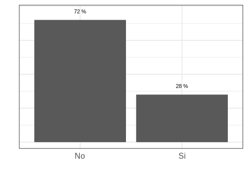
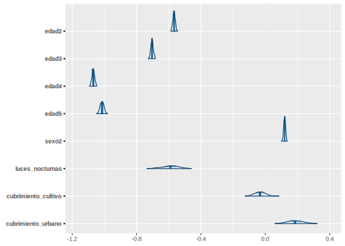
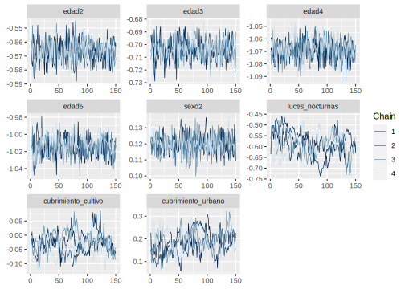

# Día 3 - Sesión 3- Modelo de unidad para la estimación de la pobreza 


Lo primero a tener en cuenta, es que no se debe usar una regresión lineal cuando se tiene una variable de tipo  binario como variable dependiente, ya que no es posible estimar la probabilidad del evento estudiado de manera directa, por esta razón se emplea una regresión logística, en la que para obtener las estimaciones          de la probabilidad del evento estudiado se debe realizar una transformación (logit), lo cual consiste en          tomar el logaritmo de la probabilidad de éxito entre la probabilidad de fracaso, de la siguiente manera:  

$$
\ln \frac{\theta}{1-\theta}
$$
donde $\theta$ representa la probabilidad de éxito del evento.  

## Modelo de regresión logistica. 

Sea 
$$
y_{ji}=\begin{cases}
1 & ingreso_{ji}\le lp\\
0 & e.o.c.
\end{cases}
$$ 
donde $ingreso_{ji}$ representa el ingreso de la $i$-ésima persona en el $j$-ésimo post-estrato y $lp$ es un valor limite, en particular la linea de pobreza. Empleando un modelo de regresión logística de efecto aleatorios pretende establecer la relación entre la expectativa $\theta_{ji}$  de la variable dicotómica con las covariables de información auxiliar disponibles para ser incluidas. El procedimiento correspondiente a este proceso, modela el logaritmo del cociente entre la probabilidad de estar por debajo de la linea de pobreza  a su complemento en relación al conjunto de covariables a nivel de unidad, $x_{ji}$, y el efecto aleatorio $u_d$.     

$$
\begin{eqnarray*}
\ln\left(\frac{\theta_{ji}}{1-\theta_{ji}}\right)=\boldsymbol{x}_{ji}^{T}\boldsymbol{\beta}+u_d
\end{eqnarray*}
$$

Donde los coeficientes $\boldsymbol{\beta}$ hacen referencia a los efectos fijos de las variables $x_{ji}^T$  sobre las probabilidades de que la $i$-ésima persona este por debajo de la linea de pobreza; por otro lado, $u_d$ son los efectos fijos aleatorios, donde $u_{d}\sim N\left(0,\sigma^2_{u}\right)$. 

Para este caso se asumen las distribuciones previas

$$
\begin{eqnarray*}
\beta_k & \sim   & N(0, 1000)\\
\sigma^2_u &\sim & IG(0.0001,0.0001)
\end{eqnarray*}
$$ las cuales se toman no informativas.


#### Obejtivo {-}

Estimar la proporción de personas que están por debajo de la linea pobreza, es decir, 
$$
P_d = \frac{\sum_{U_d}y_{di}}{N_d}
$$
donde $y_{di}$ toma el valor de 1 cuando el ingreso de la persona es menor a la linea de pobreza 0 en caso contrario. 

Note que, 

$$
\begin{equation*}
\bar{Y}_d = P_d =  \frac{\sum_{s_d}y_{di} + \sum_{s^c_d}y_{di}}{N_d} 
\end{equation*}
$$

Ahora, el estimador de $P$ esta dado por: 

$$
\hat{P} = \frac{\sum_{s_d}y_{di} + \sum_{s^c_d}\hat{y}_{di}}{N_d}
$$

donde

$$\hat{y}_{di}=E_{\mathscr{M}}\left(y_{di}\mid\boldsymbol{x}_{d},\boldsymbol{\beta}\right)$$,

donde $\mathscr{M}$ hace referencia a la medida de probabilidad inducida por el modelamiento. 
De esta forma se tiene que, 

$$
\hat{P} = \frac{\sum_{U_{d}}\hat{y}_{di}}{N_d}
$$


A continuación se muestra el proceso realizado para la obtención de la predicción de la tasa de pobreza.

## Proceso de estimación en `R`

Para desarrollar la metodología se hace uso de las siguientes librerías.


```r
# Interprete de STAN en R
library(rstan)
library(rstanarm)
# Manejo de bases de datos.
library(tidyverse)
# Gráficas de los modelos. 
library(bayesplot)
library(patchwork)
# Organizar la presentación de las tablas
library(kableExtra)
library(printr)
```

Un conjunto de funciones desarrolladas para realizar de forma simplificada los procesos están consignadas en la siguiente rutina.


```r
source("Recursos/Día3/Sesion3/0Recursos/funciones_mrp.R")
```

Entre las funciones incluidas en el archivo encuentra

-   *plot_interaction*: Esta crea un diagrama de lineas donde se estudia la interacción entre las variables, en el caso de presentar un traslape de las lineas se recomienda incluir el interacción en el modelo.

-   *Plot_Compare* Puesto que es necesario realizar una homologar la información del censo y la encuesta es conveniente llevar a cabo una validación de las variables que han sido homologadas, por tanto, se espera que las proporciones resultantes del censo y la encuesta estén cercanas entre sí.

-   *Aux_Agregado*: Esta es función permite obtener estimaciones a diferentes niveles de agregación, toma mucha relevancia cuando se realiza un proceso repetitivo.

**Las funciones están diseñada específicamente  para este  proceso**

### Encuesta de hogares

Los datos empleados en esta ocasión corresponden a la ultima encuesta de hogares, la cual ha sido estandarizada por *CEPAL* y se encuentra disponible en *BADEHOG*


```r
encuesta <- readRDS("Recursos/Día3/Sesion3/Data/encuestaCOL18N1.rds")

encuesta_mrp <- encuesta %>% 
  transmute(
   dam = dam_ee,
  dam2, 
  area = haven::as_factor(area_ee,levels  = "values"),
  area = case_when(area == 1 ~ "1", TRUE ~ "0"),
  pobreza = ifelse(ingcorte < lp,1,0),
  sexo = as.character(sexo),
  anoest = case_when(
    edad < 7 | anoest == -1   ~ "98"  , #No aplica
    anoest == 99 | (edad>=7 & is.na(anoest)) ~ "99", #NS/NR
    anoest == 0  ~ "1", # Sin educacion
    anoest %in% c(1:6) ~ "2",       # 1 - 6
    anoest %in% c(7:12) ~ "3",      # 7 - 12
    anoest > 12 ~ "4",      # mas de 12
    TRUE ~ "Error"  ),
  edad = case_when(
    edad < 15 ~ "1",
    edad < 30 ~ "2",
    edad < 45 ~ "3",
    edad < 65 ~ "4",
    TRUE ~ "5"),
  
  etnia = case_when(
    etnia_ee == 1 ~ "1", # Indigena
    etnia_ee == 2 ~ "2",   # Afro
    TRUE ~ "3"         # Otra
  ),
fep = `_fep`
) 

tba(encuesta_mrp %>% head(10)) 
```

<table class="table table-striped lightable-classic" style="width: auto !important; margin-left: auto; margin-right: auto; font-family: Arial Narrow; width: auto !important; margin-left: auto; margin-right: auto;">
 <thead>
  <tr>
   <th style="text-align:left;"> dam </th>
   <th style="text-align:left;"> dam2 </th>
   <th style="text-align:left;"> area </th>
   <th style="text-align:right;"> pobreza </th>
   <th style="text-align:left;"> sexo </th>
   <th style="text-align:left;"> anoest </th>
   <th style="text-align:left;"> edad </th>
   <th style="text-align:left;"> etnia </th>
   <th style="text-align:right;"> fep </th>
  </tr>
 </thead>
<tbody>
  <tr>
   <td style="text-align:left;"> 05 </td>
   <td style="text-align:left;"> 05360 </td>
   <td style="text-align:left;"> 1 </td>
   <td style="text-align:right;"> 0 </td>
   <td style="text-align:left;"> 1 </td>
   <td style="text-align:left;"> 3 </td>
   <td style="text-align:left;"> 3 </td>
   <td style="text-align:left;"> 2 </td>
   <td style="text-align:right;"> 127.2220 </td>
  </tr>
  <tr>
   <td style="text-align:left;"> 05 </td>
   <td style="text-align:left;"> 05360 </td>
   <td style="text-align:left;"> 1 </td>
   <td style="text-align:right;"> 0 </td>
   <td style="text-align:left;"> 2 </td>
   <td style="text-align:left;"> 2 </td>
   <td style="text-align:left;"> 3 </td>
   <td style="text-align:left;"> 3 </td>
   <td style="text-align:right;"> 127.2220 </td>
  </tr>
  <tr>
   <td style="text-align:left;"> 05 </td>
   <td style="text-align:left;"> 05360 </td>
   <td style="text-align:left;"> 1 </td>
   <td style="text-align:right;"> 0 </td>
   <td style="text-align:left;"> 1 </td>
   <td style="text-align:left;"> 2 </td>
   <td style="text-align:left;"> 1 </td>
   <td style="text-align:left;"> 2 </td>
   <td style="text-align:right;"> 127.2220 </td>
  </tr>
  <tr>
   <td style="text-align:left;"> 05 </td>
   <td style="text-align:left;"> 05360 </td>
   <td style="text-align:left;"> 1 </td>
   <td style="text-align:right;"> 0 </td>
   <td style="text-align:left;"> 1 </td>
   <td style="text-align:left;"> 98 </td>
   <td style="text-align:left;"> 1 </td>
   <td style="text-align:left;"> 2 </td>
   <td style="text-align:right;"> 127.2220 </td>
  </tr>
  <tr>
   <td style="text-align:left;"> 05 </td>
   <td style="text-align:left;"> 05360 </td>
   <td style="text-align:left;"> 1 </td>
   <td style="text-align:right;"> 0 </td>
   <td style="text-align:left;"> 1 </td>
   <td style="text-align:left;"> 98 </td>
   <td style="text-align:left;"> 1 </td>
   <td style="text-align:left;"> 2 </td>
   <td style="text-align:right;"> 127.2220 </td>
  </tr>
  <tr>
   <td style="text-align:left;"> 05 </td>
   <td style="text-align:left;"> 05360 </td>
   <td style="text-align:left;"> 1 </td>
   <td style="text-align:right;"> 1 </td>
   <td style="text-align:left;"> 1 </td>
   <td style="text-align:left;"> 4 </td>
   <td style="text-align:left;"> 3 </td>
   <td style="text-align:left;"> 2 </td>
   <td style="text-align:right;"> 125.7202 </td>
  </tr>
  <tr>
   <td style="text-align:left;"> 05 </td>
   <td style="text-align:left;"> 05360 </td>
   <td style="text-align:left;"> 1 </td>
   <td style="text-align:right;"> 1 </td>
   <td style="text-align:left;"> 2 </td>
   <td style="text-align:left;"> 3 </td>
   <td style="text-align:left;"> 3 </td>
   <td style="text-align:left;"> 2 </td>
   <td style="text-align:right;"> 125.7202 </td>
  </tr>
  <tr>
   <td style="text-align:left;"> 05 </td>
   <td style="text-align:left;"> 05360 </td>
   <td style="text-align:left;"> 1 </td>
   <td style="text-align:right;"> 1 </td>
   <td style="text-align:left;"> 2 </td>
   <td style="text-align:left;"> 2 </td>
   <td style="text-align:left;"> 1 </td>
   <td style="text-align:left;"> 2 </td>
   <td style="text-align:right;"> 125.7202 </td>
  </tr>
  <tr>
   <td style="text-align:left;"> 05 </td>
   <td style="text-align:left;"> 05360 </td>
   <td style="text-align:left;"> 1 </td>
   <td style="text-align:right;"> 1 </td>
   <td style="text-align:left;"> 1 </td>
   <td style="text-align:left;"> 98 </td>
   <td style="text-align:left;"> 1 </td>
   <td style="text-align:left;"> 2 </td>
   <td style="text-align:right;"> 125.7202 </td>
  </tr>
  <tr>
   <td style="text-align:left;"> 05 </td>
   <td style="text-align:left;"> 05360 </td>
   <td style="text-align:left;"> 1 </td>
   <td style="text-align:right;"> 1 </td>
   <td style="text-align:left;"> 1 </td>
   <td style="text-align:left;"> 2 </td>
   <td style="text-align:left;"> 4 </td>
   <td style="text-align:left;"> 2 </td>
   <td style="text-align:right;"> 115.8661 </td>
  </tr>
</tbody>
</table>

La base de datos de la encuesta tiene la siguientes columnas: 

-   *dam*: Corresponde al código asignado a la división administrativa mayor del país.

-   *dam2*: Corresponde al código asignado a la segunda división administrativa del país.

-   *lp* y *li* lineas de pobreza y pobreza extrema definidas por CEPAL. 

-   *área* división geográfica (Urbano y Rural). 

-   *sexo* Hombre y Mujer. 

-   *etnia* En estas variable se definen tres grupos:  afrodescendientes, indígenas y Otros. 

-   Años de escolaridad (*anoest*) 

-   Rangos de edad (*edad*) 

-   Factor de expansión por persona (*fep*)


Ahora, inspeccionamos el comportamiento de la variable de interés: 


```r
tab <- encuesta_mrp %>% group_by(pobreza) %>% 
  tally() %>%
  mutate(prop = round(n/sum(n),2),
         pobreza = ifelse(pobreza == 1, "Si", "No"))

ggplot(data = tab, aes(x = pobreza, y = prop)) +
  geom_bar(stat = "identity") + 
  labs(y = "", x = "") +
  geom_text(aes(label = paste(prop*100,"%")), 
            nudge_y=0.05) +
  theme_bw(base_size = 20) +
  theme(axis.text.y = element_blank(),
        axis.ticks = element_blank())
```

<div class="figure">

<p class="caption">(\#fig:unnamed-chunk-4)Proporción de personas por debajo de la linea de pobreza</p>
</div>


La información auxiliar disponible ha sido extraída del censo  e imágenes satelitales


```r
statelevel_predictors_df <- 
  readRDS("Recursos/Día3/Sesion3/Data/statelevel_predictors_df_dam2.rds") %>% 
    mutate_at(.vars = c("luces_nocturnas",
                      "cubrimiento_cultivo",
                      "cubrimiento_urbano",
                      "modificacion_humana",
                      "accesibilidad_hospitales",
                      "accesibilidad_hosp_caminado"),
            function(x) as.numeric(scale(x)))
tba(statelevel_predictors_df  %>%  head(10))
```

<table class="table table-striped lightable-classic" style="width: auto !important; margin-left: auto; margin-right: auto; font-family: Arial Narrow; width: auto !important; margin-left: auto; margin-right: auto;">
 <thead>
  <tr>
   <th style="text-align:left;"> dam </th>
   <th style="text-align:left;"> dam2 </th>
   <th style="text-align:right;"> area1 </th>
   <th style="text-align:right;"> sexo2 </th>
   <th style="text-align:right;"> edad2 </th>
   <th style="text-align:right;"> edad3 </th>
   <th style="text-align:right;"> edad4 </th>
   <th style="text-align:right;"> edad5 </th>
   <th style="text-align:right;"> etnia2 </th>
   <th style="text-align:right;"> anoest2 </th>
   <th style="text-align:right;"> anoest3 </th>
   <th style="text-align:right;"> anoest4 </th>
   <th style="text-align:right;"> etnia1 </th>
   <th style="text-align:right;"> tiene_acueducto </th>
   <th style="text-align:right;"> piso_tierra </th>
   <th style="text-align:right;"> alfabeta </th>
   <th style="text-align:right;"> hacinamiento </th>
   <th style="text-align:right;"> tasa_desocupacion </th>
   <th style="text-align:right;"> luces_nocturnas </th>
   <th style="text-align:right;"> cubrimiento_cultivo </th>
   <th style="text-align:right;"> cubrimiento_urbano </th>
   <th style="text-align:right;"> modificacion_humana </th>
   <th style="text-align:right;"> accesibilidad_hospitales </th>
   <th style="text-align:right;"> accesibilidad_hosp_caminado </th>
  </tr>
 </thead>
<tbody>
  <tr>
   <td style="text-align:left;"> 05 </td>
   <td style="text-align:left;"> 05001 </td>
   <td style="text-align:right;"> 0.9832 </td>
   <td style="text-align:right;"> 0.5299 </td>
   <td style="text-align:right;"> 0.2671 </td>
   <td style="text-align:right;"> 0.2201 </td>
   <td style="text-align:right;"> 0.2355 </td>
   <td style="text-align:right;"> 0.1060 </td>
   <td style="text-align:right;"> 0.0251 </td>
   <td style="text-align:right;"> 0.2598 </td>
   <td style="text-align:right;"> 0.4048 </td>
   <td style="text-align:right;"> 0.2287 </td>
   <td style="text-align:right;"> 0.0009 </td>
   <td style="text-align:right;"> 0.0354 </td>
   <td style="text-align:right;"> 0.0024 </td>
   <td style="text-align:right;"> 0.0258 </td>
   <td style="text-align:right;"> 0.0833 </td>
   <td style="text-align:right;"> 0.0062 </td>
   <td style="text-align:right;"> 4.9762 </td>
   <td style="text-align:right;"> -0.5072 </td>
   <td style="text-align:right;"> 7.2903 </td>
   <td style="text-align:right;"> 2.8648 </td>
   <td style="text-align:right;"> -0.3953 </td>
   <td style="text-align:right;"> -0.5248 </td>
  </tr>
  <tr>
   <td style="text-align:left;"> 05 </td>
   <td style="text-align:left;"> 05002 </td>
   <td style="text-align:right;"> 0.3953 </td>
   <td style="text-align:right;"> 0.4807 </td>
   <td style="text-align:right;"> 0.2229 </td>
   <td style="text-align:right;"> 0.1977 </td>
   <td style="text-align:right;"> 0.2497 </td>
   <td style="text-align:right;"> 0.1281 </td>
   <td style="text-align:right;"> 0.0035 </td>
   <td style="text-align:right;"> 0.5644 </td>
   <td style="text-align:right;"> 0.2393 </td>
   <td style="text-align:right;"> 0.0473 </td>
   <td style="text-align:right;"> 0.0001 </td>
   <td style="text-align:right;"> 0.3416 </td>
   <td style="text-align:right;"> 0.0160 </td>
   <td style="text-align:right;"> 0.1139 </td>
   <td style="text-align:right;"> 0.1395 </td>
   <td style="text-align:right;"> 0.0000 </td>
   <td style="text-align:right;"> -0.3246 </td>
   <td style="text-align:right;"> -0.5749 </td>
   <td style="text-align:right;"> -0.1807 </td>
   <td style="text-align:right;"> -0.0439 </td>
   <td style="text-align:right;"> -0.3439 </td>
   <td style="text-align:right;"> -0.4224 </td>
  </tr>
  <tr>
   <td style="text-align:left;"> 05 </td>
   <td style="text-align:left;"> 05004 </td>
   <td style="text-align:right;"> 0.3279 </td>
   <td style="text-align:right;"> 0.4576 </td>
   <td style="text-align:right;"> 0.2376 </td>
   <td style="text-align:right;"> 0.2075 </td>
   <td style="text-align:right;"> 0.2316 </td>
   <td style="text-align:right;"> 0.1218 </td>
   <td style="text-align:right;"> 0.0199 </td>
   <td style="text-align:right;"> 0.4470 </td>
   <td style="text-align:right;"> 0.3460 </td>
   <td style="text-align:right;"> 0.0723 </td>
   <td style="text-align:right;"> 0.0000 </td>
   <td style="text-align:right;"> 0.3694 </td>
   <td style="text-align:right;"> 0.0325 </td>
   <td style="text-align:right;"> 0.0787 </td>
   <td style="text-align:right;"> 0.1557 </td>
   <td style="text-align:right;"> 0.0000 </td>
   <td style="text-align:right;"> -0.6111 </td>
   <td style="text-align:right;"> -0.5475 </td>
   <td style="text-align:right;"> -0.2991 </td>
   <td style="text-align:right;"> -0.8159 </td>
   <td style="text-align:right;"> 0.0619 </td>
   <td style="text-align:right;"> -0.0654 </td>
  </tr>
  <tr>
   <td style="text-align:left;"> 05 </td>
   <td style="text-align:left;"> 05021 </td>
   <td style="text-align:right;"> 0.5770 </td>
   <td style="text-align:right;"> 0.5020 </td>
   <td style="text-align:right;"> 0.2191 </td>
   <td style="text-align:right;"> 0.1946 </td>
   <td style="text-align:right;"> 0.2357 </td>
   <td style="text-align:right;"> 0.1274 </td>
   <td style="text-align:right;"> 0.0031 </td>
   <td style="text-align:right;"> 0.5038 </td>
   <td style="text-align:right;"> 0.2727 </td>
   <td style="text-align:right;"> 0.0716 </td>
   <td style="text-align:right;"> 0.0000 </td>
   <td style="text-align:right;"> 0.2785 </td>
   <td style="text-align:right;"> 0.0255 </td>
   <td style="text-align:right;"> 0.0959 </td>
   <td style="text-align:right;"> 0.1025 </td>
   <td style="text-align:right;"> 0.0000 </td>
   <td style="text-align:right;"> -0.4532 </td>
   <td style="text-align:right;"> -0.6694 </td>
   <td style="text-align:right;"> -0.1852 </td>
   <td style="text-align:right;"> -0.3570 </td>
   <td style="text-align:right;"> -0.2956 </td>
   <td style="text-align:right;"> -0.3104 </td>
  </tr>
  <tr>
   <td style="text-align:left;"> 05 </td>
   <td style="text-align:left;"> 05030 </td>
   <td style="text-align:right;"> 0.4859 </td>
   <td style="text-align:right;"> 0.5063 </td>
   <td style="text-align:right;"> 0.2571 </td>
   <td style="text-align:right;"> 0.2047 </td>
   <td style="text-align:right;"> 0.2507 </td>
   <td style="text-align:right;"> 0.0997 </td>
   <td style="text-align:right;"> 0.0048 </td>
   <td style="text-align:right;"> 0.4130 </td>
   <td style="text-align:right;"> 0.3756 </td>
   <td style="text-align:right;"> 0.0828 </td>
   <td style="text-align:right;"> 0.0003 </td>
   <td style="text-align:right;"> 0.0775 </td>
   <td style="text-align:right;"> 0.0143 </td>
   <td style="text-align:right;"> 0.0844 </td>
   <td style="text-align:right;"> 0.1176 </td>
   <td style="text-align:right;"> 0.0000 </td>
   <td style="text-align:right;"> 1.1636 </td>
   <td style="text-align:right;"> -0.5002 </td>
   <td style="text-align:right;"> 0.7336 </td>
   <td style="text-align:right;"> 1.4706 </td>
   <td style="text-align:right;"> -0.3670 </td>
   <td style="text-align:right;"> -0.4265 </td>
  </tr>
  <tr>
   <td style="text-align:left;"> 05 </td>
   <td style="text-align:left;"> 05031 </td>
   <td style="text-align:right;"> 0.5766 </td>
   <td style="text-align:right;"> 0.4978 </td>
   <td style="text-align:right;"> 0.2695 </td>
   <td style="text-align:right;"> 0.1961 </td>
   <td style="text-align:right;"> 0.2047 </td>
   <td style="text-align:right;"> 0.0850 </td>
   <td style="text-align:right;"> 0.0050 </td>
   <td style="text-align:right;"> 0.4618 </td>
   <td style="text-align:right;"> 0.2981 </td>
   <td style="text-align:right;"> 0.0585 </td>
   <td style="text-align:right;"> 0.0001 </td>
   <td style="text-align:right;"> 0.4010 </td>
   <td style="text-align:right;"> 0.0970 </td>
   <td style="text-align:right;"> 0.1200 </td>
   <td style="text-align:right;"> 0.1417 </td>
   <td style="text-align:right;"> 0.0000 </td>
   <td style="text-align:right;"> -0.5077 </td>
   <td style="text-align:right;"> -0.6806 </td>
   <td style="text-align:right;"> -0.2532 </td>
   <td style="text-align:right;"> -0.6818 </td>
   <td style="text-align:right;"> 0.0167 </td>
   <td style="text-align:right;"> 0.2017 </td>
  </tr>
  <tr>
   <td style="text-align:left;"> 05 </td>
   <td style="text-align:left;"> 05034 </td>
   <td style="text-align:right;"> 0.5029 </td>
   <td style="text-align:right;"> 0.4815 </td>
   <td style="text-align:right;"> 0.2530 </td>
   <td style="text-align:right;"> 0.2052 </td>
   <td style="text-align:right;"> 0.2324 </td>
   <td style="text-align:right;"> 0.1042 </td>
   <td style="text-align:right;"> 0.0060 </td>
   <td style="text-align:right;"> 0.4731 </td>
   <td style="text-align:right;"> 0.2976 </td>
   <td style="text-align:right;"> 0.0634 </td>
   <td style="text-align:right;"> 0.0065 </td>
   <td style="text-align:right;"> 0.3435 </td>
   <td style="text-align:right;"> 0.0069 </td>
   <td style="text-align:right;"> 0.1089 </td>
   <td style="text-align:right;"> 0.1301 </td>
   <td style="text-align:right;"> 0.0000 </td>
   <td style="text-align:right;"> -0.2580 </td>
   <td style="text-align:right;"> -0.5573 </td>
   <td style="text-align:right;"> -0.2197 </td>
   <td style="text-align:right;"> 0.2265 </td>
   <td style="text-align:right;"> -0.0293 </td>
   <td style="text-align:right;"> -0.2376 </td>
  </tr>
  <tr>
   <td style="text-align:left;"> 05 </td>
   <td style="text-align:left;"> 05036 </td>
   <td style="text-align:right;"> 0.3931 </td>
   <td style="text-align:right;"> 0.4951 </td>
   <td style="text-align:right;"> 0.2447 </td>
   <td style="text-align:right;"> 0.1955 </td>
   <td style="text-align:right;"> 0.2435 </td>
   <td style="text-align:right;"> 0.1142 </td>
   <td style="text-align:right;"> 0.0054 </td>
   <td style="text-align:right;"> 0.4808 </td>
   <td style="text-align:right;"> 0.3010 </td>
   <td style="text-align:right;"> 0.0591 </td>
   <td style="text-align:right;"> 0.0006 </td>
   <td style="text-align:right;"> 0.1341 </td>
   <td style="text-align:right;"> 0.0227 </td>
   <td style="text-align:right;"> 0.1100 </td>
   <td style="text-align:right;"> 0.1561 </td>
   <td style="text-align:right;"> 0.0000 </td>
   <td style="text-align:right;"> 0.7139 </td>
   <td style="text-align:right;"> -0.5957 </td>
   <td style="text-align:right;"> -0.2053 </td>
   <td style="text-align:right;"> 1.0807 </td>
   <td style="text-align:right;"> -0.3818 </td>
   <td style="text-align:right;"> -0.5131 </td>
  </tr>
  <tr>
   <td style="text-align:left;"> 05 </td>
   <td style="text-align:left;"> 05038 </td>
   <td style="text-align:right;"> 0.2256 </td>
   <td style="text-align:right;"> 0.4927 </td>
   <td style="text-align:right;"> 0.2659 </td>
   <td style="text-align:right;"> 0.1984 </td>
   <td style="text-align:right;"> 0.2049 </td>
   <td style="text-align:right;"> 0.0904 </td>
   <td style="text-align:right;"> 0.0050 </td>
   <td style="text-align:right;"> 0.5162 </td>
   <td style="text-align:right;"> 0.2696 </td>
   <td style="text-align:right;"> 0.0281 </td>
   <td style="text-align:right;"> 0.0000 </td>
   <td style="text-align:right;"> 0.2768 </td>
   <td style="text-align:right;"> 0.1011 </td>
   <td style="text-align:right;"> 0.1544 </td>
   <td style="text-align:right;"> 0.2247 </td>
   <td style="text-align:right;"> 0.0000 </td>
   <td style="text-align:right;"> -0.4100 </td>
   <td style="text-align:right;"> -0.5108 </td>
   <td style="text-align:right;"> -0.2644 </td>
   <td style="text-align:right;"> -0.1709 </td>
   <td style="text-align:right;"> -0.3398 </td>
   <td style="text-align:right;"> -0.3666 </td>
  </tr>
  <tr>
   <td style="text-align:left;"> 05 </td>
   <td style="text-align:left;"> 05040 </td>
   <td style="text-align:right;"> 0.4858 </td>
   <td style="text-align:right;"> 0.4826 </td>
   <td style="text-align:right;"> 0.2859 </td>
   <td style="text-align:right;"> 0.1982 </td>
   <td style="text-align:right;"> 0.1678 </td>
   <td style="text-align:right;"> 0.0641 </td>
   <td style="text-align:right;"> 0.0168 </td>
   <td style="text-align:right;"> 0.4928 </td>
   <td style="text-align:right;"> 0.2738 </td>
   <td style="text-align:right;"> 0.0361 </td>
   <td style="text-align:right;"> 0.0117 </td>
   <td style="text-align:right;"> 0.4961 </td>
   <td style="text-align:right;"> 0.0824 </td>
   <td style="text-align:right;"> 0.1253 </td>
   <td style="text-align:right;"> 0.1948 </td>
   <td style="text-align:right;"> 0.0000 </td>
   <td style="text-align:right;"> -0.5447 </td>
   <td style="text-align:right;"> -0.6866 </td>
   <td style="text-align:right;"> -0.2954 </td>
   <td style="text-align:right;"> -0.9040 </td>
   <td style="text-align:right;"> 0.0470 </td>
   <td style="text-align:right;"> 0.1783 </td>
  </tr>
</tbody>
</table>


### Niveles de agregación para colapsar la encuesta

Después de realizar una investigación en la literatura especializada y realizar estudios de simulación fue posible evidenciar que las predicciones obtenidas con la muestra sin agregar y la muestra agregada convergen a la media del dominio. 


```r
byAgrega <- c("dam", "dam2",  "area", 
              "sexo",   "anoest", "edad",   "etnia" )
```

### Creando base con la encuesta agregada

El resultado de agregar la base de dato se muestra a continuación:


```r
encuesta_df_agg <-
  encuesta_mrp %>%                    # Encuesta  
  group_by_at(all_of(byAgrega)) %>%   # Agrupar por el listado de variables
  summarise(n = n(),                  # Número de observaciones
  # conteo de personas con características similares.           
             pobreza = sum(pobreza),
             no_pobreza = n-pobreza,
            .groups = "drop") %>%     
  arrange(desc(pobreza))                    # Ordenar la base.
```

La tabla obtenida es la siguiente: 

<table class="table table-striped lightable-classic" style="width: auto !important; margin-left: auto; margin-right: auto; font-family: Arial Narrow; width: auto !important; margin-left: auto; margin-right: auto;">
 <thead>
  <tr>
   <th style="text-align:left;"> dam </th>
   <th style="text-align:left;"> dam2 </th>
   <th style="text-align:left;"> area </th>
   <th style="text-align:left;"> sexo </th>
   <th style="text-align:left;"> anoest </th>
   <th style="text-align:left;"> edad </th>
   <th style="text-align:left;"> etnia </th>
   <th style="text-align:right;"> n </th>
   <th style="text-align:right;"> pobreza </th>
   <th style="text-align:right;"> no_pobreza </th>
  </tr>
 </thead>
<tbody>
  <tr>
   <td style="text-align:left;"> 47 </td>
   <td style="text-align:left;"> 47001 </td>
   <td style="text-align:left;"> 1 </td>
   <td style="text-align:left;"> 2 </td>
   <td style="text-align:left;"> 3 </td>
   <td style="text-align:left;"> 2 </td>
   <td style="text-align:left;"> 3 </td>
   <td style="text-align:right;"> 2636 </td>
   <td style="text-align:right;"> 1048 </td>
   <td style="text-align:right;"> 1588 </td>
  </tr>
  <tr>
   <td style="text-align:left;"> 27 </td>
   <td style="text-align:left;"> 27001 </td>
   <td style="text-align:left;"> 1 </td>
   <td style="text-align:left;"> 2 </td>
   <td style="text-align:left;"> 3 </td>
   <td style="text-align:left;"> 2 </td>
   <td style="text-align:left;"> 2 </td>
   <td style="text-align:right;"> 1824 </td>
   <td style="text-align:right;"> 993 </td>
   <td style="text-align:right;"> 831 </td>
  </tr>
  <tr>
   <td style="text-align:left;"> 20 </td>
   <td style="text-align:left;"> 20001 </td>
   <td style="text-align:left;"> 1 </td>
   <td style="text-align:left;"> 2 </td>
   <td style="text-align:left;"> 3 </td>
   <td style="text-align:left;"> 2 </td>
   <td style="text-align:left;"> 3 </td>
   <td style="text-align:right;"> 2211 </td>
   <td style="text-align:right;"> 953 </td>
   <td style="text-align:right;"> 1258 </td>
  </tr>
  <tr>
   <td style="text-align:left;"> 23 </td>
   <td style="text-align:left;"> 23001 </td>
   <td style="text-align:left;"> 1 </td>
   <td style="text-align:left;"> 2 </td>
   <td style="text-align:left;"> 3 </td>
   <td style="text-align:left;"> 2 </td>
   <td style="text-align:left;"> 3 </td>
   <td style="text-align:right;"> 2530 </td>
   <td style="text-align:right;"> 909 </td>
   <td style="text-align:right;"> 1621 </td>
  </tr>
  <tr>
   <td style="text-align:left;"> 47 </td>
   <td style="text-align:left;"> 47001 </td>
   <td style="text-align:left;"> 1 </td>
   <td style="text-align:left;"> 1 </td>
   <td style="text-align:left;"> 3 </td>
   <td style="text-align:left;"> 2 </td>
   <td style="text-align:left;"> 3 </td>
   <td style="text-align:right;"> 2550 </td>
   <td style="text-align:right;"> 870 </td>
   <td style="text-align:right;"> 1680 </td>
  </tr>
  <tr>
   <td style="text-align:left;"> 44 </td>
   <td style="text-align:left;"> 44001 </td>
   <td style="text-align:left;"> 1 </td>
   <td style="text-align:left;"> 1 </td>
   <td style="text-align:left;"> 98 </td>
   <td style="text-align:left;"> 1 </td>
   <td style="text-align:left;"> 3 </td>
   <td style="text-align:right;"> 1605 </td>
   <td style="text-align:right;"> 848 </td>
   <td style="text-align:right;"> 757 </td>
  </tr>
  <tr>
   <td style="text-align:left;"> 44 </td>
   <td style="text-align:left;"> 44001 </td>
   <td style="text-align:left;"> 1 </td>
   <td style="text-align:left;"> 2 </td>
   <td style="text-align:left;"> 3 </td>
   <td style="text-align:left;"> 2 </td>
   <td style="text-align:left;"> 3 </td>
   <td style="text-align:right;"> 1636 </td>
   <td style="text-align:right;"> 840 </td>
   <td style="text-align:right;"> 796 </td>
  </tr>
  <tr>
   <td style="text-align:left;"> 47 </td>
   <td style="text-align:left;"> 47001 </td>
   <td style="text-align:left;"> 1 </td>
   <td style="text-align:left;"> 1 </td>
   <td style="text-align:left;"> 98 </td>
   <td style="text-align:left;"> 1 </td>
   <td style="text-align:left;"> 3 </td>
   <td style="text-align:right;"> 1702 </td>
   <td style="text-align:right;"> 830 </td>
   <td style="text-align:right;"> 872 </td>
  </tr>
  <tr>
   <td style="text-align:left;"> 70 </td>
   <td style="text-align:left;"> 70001 </td>
   <td style="text-align:left;"> 1 </td>
   <td style="text-align:left;"> 2 </td>
   <td style="text-align:left;"> 3 </td>
   <td style="text-align:left;"> 2 </td>
   <td style="text-align:left;"> 3 </td>
   <td style="text-align:right;"> 2023 </td>
   <td style="text-align:right;"> 825 </td>
   <td style="text-align:right;"> 1198 </td>
  </tr>
  <tr>
   <td style="text-align:left;"> 18 </td>
   <td style="text-align:left;"> 18001 </td>
   <td style="text-align:left;"> 1 </td>
   <td style="text-align:left;"> 2 </td>
   <td style="text-align:left;"> 3 </td>
   <td style="text-align:left;"> 2 </td>
   <td style="text-align:left;"> 3 </td>
   <td style="text-align:right;"> 1904 </td>
   <td style="text-align:right;"> 820 </td>
   <td style="text-align:right;"> 1084 </td>
  </tr>
</tbody>
</table>
El paso a seguir es unificar las tablas creadas. 


```r
encuesta_df_agg <- inner_join(encuesta_df_agg, statelevel_predictors_df)
```

### Definiendo el modelo multinivel.

Después de haber ordenado la encuesta, podemos pasar a la definición del modelo.


```r
options(mc.cores = parallel::detectCores()) # Permite procesar en paralelo. 
fit <- stan_glmer(
  cbind(pobreza, no_pobreza) ~                              
    (1 | dam2) +                          # Efecto aleatorio (ud)
    edad +                               # Efecto fijo (Variables X)
    sexo  + 
    tasa_desocupacion +
    luces_nocturnas + 
    cubrimiento_cultivo +
    cubrimiento_urbano ,
                  data = encuesta_df_agg, # Encuesta agregada 
                  verbose = TRUE,         # Muestre el avance del proceso
                  chains = 4,             # Número de cadenas.
                 iter = 100,              # Número de realizaciones de la cadena
         cores = 4,
      family = binomial(link = "logit")
                )
saveRDS(fit, file = "Recursos/Día3/Sesion3/Data/fit_pobreza.rds")
```

Después de esperar un tiempo prudente se obtiene el siguiente modelo.


```r
fit <- readRDS("Recursos/Día3/Sesion3/Data/fit_pobreza2.rds")
```

Validación del modelo 


```r
library(posterior)
library(bayesplot)

var_names <- c("edad2",  "edad3",  "edad4", "edad5", "sexo2",
               "luces_nocturnas", "cubrimiento_cultivo","cubrimiento_urbano")
mcmc_areas(fit,pars = var_names)
```




```r
mcmc_trace(fit,pars = var_names)
```




```r
encuesta_mrp2 <- inner_join(encuesta_mrp %>% filter(), statelevel_predictors_df)
y_pred_B <- posterior_epred(fit, newdata = encuesta_mrp2)
rowsrandom <- sample(nrow(y_pred_B), 100)
y_pred2 <- y_pred_B[rowsrandom, ]
ppc_dens_overlay(y = as.numeric(encuesta_mrp2$pobreza), y_pred2) 
```

<div class="figure" style="text-align: center">

<p class="caption">(\#fig:unnamed-chunk-15)Tasa de pobreza por dam2</p>
</div>

Los coeficientes del modelo para las primeras dam2 son: 

<table class="table table-striped lightable-classic" style="width: auto !important; margin-left: auto; margin-right: auto; font-family: Arial Narrow; width: auto !important; margin-left: auto; margin-right: auto;">
 <thead>
  <tr>
   <th style="text-align:left;">   </th>
   <th style="text-align:right;"> (Intercept) </th>
   <th style="text-align:right;"> edad2 </th>
   <th style="text-align:right;"> edad3 </th>
   <th style="text-align:right;"> edad4 </th>
   <th style="text-align:right;"> edad5 </th>
   <th style="text-align:right;"> sexo2 </th>
   <th style="text-align:right;"> tasa_desocupacion </th>
   <th style="text-align:right;"> luces_nocturnas </th>
   <th style="text-align:right;"> cubrimiento_cultivo </th>
   <th style="text-align:right;"> cubrimiento_urbano </th>
  </tr>
 </thead>
<tbody>
  <tr>
   <td style="text-align:left;"> 05001 </td>
   <td style="text-align:right;"> 0.6828 </td>
   <td style="text-align:right;"> -0.5671 </td>
   <td style="text-align:right;"> -0.7038 </td>
   <td style="text-align:right;"> -1.0693 </td>
   <td style="text-align:right;"> -1.0142 </td>
   <td style="text-align:right;"> 0.12 </td>
   <td style="text-align:right;"> -47.2389 </td>
   <td style="text-align:right;"> -0.5892 </td>
   <td style="text-align:right;"> -0.033 </td>
   <td style="text-align:right;"> 0.1844 </td>
  </tr>
  <tr>
   <td style="text-align:left;"> 05002 </td>
   <td style="text-align:right;"> 0.0681 </td>
   <td style="text-align:right;"> -0.5671 </td>
   <td style="text-align:right;"> -0.7038 </td>
   <td style="text-align:right;"> -1.0693 </td>
   <td style="text-align:right;"> -1.0142 </td>
   <td style="text-align:right;"> 0.12 </td>
   <td style="text-align:right;"> -47.2389 </td>
   <td style="text-align:right;"> -0.5892 </td>
   <td style="text-align:right;"> -0.033 </td>
   <td style="text-align:right;"> 0.1844 </td>
  </tr>
  <tr>
   <td style="text-align:left;"> 05031 </td>
   <td style="text-align:right;"> -0.3101 </td>
   <td style="text-align:right;"> -0.5671 </td>
   <td style="text-align:right;"> -0.7038 </td>
   <td style="text-align:right;"> -1.0693 </td>
   <td style="text-align:right;"> -1.0142 </td>
   <td style="text-align:right;"> 0.12 </td>
   <td style="text-align:right;"> -47.2389 </td>
   <td style="text-align:right;"> -0.5892 </td>
   <td style="text-align:right;"> -0.033 </td>
   <td style="text-align:right;"> 0.1844 </td>
  </tr>
  <tr>
   <td style="text-align:left;"> 05034 </td>
   <td style="text-align:right;"> 0.1841 </td>
   <td style="text-align:right;"> -0.5671 </td>
   <td style="text-align:right;"> -0.7038 </td>
   <td style="text-align:right;"> -1.0693 </td>
   <td style="text-align:right;"> -1.0142 </td>
   <td style="text-align:right;"> 0.12 </td>
   <td style="text-align:right;"> -47.2389 </td>
   <td style="text-align:right;"> -0.5892 </td>
   <td style="text-align:right;"> -0.033 </td>
   <td style="text-align:right;"> 0.1844 </td>
  </tr>
  <tr>
   <td style="text-align:left;"> 05045 </td>
   <td style="text-align:right;"> -0.6516 </td>
   <td style="text-align:right;"> -0.5671 </td>
   <td style="text-align:right;"> -0.7038 </td>
   <td style="text-align:right;"> -1.0693 </td>
   <td style="text-align:right;"> -1.0142 </td>
   <td style="text-align:right;"> 0.12 </td>
   <td style="text-align:right;"> -47.2389 </td>
   <td style="text-align:right;"> -0.5892 </td>
   <td style="text-align:right;"> -0.033 </td>
   <td style="text-align:right;"> 0.1844 </td>
  </tr>
  <tr>
   <td style="text-align:left;"> 05079 </td>
   <td style="text-align:right;"> 0.6482 </td>
   <td style="text-align:right;"> -0.5671 </td>
   <td style="text-align:right;"> -0.7038 </td>
   <td style="text-align:right;"> -1.0693 </td>
   <td style="text-align:right;"> -1.0142 </td>
   <td style="text-align:right;"> 0.12 </td>
   <td style="text-align:right;"> -47.2389 </td>
   <td style="text-align:right;"> -0.5892 </td>
   <td style="text-align:right;"> -0.033 </td>
   <td style="text-align:right;"> 0.1844 </td>
  </tr>
  <tr>
   <td style="text-align:left;"> 05088 </td>
   <td style="text-align:right;"> 0.2210 </td>
   <td style="text-align:right;"> -0.5671 </td>
   <td style="text-align:right;"> -0.7038 </td>
   <td style="text-align:right;"> -1.0693 </td>
   <td style="text-align:right;"> -1.0142 </td>
   <td style="text-align:right;"> 0.12 </td>
   <td style="text-align:right;"> -47.2389 </td>
   <td style="text-align:right;"> -0.5892 </td>
   <td style="text-align:right;"> -0.033 </td>
   <td style="text-align:right;"> 0.1844 </td>
  </tr>
  <tr>
   <td style="text-align:left;"> 05093 </td>
   <td style="text-align:right;"> -0.5751 </td>
   <td style="text-align:right;"> -0.5671 </td>
   <td style="text-align:right;"> -0.7038 </td>
   <td style="text-align:right;"> -1.0693 </td>
   <td style="text-align:right;"> -1.0142 </td>
   <td style="text-align:right;"> 0.12 </td>
   <td style="text-align:right;"> -47.2389 </td>
   <td style="text-align:right;"> -0.5892 </td>
   <td style="text-align:right;"> -0.033 </td>
   <td style="text-align:right;"> 0.1844 </td>
  </tr>
  <tr>
   <td style="text-align:left;"> 05120 </td>
   <td style="text-align:right;"> 0.9444 </td>
   <td style="text-align:right;"> -0.5671 </td>
   <td style="text-align:right;"> -0.7038 </td>
   <td style="text-align:right;"> -1.0693 </td>
   <td style="text-align:right;"> -1.0142 </td>
   <td style="text-align:right;"> 0.12 </td>
   <td style="text-align:right;"> -47.2389 </td>
   <td style="text-align:right;"> -0.5892 </td>
   <td style="text-align:right;"> -0.033 </td>
   <td style="text-align:right;"> 0.1844 </td>
  </tr>
  <tr>
   <td style="text-align:left;"> 05129 </td>
   <td style="text-align:right;"> -0.6751 </td>
   <td style="text-align:right;"> -0.5671 </td>
   <td style="text-align:right;"> -0.7038 </td>
   <td style="text-align:right;"> -1.0693 </td>
   <td style="text-align:right;"> -1.0142 </td>
   <td style="text-align:right;"> 0.12 </td>
   <td style="text-align:right;"> -47.2389 </td>
   <td style="text-align:right;"> -0.5892 </td>
   <td style="text-align:right;"> -0.033 </td>
   <td style="text-align:right;"> 0.1844 </td>
  </tr>
</tbody>
</table>

## Proceso de estimación y predicción

Obtener el modelo es solo un paso más, ahora se debe realizar la predicción en el censo, el cual fue estandarizado y homologado con la encuesta previamente. 


```r
poststrat_df <- readRDS("Recursos/Día3/Sesion3/Data/censo_dam2.rds") %>% 
     left_join(statelevel_predictors_df) 
tba( poststrat_df %>% arrange(desc(n)) %>% head(10))
```

<table class="table table-striped lightable-classic" style="width: auto !important; margin-left: auto; margin-right: auto; font-family: Arial Narrow; width: auto !important; margin-left: auto; margin-right: auto;">
 <thead>
  <tr>
   <th style="text-align:left;"> dam </th>
   <th style="text-align:left;"> dam2 </th>
   <th style="text-align:left;"> area </th>
   <th style="text-align:left;"> sexo </th>
   <th style="text-align:left;"> edad </th>
   <th style="text-align:left;"> etnia </th>
   <th style="text-align:left;"> anoest </th>
   <th style="text-align:right;"> n </th>
   <th style="text-align:right;"> area1 </th>
   <th style="text-align:right;"> sexo2 </th>
   <th style="text-align:right;"> edad2 </th>
   <th style="text-align:right;"> edad3 </th>
   <th style="text-align:right;"> edad4 </th>
   <th style="text-align:right;"> edad5 </th>
   <th style="text-align:right;"> etnia2 </th>
   <th style="text-align:right;"> anoest2 </th>
   <th style="text-align:right;"> anoest3 </th>
   <th style="text-align:right;"> anoest4 </th>
   <th style="text-align:right;"> etnia1 </th>
   <th style="text-align:right;"> tiene_acueducto </th>
   <th style="text-align:right;"> piso_tierra </th>
   <th style="text-align:right;"> alfabeta </th>
   <th style="text-align:right;"> hacinamiento </th>
   <th style="text-align:right;"> tasa_desocupacion </th>
   <th style="text-align:right;"> luces_nocturnas </th>
   <th style="text-align:right;"> cubrimiento_cultivo </th>
   <th style="text-align:right;"> cubrimiento_urbano </th>
   <th style="text-align:right;"> modificacion_humana </th>
   <th style="text-align:right;"> accesibilidad_hospitales </th>
   <th style="text-align:right;"> accesibilidad_hosp_caminado </th>
  </tr>
 </thead>
<tbody>
  <tr>
   <td style="text-align:left;"> 11 </td>
   <td style="text-align:left;"> 11001 </td>
   <td style="text-align:left;"> 1 </td>
   <td style="text-align:left;"> 1 </td>
   <td style="text-align:left;"> 2 </td>
   <td style="text-align:left;"> 3 </td>
   <td style="text-align:left;"> 3 </td>
   <td style="text-align:right;"> 602093 </td>
   <td style="text-align:right;"> 0.9979 </td>
   <td style="text-align:right;"> 0.5219 </td>
   <td style="text-align:right;"> 0.269 </td>
   <td style="text-align:right;"> 0.2316 </td>
   <td style="text-align:right;"> 0.2251 </td>
   <td style="text-align:right;"> 0.0886 </td>
   <td style="text-align:right;"> 0.0093 </td>
   <td style="text-align:right;"> 0.2098 </td>
   <td style="text-align:right;"> 0.381 </td>
   <td style="text-align:right;"> 0.2938 </td>
   <td style="text-align:right;"> 0.0027 </td>
   <td style="text-align:right;"> 0.0219 </td>
   <td style="text-align:right;"> 0.0026 </td>
   <td style="text-align:right;"> 0.0143 </td>
   <td style="text-align:right;"> 0.0848 </td>
   <td style="text-align:right;"> 0.0176 </td>
   <td style="text-align:right;"> 2.0576 </td>
   <td style="text-align:right;"> 0.1112 </td>
   <td style="text-align:right;"> 4.7003 </td>
   <td style="text-align:right;"> 1.9002 </td>
   <td style="text-align:right;"> -0.2644 </td>
   <td style="text-align:right;"> -0.2257 </td>
  </tr>
  <tr>
   <td style="text-align:left;"> 11 </td>
   <td style="text-align:left;"> 11001 </td>
   <td style="text-align:left;"> 1 </td>
   <td style="text-align:left;"> 2 </td>
   <td style="text-align:left;"> 2 </td>
   <td style="text-align:left;"> 3 </td>
   <td style="text-align:left;"> 3 </td>
   <td style="text-align:right;"> 538416 </td>
   <td style="text-align:right;"> 0.9979 </td>
   <td style="text-align:right;"> 0.5219 </td>
   <td style="text-align:right;"> 0.269 </td>
   <td style="text-align:right;"> 0.2316 </td>
   <td style="text-align:right;"> 0.2251 </td>
   <td style="text-align:right;"> 0.0886 </td>
   <td style="text-align:right;"> 0.0093 </td>
   <td style="text-align:right;"> 0.2098 </td>
   <td style="text-align:right;"> 0.381 </td>
   <td style="text-align:right;"> 0.2938 </td>
   <td style="text-align:right;"> 0.0027 </td>
   <td style="text-align:right;"> 0.0219 </td>
   <td style="text-align:right;"> 0.0026 </td>
   <td style="text-align:right;"> 0.0143 </td>
   <td style="text-align:right;"> 0.0848 </td>
   <td style="text-align:right;"> 0.0176 </td>
   <td style="text-align:right;"> 2.0576 </td>
   <td style="text-align:right;"> 0.1112 </td>
   <td style="text-align:right;"> 4.7003 </td>
   <td style="text-align:right;"> 1.9002 </td>
   <td style="text-align:right;"> -0.2644 </td>
   <td style="text-align:right;"> -0.2257 </td>
  </tr>
  <tr>
   <td style="text-align:left;"> 11 </td>
   <td style="text-align:left;"> 11001 </td>
   <td style="text-align:left;"> 1 </td>
   <td style="text-align:left;"> 2 </td>
   <td style="text-align:left;"> 3 </td>
   <td style="text-align:left;"> 3 </td>
   <td style="text-align:left;"> 4 </td>
   <td style="text-align:right;"> 435396 </td>
   <td style="text-align:right;"> 0.9979 </td>
   <td style="text-align:right;"> 0.5219 </td>
   <td style="text-align:right;"> 0.269 </td>
   <td style="text-align:right;"> 0.2316 </td>
   <td style="text-align:right;"> 0.2251 </td>
   <td style="text-align:right;"> 0.0886 </td>
   <td style="text-align:right;"> 0.0093 </td>
   <td style="text-align:right;"> 0.2098 </td>
   <td style="text-align:right;"> 0.381 </td>
   <td style="text-align:right;"> 0.2938 </td>
   <td style="text-align:right;"> 0.0027 </td>
   <td style="text-align:right;"> 0.0219 </td>
   <td style="text-align:right;"> 0.0026 </td>
   <td style="text-align:right;"> 0.0143 </td>
   <td style="text-align:right;"> 0.0848 </td>
   <td style="text-align:right;"> 0.0176 </td>
   <td style="text-align:right;"> 2.0576 </td>
   <td style="text-align:right;"> 0.1112 </td>
   <td style="text-align:right;"> 4.7003 </td>
   <td style="text-align:right;"> 1.9002 </td>
   <td style="text-align:right;"> -0.2644 </td>
   <td style="text-align:right;"> -0.2257 </td>
  </tr>
  <tr>
   <td style="text-align:left;"> 11 </td>
   <td style="text-align:left;"> 11001 </td>
   <td style="text-align:left;"> 1 </td>
   <td style="text-align:left;"> 2 </td>
   <td style="text-align:left;"> 2 </td>
   <td style="text-align:left;"> 3 </td>
   <td style="text-align:left;"> 4 </td>
   <td style="text-align:right;"> 406654 </td>
   <td style="text-align:right;"> 0.9979 </td>
   <td style="text-align:right;"> 0.5219 </td>
   <td style="text-align:right;"> 0.269 </td>
   <td style="text-align:right;"> 0.2316 </td>
   <td style="text-align:right;"> 0.2251 </td>
   <td style="text-align:right;"> 0.0886 </td>
   <td style="text-align:right;"> 0.0093 </td>
   <td style="text-align:right;"> 0.2098 </td>
   <td style="text-align:right;"> 0.381 </td>
   <td style="text-align:right;"> 0.2938 </td>
   <td style="text-align:right;"> 0.0027 </td>
   <td style="text-align:right;"> 0.0219 </td>
   <td style="text-align:right;"> 0.0026 </td>
   <td style="text-align:right;"> 0.0143 </td>
   <td style="text-align:right;"> 0.0848 </td>
   <td style="text-align:right;"> 0.0176 </td>
   <td style="text-align:right;"> 2.0576 </td>
   <td style="text-align:right;"> 0.1112 </td>
   <td style="text-align:right;"> 4.7003 </td>
   <td style="text-align:right;"> 1.9002 </td>
   <td style="text-align:right;"> -0.2644 </td>
   <td style="text-align:right;"> -0.2257 </td>
  </tr>
  <tr>
   <td style="text-align:left;"> 11 </td>
   <td style="text-align:left;"> 11001 </td>
   <td style="text-align:left;"> 1 </td>
   <td style="text-align:left;"> 1 </td>
   <td style="text-align:left;"> 1 </td>
   <td style="text-align:left;"> 3 </td>
   <td style="text-align:left;"> 2 </td>
   <td style="text-align:right;"> 368795 </td>
   <td style="text-align:right;"> 0.9979 </td>
   <td style="text-align:right;"> 0.5219 </td>
   <td style="text-align:right;"> 0.269 </td>
   <td style="text-align:right;"> 0.2316 </td>
   <td style="text-align:right;"> 0.2251 </td>
   <td style="text-align:right;"> 0.0886 </td>
   <td style="text-align:right;"> 0.0093 </td>
   <td style="text-align:right;"> 0.2098 </td>
   <td style="text-align:right;"> 0.381 </td>
   <td style="text-align:right;"> 0.2938 </td>
   <td style="text-align:right;"> 0.0027 </td>
   <td style="text-align:right;"> 0.0219 </td>
   <td style="text-align:right;"> 0.0026 </td>
   <td style="text-align:right;"> 0.0143 </td>
   <td style="text-align:right;"> 0.0848 </td>
   <td style="text-align:right;"> 0.0176 </td>
   <td style="text-align:right;"> 2.0576 </td>
   <td style="text-align:right;"> 0.1112 </td>
   <td style="text-align:right;"> 4.7003 </td>
   <td style="text-align:right;"> 1.9002 </td>
   <td style="text-align:right;"> -0.2644 </td>
   <td style="text-align:right;"> -0.2257 </td>
  </tr>
  <tr>
   <td style="text-align:left;"> 11 </td>
   <td style="text-align:left;"> 11001 </td>
   <td style="text-align:left;"> 1 </td>
   <td style="text-align:left;"> 1 </td>
   <td style="text-align:left;"> 3 </td>
   <td style="text-align:left;"> 3 </td>
   <td style="text-align:left;"> 4 </td>
   <td style="text-align:right;"> 360435 </td>
   <td style="text-align:right;"> 0.9979 </td>
   <td style="text-align:right;"> 0.5219 </td>
   <td style="text-align:right;"> 0.269 </td>
   <td style="text-align:right;"> 0.2316 </td>
   <td style="text-align:right;"> 0.2251 </td>
   <td style="text-align:right;"> 0.0886 </td>
   <td style="text-align:right;"> 0.0093 </td>
   <td style="text-align:right;"> 0.2098 </td>
   <td style="text-align:right;"> 0.381 </td>
   <td style="text-align:right;"> 0.2938 </td>
   <td style="text-align:right;"> 0.0027 </td>
   <td style="text-align:right;"> 0.0219 </td>
   <td style="text-align:right;"> 0.0026 </td>
   <td style="text-align:right;"> 0.0143 </td>
   <td style="text-align:right;"> 0.0848 </td>
   <td style="text-align:right;"> 0.0176 </td>
   <td style="text-align:right;"> 2.0576 </td>
   <td style="text-align:right;"> 0.1112 </td>
   <td style="text-align:right;"> 4.7003 </td>
   <td style="text-align:right;"> 1.9002 </td>
   <td style="text-align:right;"> -0.2644 </td>
   <td style="text-align:right;"> -0.2257 </td>
  </tr>
  <tr>
   <td style="text-align:left;"> 11 </td>
   <td style="text-align:left;"> 11001 </td>
   <td style="text-align:left;"> 1 </td>
   <td style="text-align:left;"> 1 </td>
   <td style="text-align:left;"> 3 </td>
   <td style="text-align:left;"> 3 </td>
   <td style="text-align:left;"> 3 </td>
   <td style="text-align:right;"> 359097 </td>
   <td style="text-align:right;"> 0.9979 </td>
   <td style="text-align:right;"> 0.5219 </td>
   <td style="text-align:right;"> 0.269 </td>
   <td style="text-align:right;"> 0.2316 </td>
   <td style="text-align:right;"> 0.2251 </td>
   <td style="text-align:right;"> 0.0886 </td>
   <td style="text-align:right;"> 0.0093 </td>
   <td style="text-align:right;"> 0.2098 </td>
   <td style="text-align:right;"> 0.381 </td>
   <td style="text-align:right;"> 0.2938 </td>
   <td style="text-align:right;"> 0.0027 </td>
   <td style="text-align:right;"> 0.0219 </td>
   <td style="text-align:right;"> 0.0026 </td>
   <td style="text-align:right;"> 0.0143 </td>
   <td style="text-align:right;"> 0.0848 </td>
   <td style="text-align:right;"> 0.0176 </td>
   <td style="text-align:right;"> 2.0576 </td>
   <td style="text-align:right;"> 0.1112 </td>
   <td style="text-align:right;"> 4.7003 </td>
   <td style="text-align:right;"> 1.9002 </td>
   <td style="text-align:right;"> -0.2644 </td>
   <td style="text-align:right;"> -0.2257 </td>
  </tr>
  <tr>
   <td style="text-align:left;"> 11 </td>
   <td style="text-align:left;"> 11001 </td>
   <td style="text-align:left;"> 1 </td>
   <td style="text-align:left;"> 2 </td>
   <td style="text-align:left;"> 4 </td>
   <td style="text-align:left;"> 3 </td>
   <td style="text-align:left;"> 3 </td>
   <td style="text-align:right;"> 353834 </td>
   <td style="text-align:right;"> 0.9979 </td>
   <td style="text-align:right;"> 0.5219 </td>
   <td style="text-align:right;"> 0.269 </td>
   <td style="text-align:right;"> 0.2316 </td>
   <td style="text-align:right;"> 0.2251 </td>
   <td style="text-align:right;"> 0.0886 </td>
   <td style="text-align:right;"> 0.0093 </td>
   <td style="text-align:right;"> 0.2098 </td>
   <td style="text-align:right;"> 0.381 </td>
   <td style="text-align:right;"> 0.2938 </td>
   <td style="text-align:right;"> 0.0027 </td>
   <td style="text-align:right;"> 0.0219 </td>
   <td style="text-align:right;"> 0.0026 </td>
   <td style="text-align:right;"> 0.0143 </td>
   <td style="text-align:right;"> 0.0848 </td>
   <td style="text-align:right;"> 0.0176 </td>
   <td style="text-align:right;"> 2.0576 </td>
   <td style="text-align:right;"> 0.1112 </td>
   <td style="text-align:right;"> 4.7003 </td>
   <td style="text-align:right;"> 1.9002 </td>
   <td style="text-align:right;"> -0.2644 </td>
   <td style="text-align:right;"> -0.2257 </td>
  </tr>
  <tr>
   <td style="text-align:left;"> 11 </td>
   <td style="text-align:left;"> 11001 </td>
   <td style="text-align:left;"> 1 </td>
   <td style="text-align:left;"> 2 </td>
   <td style="text-align:left;"> 3 </td>
   <td style="text-align:left;"> 3 </td>
   <td style="text-align:left;"> 3 </td>
   <td style="text-align:right;"> 345223 </td>
   <td style="text-align:right;"> 0.9979 </td>
   <td style="text-align:right;"> 0.5219 </td>
   <td style="text-align:right;"> 0.269 </td>
   <td style="text-align:right;"> 0.2316 </td>
   <td style="text-align:right;"> 0.2251 </td>
   <td style="text-align:right;"> 0.0886 </td>
   <td style="text-align:right;"> 0.0093 </td>
   <td style="text-align:right;"> 0.2098 </td>
   <td style="text-align:right;"> 0.381 </td>
   <td style="text-align:right;"> 0.2938 </td>
   <td style="text-align:right;"> 0.0027 </td>
   <td style="text-align:right;"> 0.0219 </td>
   <td style="text-align:right;"> 0.0026 </td>
   <td style="text-align:right;"> 0.0143 </td>
   <td style="text-align:right;"> 0.0848 </td>
   <td style="text-align:right;"> 0.0176 </td>
   <td style="text-align:right;"> 2.0576 </td>
   <td style="text-align:right;"> 0.1112 </td>
   <td style="text-align:right;"> 4.7003 </td>
   <td style="text-align:right;"> 1.9002 </td>
   <td style="text-align:right;"> -0.2644 </td>
   <td style="text-align:right;"> -0.2257 </td>
  </tr>
  <tr>
   <td style="text-align:left;"> 11 </td>
   <td style="text-align:left;"> 11001 </td>
   <td style="text-align:left;"> 1 </td>
   <td style="text-align:left;"> 2 </td>
   <td style="text-align:left;"> 1 </td>
   <td style="text-align:left;"> 3 </td>
   <td style="text-align:left;"> 2 </td>
   <td style="text-align:right;"> 341452 </td>
   <td style="text-align:right;"> 0.9979 </td>
   <td style="text-align:right;"> 0.5219 </td>
   <td style="text-align:right;"> 0.269 </td>
   <td style="text-align:right;"> 0.2316 </td>
   <td style="text-align:right;"> 0.2251 </td>
   <td style="text-align:right;"> 0.0886 </td>
   <td style="text-align:right;"> 0.0093 </td>
   <td style="text-align:right;"> 0.2098 </td>
   <td style="text-align:right;"> 0.381 </td>
   <td style="text-align:right;"> 0.2938 </td>
   <td style="text-align:right;"> 0.0027 </td>
   <td style="text-align:right;"> 0.0219 </td>
   <td style="text-align:right;"> 0.0026 </td>
   <td style="text-align:right;"> 0.0143 </td>
   <td style="text-align:right;"> 0.0848 </td>
   <td style="text-align:right;"> 0.0176 </td>
   <td style="text-align:right;"> 2.0576 </td>
   <td style="text-align:right;"> 0.1112 </td>
   <td style="text-align:right;"> 4.7003 </td>
   <td style="text-align:right;"> 1.9002 </td>
   <td style="text-align:right;"> -0.2644 </td>
   <td style="text-align:right;"> -0.2257 </td>
  </tr>
</tbody>
</table>
Note que la información del censo esta agregada.

### Distribución posterior.

Para obtener una distribución posterior de cada observación se hace uso de la función *posterior_epred* de la siguiente forma.


```r
epred_mat <- posterior_epred(fit, newdata = poststrat_df, type = "response")
dim(epred_mat)
dim(poststrat_df)
```


### Estimación de la tasa de pobreza


```r
n_filtered <- poststrat_df$n
mrp_estimates <- epred_mat %*% n_filtered / sum(n_filtered)

(temp_ing <- data.frame(
  mrp_estimate = mean(mrp_estimates),
  mrp_estimate_se = sd(mrp_estimates)
) ) %>% tba()
```


<table class="table table-striped lightable-classic" style="width: auto !important; margin-left: auto; margin-right: auto; font-family: Arial Narrow; width: auto !important; margin-left: auto; margin-right: auto;">
 <thead>
  <tr>
   <th style="text-align:right;"> mrp_estimate </th>
   <th style="text-align:right;"> mrp_estimate_se </th>
  </tr>
 </thead>
<tbody>
  <tr>
   <td style="text-align:right;"> 0.2849 </td>
   <td style="text-align:right;"> 0.0286 </td>
  </tr>
</tbody>
</table>

El resultado nos indica que el ingreso medio nacional es 0.28 lineas de pobreza

### Estimación para el dam == "44".

Es importante siempre conservar el orden de la base, dado que relación entre la predicción y el censo en uno a uno.


```r
temp <- poststrat_df %>%  mutate( Posi = 1:n())
temp <- filter(temp, dam == "44") %>% select(n, Posi)
n_filtered <- temp$n
temp_epred_mat <- epred_mat[, temp$Posi]

## Estimando el CME
mrp_estimates <- temp_epred_mat %*% n_filtered / sum(n_filtered)

(temp_dam44 <- data.frame(
  mrp_estimate = mean(mrp_estimates),
  mrp_estimate_se = sd(mrp_estimates)
) ) %>% tba()
```


<table class="table table-striped lightable-classic" style="width: auto !important; margin-left: auto; margin-right: auto; font-family: Arial Narrow; width: auto !important; margin-left: auto; margin-right: auto;">
 <thead>
  <tr>
   <th style="text-align:right;"> mrp_estimate </th>
   <th style="text-align:right;"> mrp_estimate_se </th>
  </tr>
 </thead>
<tbody>
  <tr>
   <td style="text-align:right;"> 0.5363 </td>
   <td style="text-align:right;"> 0.0186 </td>
  </tr>
</tbody>
</table>

El resultado nos indica que la tasa de pobreza en la dam 44 es 0.54

### Estimación para la dam2 == "44001"


```r
temp <- poststrat_df %>%  mutate(Posi = 1:n())
temp <-
  filter(temp, dam2 == "44001") %>% select(n, Posi)
n_filtered <- temp$n
temp_epred_mat <- epred_mat[, temp$Posi]
## Estimando el CME
mrp_estimates <- temp_epred_mat %*% n_filtered / sum(n_filtered)

(temp_dam2_44001 <- data.frame(
  mrp_estimate = mean(mrp_estimates),
  mrp_estimate_se = sd(mrp_estimates)
) ) %>% tba()
```


<table class="table table-striped lightable-classic" style="width: auto !important; margin-left: auto; margin-right: auto; font-family: Arial Narrow; width: auto !important; margin-left: auto; margin-right: auto;">
 <thead>
  <tr>
   <th style="text-align:right;"> mrp_estimate </th>
   <th style="text-align:right;"> mrp_estimate_se </th>
  </tr>
 </thead>
<tbody>
  <tr>
   <td style="text-align:right;"> 0.4499 </td>
   <td style="text-align:right;"> 0.0029 </td>
  </tr>
</tbody>
</table>

El resultado nos indica que la tasa de pobreza en la dam2  05001 es 0.45

Después de comprender la forma en que se realiza la estimación de los dominios no observados procedemos el uso de la función *Aux_Agregado* que es desarrollada para este fin.


```r
(mrp_estimate_Ingresolp <-
  Aux_Agregado(poststrat = poststrat_df,
             epredmat = epred_mat,
             byMap = NULL)
) %>% tba()
```


<table class="table table-striped lightable-classic" style="width: auto !important; margin-left: auto; margin-right: auto; font-family: Arial Narrow; width: auto !important; margin-left: auto; margin-right: auto;">
 <thead>
  <tr>
   <th style="text-align:left;"> Nacional </th>
   <th style="text-align:right;"> mrp_estimate </th>
   <th style="text-align:right;"> mrp_estimate_se </th>
  </tr>
 </thead>
<tbody>
  <tr>
   <td style="text-align:left;"> Nacional </td>
   <td style="text-align:right;"> 0.2849 </td>
   <td style="text-align:right;"> 0.0286 </td>
  </tr>
</tbody>
</table>

De forma similar es posible obtener los resultados para las divisiones administrativas del país.  


```r
mrp_estimate_dam <-
  Aux_Agregado(poststrat = poststrat_df %>% 
                 mutate(dam = str_sub(dam2, 1,2)),
             epredmat = epred_mat,
             byMap = "dam")
tba(mrp_estimate_dam %>% head(10))
```


<table class="table table-striped lightable-classic" style="width: auto !important; margin-left: auto; margin-right: auto; font-family: Arial Narrow; width: auto !important; margin-left: auto; margin-right: auto;">
 <thead>
  <tr>
   <th style="text-align:left;"> dam </th>
   <th style="text-align:right;"> mrp_estimate </th>
   <th style="text-align:right;"> mrp_estimate_se </th>
  </tr>
 </thead>
<tbody>
  <tr>
   <td style="text-align:left;"> 05 </td>
   <td style="text-align:right;"> 0.2281 </td>
   <td style="text-align:right;"> 0.0305 </td>
  </tr>
  <tr>
   <td style="text-align:left;"> 08 </td>
   <td style="text-align:right;"> 0.2547 </td>
   <td style="text-align:right;"> 0.0160 </td>
  </tr>
  <tr>
   <td style="text-align:left;"> 11 </td>
   <td style="text-align:right;"> 0.1305 </td>
   <td style="text-align:right;"> 0.0019 </td>
  </tr>
  <tr>
   <td style="text-align:left;"> 13 </td>
   <td style="text-align:right;"> 0.3776 </td>
   <td style="text-align:right;"> 0.0342 </td>
  </tr>
  <tr>
   <td style="text-align:left;"> 15 </td>
   <td style="text-align:right;"> 0.3115 </td>
   <td style="text-align:right;"> 0.0548 </td>
  </tr>
  <tr>
   <td style="text-align:left;"> 17 </td>
   <td style="text-align:right;"> 0.2311 </td>
   <td style="text-align:right;"> 0.0231 </td>
  </tr>
  <tr>
   <td style="text-align:left;"> 18 </td>
   <td style="text-align:right;"> 0.4185 </td>
   <td style="text-align:right;"> 0.0170 </td>
  </tr>
  <tr>
   <td style="text-align:left;"> 19 </td>
   <td style="text-align:right;"> 0.4674 </td>
   <td style="text-align:right;"> 0.0401 </td>
  </tr>
  <tr>
   <td style="text-align:left;"> 20 </td>
   <td style="text-align:right;"> 0.4343 </td>
   <td style="text-align:right;"> 0.0456 </td>
  </tr>
  <tr>
   <td style="text-align:left;"> 23 </td>
   <td style="text-align:right;"> 0.4393 </td>
   <td style="text-align:right;"> 0.0268 </td>
  </tr>
</tbody>
</table>


```r
mrp_estimate_dam2 <-
  Aux_Agregado(poststrat = poststrat_df,
             epredmat = epred_mat,
             byMap = "dam2")

tba(mrp_estimate_dam2 %>% head(10) )
```

<table class="table table-striped lightable-classic" style="width: auto !important; margin-left: auto; margin-right: auto; font-family: Arial Narrow; width: auto !important; margin-left: auto; margin-right: auto;">
 <thead>
  <tr>
   <th style="text-align:left;"> dam2 </th>
   <th style="text-align:right;"> mrp_estimate </th>
   <th style="text-align:right;"> mrp_estimate_se </th>
  </tr>
 </thead>
<tbody>
  <tr>
   <td style="text-align:left;"> 05001 </td>
   <td style="text-align:right;"> 0.1532 </td>
   <td style="text-align:right;"> 0.0021 </td>
  </tr>
  <tr>
   <td style="text-align:left;"> 05002 </td>
   <td style="text-align:right;"> 0.4189 </td>
   <td style="text-align:right;"> 0.0300 </td>
  </tr>
  <tr>
   <td style="text-align:left;"> 05004 </td>
   <td style="text-align:right;"> 0.4747 </td>
   <td style="text-align:right;"> 0.1545 </td>
  </tr>
  <tr>
   <td style="text-align:left;"> 05021 </td>
   <td style="text-align:right;"> 0.4638 </td>
   <td style="text-align:right;"> 0.1539 </td>
  </tr>
  <tr>
   <td style="text-align:left;"> 05030 </td>
   <td style="text-align:right;"> 0.2981 </td>
   <td style="text-align:right;"> 0.1337 </td>
  </tr>
  <tr>
   <td style="text-align:left;"> 05031 </td>
   <td style="text-align:right;"> 0.3703 </td>
   <td style="text-align:right;"> 0.0325 </td>
  </tr>
  <tr>
   <td style="text-align:left;"> 05034 </td>
   <td style="text-align:right;"> 0.4445 </td>
   <td style="text-align:right;"> 0.0315 </td>
  </tr>
  <tr>
   <td style="text-align:left;"> 05036 </td>
   <td style="text-align:right;"> 0.3180 </td>
   <td style="text-align:right;"> 0.1376 </td>
  </tr>
  <tr>
   <td style="text-align:left;"> 05038 </td>
   <td style="text-align:right;"> 0.4627 </td>
   <td style="text-align:right;"> 0.1540 </td>
  </tr>
  <tr>
   <td style="text-align:left;"> 05040 </td>
   <td style="text-align:right;"> 0.4919 </td>
   <td style="text-align:right;"> 0.1548 </td>
  </tr>
</tbody>
</table>


El mapa resultante es el siguiente 


<div class="figure" style="text-align: center">

<p class="caption">(\#fig:unnamed-chunk-33)Tasa de pobreza por dam2</p>
</div>
