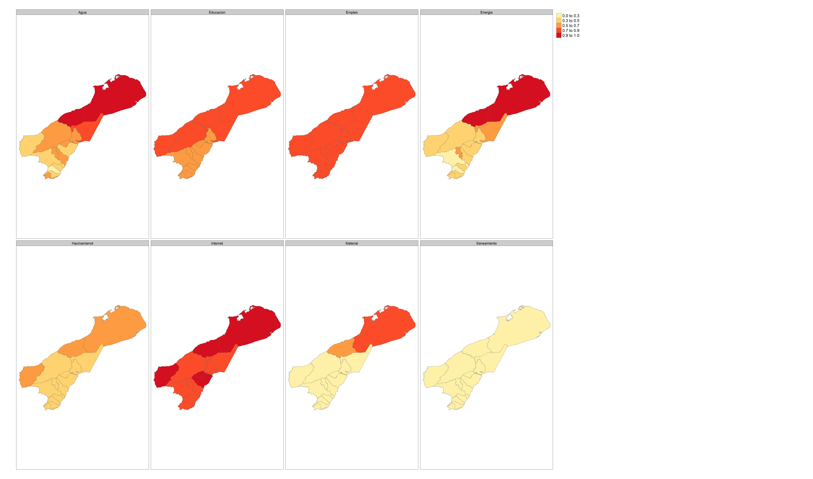

# Día 3 - Sesión 4- Estimación del Índice de Privación Multidimensional (IPM)


-   La pobreza es, y ha sido, uno de los temas principales en las agendas nacionales e internacionales de los países durante décadas. Un ejemplo reciente es el primer objetivo de la agenda **2030** para el Desarrollo Sostenible (ODS): __“Poner fin a la pobreza en todas sus formas en todo el mundo”__, así como su indicador 1.2.2 que mide __“la proporción de hombres, mujeres y niños de todas las edades que viven en pobreza en todas sus dimensiones según las definiciones nacionales”__

-   Tradicionalmente los organismos nacionales e internacionales exigen la medida de pobreza unidimensional basada en ingresos y/o gastos. 

-   La pobreza es un fenómeno complejo que debe ser analizado considerando un conjunto de factores y no solo el monetario. 

-   En está ocasión se aborda el problema multidimensional de la pobreza utilizando métodos de áreas pequeñas proporcionando una estimación del índice de privación multidimensional (IPM) en Colombia. 

## Índice de Privación Multidimensional (IPM)

-   El IPM propuesto por CEPAL es una herramienta comparable entre los países de la región, para estudiar los fenómenos de la pobreza considerando varios aspectos o dimensiones. **En ningún caso el IPM busca reemplazar los indicadores pobreza unidimensional o multidimensional que hayan definido los países u organismos internacionales**

-  A continuación se describen las dimensiones que conforma el IPM.  

    {width="15cm" height="10cm"}

-   El índice requiere la información para cada individuo $i = 1,\cdots,N_d$ en $d = 1, \cdots, D$ dominios, donde $N_d$ denota el tamaño de la población del dominio $d$. El índice para el dominio $d$ se calcula como:

    $$
    IPM_d = \frac{1}{N_d}\sum_{i=1}^{N_d}I\left(q_{di} > 0.4  \right).
    $$
    
    La función del índicador  $I\left( \cdot \right)$ es igual a 1 cuando la condición $q_{di} > 0.4$. 

-   $q_{di}$ es una cantidad ponderada de la siguiente forma: 

    $$
    q_{di} = 0.1\sum_{k=1}^{6}y_{di}^{k} +  0.2(y_{di}^{7} + y_{di}^{8})
    $$

    Donde: 
    a. $y_{di}^{1}$ = Privación en material de construcción de la vivienda
    
    b. $y_{di}^{2}$ = Hacinamiento en el hogar. 
    
    c. $y_{di}^{3}$ = Privación de acceso al agua potable. 
    
    d. $y_{di}^{4}$ = Privación en saneamiento.
    
    e. $y_{di}^{5}$ = Acceso al servicio energía eléctrica. 
    
    f. $y_{di}^{6}$ = Acceso al servicio de internet.
    
    g. $y_{di}^{7}$ = Privación de la educación. 
    
    h. $y_{di}^{8}$ = Privación del empleo y la protección social.  

    Note que, la primera parte de la suma considera los indicadores de las dimensiones de vivienda, agua y saneamiento, energía y conectividad. La segunda parte, los indicadores de las dimensiones de educación y empleo y protección social. Además, $y_{di}^{k}$ es igual a **1** si la persona tiene privación en la $k-ésima$ dimesión y **0** en el caso que de no tener la privación. 
    
    
## Definición del modelo 

En muchas aplicaciones, la variable de interés en áreas pequeñas puede ser binaria, esto es $y_{dj} = 0$ o $1$ que representa la ausencia (o no) de una característica específica. Para este caso, la estimación objetivo en cada dominio $d = 1,\cdots , D$ es la proporción $\theta_d =\frac{1}{N_d}\sum_{i=1}^{N_d}y_{di}$ de la población que tiene esta característica, siendo $\theta_{di}$ la probabilidad de que una determinada unidad $i$ en el dominio $d$ obtenga el valor $1$. Bajo este escenario, el $\theta_{di}$ con una función de enlace logit se define como: 

$$
logit(\theta_{di}) = \log \left(\frac{\theta_{di}}{1-\theta_{di}}\right) = \boldsymbol{x}_{di}^{T}\boldsymbol{\beta} + u_{d}
$$
con $i=1,\cdots,N_d$, $d=1,\cdots,D$, $\boldsymbol{\beta}$  un vector de parámetros de efecto fijo, y $u_d$ el efecto aleatorio especifico del área para el dominio $d$ con $u_d \sim N\left(0,\sigma^2_u \right)$.  $u_d$ son independiente y $y_{di}\mid u_d \sim Bernoulli(\theta_{di})$ con $E(y_{di}\mid u_d)=\theta_{di}$ y $Var(y_{di}\mid u_d)=\sigma_{di}^2=\theta_{di}(1-\theta_{di})$. Además,  $\boldsymbol{x}_{di}^T$ representa el vector $p\times 1$ de valores de $p$ variables auxiliares. Entonces, $\theta_{di}$ se puede escribir como 

$$
\theta_{di} = \frac{\exp(\boldsymbol{x}_{di}^T\boldsymbol{\beta} + u_{d})}{1+ \exp(\boldsymbol{x}_{di}^T\boldsymbol{\beta} + u_{d})}
$$
De está forma podemos definir distribuciones previas 

$$
\begin{eqnarray*}
\beta_k & \sim   & N(0, 10000)\\
\sigma^2_u &\sim & IG(0.0001,0.0001)
\end{eqnarray*}
$$
El modelo se debe estimar para cada una de las dimensiones. 
  
  
### Procesamiento del modelo en `R`. 
El proceso inicia con el cargue de las librerías. 


```r
library(patchwork)
library(lme4)
library(tidyverse)
library(rstan)
library(rstanarm)
library(magrittr)
```

Los datos de la encuesta y el censo han sido preparados previamente, la información sobre la cual realizaremos la predicción corresponde a Colombia en el 2019 


```r
encuesta_ipm <- readRDS("Recursos/Día3/Sesion4/Data/encuesta_COL.rds") 
statelevel_predictors_df <-
  readRDS("Recursos/Día3/Sesion4/Data/statelevel_predictors_df_dam2.rds") %>% 
  rename(depto = dam, mpio = dam2)

byAgrega <- c("depto", "mpio", "area", "sexo", "etnia", 
              "anoest", "edad", "condact3" )
```

Agregando la información para los municipios de la  Guajira-Colomabia para los indicadores que conformarán el IPM


```r
names_ipm <- grep(pattern = "ipm", names(encuesta_ipm),value = TRUE)

encuesta_df <- map(setNames(names_ipm,names_ipm),
    function(y){
  encuesta_ipm$temp <- encuesta_ipm[[y]]
  encuesta_ipm %>% 
  group_by_at(all_of(byAgrega)) %>%
  summarise(n = n(),
            yno = sum(temp),
            ysi = n - yno, .groups = "drop") %>% 
    inner_join(statelevel_predictors_df,
                              by = c("depto","mpio"))
})
```

#### Privación en material de construcción de la vivienda {-} 

<table class="table table-striped lightable-classic" style="width: auto !important; margin-left: auto; margin-right: auto; font-family: Arial Narrow; width: auto !important; margin-left: auto; margin-right: auto;">
<caption>(\#tab:unnamed-chunk-4)ipm_Material</caption>
 <thead>
  <tr>
   <th style="text-align:left;"> depto </th>
   <th style="text-align:left;"> mpio </th>
   <th style="text-align:left;"> area </th>
   <th style="text-align:left;"> sexo </th>
   <th style="text-align:left;"> etnia </th>
   <th style="text-align:left;"> anoest </th>
   <th style="text-align:left;"> edad </th>
   <th style="text-align:right;"> condact3 </th>
   <th style="text-align:right;"> n </th>
   <th style="text-align:right;"> yno </th>
   <th style="text-align:right;"> ysi </th>
   <th style="text-align:right;"> area1 </th>
   <th style="text-align:right;"> sexo2 </th>
   <th style="text-align:right;"> edad2 </th>
   <th style="text-align:right;"> edad3 </th>
   <th style="text-align:right;"> edad4 </th>
   <th style="text-align:right;"> edad5 </th>
   <th style="text-align:right;"> etnia2 </th>
   <th style="text-align:right;"> anoest2 </th>
   <th style="text-align:right;"> anoest3 </th>
   <th style="text-align:right;"> anoest4 </th>
   <th style="text-align:right;"> etnia1 </th>
   <th style="text-align:right;"> tiene_acueducto </th>
   <th style="text-align:right;"> piso_tierra </th>
   <th style="text-align:right;"> alfabeta </th>
   <th style="text-align:right;"> hacinamiento </th>
   <th style="text-align:right;"> tasa_desocupacion </th>
   <th style="text-align:right;"> luces_nocturnas </th>
   <th style="text-align:right;"> cubrimiento_cultivo </th>
   <th style="text-align:right;"> cubrimiento_urbano </th>
   <th style="text-align:right;"> modificacion_humana </th>
   <th style="text-align:right;"> accesibilidad_hospitales </th>
   <th style="text-align:right;"> accesibilidad_hosp_caminado </th>
  </tr>
 </thead>
<tbody>
  <tr>
   <td style="text-align:left;"> 11 </td>
   <td style="text-align:left;"> 11001 </td>
   <td style="text-align:left;"> 1 </td>
   <td style="text-align:left;"> 1 </td>
   <td style="text-align:left;"> 3 </td>
   <td style="text-align:left;"> 3 </td>
   <td style="text-align:left;"> 2 </td>
   <td style="text-align:right;"> 1 </td>
   <td style="text-align:right;"> 1434 </td>
   <td style="text-align:right;"> 5 </td>
   <td style="text-align:right;"> 1429 </td>
   <td style="text-align:right;"> 0.9979 </td>
   <td style="text-align:right;"> 0.5219 </td>
   <td style="text-align:right;"> 0.2690 </td>
   <td style="text-align:right;"> 0.2316 </td>
   <td style="text-align:right;"> 0.2251 </td>
   <td style="text-align:right;"> 0.0886 </td>
   <td style="text-align:right;"> 0.0093 </td>
   <td style="text-align:right;"> 0.2098 </td>
   <td style="text-align:right;"> 0.3810 </td>
   <td style="text-align:right;"> 0.2938 </td>
   <td style="text-align:right;"> 0.0027 </td>
   <td style="text-align:right;"> 0.0219 </td>
   <td style="text-align:right;"> 0.0026 </td>
   <td style="text-align:right;"> 0.0143 </td>
   <td style="text-align:right;"> 0.0848 </td>
   <td style="text-align:right;"> 0.0176 </td>
   <td style="text-align:right;"> 22.0069 </td>
   <td style="text-align:right;"> 9.1869 </td>
   <td style="text-align:right;"> 19.7751 </td>
   <td style="text-align:right;"> 0.5697 </td>
   <td style="text-align:right;"> 61.3823 </td>
   <td style="text-align:right;"> 259.2423 </td>
  </tr>
  <tr>
   <td style="text-align:left;"> 47 </td>
   <td style="text-align:left;"> 47001 </td>
   <td style="text-align:left;"> 1 </td>
   <td style="text-align:left;"> 1 </td>
   <td style="text-align:left;"> 3 </td>
   <td style="text-align:left;"> 3 </td>
   <td style="text-align:left;"> 3 </td>
   <td style="text-align:right;"> 1 </td>
   <td style="text-align:right;"> 1432 </td>
   <td style="text-align:right;"> 17 </td>
   <td style="text-align:right;"> 1415 </td>
   <td style="text-align:right;"> 0.9150 </td>
   <td style="text-align:right;"> 0.5158 </td>
   <td style="text-align:right;"> 0.2705 </td>
   <td style="text-align:right;"> 0.2125 </td>
   <td style="text-align:right;"> 0.1913 </td>
   <td style="text-align:right;"> 0.0719 </td>
   <td style="text-align:right;"> 0.0354 </td>
   <td style="text-align:right;"> 0.2539 </td>
   <td style="text-align:right;"> 0.4149 </td>
   <td style="text-align:right;"> 0.1837 </td>
   <td style="text-align:right;"> 0.0169 </td>
   <td style="text-align:right;"> 0.3002 </td>
   <td style="text-align:right;"> 0.0312 </td>
   <td style="text-align:right;"> 0.0364 </td>
   <td style="text-align:right;"> 0.2845 </td>
   <td style="text-align:right;"> 0.0015 </td>
   <td style="text-align:right;"> 4.3364 </td>
   <td style="text-align:right;"> 0.4577 </td>
   <td style="text-align:right;"> 1.7512 </td>
   <td style="text-align:right;"> 0.3278 </td>
   <td style="text-align:right;"> 210.3355 </td>
   <td style="text-align:right;"> 611.8750 </td>
  </tr>
  <tr>
   <td style="text-align:left;"> 11 </td>
   <td style="text-align:left;"> 11001 </td>
   <td style="text-align:left;"> 1 </td>
   <td style="text-align:left;"> 2 </td>
   <td style="text-align:left;"> 3 </td>
   <td style="text-align:left;"> 4 </td>
   <td style="text-align:left;"> 3 </td>
   <td style="text-align:right;"> 1 </td>
   <td style="text-align:right;"> 1387 </td>
   <td style="text-align:right;"> 2 </td>
   <td style="text-align:right;"> 1385 </td>
   <td style="text-align:right;"> 0.9979 </td>
   <td style="text-align:right;"> 0.5219 </td>
   <td style="text-align:right;"> 0.2690 </td>
   <td style="text-align:right;"> 0.2316 </td>
   <td style="text-align:right;"> 0.2251 </td>
   <td style="text-align:right;"> 0.0886 </td>
   <td style="text-align:right;"> 0.0093 </td>
   <td style="text-align:right;"> 0.2098 </td>
   <td style="text-align:right;"> 0.3810 </td>
   <td style="text-align:right;"> 0.2938 </td>
   <td style="text-align:right;"> 0.0027 </td>
   <td style="text-align:right;"> 0.0219 </td>
   <td style="text-align:right;"> 0.0026 </td>
   <td style="text-align:right;"> 0.0143 </td>
   <td style="text-align:right;"> 0.0848 </td>
   <td style="text-align:right;"> 0.0176 </td>
   <td style="text-align:right;"> 22.0069 </td>
   <td style="text-align:right;"> 9.1869 </td>
   <td style="text-align:right;"> 19.7751 </td>
   <td style="text-align:right;"> 0.5697 </td>
   <td style="text-align:right;"> 61.3823 </td>
   <td style="text-align:right;"> 259.2423 </td>
  </tr>
  <tr>
   <td style="text-align:left;"> 11 </td>
   <td style="text-align:left;"> 11001 </td>
   <td style="text-align:left;"> 1 </td>
   <td style="text-align:left;"> 1 </td>
   <td style="text-align:left;"> 3 </td>
   <td style="text-align:left;"> 3 </td>
   <td style="text-align:left;"> 3 </td>
   <td style="text-align:right;"> 1 </td>
   <td style="text-align:right;"> 1326 </td>
   <td style="text-align:right;"> 7 </td>
   <td style="text-align:right;"> 1319 </td>
   <td style="text-align:right;"> 0.9979 </td>
   <td style="text-align:right;"> 0.5219 </td>
   <td style="text-align:right;"> 0.2690 </td>
   <td style="text-align:right;"> 0.2316 </td>
   <td style="text-align:right;"> 0.2251 </td>
   <td style="text-align:right;"> 0.0886 </td>
   <td style="text-align:right;"> 0.0093 </td>
   <td style="text-align:right;"> 0.2098 </td>
   <td style="text-align:right;"> 0.3810 </td>
   <td style="text-align:right;"> 0.2938 </td>
   <td style="text-align:right;"> 0.0027 </td>
   <td style="text-align:right;"> 0.0219 </td>
   <td style="text-align:right;"> 0.0026 </td>
   <td style="text-align:right;"> 0.0143 </td>
   <td style="text-align:right;"> 0.0848 </td>
   <td style="text-align:right;"> 0.0176 </td>
   <td style="text-align:right;"> 22.0069 </td>
   <td style="text-align:right;"> 9.1869 </td>
   <td style="text-align:right;"> 19.7751 </td>
   <td style="text-align:right;"> 0.5697 </td>
   <td style="text-align:right;"> 61.3823 </td>
   <td style="text-align:right;"> 259.2423 </td>
  </tr>
  <tr>
   <td style="text-align:left;"> 08 </td>
   <td style="text-align:left;"> 08001 </td>
   <td style="text-align:left;"> 1 </td>
   <td style="text-align:left;"> 1 </td>
   <td style="text-align:left;"> 3 </td>
   <td style="text-align:left;"> 3 </td>
   <td style="text-align:left;"> 3 </td>
   <td style="text-align:right;"> 1 </td>
   <td style="text-align:right;"> 1280 </td>
   <td style="text-align:right;"> 7 </td>
   <td style="text-align:right;"> 1273 </td>
   <td style="text-align:right;"> 0.9993 </td>
   <td style="text-align:right;"> 0.5208 </td>
   <td style="text-align:right;"> 0.2558 </td>
   <td style="text-align:right;"> 0.2131 </td>
   <td style="text-align:right;"> 0.2146 </td>
   <td style="text-align:right;"> 0.0968 </td>
   <td style="text-align:right;"> 0.0521 </td>
   <td style="text-align:right;"> 0.2324 </td>
   <td style="text-align:right;"> 0.3976 </td>
   <td style="text-align:right;"> 0.2411 </td>
   <td style="text-align:right;"> 0.0012 </td>
   <td style="text-align:right;"> 0.0188 </td>
   <td style="text-align:right;"> 0.0139 </td>
   <td style="text-align:right;"> 0.0232 </td>
   <td style="text-align:right;"> 0.2084 </td>
   <td style="text-align:right;"> 0.0029 </td>
   <td style="text-align:right;"> 58.0251 </td>
   <td style="text-align:right;"> 3.8798 </td>
   <td style="text-align:right;"> 50.9581 </td>
   <td style="text-align:right;"> 0.8114 </td>
   <td style="text-align:right;"> 3.2552 </td>
   <td style="text-align:right;"> 21.7908 </td>
  </tr>
  <tr>
   <td style="text-align:left;"> 23 </td>
   <td style="text-align:left;"> 23001 </td>
   <td style="text-align:left;"> 1 </td>
   <td style="text-align:left;"> 1 </td>
   <td style="text-align:left;"> 3 </td>
   <td style="text-align:left;"> 3 </td>
   <td style="text-align:left;"> 3 </td>
   <td style="text-align:right;"> 1 </td>
   <td style="text-align:right;"> 1236 </td>
   <td style="text-align:right;"> 83 </td>
   <td style="text-align:right;"> 1153 </td>
   <td style="text-align:right;"> 0.8192 </td>
   <td style="text-align:right;"> 0.5149 </td>
   <td style="text-align:right;"> 0.2631 </td>
   <td style="text-align:right;"> 0.2146 </td>
   <td style="text-align:right;"> 0.1961 </td>
   <td style="text-align:right;"> 0.0761 </td>
   <td style="text-align:right;"> 0.0170 </td>
   <td style="text-align:right;"> 0.2857 </td>
   <td style="text-align:right;"> 0.3634 </td>
   <td style="text-align:right;"> 0.1920 </td>
   <td style="text-align:right;"> 0.0072 </td>
   <td style="text-align:right;"> 0.1251 </td>
   <td style="text-align:right;"> 0.1412 </td>
   <td style="text-align:right;"> 0.0657 </td>
   <td style="text-align:right;"> 0.2275 </td>
   <td style="text-align:right;"> 0.0010 </td>
   <td style="text-align:right;"> 3.8284 </td>
   <td style="text-align:right;"> 19.0431 </td>
   <td style="text-align:right;"> 1.0209 </td>
   <td style="text-align:right;"> 0.4172 </td>
   <td style="text-align:right;"> 48.4391 </td>
   <td style="text-align:right;"> 234.8668 </td>
  </tr>
</tbody>
</table>

#### Hacinamiento {-}

<table class="table table-striped lightable-classic" style="width: auto !important; margin-left: auto; margin-right: auto; font-family: Arial Narrow; width: auto !important; margin-left: auto; margin-right: auto;">
 <thead>
  <tr>
   <th style="text-align:left;"> depto </th>
   <th style="text-align:left;"> mpio </th>
   <th style="text-align:left;"> area </th>
   <th style="text-align:left;"> sexo </th>
   <th style="text-align:left;"> etnia </th>
   <th style="text-align:left;"> anoest </th>
   <th style="text-align:left;"> edad </th>
   <th style="text-align:right;"> condact3 </th>
   <th style="text-align:right;"> n </th>
   <th style="text-align:right;"> yno </th>
   <th style="text-align:right;"> ysi </th>
   <th style="text-align:right;"> area1 </th>
   <th style="text-align:right;"> sexo2 </th>
   <th style="text-align:right;"> edad2 </th>
   <th style="text-align:right;"> edad3 </th>
   <th style="text-align:right;"> edad4 </th>
   <th style="text-align:right;"> edad5 </th>
   <th style="text-align:right;"> etnia2 </th>
   <th style="text-align:right;"> anoest2 </th>
   <th style="text-align:right;"> anoest3 </th>
   <th style="text-align:right;"> anoest4 </th>
   <th style="text-align:right;"> etnia1 </th>
   <th style="text-align:right;"> tiene_acueducto </th>
   <th style="text-align:right;"> piso_tierra </th>
   <th style="text-align:right;"> alfabeta </th>
   <th style="text-align:right;"> hacinamiento </th>
   <th style="text-align:right;"> tasa_desocupacion </th>
   <th style="text-align:right;"> luces_nocturnas </th>
   <th style="text-align:right;"> cubrimiento_cultivo </th>
   <th style="text-align:right;"> cubrimiento_urbano </th>
   <th style="text-align:right;"> modificacion_humana </th>
   <th style="text-align:right;"> accesibilidad_hospitales </th>
   <th style="text-align:right;"> accesibilidad_hosp_caminado </th>
  </tr>
 </thead>
<tbody>
  <tr>
   <td style="text-align:left;"> 11 </td>
   <td style="text-align:left;"> 11001 </td>
   <td style="text-align:left;"> 1 </td>
   <td style="text-align:left;"> 1 </td>
   <td style="text-align:left;"> 3 </td>
   <td style="text-align:left;"> 3 </td>
   <td style="text-align:left;"> 2 </td>
   <td style="text-align:right;"> 1 </td>
   <td style="text-align:right;"> 1434 </td>
   <td style="text-align:right;"> 342 </td>
   <td style="text-align:right;"> 1092 </td>
   <td style="text-align:right;"> 0.9979 </td>
   <td style="text-align:right;"> 0.5219 </td>
   <td style="text-align:right;"> 0.2690 </td>
   <td style="text-align:right;"> 0.2316 </td>
   <td style="text-align:right;"> 0.2251 </td>
   <td style="text-align:right;"> 0.0886 </td>
   <td style="text-align:right;"> 0.0093 </td>
   <td style="text-align:right;"> 0.2098 </td>
   <td style="text-align:right;"> 0.3810 </td>
   <td style="text-align:right;"> 0.2938 </td>
   <td style="text-align:right;"> 0.0027 </td>
   <td style="text-align:right;"> 0.0219 </td>
   <td style="text-align:right;"> 0.0026 </td>
   <td style="text-align:right;"> 0.0143 </td>
   <td style="text-align:right;"> 0.0848 </td>
   <td style="text-align:right;"> 0.0176 </td>
   <td style="text-align:right;"> 22.0069 </td>
   <td style="text-align:right;"> 9.1869 </td>
   <td style="text-align:right;"> 19.7751 </td>
   <td style="text-align:right;"> 0.5697 </td>
   <td style="text-align:right;"> 61.3823 </td>
   <td style="text-align:right;"> 259.2423 </td>
  </tr>
  <tr>
   <td style="text-align:left;"> 47 </td>
   <td style="text-align:left;"> 47001 </td>
   <td style="text-align:left;"> 1 </td>
   <td style="text-align:left;"> 1 </td>
   <td style="text-align:left;"> 3 </td>
   <td style="text-align:left;"> 3 </td>
   <td style="text-align:left;"> 3 </td>
   <td style="text-align:right;"> 1 </td>
   <td style="text-align:right;"> 1432 </td>
   <td style="text-align:right;"> 657 </td>
   <td style="text-align:right;"> 775 </td>
   <td style="text-align:right;"> 0.9150 </td>
   <td style="text-align:right;"> 0.5158 </td>
   <td style="text-align:right;"> 0.2705 </td>
   <td style="text-align:right;"> 0.2125 </td>
   <td style="text-align:right;"> 0.1913 </td>
   <td style="text-align:right;"> 0.0719 </td>
   <td style="text-align:right;"> 0.0354 </td>
   <td style="text-align:right;"> 0.2539 </td>
   <td style="text-align:right;"> 0.4149 </td>
   <td style="text-align:right;"> 0.1837 </td>
   <td style="text-align:right;"> 0.0169 </td>
   <td style="text-align:right;"> 0.3002 </td>
   <td style="text-align:right;"> 0.0312 </td>
   <td style="text-align:right;"> 0.0364 </td>
   <td style="text-align:right;"> 0.2845 </td>
   <td style="text-align:right;"> 0.0015 </td>
   <td style="text-align:right;"> 4.3364 </td>
   <td style="text-align:right;"> 0.4577 </td>
   <td style="text-align:right;"> 1.7512 </td>
   <td style="text-align:right;"> 0.3278 </td>
   <td style="text-align:right;"> 210.3355 </td>
   <td style="text-align:right;"> 611.8750 </td>
  </tr>
  <tr>
   <td style="text-align:left;"> 11 </td>
   <td style="text-align:left;"> 11001 </td>
   <td style="text-align:left;"> 1 </td>
   <td style="text-align:left;"> 2 </td>
   <td style="text-align:left;"> 3 </td>
   <td style="text-align:left;"> 4 </td>
   <td style="text-align:left;"> 3 </td>
   <td style="text-align:right;"> 1 </td>
   <td style="text-align:right;"> 1387 </td>
   <td style="text-align:right;"> 118 </td>
   <td style="text-align:right;"> 1269 </td>
   <td style="text-align:right;"> 0.9979 </td>
   <td style="text-align:right;"> 0.5219 </td>
   <td style="text-align:right;"> 0.2690 </td>
   <td style="text-align:right;"> 0.2316 </td>
   <td style="text-align:right;"> 0.2251 </td>
   <td style="text-align:right;"> 0.0886 </td>
   <td style="text-align:right;"> 0.0093 </td>
   <td style="text-align:right;"> 0.2098 </td>
   <td style="text-align:right;"> 0.3810 </td>
   <td style="text-align:right;"> 0.2938 </td>
   <td style="text-align:right;"> 0.0027 </td>
   <td style="text-align:right;"> 0.0219 </td>
   <td style="text-align:right;"> 0.0026 </td>
   <td style="text-align:right;"> 0.0143 </td>
   <td style="text-align:right;"> 0.0848 </td>
   <td style="text-align:right;"> 0.0176 </td>
   <td style="text-align:right;"> 22.0069 </td>
   <td style="text-align:right;"> 9.1869 </td>
   <td style="text-align:right;"> 19.7751 </td>
   <td style="text-align:right;"> 0.5697 </td>
   <td style="text-align:right;"> 61.3823 </td>
   <td style="text-align:right;"> 259.2423 </td>
  </tr>
  <tr>
   <td style="text-align:left;"> 11 </td>
   <td style="text-align:left;"> 11001 </td>
   <td style="text-align:left;"> 1 </td>
   <td style="text-align:left;"> 1 </td>
   <td style="text-align:left;"> 3 </td>
   <td style="text-align:left;"> 3 </td>
   <td style="text-align:left;"> 3 </td>
   <td style="text-align:right;"> 1 </td>
   <td style="text-align:right;"> 1326 </td>
   <td style="text-align:right;"> 251 </td>
   <td style="text-align:right;"> 1075 </td>
   <td style="text-align:right;"> 0.9979 </td>
   <td style="text-align:right;"> 0.5219 </td>
   <td style="text-align:right;"> 0.2690 </td>
   <td style="text-align:right;"> 0.2316 </td>
   <td style="text-align:right;"> 0.2251 </td>
   <td style="text-align:right;"> 0.0886 </td>
   <td style="text-align:right;"> 0.0093 </td>
   <td style="text-align:right;"> 0.2098 </td>
   <td style="text-align:right;"> 0.3810 </td>
   <td style="text-align:right;"> 0.2938 </td>
   <td style="text-align:right;"> 0.0027 </td>
   <td style="text-align:right;"> 0.0219 </td>
   <td style="text-align:right;"> 0.0026 </td>
   <td style="text-align:right;"> 0.0143 </td>
   <td style="text-align:right;"> 0.0848 </td>
   <td style="text-align:right;"> 0.0176 </td>
   <td style="text-align:right;"> 22.0069 </td>
   <td style="text-align:right;"> 9.1869 </td>
   <td style="text-align:right;"> 19.7751 </td>
   <td style="text-align:right;"> 0.5697 </td>
   <td style="text-align:right;"> 61.3823 </td>
   <td style="text-align:right;"> 259.2423 </td>
  </tr>
  <tr>
   <td style="text-align:left;"> 08 </td>
   <td style="text-align:left;"> 08001 </td>
   <td style="text-align:left;"> 1 </td>
   <td style="text-align:left;"> 1 </td>
   <td style="text-align:left;"> 3 </td>
   <td style="text-align:left;"> 3 </td>
   <td style="text-align:left;"> 3 </td>
   <td style="text-align:right;"> 1 </td>
   <td style="text-align:right;"> 1280 </td>
   <td style="text-align:right;"> 583 </td>
   <td style="text-align:right;"> 697 </td>
   <td style="text-align:right;"> 0.9993 </td>
   <td style="text-align:right;"> 0.5208 </td>
   <td style="text-align:right;"> 0.2558 </td>
   <td style="text-align:right;"> 0.2131 </td>
   <td style="text-align:right;"> 0.2146 </td>
   <td style="text-align:right;"> 0.0968 </td>
   <td style="text-align:right;"> 0.0521 </td>
   <td style="text-align:right;"> 0.2324 </td>
   <td style="text-align:right;"> 0.3976 </td>
   <td style="text-align:right;"> 0.2411 </td>
   <td style="text-align:right;"> 0.0012 </td>
   <td style="text-align:right;"> 0.0188 </td>
   <td style="text-align:right;"> 0.0139 </td>
   <td style="text-align:right;"> 0.0232 </td>
   <td style="text-align:right;"> 0.2084 </td>
   <td style="text-align:right;"> 0.0029 </td>
   <td style="text-align:right;"> 58.0251 </td>
   <td style="text-align:right;"> 3.8798 </td>
   <td style="text-align:right;"> 50.9581 </td>
   <td style="text-align:right;"> 0.8114 </td>
   <td style="text-align:right;"> 3.2552 </td>
   <td style="text-align:right;"> 21.7908 </td>
  </tr>
  <tr>
   <td style="text-align:left;"> 23 </td>
   <td style="text-align:left;"> 23001 </td>
   <td style="text-align:left;"> 1 </td>
   <td style="text-align:left;"> 1 </td>
   <td style="text-align:left;"> 3 </td>
   <td style="text-align:left;"> 3 </td>
   <td style="text-align:left;"> 3 </td>
   <td style="text-align:right;"> 1 </td>
   <td style="text-align:right;"> 1236 </td>
   <td style="text-align:right;"> 503 </td>
   <td style="text-align:right;"> 733 </td>
   <td style="text-align:right;"> 0.8192 </td>
   <td style="text-align:right;"> 0.5149 </td>
   <td style="text-align:right;"> 0.2631 </td>
   <td style="text-align:right;"> 0.2146 </td>
   <td style="text-align:right;"> 0.1961 </td>
   <td style="text-align:right;"> 0.0761 </td>
   <td style="text-align:right;"> 0.0170 </td>
   <td style="text-align:right;"> 0.2857 </td>
   <td style="text-align:right;"> 0.3634 </td>
   <td style="text-align:right;"> 0.1920 </td>
   <td style="text-align:right;"> 0.0072 </td>
   <td style="text-align:right;"> 0.1251 </td>
   <td style="text-align:right;"> 0.1412 </td>
   <td style="text-align:right;"> 0.0657 </td>
   <td style="text-align:right;"> 0.2275 </td>
   <td style="text-align:right;"> 0.0010 </td>
   <td style="text-align:right;"> 3.8284 </td>
   <td style="text-align:right;"> 19.0431 </td>
   <td style="text-align:right;"> 1.0209 </td>
   <td style="text-align:right;"> 0.4172 </td>
   <td style="text-align:right;"> 48.4391 </td>
   <td style="text-align:right;"> 234.8668 </td>
  </tr>
</tbody>
</table>

### Definiendo el modelo multinivel.

Para cada dimensión que compone el IPM se ajusta el siguiente modelo mostrado en el script. En este código se incluye el uso de la función `future_map` que permite procesar en paralelo cada modelo O puede compilar cada por separado.   


```r
library(furrr)
plan(multisession, workers = 4)

fit <- future_map(encuesta_df, function(xdat){
stan_glmer(
  cbind(yno, ysi) ~ (1 | mpio) +
    (1 | depto) +
    edad +
    area +
    anoest +
    etnia +
    sexo + 
    tasa_desocupacion ,
  family = binomial(link = "logit"),
  data = xdat,
  cores = 7,
  chains = 4,
  iter = 300
)}, 
.progress = TRUE)

saveRDS(object = fit, "Recursos/Día3/Sesion4/Data/fits_IPM.rds")
```

Terminado la compilación de los modelos después de realizar validaciones sobre esto, pasamos hacer las predicciones en el censo. 

### Proceso de estimación y predicción

Los modelos fueron compilados de manera separada, por tanto, disponemos de un objeto `.rds` por cada dimensión del IPM 


```r
fit_agua <-
  readRDS(file = "Recursos/Día3/Sesion4/Data/fit_bayes_agua.rds")
fit_educacion <-
  readRDS(file = "Recursos/Día3/Sesion4/Data/fit_bayes_educacion.rds")
fit_empleo <-
  readRDS(file = "Recursos/Día3/Sesion4/Data/fit_bayes_empleo.rds")
fit_energia <-
  readRDS(file = "Recursos/Día3/Sesion4/Data/fit_bayes_Energia.rds")
fit_hacinamiento <-
  readRDS(file = "Recursos/Día3/Sesion4/Data/fit_bayes_Hacinamiento.rds")
fit_internet <-
  readRDS(file = "Recursos/Día3/Sesion4/Data/fit_bayes_internet.rds")
fit_material <-
  readRDS(file = "Recursos/Día3/Sesion4/Data/fit_bayes_material.rds")
fit_saneamiento <-
  readRDS(file = "Recursos/Día3/Sesion4/Data/fit_bayes_saneamiento.rds")
```

Ahora, debemos leer la información del censo  y crear los **post-estrato **

```r
censo_ipm <- readRDS("Recursos/Día3/Sesion4/Data/censo_COL.rds") 

poststrat_df <- censo_ipm %>%
  filter(!is.na(condact3))  %>%
  group_by_at(byAgrega) %>%
  summarise(n = sum(n), .groups = "drop") %>% 
  arrange(desc(n))
tba(head(poststrat_df))
```

<table class="table table-striped lightable-classic" style="width: auto !important; margin-left: auto; margin-right: auto; font-family: Arial Narrow; width: auto !important; margin-left: auto; margin-right: auto;">
 <thead>
  <tr>
   <th style="text-align:left;"> depto </th>
   <th style="text-align:left;"> mpio </th>
   <th style="text-align:left;"> area </th>
   <th style="text-align:left;"> sexo </th>
   <th style="text-align:left;"> etnia </th>
   <th style="text-align:left;"> anoest </th>
   <th style="text-align:left;"> edad </th>
   <th style="text-align:left;"> condact3 </th>
   <th style="text-align:right;"> n </th>
  </tr>
 </thead>
<tbody>
  <tr>
   <td style="text-align:left;"> 11 </td>
   <td style="text-align:left;"> 11001 </td>
   <td style="text-align:left;"> 1 </td>
   <td style="text-align:left;"> 2 </td>
   <td style="text-align:left;"> 3 </td>
   <td style="text-align:left;"> 4 </td>
   <td style="text-align:left;"> 3 </td>
   <td style="text-align:left;"> 1 </td>
   <td style="text-align:right;"> 339250 </td>
  </tr>
  <tr>
   <td style="text-align:left;"> 11 </td>
   <td style="text-align:left;"> 11001 </td>
   <td style="text-align:left;"> 1 </td>
   <td style="text-align:left;"> 1 </td>
   <td style="text-align:left;"> 3 </td>
   <td style="text-align:left;"> 4 </td>
   <td style="text-align:left;"> 3 </td>
   <td style="text-align:left;"> 1 </td>
   <td style="text-align:right;"> 302053 </td>
  </tr>
  <tr>
   <td style="text-align:left;"> 11 </td>
   <td style="text-align:left;"> 11001 </td>
   <td style="text-align:left;"> 1 </td>
   <td style="text-align:left;"> 1 </td>
   <td style="text-align:left;"> 3 </td>
   <td style="text-align:left;"> 3 </td>
   <td style="text-align:left;"> 3 </td>
   <td style="text-align:left;"> 1 </td>
   <td style="text-align:right;"> 295904 </td>
  </tr>
  <tr>
   <td style="text-align:left;"> 11 </td>
   <td style="text-align:left;"> 11001 </td>
   <td style="text-align:left;"> 1 </td>
   <td style="text-align:left;"> 1 </td>
   <td style="text-align:left;"> 3 </td>
   <td style="text-align:left;"> 3 </td>
   <td style="text-align:left;"> 2 </td>
   <td style="text-align:left;"> 1 </td>
   <td style="text-align:right;"> 285108 </td>
  </tr>
  <tr>
   <td style="text-align:left;"> 11 </td>
   <td style="text-align:left;"> 11001 </td>
   <td style="text-align:left;"> 1 </td>
   <td style="text-align:left;"> 2 </td>
   <td style="text-align:left;"> 3 </td>
   <td style="text-align:left;"> 3 </td>
   <td style="text-align:left;"> 2 </td>
   <td style="text-align:left;"> 3 </td>
   <td style="text-align:right;"> 257434 </td>
  </tr>
  <tr>
   <td style="text-align:left;"> 11 </td>
   <td style="text-align:left;"> 11001 </td>
   <td style="text-align:left;"> 1 </td>
   <td style="text-align:left;"> 2 </td>
   <td style="text-align:left;"> 3 </td>
   <td style="text-align:left;"> 4 </td>
   <td style="text-align:left;"> 2 </td>
   <td style="text-align:left;"> 1 </td>
   <td style="text-align:right;"> 238437 </td>
  </tr>
</tbody>
</table>

Para realizar la predicción en el censo debemos incluir la información auxiliar 


```r
poststrat_df <- left_join(poststrat_df, statelevel_predictors_df,
                          by = c("depto", "mpio"))
dim(poststrat_df)
```

```
## [1] 281077     31
```


Para cada uno de los modelos anteriores debe tener las predicciones, para ejemplificar el proceso tomaremos el departamento de la Guajira de Colombia 

-   Privación de acceso al agua potable. 

```r
temp <- poststrat_df 
epred_mat_agua <- posterior_epred(
  fit_agua,
  newdata = temp,
  type = "response",
  allow.new.levels = TRUE
)
```

-   Privación de la educación.


```r
epred_mat_educacion <-
  posterior_epred(
    fit_educacion,
    newdata = temp,
    type = "response",
    allow.new.levels = TRUE
  )
```

-   Privación del empleo y la protección social.


```r
epred_mat_empleo <-
  posterior_epred(
    fit_empleo,
    newdata = temp,
    type = "response",
    allow.new.levels = TRUE
  )
```

-   Acceso al servicio energía eléctrica.


```r
epred_mat_energia <-
  posterior_epred(
    fit_energia,
    newdata = temp,
    type = "response",
    allow.new.levels = TRUE
  )
```

-    Hacinamiento en el hogar.


```r
epred_mat_hacinamiento <-
  posterior_epred(
    fit_hacinamiento,
    newdata = temp,
    type = "response",
    allow.new.levels = TRUE
  )
```

-   Acceso al servicio de Internet.


```r
epred_mat_internet <-
  posterior_epred(
    fit_internet,
    newdata = temp,
    type = "response",
    allow.new.levels = TRUE
  )
```

-   Privación en material de construcción de la vivienda


```r
epred_mat_material <-
  posterior_epred(
    fit_material,
    newdata = temp,
    type = "response",
    allow.new.levels = TRUE
  )
```

-   Privación en saneamiento.


```r
epred_mat_saneamiento <-
  posterior_epred(
    fit_saneamiento,
    newdata = temp,
    type = "response",
    allow.new.levels = TRUE
  )
```


Los resultados anteriores se deben procesarse en términos de carencia (1) y  no carencia (0) para la $k-esima$ dimensión . 

-    Privación de acceso al agua potable. 


```r
epred_mat_agua_dummy <-
  rbinom(n = nrow(epred_mat_agua) * ncol(epred_mat_agua) , 1,
         epred_mat_agua)

epred_mat_agua_dummy <- matrix(
  epred_mat_agua_dummy,
  nrow = nrow(epred_mat_agua),
  ncol = ncol(epred_mat_agua)
)
```

-   Privación de la educación.


```r
epred_mat_educacion_dummy <-
  rbinom(n = nrow(epred_mat_educacion) * ncol(epred_mat_educacion) ,
         1,
         epred_mat_educacion)

epred_mat_educacion_dummy <- matrix(
  epred_mat_educacion_dummy,
  nrow = nrow(epred_mat_educacion),
  ncol = ncol(epred_mat_educacion)
)
```

-    Acceso al servicio energía eléctrica 


```r
epred_mat_energia_dummy <-
  rbinom(n = nrow(epred_mat_energia) * ncol(epred_mat_energia) ,
         1,
         epred_mat_energia)

epred_mat_energia_dummy <- matrix(
  epred_mat_energia_dummy,
  nrow = nrow(epred_mat_energia),
  ncol = ncol(epred_mat_energia)
)
```

-   Hacinamiento en el hogar.


```r
epred_mat_hacinamiento_dummy <-
  rbinom(
    n = nrow(epred_mat_hacinamiento) * ncol(epred_mat_hacinamiento) ,
    1,
    epred_mat_hacinamiento
  )

epred_mat_hacinamiento_dummy <-
  matrix(
    epred_mat_hacinamiento_dummy,
    nrow = nrow(epred_mat_hacinamiento),
    ncol = ncol(epred_mat_hacinamiento)
  )
```

-   Acceso al servicio de Internet.


```r
epred_mat_internet_dummy <-
  rbinom(n = nrow(epred_mat_internet) * ncol(epred_mat_internet) ,
         1,
         epred_mat_internet)

epred_mat_internet_dummy <- matrix(
  epred_mat_internet_dummy,
  nrow = nrow(epred_mat_internet),
  ncol = ncol(epred_mat_internet)
)
```

-   Privación en material de construcción de la vivienda 


```r
epred_mat_material_dummy <-
  rbinom(n = nrow(epred_mat_material) * ncol(epred_mat_material) ,
         1,
         epred_mat_material)

epred_mat_material_dummy <- matrix(
  epred_mat_material_dummy,
  nrow = nrow(epred_mat_material),
  ncol = ncol(epred_mat_material)
)
```

-   Privación en saneamiento. 


```r
epred_mat_saneamiento_dummy <-
  rbinom(n = nrow(epred_mat_saneamiento) * ncol(epred_mat_saneamiento) ,
         1,
         epred_mat_saneamiento)

epred_mat_saneamiento_dummy <- matrix(
  epred_mat_saneamiento_dummy,
  nrow = nrow(epred_mat_saneamiento),
  ncol = ncol(epred_mat_saneamiento)
)
```

-   Privación del empleo y la protección social. 


```r
epred_mat_empleo_dummy <-
  rbinom(n = nrow(epred_mat_empleo) * ncol(epred_mat_empleo) ,
         1,
         epred_mat_empleo)

epred_mat_empleo_dummy <- matrix(
  epred_mat_empleo_dummy,
  nrow = nrow(epred_mat_empleo),
  ncol = ncol(epred_mat_empleo)
)
```


Con las variables dummy creadas es posible estimar el IPM 


```r
epred_mat_ipm <- 0.1 * (
  epred_mat_material_dummy +
    epred_mat_hacinamiento_dummy +
    epred_mat_agua_dummy +
    epred_mat_saneamiento_dummy +
    epred_mat_energia_dummy + epred_mat_internet_dummy
) +
  0.2 * (epred_mat_educacion_dummy + 
    epred_mat_empleo_dummy)
```

Ahora, debemos dicotomizar la variable nuevamente. 


```r
epred_mat_ipm[epred_mat_ipm <= 0.4] <- 0
epred_mat_ipm[epred_mat_ipm != 0] <- 1
```


Finalmente realizamos el calculo del IPM así: 

```r
mean(colSums(t(epred_mat_ipm)*poststrat_df$n)/sum(poststrat_df$n))
```

```
## [1] 0.363959
```
También es posible utilizar la función `Aux_Agregado` para las estimaciones. 


```r
source("Recursos/Día3/Sesion4/0Recursos/funciones_mrp.R")
 Aux_Agregado(poststrat = poststrat_df,
                epredmat = epred_mat_ipm,
                byMap = NULL) %>% tba()
```

<table class="table table-striped lightable-classic" style="width: auto !important; margin-left: auto; margin-right: auto; font-family: Arial Narrow; width: auto !important; margin-left: auto; margin-right: auto;">
 <thead>
  <tr>
   <th style="text-align:left;"> Nacional </th>
   <th style="text-align:right;"> mrp_estimate </th>
   <th style="text-align:right;"> mrp_estimate_se </th>
  </tr>
 </thead>
<tbody>
  <tr>
   <td style="text-align:left;"> Nacional </td>
   <td style="text-align:right;"> 0.364 </td>
   <td style="text-align:right;"> 0.0073 </td>
  </tr>
</tbody>
</table>

Para obtener el resultado por municipio procedemos así: 

```r
mrp_estimate_mpio <-
   Aux_Agregado(poststrat = temp,
                epredmat = epred_mat_ipm,
                byMap = "mpio")
tba(mrp_estimate_mpio %>% head(10))
```

<table class="table table-striped lightable-classic" style="width: auto !important; margin-left: auto; margin-right: auto; font-family: Arial Narrow; width: auto !important; margin-left: auto; margin-right: auto;">
 <thead>
  <tr>
   <th style="text-align:left;"> mpio </th>
   <th style="text-align:right;"> mrp_estimate </th>
   <th style="text-align:right;"> mrp_estimate_se </th>
  </tr>
 </thead>
<tbody>
  <tr>
   <td style="text-align:left;"> 05001 </td>
   <td style="text-align:right;"> 0.2770 </td>
   <td style="text-align:right;"> 0.0280 </td>
  </tr>
  <tr>
   <td style="text-align:left;"> 05002 </td>
   <td style="text-align:right;"> 0.4889 </td>
   <td style="text-align:right;"> 0.0208 </td>
  </tr>
  <tr>
   <td style="text-align:left;"> 05004 </td>
   <td style="text-align:right;"> 0.4437 </td>
   <td style="text-align:right;"> 0.0390 </td>
  </tr>
  <tr>
   <td style="text-align:left;"> 05021 </td>
   <td style="text-align:right;"> 0.4295 </td>
   <td style="text-align:right;"> 0.0407 </td>
  </tr>
  <tr>
   <td style="text-align:left;"> 05030 </td>
   <td style="text-align:right;"> 0.4263 </td>
   <td style="text-align:right;"> 0.0369 </td>
  </tr>
  <tr>
   <td style="text-align:left;"> 05031 </td>
   <td style="text-align:right;"> 0.4692 </td>
   <td style="text-align:right;"> 0.0204 </td>
  </tr>
  <tr>
   <td style="text-align:left;"> 05034 </td>
   <td style="text-align:right;"> 0.4719 </td>
   <td style="text-align:right;"> 0.0199 </td>
  </tr>
  <tr>
   <td style="text-align:left;"> 05036 </td>
   <td style="text-align:right;"> 0.4559 </td>
   <td style="text-align:right;"> 0.0391 </td>
  </tr>
  <tr>
   <td style="text-align:left;"> 05038 </td>
   <td style="text-align:right;"> 0.4927 </td>
   <td style="text-align:right;"> 0.0386 </td>
  </tr>
  <tr>
   <td style="text-align:left;"> 05040 </td>
   <td style="text-align:right;"> 0.4594 </td>
   <td style="text-align:right;"> 0.0387 </td>
  </tr>
</tbody>
</table>


El siguiente paso es realizar el mapa de los resultados 


```r
library(sp)
library(sf)
library(tmap)

ShapeSAE <- read_sf("Recursos/Día3/Sesion4/Shape/COL_dam2.shp")  %>%
  rename(depto = dam, mpio = dam2)
```

Los resultados nacionales son mostrados en el mapa. 


```r
brks_ing <- c(0,0.3 ,0.5, .7, 0.9,  1)
maps3 <- tm_shape(ShapeSAE %>%
                    left_join(mrp_estimate_mpio,  by = "mpio"))

Mapa_ing3 <-
  maps3 + tm_polygons(
    "mrp_estimate",
    breaks = brks_ing,
    title = "IPM",
    palette = "YlOrRd",
    colorNA = "white"
  ) 

tmap_save(
  Mapa_ing3,
  "Recursos/Día3/Sesion4/Data/COL_IPM.jpeg",
  width = 6920,
  height = 4080,
  asp = 0
)

Mapa_ing3
```


```r
temp_shape <- ShapeSAE %>% filter(depto == "44")

maps <- tm_shape(temp_shape %>%
                           left_join(mrp_estimate_mpio,  by = "mpio"))

tmap_options(check.and.fix = TRUE)
Mapa_ing <-
  maps + tm_polygons(
    "mrp_estimate",
    breaks = brks_ing,
    title = "IPM",
    palette = "YlOrRd",
    colorNA = "white"
  ) 

tmap_save(
  Mapa_ing,
  "Recursos/Día3/Sesion4/Data/COL_IPM_44.jpeg",
  width = 6920,
  height = 4080,
  asp = 0
)


Mapa_ing
```


Los resultado para cada componente puede ser mapeado de forma similar. 

Para obtener el resultado por municipio procedemos así: 


<table class="table table-striped lightable-classic" style="width: auto !important; margin-left: auto; margin-right: auto; font-family: Arial Narrow; width: auto !important; margin-left: auto; margin-right: auto;">
 <thead>
  <tr>
   <th style="text-align:left;"> Indicador </th>
   <th style="text-align:left;"> mpio </th>
   <th style="text-align:right;"> mrp_estimate </th>
  </tr>
 </thead>
<tbody>
  <tr>
   <td style="text-align:left;"> Material </td>
   <td style="text-align:left;"> 05001 </td>
   <td style="text-align:right;"> 0.0024 </td>
  </tr>
  <tr>
   <td style="text-align:left;"> Material </td>
   <td style="text-align:left;"> 05002 </td>
   <td style="text-align:right;"> 0.0139 </td>
  </tr>
  <tr>
   <td style="text-align:left;"> Material </td>
   <td style="text-align:left;"> 05004 </td>
   <td style="text-align:right;"> 0.0362 </td>
  </tr>
  <tr>
   <td style="text-align:left;"> Material </td>
   <td style="text-align:left;"> 05021 </td>
   <td style="text-align:right;"> 0.0283 </td>
  </tr>
  <tr>
   <td style="text-align:left;"> Material </td>
   <td style="text-align:left;"> 05030 </td>
   <td style="text-align:right;"> 0.0255 </td>
  </tr>
  <tr>
   <td style="text-align:left;"> Material </td>
   <td style="text-align:left;"> 05031 </td>
   <td style="text-align:right;"> 0.0197 </td>
  </tr>
  <tr>
   <td style="text-align:left;"> Material </td>
   <td style="text-align:left;"> 05034 </td>
   <td style="text-align:right;"> 0.0075 </td>
  </tr>
  <tr>
   <td style="text-align:left;"> Material </td>
   <td style="text-align:left;"> 05036 </td>
   <td style="text-align:right;"> 0.0326 </td>
  </tr>
  <tr>
   <td style="text-align:left;"> Material </td>
   <td style="text-align:left;"> 05038 </td>
   <td style="text-align:right;"> 0.0497 </td>
  </tr>
  <tr>
   <td style="text-align:left;"> Material </td>
   <td style="text-align:left;"> 05040 </td>
   <td style="text-align:right;"> 0.0341 </td>
  </tr>
</tbody>
</table>



