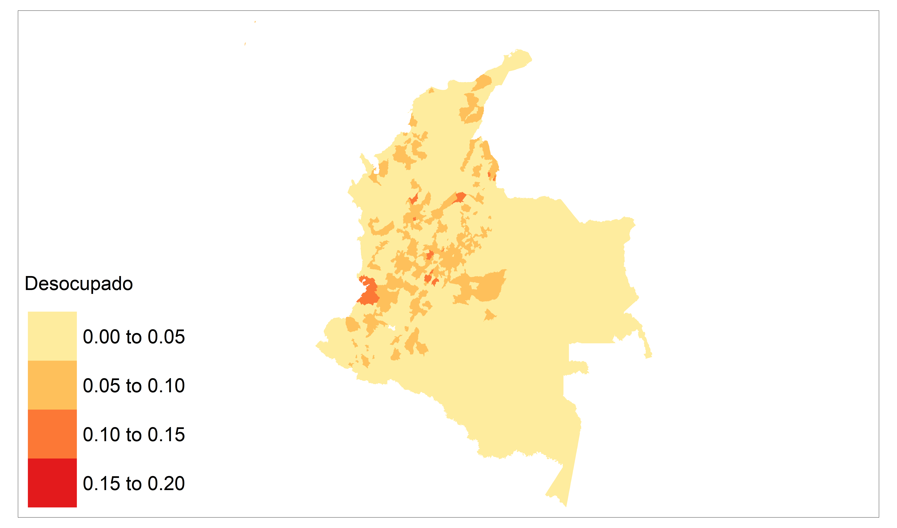

# Día 4 - Sesión 1- Modelo de área para estadísticas del mercado de trabajo


La Gran Encuesta Integrada de Hogares (GEIH) es una encuesta realizada por el Departamento Administrativo Nacional de Estadística (DANE) en Colombia. Esta encuesta tiene como objetivo principal recopilar información sobre la situación económica y social de los hogares colombianos, incluyendo aspectos relacionados con el empleo, la educación, la salud, la vivienda, la pobreza y la desigualdad.

La GEIH se realiza de forma continua durante todo el año, y cuenta con una muestra representativa de hogares seleccionados de manera aleatoria en todo el territorio colombiano. La muestra está diseñada para representar la diversidad socioeconómica y geográfica del país, y se estratifica por regiones, zonas urbanas y rurales, y tamaño de la población.

La encuesta se realiza a través de entrevistas personales en los hogares seleccionados, y se recopila información sobre las características de los miembros del hogar, su situación laboral, ingresos, educación, salud, entre otros aspectos. La GEIH es considerada una fuente confiable de información estadística sobre la situación socioeconómica del país, y se utiliza para la elaboración de políticas públicas y la toma de decisiones en diferentes áreas.

## Definición del modelo multinomial

-   Sea $K$ el número de categorías de la variable de interés $𝑌\sim multinimial\left(\boldsymbol{\theta}\right)$, con $\boldsymbol{\theta}=\left(p_{1},p_{2},\dots ,p_{k}\right)$ y $\sum_{k=1}^{K}p_{k}=1$.

-   Sea $N_i$ el número de elementos en el i-ésiamo dominio y $N_{ik}$ el número de elementos que tienen la k-ésima categoría, note que $\sum_{k=1}^{K}N_{ik}=N_{i}$ y $p_{ik}=\frac{N_{ik}}{N_{i}}$.

-   Sea $\hat{p}_{ik}$ la estimación directa de $p_{ik}$ y $v_{ik}=Var\left(\hat{p}_{ik}\right)$ y denote el estimador de la varianza por $\hat{v}_{ik}=\widehat{Var}\left(\hat{p}_{ik}\right)$


Note que el efecto diseño cambia entre categoría, por tanto, lo primero será definir el tamaño de muestra efectivo por categoría. Esto es:

La estimación de $\tilde{n}$ esta dado por $\tilde{n}_{ik} = \frac{(\tilde{p}_{ik}\times(1-\tilde{p}_{ik}))}{\hat{v}_{ik}},$

$\tilde{y}_{ik}=\tilde{n}_{ik}\times\hat{p}_{ik}$

luego, $\hat{n}_{i} = \sum_{k=1}^{K}\tilde{y}_{ik}$

de donde se sigue que $\hat{y}_{ik} = \hat{n}_i\times \hat{p}_{ik}$


Sea $\boldsymbol{\theta}=\left(p_{1},p_{2}, p_{3}\right)^{T}=\left(\frac{N_{i1}}{N_{i}},\frac{N_{i2}}{N_{i}}\frac{N_{i3}}{N_{i}}\right)^{T}$, entonces el modelo multinomial para el i-ésimo dominio estaría dado por:

$$
\left(\tilde{y}_{i1},\tilde{y}_{i2},\tilde{y}_{i3}\right)\mid\hat{n}_{i},\boldsymbol{\theta}_{i}\sim multinomial\left(\hat{n}_{i},\boldsymbol{\theta}_{i}\right)
$$ 
Ahora, puede escribir $p_{ik}$ como :

$\ln\left(\frac{p_{i2}}{p_{i1}}\right)=\boldsymbol{X}_{i}^{T}\beta_{2} + u_{i2}$ y
$\ln\left(\frac{p_{i3}}{p_{i1}}\right)=\boldsymbol{X}_{i}^{T}\beta_{3}+ u_{i3}$


Dada la restricción $1 = p_{i1} + p_{i2} + p_{i3}$ entonces 
$$p_{i1} + p_{i1}(e^{\boldsymbol{X}_{i}^{T}\boldsymbol{\beta_{2}}}+  u_{i2})+p_{i1}(e^{\boldsymbol{X}_{i}^{T}\boldsymbol{\beta}_{3}} + u_{i3})$$ de donde se sigue que 

$$
p_{i1}=\frac{1}{1+e^{\boldsymbol{X}_{i}^{T}\boldsymbol{\beta_{2}}}+ u_{i2}+e^{\boldsymbol{X_{i}}^{T}\boldsymbol{\beta_{2}}}+ u_{i3}}
$$

Las expresiones para $p_{i2}$ y $p_{i3}$ estarían dadas por: 

$$
p_{i2}=\frac{e^{\boldsymbol{X}_{i}^{T}\boldsymbol{\beta}_{2}} + u_{i2}}{1+e^{\boldsymbol{X}_{i}^{T}\boldsymbol{\beta_{2}}}+ u_{i2}+e^{\boldsymbol{X_{i}}^{T}\boldsymbol{\beta_{2}}}+ u_{i3}}
$$

$$
p_{i3}=\frac{e^{\boldsymbol{X}_{i}^{T}\boldsymbol{\beta}_{3}}+ u_{i3}}{1+e^{\boldsymbol{X}_{i}^{T}\boldsymbol{\beta_{2}}}+ u_{i2}+e^{\boldsymbol{X_{i}}^{T}\boldsymbol{\beta_{3}}}+ u_{i3}}
$$

## Lectura de librerías.

  -   La librería `survey` es una herramienta de análisis estadístico en R que permite trabajar con datos de encuestas complejas, como las encuestas estratificadas, multietápicas o con pesos de muestreo. Ofrece funciones para estimación de parámetros, diseño de muestras, análisis de varianza y regresión, y cálculo de errores estándar.

  -   La librería `tidyverse` es un conjunto de paquetes de R que se utilizan para la manipulación y visualización de datos. Incluye las librerías `dplyr`, `ggplot2`, `tidyr` y otras, y se caracteriza por su enfoque en la programación `tidy` o ordenada, que facilita la exploración y análisis de datos.

  -   La librería `srvyr` es una extensión de la librería `survey` que permite integrar las funciones de `survey` con la sintaxis de `dplyr`, lo que facilita la manipulación de datos de encuestas complejas. Incluye funciones para agrupar, filtrar y resumir datos de encuestas utilizando la sintaxis `tidy`.

  -   La librería `TeachingSampling` es una herramienta de R que se utiliza para la enseñanza de métodos de muestreo estadístico. Incluye funciones para simular diferentes tipos de muestras, estimar parámetros, calcular errores estándar y construir intervalos de confianza, entre otras.

  -   La librería `haven` es una herramienta de R que permite importar y exportar datos en diferentes formatos, incluyendo SPSS, Stata y SAS. Permite trabajar con archivos de datos de encuestas, y ofrece funciones para etiquetar variables, codificar datos faltantes y convertir datos de diferentes formatos.

  -   La librería `bayesplot` es una herramienta de R que se utiliza para la visualización y diagnóstico de modelos Bayesianos. Incluye funciones para graficar distribuciones posteriores, diagnósticos de convergencia, gráficos de diagnóstico de residuos, y otros tipos de gráficos relacionados con el análisis Bayesianos.

  -   La librería `patchwork` es una herramienta de R que permite unir gráficos de manera sencilla y flexible. Esta librería facilita la creación de gráficos complejos al permitir la combinación de múltiples gráficos en una sola visualización, lo que resulta especialmente útil en análisis de datos y modelización.

  -   La librería `stringr` es una herramienta de R que se utiliza para la manipulación de cadenas de texto. Incluye funciones para la extracción, manipulación y modificación de cadenas de texto, lo que resulta especialmente útil en la limpieza y preparación de datos antes de su análisis.

  -   La librería `rstan` es una herramienta de R que se utiliza para la estimación de modelos Bayesianos mediante el método de cadenas de Markov Monte Carlo (MCMC). Esta librería permite la especificación y estimación de modelos complejos mediante un lenguaje sencillo y flexible, y ofrece diversas herramientas para el diagnóstico y visualización de resultados.


```r
library(survey)
library(tidyverse)
library(srvyr)
library(TeachingSampling)
library(haven)
library(bayesplot)
library(patchwork)
library(stringr)
library(rstan)
```

## Lectura de la encuesta y estimaciones directas 

En la primera línea se carga la encuesta desde un archivo RDS y se guarda en un objeto llamado `encuesta`. La segunda línea utiliza la función `transmute()` de la librería `dplyr` para seleccionar las variables de interés en la encuesta y crear nuevas variables a partir de ellas. Luego, se utiliza la variable `id_dominio` para identificar el dominio de estudio. En conjunto, estos pasos son fundamentales para preparar los datos de la encuesta para su posterior estimación del parámetro.


```r
encuesta <- readRDS('Recursos/Día4/Sesion1/Data/encuestaCOL18N1.rds')
## 
encuesta <-
  encuesta %>%
  transmute(
    dam = dam_ee,
    dam2,
    fep = `_fep`, 
    upm = segmento,
    estrato = paste0(dam, haven::as_factor(area_ee,levels = "values")),
    empleo = condact3
  )
id_dominio <- "dam2"
```

El código presentado define el diseño muestral para el análisis de la encuesta "encuesta" en R. La primera línea establece una opción para el tratamiento de las PSU (unidades primarias de muestreo) solitarias, lo que indica que se deben aplicar ajustes en el cálculo de los errores estándar. La segunda línea utiliza la función "as_survey_design" de la librería "survey" para definir el diseño muestral. La función toma como argumentos la variable "encuesta" y los siguientes parámetros:

  -   `strata`: la variable que define las estratas de muestreo en la encuesta, en este caso la variable "estrato".

  -   `ids`: la variable que identifica las PSU en la encuesta, en este caso la variable "upm".

  -   `weights`: la variable que indica los pesos muestrales de cada observación, en este caso la variable "fep".

  -   `nest`: un parámetro lógico que indica si los datos de la encuesta están anidados o no. En este caso, se establece en "TRUE" porque los datos están anidados por dominio.
  
En conjunto, estos pasos permiten definir un diseño muestral que tenga en cuenta las características del muestreo y los pesos asignados a cada observación en la encuesta, lo que es necesario para obtener estimaciones precisas y representativas de los parámetros de interés.


```r
options(survey.lonely.psu= 'adjust' )
diseno <- encuesta %>%
  as_survey_design(
    strata = estrato,
    ids = upm,
    weights = fep,
    nest=T
  )
```

El código presentado es una operación que se realiza en el diseño muestral definido en el código anterior, con el objetivo de obtener un indicador del empleo por dominio. La primera línea define un objeto llamado "indicador_dam". En la segunda línea, se agrupa el diseño muestral según el dominio especificado en la variable "id_dominio". La tercera línea filtra los datos para quedarse con los individuos que tienen empleo (empleo igual a 1), están desempleados (empleo igual a 2) o son inactivos (empleo igual a 3).

A partir de la cuarta línea, se utilizan las funciones "summarise" y "survey_mean" para calcular las estadísticas descriptivas de interés. En particular, se calculan el número de personas ocupadas, desocupadas e inactivas en cada dominio, y la proporción de personas en cada una de estas categorías. La función "survey_mean" se utiliza para calcular la proporción de personas en cada una de estas categorías con sus respectivos errores estándar y efecto de diseño.


```r
indicador_dam <-
  diseno %>% group_by_at(id_dominio) %>% 
  filter(empleo %in% c(1:3)) %>%
  summarise(
    n_ocupado = unweighted(sum(empleo == 1)),
    n_desocupado = unweighted(sum(empleo == 2)),
    n_inactivo = unweighted(sum(empleo == 3)),
    Ocupado = survey_mean(empleo == 1,
      vartype = c("se",  "var"),
      deff = T
    ),
    Desocupado = survey_mean(empleo == 2,
                          vartype = c("se",  "var"),
                          deff = T
    ),
    Inactivo = survey_mean(empleo == 3,
                          vartype = c("se",  "var"),
                          deff = T
    )
  )
```

## Selección de dominios 

En la sección anterior, se llevó a cabo una estimación directa para cada categoría individualmente en cada municipio (dominio) presente en la muestra. Ahora, para evaluar la calidad de los resultados obtenidos, realizaremos un análisis descriptivo. Se emplean varias medidas de calidad, entre ellas, se cuenta el número de dominios que tienen dos o más unidades primarias de muestreo (UPM), así como el efecto de diseño mayor a 1 y las varianzas mayores a 0. Estas medidas nos permitirán determinar la fiabilidad de nuestros resultados y tomar decisiones informadas en función de ellos.

Después de realizar las validaciones anteriores se establece como regla incluir en el estudio los dominios que posean 

  - Dos o más upm por dominio. 
  
  - Contar con un resultado en el Deff


```r
indicador_dam1 <- indicador_dam %>% 
  filter(n_upm >= 2, !is.na(Desocupado_deff)) 
saveRDS(object = indicador_dam1, "Recursos/Día4/Sesion1/Data/base_modelo.Rds")
```

<table class="table table-striped lightable-classic" style="width: auto !important; margin-left: auto; margin-right: auto; font-family: Arial Narrow; width: auto !important; margin-left: auto; margin-right: auto;">
 <thead>
  <tr>
   <th style="text-align:left;"> dam2 </th>
   <th style="text-align:right;"> n_upm </th>
   <th style="text-align:right;"> n_ocupado </th>
   <th style="text-align:right;"> n_desocupado </th>
   <th style="text-align:right;"> n_inactivo </th>
   <th style="text-align:right;"> Ocupado </th>
   <th style="text-align:right;"> Ocupado_se </th>
   <th style="text-align:right;"> Ocupado_var </th>
   <th style="text-align:right;"> Ocupado_deff </th>
   <th style="text-align:right;"> Desocupado </th>
   <th style="text-align:right;"> Desocupado_se </th>
   <th style="text-align:right;"> Desocupado_var </th>
   <th style="text-align:right;"> Desocupado_deff </th>
   <th style="text-align:right;"> Inactivo </th>
   <th style="text-align:right;"> Inactivo_se </th>
   <th style="text-align:right;"> Inactivo_var </th>
   <th style="text-align:right;"> Inactivo_deff </th>
  </tr>
 </thead>
<tbody>
  <tr>
   <td style="text-align:left;"> 05001 </td>
   <td style="text-align:right;"> 806 </td>
   <td style="text-align:right;"> 13447 </td>
   <td style="text-align:right;"> 1805 </td>
   <td style="text-align:right;"> 8453 </td>
   <td style="text-align:right;"> 0.5772 </td>
   <td style="text-align:right;"> 0.0039 </td>
   <td style="text-align:right;"> 0.0000 </td>
   <td style="text-align:right;"> 1.5169 </td>
   <td style="text-align:right;"> 0.0775 </td>
   <td style="text-align:right;"> 0.0022 </td>
   <td style="text-align:right;"> 0e+00 </td>
   <td style="text-align:right;"> 1.6507 </td>
   <td style="text-align:right;"> 0.3453 </td>
   <td style="text-align:right;"> 0.0038 </td>
   <td style="text-align:right;"> 0.0000 </td>
   <td style="text-align:right;"> 1.5436 </td>
  </tr>
  <tr>
   <td style="text-align:left;"> 05002 </td>
   <td style="text-align:right;"> 10 </td>
   <td style="text-align:right;"> 102 </td>
   <td style="text-align:right;"> 7 </td>
   <td style="text-align:right;"> 118 </td>
   <td style="text-align:right;"> 0.4618 </td>
   <td style="text-align:right;"> 0.0202 </td>
   <td style="text-align:right;"> 0.0004 </td>
   <td style="text-align:right;"> 0.3739 </td>
   <td style="text-align:right;"> 0.0293 </td>
   <td style="text-align:right;"> 0.0083 </td>
   <td style="text-align:right;"> 1e-04 </td>
   <td style="text-align:right;"> 0.5478 </td>
   <td style="text-align:right;"> 0.5089 </td>
   <td style="text-align:right;"> 0.0186 </td>
   <td style="text-align:right;"> 0.0003 </td>
   <td style="text-align:right;"> 0.3127 </td>
  </tr>
  <tr>
   <td style="text-align:left;"> 05031 </td>
   <td style="text-align:right;"> 7 </td>
   <td style="text-align:right;"> 89 </td>
   <td style="text-align:right;"> 8 </td>
   <td style="text-align:right;"> 69 </td>
   <td style="text-align:right;"> 0.5307 </td>
   <td style="text-align:right;"> 0.0405 </td>
   <td style="text-align:right;"> 0.0016 </td>
   <td style="text-align:right;"> 1.0904 </td>
   <td style="text-align:right;"> 0.0626 </td>
   <td style="text-align:right;"> 0.0308 </td>
   <td style="text-align:right;"> 9e-04 </td>
   <td style="text-align:right;"> 2.6768 </td>
   <td style="text-align:right;"> 0.4066 </td>
   <td style="text-align:right;"> 0.0373 </td>
   <td style="text-align:right;"> 0.0014 </td>
   <td style="text-align:right;"> 0.9557 </td>
  </tr>
  <tr>
   <td style="text-align:left;"> 05034 </td>
   <td style="text-align:right;"> 6 </td>
   <td style="text-align:right;"> 100 </td>
   <td style="text-align:right;"> 3 </td>
   <td style="text-align:right;"> 82 </td>
   <td style="text-align:right;"> 0.5666 </td>
   <td style="text-align:right;"> 0.0322 </td>
   <td style="text-align:right;"> 0.0010 </td>
   <td style="text-align:right;"> 0.7805 </td>
   <td style="text-align:right;"> 0.0204 </td>
   <td style="text-align:right;"> 0.0076 </td>
   <td style="text-align:right;"> 1e-04 </td>
   <td style="text-align:right;"> 0.5345 </td>
   <td style="text-align:right;"> 0.4130 </td>
   <td style="text-align:right;"> 0.0327 </td>
   <td style="text-align:right;"> 0.0011 </td>
   <td style="text-align:right;"> 0.8153 </td>
  </tr>
  <tr>
   <td style="text-align:left;"> 05045 </td>
   <td style="text-align:right;"> 13 </td>
   <td style="text-align:right;"> 196 </td>
   <td style="text-align:right;"> 33 </td>
   <td style="text-align:right;"> 175 </td>
   <td style="text-align:right;"> 0.4808 </td>
   <td style="text-align:right;"> 0.0368 </td>
   <td style="text-align:right;"> 0.0014 </td>
   <td style="text-align:right;"> 2.1892 </td>
   <td style="text-align:right;"> 0.0920 </td>
   <td style="text-align:right;"> 0.0188 </td>
   <td style="text-align:right;"> 4e-04 </td>
   <td style="text-align:right;"> 1.7104 </td>
   <td style="text-align:right;"> 0.4272 </td>
   <td style="text-align:right;"> 0.0322 </td>
   <td style="text-align:right;"> 0.0010 </td>
   <td style="text-align:right;"> 1.7154 </td>
  </tr>
  <tr>
   <td style="text-align:left;"> 05079 </td>
   <td style="text-align:right;"> 6 </td>
   <td style="text-align:right;"> 71 </td>
   <td style="text-align:right;"> 14 </td>
   <td style="text-align:right;"> 74 </td>
   <td style="text-align:right;"> 0.4434 </td>
   <td style="text-align:right;"> 0.0460 </td>
   <td style="text-align:right;"> 0.0021 </td>
   <td style="text-align:right;"> 1.3676 </td>
   <td style="text-align:right;"> 0.0882 </td>
   <td style="text-align:right;"> 0.0130 </td>
   <td style="text-align:right;"> 2e-04 </td>
   <td style="text-align:right;"> 0.3359 </td>
   <td style="text-align:right;"> 0.4683 </td>
   <td style="text-align:right;"> 0.0521 </td>
   <td style="text-align:right;"> 0.0027 </td>
   <td style="text-align:right;"> 1.7387 </td>
  </tr>
  <tr>
   <td style="text-align:left;"> 05088 </td>
   <td style="text-align:right;"> 129 </td>
   <td style="text-align:right;"> 2169 </td>
   <td style="text-align:right;"> 321 </td>
   <td style="text-align:right;"> 1406 </td>
   <td style="text-align:right;"> 0.5647 </td>
   <td style="text-align:right;"> 0.0082 </td>
   <td style="text-align:right;"> 0.0001 </td>
   <td style="text-align:right;"> 1.0658 </td>
   <td style="text-align:right;"> 0.0827 </td>
   <td style="text-align:right;"> 0.0047 </td>
   <td style="text-align:right;"> 0e+00 </td>
   <td style="text-align:right;"> 1.1399 </td>
   <td style="text-align:right;"> 0.3526 </td>
   <td style="text-align:right;"> 0.0079 </td>
   <td style="text-align:right;"> 0.0001 </td>
   <td style="text-align:right;"> 1.0680 </td>
  </tr>
  <tr>
   <td style="text-align:left;"> 05093 </td>
   <td style="text-align:right;"> 6 </td>
   <td style="text-align:right;"> 81 </td>
   <td style="text-align:right;"> 1 </td>
   <td style="text-align:right;"> 55 </td>
   <td style="text-align:right;"> 0.5998 </td>
   <td style="text-align:right;"> 0.0415 </td>
   <td style="text-align:right;"> 0.0017 </td>
   <td style="text-align:right;"> 0.9791 </td>
   <td style="text-align:right;"> 0.0091 </td>
   <td style="text-align:right;"> 0.0088 </td>
   <td style="text-align:right;"> 1e-04 </td>
   <td style="text-align:right;"> 1.1823 </td>
   <td style="text-align:right;"> 0.3911 </td>
   <td style="text-align:right;"> 0.0455 </td>
   <td style="text-align:right;"> 0.0021 </td>
   <td style="text-align:right;"> 1.1878 </td>
  </tr>
  <tr>
   <td style="text-align:left;"> 05120 </td>
   <td style="text-align:right;"> 6 </td>
   <td style="text-align:right;"> 66 </td>
   <td style="text-align:right;"> 6 </td>
   <td style="text-align:right;"> 76 </td>
   <td style="text-align:right;"> 0.4384 </td>
   <td style="text-align:right;"> 0.0249 </td>
   <td style="text-align:right;"> 0.0006 </td>
   <td style="text-align:right;"> 0.3721 </td>
   <td style="text-align:right;"> 0.0300 </td>
   <td style="text-align:right;"> 0.0115 </td>
   <td style="text-align:right;"> 1e-04 </td>
   <td style="text-align:right;"> 0.6732 </td>
   <td style="text-align:right;"> 0.5316 </td>
   <td style="text-align:right;"> 0.0285 </td>
   <td style="text-align:right;"> 0.0008 </td>
   <td style="text-align:right;"> 0.4811 </td>
  </tr>
  <tr>
   <td style="text-align:left;"> 05129 </td>
   <td style="text-align:right;"> 17 </td>
   <td style="text-align:right;"> 273 </td>
   <td style="text-align:right;"> 22 </td>
   <td style="text-align:right;"> 201 </td>
   <td style="text-align:right;"> 0.5574 </td>
   <td style="text-align:right;"> 0.0145 </td>
   <td style="text-align:right;"> 0.0002 </td>
   <td style="text-align:right;"> 0.4255 </td>
   <td style="text-align:right;"> 0.0439 </td>
   <td style="text-align:right;"> 0.0090 </td>
   <td style="text-align:right;"> 1e-04 </td>
   <td style="text-align:right;"> 0.9649 </td>
   <td style="text-align:right;"> 0.3987 </td>
   <td style="text-align:right;"> 0.0191 </td>
   <td style="text-align:right;"> 0.0004 </td>
   <td style="text-align:right;"> 0.7575 </td>
  </tr>
</tbody>
</table>

## Modelo programando en `STAN`

El código presenta la implementación de un modelo multinomial logístico de área de respuesta utilizando el lenguaje de programación `STAN`. En este modelo, se asume que la variable de respuesta en cada dominio sigue una distribución multinomial. Se asume que los parámetros que rigen la relación entre las variables predictoras y la variable de respuesta son diferentes en cada dominio y se modelan como efectos aleatorios.

La sección de *functions* define una función auxiliar llamada `pred_theta()`, que se utiliza para predecir los valores de la variable de respuesta en los dominios no observados. La sección de `data` contiene las variables de entrada del modelo, incluyendo el número de dominios, el número de categorías de la variable de respuesta, las estimaciones directas de la variable de respuesta en cada dominio, las covariables observadas en cada dominio y las covariables correspondientes a los dominios no observados.

La sección de *parameters* define los parámetros desconocidos del modelo, incluyendo la matriz de parámetros *beta*, que contiene los coeficientes que relacionan las covariables con la variable de respuesta en cada categoría. También se incluyen los desviaciones estándar de los efectos aleatorios.

En la sección de *transformed parameters* se define el vector de parámetros `theta`, que contiene las probabilidades de pertenencia a cada categoría de la variable de respuesta en cada dominio. Se utilizan los efectos aleatorios para ajustar los valores de `theta` en cada dominio.

En la sección de *model* se define la estructura del modelo y se incluyen las distribuciones a priori para los parámetros desconocidos. En particular, se utiliza una distribución normal para los coeficientes de la matriz beta. Finalmente, se calcula la función de verosimilitud de la distribución multinomial para las estimaciones directas de la variable de respuesta en cada dominio.

La sección de *generated quantities* se utiliza para calcular las predicciones de la variable de respuesta en los dominios no observados utilizando la función auxiliar definida previamente.


```r
functions {
  matrix pred_theta(matrix Xp, int p, matrix beta){
  int D1 = rows(Xp);
  real num1[D1, p];
  real den1[D1];
  matrix[D1,p] theta_p;
  
  for(d in 1:D1){
    num1[d, 1] = 1;
    num1[d, 2] = exp(Xp[d, ] * beta[1, ]' ) ;
    num1[d, 3] = exp(Xp[d, ] * beta[2, ]' ) ;
    
    den1[d] = sum(num1[d, ]);
  }
  
  for(d in 1:D1){
    for(i in 2:p){
    theta_p[d, i] = num1[d, i]/den1[d];
    }
    theta_p[d, 1] = 1/den1[d];
   }

  return theta_p  ;
  }
  
}

data {
  int<lower=1> D; // número de dominios 
  int<lower=1> P; // categorías
  int<lower=1> K; // cantidad de regresores
  int y_tilde[D, P]; // matriz de datos
  matrix[D, K] X_obs; // matriz de covariables
  int<lower=1> D1; // número de dominios 
  matrix[D1, K] X_pred; // matriz de covariables
}
  

parameters {
  matrix[P-1, K] beta;// matriz de parámetros 
  real<lower=0> sigma2_u1;       // random effects standard deviations
  real<lower=0> sigma2_u2;       // random effects standard deviations
  vector[D] u1;
  vector[D] u2;
  // declare L_u to be the Choleski factor of a 2x2 correlation matrix
          
}

transformed parameters {
  simplex[P] theta[D];// vector de parámetros;
  real num[D, P];
  real den[D];
  real<lower=0> sigma_u1;       // random effects standard deviations
  real<lower=0> sigma_u2;       // random effects standard deviations
  sigma_u1 = sqrt(sigma2_u1); 
  sigma_u2 = sqrt(sigma2_u2); 

  for(d in 1:D){
    num[d, 1] = 1;
    num[d, 2] = exp(X_obs[d, ] * beta[1, ]' + u1[d]) ;
    num[d, 3] = exp(X_obs[d, ] * beta[2, ]' + u2[d]) ;
    
    den[d] = sum(num[d, ]);
  }
  
  for(d in 1:D){
    for(p in 2:P){
    theta[d, p] = num[d, p]/den[d];
    }
    theta[d, 1] = 1/den[d];
  }
}

model {
 u1 ~ normal(0, sigma_u1);
 u2 ~ normal(0, sigma_u2);
 sigma2_u1 ~  inv_gamma(0.0001, 0.0001);
 sigma2_u2 ~  inv_gamma(0.0001, 0.0001);
  
  for(p in 2:P){
    for(k in 1:K){
      beta[p-1, k] ~ normal(0, 10000);
    }
    }
  
  for(d in 1:D){
    target += multinomial_lpmf(y_tilde[d, ] | theta[d, ]); 
  }
}

  
generated quantities {
  matrix[D1,P] theta_pred;
  theta_pred = pred_theta(X_pred, P, beta);
}
```

## Preparando insumos para `STAN`

  1.    Lectura y adecuación de covariables
  

```r
statelevel_predictors_df <-
  readRDS('Recursos/Día4/Sesion1/Data/statelevel_predictors_df_dam2.rds') 
## Estandarizando las variables para controlar el efecto de la escala. 
statelevel_predictors_df %<>%
  mutate_at(vars("luces_nocturnas", 
                 "cubrimiento_cultivo",
                 "cubrimiento_urbano",
                 "modificacion_humana",
                 "accesibilidad_hospitales",
                 "accesibilidad_hosp_caminado"),
            function(x)as.numeric(scale(x)))
head(statelevel_predictors_df,10) %>% tba()
```

<table class="table table-striped lightable-classic" style="width: auto !important; margin-left: auto; margin-right: auto; font-family: Arial Narrow; width: auto !important; margin-left: auto; margin-right: auto;">
 <thead>
  <tr>
   <th style="text-align:left;"> dam </th>
   <th style="text-align:left;"> dam2 </th>
   <th style="text-align:right;"> area1 </th>
   <th style="text-align:right;"> sexo2 </th>
   <th style="text-align:right;"> edad2 </th>
   <th style="text-align:right;"> edad3 </th>
   <th style="text-align:right;"> edad4 </th>
   <th style="text-align:right;"> edad5 </th>
   <th style="text-align:right;"> etnia2 </th>
   <th style="text-align:right;"> anoest2 </th>
   <th style="text-align:right;"> anoest3 </th>
   <th style="text-align:right;"> anoest4 </th>
   <th style="text-align:right;"> etnia1 </th>
   <th style="text-align:right;"> tiene_acueducto </th>
   <th style="text-align:right;"> piso_tierra </th>
   <th style="text-align:right;"> alfabeta </th>
   <th style="text-align:right;"> hacinamiento </th>
   <th style="text-align:right;"> tasa_desocupacion </th>
   <th style="text-align:right;"> luces_nocturnas </th>
   <th style="text-align:right;"> cubrimiento_cultivo </th>
   <th style="text-align:right;"> cubrimiento_urbano </th>
   <th style="text-align:right;"> modificacion_humana </th>
   <th style="text-align:right;"> accesibilidad_hospitales </th>
   <th style="text-align:right;"> accesibilidad_hosp_caminado </th>
  </tr>
 </thead>
<tbody>
  <tr>
   <td style="text-align:left;"> 05 </td>
   <td style="text-align:left;"> 05001 </td>
   <td style="text-align:right;"> 0.9832 </td>
   <td style="text-align:right;"> 0.5299 </td>
   <td style="text-align:right;"> 0.2671 </td>
   <td style="text-align:right;"> 0.2201 </td>
   <td style="text-align:right;"> 0.2355 </td>
   <td style="text-align:right;"> 0.1060 </td>
   <td style="text-align:right;"> 0.0251 </td>
   <td style="text-align:right;"> 0.2598 </td>
   <td style="text-align:right;"> 0.4048 </td>
   <td style="text-align:right;"> 0.2287 </td>
   <td style="text-align:right;"> 0.0009 </td>
   <td style="text-align:right;"> 0.0354 </td>
   <td style="text-align:right;"> 0.0024 </td>
   <td style="text-align:right;"> 0.0258 </td>
   <td style="text-align:right;"> 0.0833 </td>
   <td style="text-align:right;"> 0.0062 </td>
   <td style="text-align:right;"> 4.9762 </td>
   <td style="text-align:right;"> -0.5072 </td>
   <td style="text-align:right;"> 7.2903 </td>
   <td style="text-align:right;"> 2.8648 </td>
   <td style="text-align:right;"> -0.3953 </td>
   <td style="text-align:right;"> -0.5248 </td>
  </tr>
  <tr>
   <td style="text-align:left;"> 05 </td>
   <td style="text-align:left;"> 05002 </td>
   <td style="text-align:right;"> 0.3953 </td>
   <td style="text-align:right;"> 0.4807 </td>
   <td style="text-align:right;"> 0.2229 </td>
   <td style="text-align:right;"> 0.1977 </td>
   <td style="text-align:right;"> 0.2497 </td>
   <td style="text-align:right;"> 0.1281 </td>
   <td style="text-align:right;"> 0.0035 </td>
   <td style="text-align:right;"> 0.5644 </td>
   <td style="text-align:right;"> 0.2393 </td>
   <td style="text-align:right;"> 0.0473 </td>
   <td style="text-align:right;"> 0.0001 </td>
   <td style="text-align:right;"> 0.3416 </td>
   <td style="text-align:right;"> 0.0160 </td>
   <td style="text-align:right;"> 0.1139 </td>
   <td style="text-align:right;"> 0.1395 </td>
   <td style="text-align:right;"> 0.0000 </td>
   <td style="text-align:right;"> -0.3246 </td>
   <td style="text-align:right;"> -0.5749 </td>
   <td style="text-align:right;"> -0.1807 </td>
   <td style="text-align:right;"> -0.0439 </td>
   <td style="text-align:right;"> -0.3439 </td>
   <td style="text-align:right;"> -0.4224 </td>
  </tr>
  <tr>
   <td style="text-align:left;"> 05 </td>
   <td style="text-align:left;"> 05004 </td>
   <td style="text-align:right;"> 0.3279 </td>
   <td style="text-align:right;"> 0.4576 </td>
   <td style="text-align:right;"> 0.2376 </td>
   <td style="text-align:right;"> 0.2075 </td>
   <td style="text-align:right;"> 0.2316 </td>
   <td style="text-align:right;"> 0.1218 </td>
   <td style="text-align:right;"> 0.0199 </td>
   <td style="text-align:right;"> 0.4470 </td>
   <td style="text-align:right;"> 0.3460 </td>
   <td style="text-align:right;"> 0.0723 </td>
   <td style="text-align:right;"> 0.0000 </td>
   <td style="text-align:right;"> 0.3694 </td>
   <td style="text-align:right;"> 0.0325 </td>
   <td style="text-align:right;"> 0.0787 </td>
   <td style="text-align:right;"> 0.1557 </td>
   <td style="text-align:right;"> 0.0000 </td>
   <td style="text-align:right;"> -0.6111 </td>
   <td style="text-align:right;"> -0.5475 </td>
   <td style="text-align:right;"> -0.2991 </td>
   <td style="text-align:right;"> -0.8159 </td>
   <td style="text-align:right;"> 0.0619 </td>
   <td style="text-align:right;"> -0.0654 </td>
  </tr>
  <tr>
   <td style="text-align:left;"> 05 </td>
   <td style="text-align:left;"> 05021 </td>
   <td style="text-align:right;"> 0.5770 </td>
   <td style="text-align:right;"> 0.5020 </td>
   <td style="text-align:right;"> 0.2191 </td>
   <td style="text-align:right;"> 0.1946 </td>
   <td style="text-align:right;"> 0.2357 </td>
   <td style="text-align:right;"> 0.1274 </td>
   <td style="text-align:right;"> 0.0031 </td>
   <td style="text-align:right;"> 0.5038 </td>
   <td style="text-align:right;"> 0.2727 </td>
   <td style="text-align:right;"> 0.0716 </td>
   <td style="text-align:right;"> 0.0000 </td>
   <td style="text-align:right;"> 0.2785 </td>
   <td style="text-align:right;"> 0.0255 </td>
   <td style="text-align:right;"> 0.0959 </td>
   <td style="text-align:right;"> 0.1025 </td>
   <td style="text-align:right;"> 0.0000 </td>
   <td style="text-align:right;"> -0.4532 </td>
   <td style="text-align:right;"> -0.6694 </td>
   <td style="text-align:right;"> -0.1852 </td>
   <td style="text-align:right;"> -0.3570 </td>
   <td style="text-align:right;"> -0.2956 </td>
   <td style="text-align:right;"> -0.3104 </td>
  </tr>
  <tr>
   <td style="text-align:left;"> 05 </td>
   <td style="text-align:left;"> 05030 </td>
   <td style="text-align:right;"> 0.4859 </td>
   <td style="text-align:right;"> 0.5063 </td>
   <td style="text-align:right;"> 0.2571 </td>
   <td style="text-align:right;"> 0.2047 </td>
   <td style="text-align:right;"> 0.2507 </td>
   <td style="text-align:right;"> 0.0997 </td>
   <td style="text-align:right;"> 0.0048 </td>
   <td style="text-align:right;"> 0.4130 </td>
   <td style="text-align:right;"> 0.3756 </td>
   <td style="text-align:right;"> 0.0828 </td>
   <td style="text-align:right;"> 0.0003 </td>
   <td style="text-align:right;"> 0.0775 </td>
   <td style="text-align:right;"> 0.0143 </td>
   <td style="text-align:right;"> 0.0844 </td>
   <td style="text-align:right;"> 0.1176 </td>
   <td style="text-align:right;"> 0.0000 </td>
   <td style="text-align:right;"> 1.1636 </td>
   <td style="text-align:right;"> -0.5002 </td>
   <td style="text-align:right;"> 0.7336 </td>
   <td style="text-align:right;"> 1.4706 </td>
   <td style="text-align:right;"> -0.3670 </td>
   <td style="text-align:right;"> -0.4265 </td>
  </tr>
  <tr>
   <td style="text-align:left;"> 05 </td>
   <td style="text-align:left;"> 05031 </td>
   <td style="text-align:right;"> 0.5766 </td>
   <td style="text-align:right;"> 0.4978 </td>
   <td style="text-align:right;"> 0.2695 </td>
   <td style="text-align:right;"> 0.1961 </td>
   <td style="text-align:right;"> 0.2047 </td>
   <td style="text-align:right;"> 0.0850 </td>
   <td style="text-align:right;"> 0.0050 </td>
   <td style="text-align:right;"> 0.4618 </td>
   <td style="text-align:right;"> 0.2981 </td>
   <td style="text-align:right;"> 0.0585 </td>
   <td style="text-align:right;"> 0.0001 </td>
   <td style="text-align:right;"> 0.4010 </td>
   <td style="text-align:right;"> 0.0970 </td>
   <td style="text-align:right;"> 0.1200 </td>
   <td style="text-align:right;"> 0.1417 </td>
   <td style="text-align:right;"> 0.0000 </td>
   <td style="text-align:right;"> -0.5077 </td>
   <td style="text-align:right;"> -0.6806 </td>
   <td style="text-align:right;"> -0.2532 </td>
   <td style="text-align:right;"> -0.6818 </td>
   <td style="text-align:right;"> 0.0167 </td>
   <td style="text-align:right;"> 0.2017 </td>
  </tr>
  <tr>
   <td style="text-align:left;"> 05 </td>
   <td style="text-align:left;"> 05034 </td>
   <td style="text-align:right;"> 0.5029 </td>
   <td style="text-align:right;"> 0.4815 </td>
   <td style="text-align:right;"> 0.2530 </td>
   <td style="text-align:right;"> 0.2052 </td>
   <td style="text-align:right;"> 0.2324 </td>
   <td style="text-align:right;"> 0.1042 </td>
   <td style="text-align:right;"> 0.0060 </td>
   <td style="text-align:right;"> 0.4731 </td>
   <td style="text-align:right;"> 0.2976 </td>
   <td style="text-align:right;"> 0.0634 </td>
   <td style="text-align:right;"> 0.0065 </td>
   <td style="text-align:right;"> 0.3435 </td>
   <td style="text-align:right;"> 0.0069 </td>
   <td style="text-align:right;"> 0.1089 </td>
   <td style="text-align:right;"> 0.1301 </td>
   <td style="text-align:right;"> 0.0000 </td>
   <td style="text-align:right;"> -0.2580 </td>
   <td style="text-align:right;"> -0.5573 </td>
   <td style="text-align:right;"> -0.2197 </td>
   <td style="text-align:right;"> 0.2265 </td>
   <td style="text-align:right;"> -0.0293 </td>
   <td style="text-align:right;"> -0.2376 </td>
  </tr>
  <tr>
   <td style="text-align:left;"> 05 </td>
   <td style="text-align:left;"> 05036 </td>
   <td style="text-align:right;"> 0.3931 </td>
   <td style="text-align:right;"> 0.4951 </td>
   <td style="text-align:right;"> 0.2447 </td>
   <td style="text-align:right;"> 0.1955 </td>
   <td style="text-align:right;"> 0.2435 </td>
   <td style="text-align:right;"> 0.1142 </td>
   <td style="text-align:right;"> 0.0054 </td>
   <td style="text-align:right;"> 0.4808 </td>
   <td style="text-align:right;"> 0.3010 </td>
   <td style="text-align:right;"> 0.0591 </td>
   <td style="text-align:right;"> 0.0006 </td>
   <td style="text-align:right;"> 0.1341 </td>
   <td style="text-align:right;"> 0.0227 </td>
   <td style="text-align:right;"> 0.1100 </td>
   <td style="text-align:right;"> 0.1561 </td>
   <td style="text-align:right;"> 0.0000 </td>
   <td style="text-align:right;"> 0.7139 </td>
   <td style="text-align:right;"> -0.5957 </td>
   <td style="text-align:right;"> -0.2053 </td>
   <td style="text-align:right;"> 1.0807 </td>
   <td style="text-align:right;"> -0.3818 </td>
   <td style="text-align:right;"> -0.5131 </td>
  </tr>
  <tr>
   <td style="text-align:left;"> 05 </td>
   <td style="text-align:left;"> 05038 </td>
   <td style="text-align:right;"> 0.2256 </td>
   <td style="text-align:right;"> 0.4927 </td>
   <td style="text-align:right;"> 0.2659 </td>
   <td style="text-align:right;"> 0.1984 </td>
   <td style="text-align:right;"> 0.2049 </td>
   <td style="text-align:right;"> 0.0904 </td>
   <td style="text-align:right;"> 0.0050 </td>
   <td style="text-align:right;"> 0.5162 </td>
   <td style="text-align:right;"> 0.2696 </td>
   <td style="text-align:right;"> 0.0281 </td>
   <td style="text-align:right;"> 0.0000 </td>
   <td style="text-align:right;"> 0.2768 </td>
   <td style="text-align:right;"> 0.1011 </td>
   <td style="text-align:right;"> 0.1544 </td>
   <td style="text-align:right;"> 0.2247 </td>
   <td style="text-align:right;"> 0.0000 </td>
   <td style="text-align:right;"> -0.4100 </td>
   <td style="text-align:right;"> -0.5108 </td>
   <td style="text-align:right;"> -0.2644 </td>
   <td style="text-align:right;"> -0.1709 </td>
   <td style="text-align:right;"> -0.3398 </td>
   <td style="text-align:right;"> -0.3666 </td>
  </tr>
  <tr>
   <td style="text-align:left;"> 05 </td>
   <td style="text-align:left;"> 05040 </td>
   <td style="text-align:right;"> 0.4858 </td>
   <td style="text-align:right;"> 0.4826 </td>
   <td style="text-align:right;"> 0.2859 </td>
   <td style="text-align:right;"> 0.1982 </td>
   <td style="text-align:right;"> 0.1678 </td>
   <td style="text-align:right;"> 0.0641 </td>
   <td style="text-align:right;"> 0.0168 </td>
   <td style="text-align:right;"> 0.4928 </td>
   <td style="text-align:right;"> 0.2738 </td>
   <td style="text-align:right;"> 0.0361 </td>
   <td style="text-align:right;"> 0.0117 </td>
   <td style="text-align:right;"> 0.4961 </td>
   <td style="text-align:right;"> 0.0824 </td>
   <td style="text-align:right;"> 0.1253 </td>
   <td style="text-align:right;"> 0.1948 </td>
   <td style="text-align:right;"> 0.0000 </td>
   <td style="text-align:right;"> -0.5447 </td>
   <td style="text-align:right;"> -0.6866 </td>
   <td style="text-align:right;"> -0.2954 </td>
   <td style="text-align:right;"> -0.9040 </td>
   <td style="text-align:right;"> 0.0470 </td>
   <td style="text-align:right;"> 0.1783 </td>
  </tr>
</tbody>
</table>
  
  2.    Seleccionar las variables del modelo y crear matriz de covariables.
  

```r
names_cov <-
  c(
    "dam2",
    "tasa_desocupacion",
    "hacinamiento",
    "piso_tierra",
    "luces_nocturnas",
    "cubrimiento_cultivo",
    "modificacion_humana"
  )
X_pred <-
  anti_join(statelevel_predictors_df %>% select(all_of(names_cov)),
            indicador_dam1 %>% select(dam2))
```

  En el bloque de código se identifican que dominios serán los predichos.  

```r
X_pred %>% select(dam2) %>% 
  saveRDS(file = "Recursos/Día4/Sesion1/Data/dam_pred.rds")
```

  Creando la matriz de covariables para los dominios no observados (`X_pred`) y los observados (`X_obs`)
  

```r
## Obteniendo la matrix 
X_pred %<>%
  data.frame() %>%
  select(-dam2)  %>%  as.matrix()

## Identificando los dominios para realizar estimación del modelo

X_obs <- inner_join(indicador_dam1 %>% select(dam2, id_orden),
                    statelevel_predictors_df %>% select(all_of(names_cov))) %>%
  arrange(id_orden) %>%
  data.frame() %>%
  select(-dam2, -id_orden)  %>%  as.matrix()
```
  
  3. Calculando el n_efectivo y el $\tilde{y}$ 
  

```r
D <- nrow(indicador_dam1)
P <- 3 # Ocupado, desocupado, inactivo.
Y_tilde <- matrix(NA, D, P)
n_tilde <- matrix(NA, D, P)
Y_hat <- matrix(NA, D, P)

# n efectivos ocupado
n_tilde[,1] <- (indicador_dam1$Ocupado*(1 - indicador_dam1$Ocupado))/indicador_dam1$Ocupado_var
Y_tilde[,1] <- n_tilde[,1]* indicador_dam1$Ocupado


# n efectivos desocupado
n_tilde[,2] <- (indicador_dam1$Desocupado*(1 - indicador_dam1$Desocupado))/indicador_dam1$Desocupado_var
Y_tilde[,2] <- n_tilde[,2]* indicador_dam1$Desocupado

# n efectivos Inactivo
n_tilde[,3] <- (indicador_dam1$Inactivo*(1 - indicador_dam1$Inactivo))/indicador_dam1$Inactivo_var
Y_tilde[,3] <- n_tilde[,3]* indicador_dam1$Inactivo
```

  Ahora, validamos la coherencia de los cálculos realizados 
  

```r
ni_hat = rowSums(Y_tilde)
Y_hat[,1] <- ni_hat* indicador_dam1$Ocupado
Y_hat[,2] <- ni_hat* indicador_dam1$Desocupado
Y_hat[,3] <- ni_hat* indicador_dam1$Inactivo
Y_hat <- round(Y_hat)

hat_p <- Y_hat/rowSums(Y_hat)
plot(hat_p[,1],indicador_dam1$Ocupado)
plot(hat_p[,2],indicador_dam1$Desocupado)
plot(hat_p[,3],indicador_dam1$Inactivo)
```
  


  4. Compilando el modelo 


```r
sample_data <- list(D = D,
                    P = P,
                    K = K,
                    y_tilde = Y_hat,
                    X_obs = X1_obs,
                    X_pred = X1_pred,
                    D1 = D1)


library(rstan)
fit_mcmc2 <- stan(
  file = "Recursos/Día4/Sesion1/Data/modelosStan/00 Multinomial_simple_no_cor.stan",  # Stan program
  data = sample_data,    # named list of data
  verbose = TRUE,
  warmup = 1000,          # number of warmup iterations per chain
  iter = 2000,            # total number of iterations per chain
  cores = 4,              # number of cores (could use one per chain)
)

saveRDS(fit_mcmc2,
        "Recursos/Día4/Sesion1/Data/fit_multinomial_no_cor.Rds")
```


## Validación del modelo 

La validación de un modelo es esencial para evaluar su capacidad para predecir de manera precisa y confiable los resultados futuros. En el caso de un modelo de área con respuesta multinomial, la validación se enfoca en medir la precisión del modelo para predecir las diferentes categorías de respuesta. El objetivo principal de la validación es determinar si el modelo es capaz de generalizar bien a datos no vistos y proporcionar predicciones precisas. Esto implica comparar las predicciones del modelo con los datos observados y utilizar métricas de evaluación para medir el rendimiento del modelo. La validación del modelo es esencial para garantizar la calidad de las predicciones y la confiabilidad del modelo para su uso en aplicaciones futuras.


```r
infile <- paste0("Recursos/Día4/Sesion1/Data/fit_multinomial_no_cor.Rds")
fit <- readRDS(infile)

theta_dir <- indicador_dam1 %>%  
  transmute(dam2,
    n = n_desocupado + n_ocupado + n_inactivo,
            Ocupado, Desocupado, Inactivo) 

color_scheme_set("brightblue")
theme_set(theme_bw(base_size = 15))
y_pred_B <- as.array(fit, pars = "theta") %>%
  as_draws_matrix()
  
rowsrandom <- sample(nrow(y_pred_B), 100)

theta_1<-  grep(pattern = "1]",x = colnames(y_pred_B),value = TRUE)
theta_2<-  grep(pattern = "2]",x = colnames(y_pred_B),value = TRUE)
theta_3<-  grep(pattern = "3]",x = colnames(y_pred_B),value = TRUE)
y_pred1 <- y_pred_B[rowsrandom,theta_1 ]
y_pred2 <- y_pred_B[rowsrandom,theta_2 ]
y_pred3 <- y_pred_B[rowsrandom,theta_3 ]

ppc_dens_overlay(y = as.numeric(theta_dir$Ocupado), y_pred1)/
  ppc_dens_overlay(y = as.numeric(theta_dir$Desocupado), y_pred2)/
  ppc_dens_overlay(y = as.numeric(theta_dir$Inactivo), y_pred3)
```


## Estimación de los parámetros. 

El código crea dos matrices, `theta_obs_ordenado` y `theta_pred_ordenado`, que contienen las estimaciones medias de los parámetros del modelo de respuesta multinomial con covariables para los datos de observación y predicción, respectivamente. La función `matrix()` se utiliza para dar formato a los datos con una matriz `nrow` x `ncol`, y se asignan nombres de columna apropiados a la matriz resultante utilizando `colnames()`. Luego se convierten las matrices en marcos de datos (`as.data.frame()`) y se unen mediante `full_join()` para crear una única tabla que contenga todas las estimaciones de los parámetros para los datos de observación y predicción, junto con la información del indicador de área (theta_dir). El resultado final es un marco de datos llamado estimaciones_obs.


```r
dam_pred <- readRDS("Recursos/Día4/Sesion1/Data/dam_pred.rds")
P <- 3 
D <- nrow(indicador_dam1)
D1 <- nrow(dam_pred)
## Estimación del modelo. 
theta_obs <- summary(fit, pars = "theta")$summary[, "mean"]
theta_pred <- summary(fit, pars = "theta_pred")$summary[, "mean"]

## Ordenando la matrix de theta 
theta_obs_ordenado <- matrix(theta_obs, 
                             nrow = D,
                             ncol = P,byrow = TRUE) 

colnames(theta_obs_ordenado) <- c("Ocupado_mod", "Desocupado_mod", "Inactivo_mod")
theta_obs_ordenado%<>% as.data.frame()
theta_obs_ordenado <- cbind(dam2 = indicador_dam1$dam2,
                            theta_obs_ordenado)

theta_pred_ordenado <- matrix(theta_pred, 
                             nrow = D1,
                             ncol = P,byrow = TRUE)

colnames(theta_pred_ordenado) <- c("Ocupado_mod", "Desocupado_mod", "Inactivo_mod")
theta_pred_ordenado%<>% as.data.frame()
theta_pred_ordenado <- cbind(dam2 = dam_pred$dam2, theta_pred_ordenado)
```

## Estimación de la desviación estárdar y el coeficiente de valiación 

Este bloque de código corresponde al cálculo de las desviaciones estándar (sd) y coeficientes de variación (cv) de los parámetros `theta` para los datos observados y predichos. En primer lugar, se utiliza la función `summary()` del paquete `rstan` para extraer los valores de `sd` de los parámetros `theta` observados y predichos, respectivamente, a partir del modelo (`fit`) que contiene la información de la estimación de los parámetros de la distribución Bayesiana. Luego, se organizan los valores de sd en una matriz ordenada por `dam2` y se les asignan los nombres correspondientes. Con esta matriz, se calcula otra matriz que contiene los coeficientes de variación para los parámetros `theta` observados (`theta_obs_ordenado_cv`). De manera similar, se construyen matrices ordenadas por `dam2` para los valores de sd y cv de los parámetros theta predichos (`theta_pred_ordenado_sd` y `theta_pred_ordenado_cv`, respectivamente).


```r
theta_obs_sd <- summary(fit, pars = "theta")$summary[, "sd"]
theta_pred_sd <- summary(fit, pars = "theta_pred")$summary[, "sd"]

theta_obs_ordenado_sd <- matrix(theta_obs_sd, 
                             nrow = D,
                             ncol = P,byrow = TRUE) 

colnames(theta_obs_ordenado_sd) <- c("Ocupado_mod_sd", "Desocupado_mod_sd", "Inactivo_mod_sd")
theta_obs_ordenado_sd%<>% as.data.frame()
theta_obs_ordenado_sd <- cbind(dam2 = indicador_dam1$dam2,
                            theta_obs_ordenado_sd)
theta_obs_ordenado_cv <- theta_obs_ordenado_sd[,-1]/theta_obs_ordenado[,-1]

colnames(theta_obs_ordenado_cv) <- c("Ocupado_mod_cv", "Desocupado_mod_cv", "Inactivo_mod_cv")

theta_obs_ordenado_cv <- cbind(dam2 = indicador_dam1$dam2,
                               theta_obs_ordenado_cv)

theta_pred_ordenado_sd <- matrix(theta_pred_sd, 
                              nrow = D1,
                              ncol = P,byrow = TRUE)

colnames(theta_pred_ordenado_sd) <- c("Ocupado_mod_sd", "Desocupado_mod_sd", "Inactivo_mod_sd")
theta_pred_ordenado_sd%<>% as.data.frame()
theta_pred_ordenado_sd <- cbind(dam2 = dam_pred$dam2, theta_pred_ordenado_sd)

theta_pred_ordenado_cv <- theta_pred_ordenado_sd[,-1]/theta_pred_ordenado[,-1]

colnames(theta_pred_ordenado_cv) <- c("Ocupado_mod_cv", "Desocupado_mod_cv", "Inactivo_mod_cv")

theta_pred_ordenado_cv <- cbind(dam2 = dam_pred$dam2, theta_pred_ordenado_cv)
```

El último paso es realizar la consolidación de la bases obtenidas para la estimación puntual, desviación estándar y coeficiente de variación. 


```r
theta_obs_ordenado <- full_join(theta_obs_ordenado,theta_obs_ordenado_sd) %>% 
  full_join(theta_obs_ordenado_cv)

theta_pred_ordenado <- full_join(theta_pred_ordenado,theta_pred_ordenado_sd) %>% 
  full_join(theta_pred_ordenado_cv)


estimaciones <- full_join(indicador_dam1,
                              bind_rows(theta_obs_ordenado, theta_pred_ordenado))

saveRDS(object = estimaciones, file = "Recursos/Día4/Sesion1/Data/estimaciones.rds")
tba(head(estimaciones_obs,10))
```

<table class="table table-striped lightable-classic" style="width: auto !important; margin-left: auto; margin-right: auto; font-family: Arial Narrow; width: auto !important; margin-left: auto; margin-right: auto;">
 <thead>
  <tr>
   <th style="text-align:left;"> dam2 </th>
   <th style="text-align:right;"> n_upm </th>
   <th style="text-align:right;"> n_ocupado </th>
   <th style="text-align:right;"> n_desocupado </th>
   <th style="text-align:right;"> n_inactivo </th>
   <th style="text-align:right;"> Ocupado </th>
   <th style="text-align:right;"> Ocupado_se </th>
   <th style="text-align:right;"> Ocupado_var </th>
   <th style="text-align:right;"> Ocupado_deff </th>
   <th style="text-align:right;"> Desocupado </th>
   <th style="text-align:right;"> Desocupado_se </th>
   <th style="text-align:right;"> Desocupado_var </th>
   <th style="text-align:right;"> Desocupado_deff </th>
   <th style="text-align:right;"> Inactivo </th>
   <th style="text-align:right;"> Inactivo_se </th>
   <th style="text-align:right;"> Inactivo_var </th>
   <th style="text-align:right;"> Inactivo_deff </th>
   <th style="text-align:right;"> Ocupado_mod </th>
   <th style="text-align:right;"> Desocupado_mod </th>
   <th style="text-align:right;"> Inactivo_mod </th>
   <th style="text-align:right;"> Ocupado_mod_sd </th>
   <th style="text-align:right;"> Desocupado_mod_sd </th>
   <th style="text-align:right;"> Inactivo_mod_sd </th>
   <th style="text-align:right;"> Ocupado_mod_cv </th>
   <th style="text-align:right;"> Desocupado_mod_cv </th>
   <th style="text-align:right;"> Inactivo_mod_cv </th>
  </tr>
 </thead>
<tbody>
  <tr>
   <td style="text-align:left;"> 05001 </td>
   <td style="text-align:right;"> 806 </td>
   <td style="text-align:right;"> 13447 </td>
   <td style="text-align:right;"> 1805 </td>
   <td style="text-align:right;"> 8453 </td>
   <td style="text-align:right;"> 0.5772 </td>
   <td style="text-align:right;"> 0.0039 </td>
   <td style="text-align:right;"> 0.0000 </td>
   <td style="text-align:right;"> 1.5169 </td>
   <td style="text-align:right;"> 0.0775 </td>
   <td style="text-align:right;"> 0.0022 </td>
   <td style="text-align:right;"> 0e+00 </td>
   <td style="text-align:right;"> 1.6507 </td>
   <td style="text-align:right;"> 0.3453 </td>
   <td style="text-align:right;"> 0.0038 </td>
   <td style="text-align:right;"> 0.0000 </td>
   <td style="text-align:right;"> 1.5436 </td>
   <td style="text-align:right;"> 0.5774 </td>
   <td style="text-align:right;"> 0.0775 </td>
   <td style="text-align:right;"> 0.3451 </td>
   <td style="text-align:right;"> 0.0040 </td>
   <td style="text-align:right;"> 0.0021 </td>
   <td style="text-align:right;"> 0.0038 </td>
   <td style="text-align:right;"> 0.0069 </td>
   <td style="text-align:right;"> 0.0271 </td>
   <td style="text-align:right;"> 0.0109 </td>
  </tr>
  <tr>
   <td style="text-align:left;"> 05002 </td>
   <td style="text-align:right;"> 10 </td>
   <td style="text-align:right;"> 102 </td>
   <td style="text-align:right;"> 7 </td>
   <td style="text-align:right;"> 118 </td>
   <td style="text-align:right;"> 0.4618 </td>
   <td style="text-align:right;"> 0.0202 </td>
   <td style="text-align:right;"> 0.0004 </td>
   <td style="text-align:right;"> 0.3739 </td>
   <td style="text-align:right;"> 0.0293 </td>
   <td style="text-align:right;"> 0.0083 </td>
   <td style="text-align:right;"> 1e-04 </td>
   <td style="text-align:right;"> 0.5478 </td>
   <td style="text-align:right;"> 0.5089 </td>
   <td style="text-align:right;"> 0.0186 </td>
   <td style="text-align:right;"> 0.0003 </td>
   <td style="text-align:right;"> 0.3127 </td>
   <td style="text-align:right;"> 0.4675 </td>
   <td style="text-align:right;"> 0.0309 </td>
   <td style="text-align:right;"> 0.5017 </td>
   <td style="text-align:right;"> 0.0190 </td>
   <td style="text-align:right;"> 0.0060 </td>
   <td style="text-align:right;"> 0.0189 </td>
   <td style="text-align:right;"> 0.0406 </td>
   <td style="text-align:right;"> 0.1943 </td>
   <td style="text-align:right;"> 0.0376 </td>
  </tr>
  <tr>
   <td style="text-align:left;"> 05031 </td>
   <td style="text-align:right;"> 7 </td>
   <td style="text-align:right;"> 89 </td>
   <td style="text-align:right;"> 8 </td>
   <td style="text-align:right;"> 69 </td>
   <td style="text-align:right;"> 0.5307 </td>
   <td style="text-align:right;"> 0.0405 </td>
   <td style="text-align:right;"> 0.0016 </td>
   <td style="text-align:right;"> 1.0904 </td>
   <td style="text-align:right;"> 0.0626 </td>
   <td style="text-align:right;"> 0.0308 </td>
   <td style="text-align:right;"> 9e-04 </td>
   <td style="text-align:right;"> 2.6768 </td>
   <td style="text-align:right;"> 0.4066 </td>
   <td style="text-align:right;"> 0.0373 </td>
   <td style="text-align:right;"> 0.0014 </td>
   <td style="text-align:right;"> 0.9557 </td>
   <td style="text-align:right;"> 0.5391 </td>
   <td style="text-align:right;"> 0.0580 </td>
   <td style="text-align:right;"> 0.4028 </td>
   <td style="text-align:right;"> 0.0338 </td>
   <td style="text-align:right;"> 0.0154 </td>
   <td style="text-align:right;"> 0.0348 </td>
   <td style="text-align:right;"> 0.0626 </td>
   <td style="text-align:right;"> 0.2661 </td>
   <td style="text-align:right;"> 0.0864 </td>
  </tr>
  <tr>
   <td style="text-align:left;"> 05034 </td>
   <td style="text-align:right;"> 6 </td>
   <td style="text-align:right;"> 100 </td>
   <td style="text-align:right;"> 3 </td>
   <td style="text-align:right;"> 82 </td>
   <td style="text-align:right;"> 0.5666 </td>
   <td style="text-align:right;"> 0.0322 </td>
   <td style="text-align:right;"> 0.0010 </td>
   <td style="text-align:right;"> 0.7805 </td>
   <td style="text-align:right;"> 0.0204 </td>
   <td style="text-align:right;"> 0.0076 </td>
   <td style="text-align:right;"> 1e-04 </td>
   <td style="text-align:right;"> 0.5345 </td>
   <td style="text-align:right;"> 0.4130 </td>
   <td style="text-align:right;"> 0.0327 </td>
   <td style="text-align:right;"> 0.0011 </td>
   <td style="text-align:right;"> 0.8153 </td>
   <td style="text-align:right;"> 0.5589 </td>
   <td style="text-align:right;"> 0.0312 </td>
   <td style="text-align:right;"> 0.4099 </td>
   <td style="text-align:right;"> 0.0287 </td>
   <td style="text-align:right;"> 0.0089 </td>
   <td style="text-align:right;"> 0.0290 </td>
   <td style="text-align:right;"> 0.0513 </td>
   <td style="text-align:right;"> 0.2861 </td>
   <td style="text-align:right;"> 0.0708 </td>
  </tr>
  <tr>
   <td style="text-align:left;"> 05045 </td>
   <td style="text-align:right;"> 13 </td>
   <td style="text-align:right;"> 196 </td>
   <td style="text-align:right;"> 33 </td>
   <td style="text-align:right;"> 175 </td>
   <td style="text-align:right;"> 0.4808 </td>
   <td style="text-align:right;"> 0.0368 </td>
   <td style="text-align:right;"> 0.0014 </td>
   <td style="text-align:right;"> 2.1892 </td>
   <td style="text-align:right;"> 0.0920 </td>
   <td style="text-align:right;"> 0.0188 </td>
   <td style="text-align:right;"> 4e-04 </td>
   <td style="text-align:right;"> 1.7104 </td>
   <td style="text-align:right;"> 0.4272 </td>
   <td style="text-align:right;"> 0.0322 </td>
   <td style="text-align:right;"> 0.0010 </td>
   <td style="text-align:right;"> 1.7154 </td>
   <td style="text-align:right;"> 0.5043 </td>
   <td style="text-align:right;"> 0.0775 </td>
   <td style="text-align:right;"> 0.4182 </td>
   <td style="text-align:right;"> 0.0301 </td>
   <td style="text-align:right;"> 0.0160 </td>
   <td style="text-align:right;"> 0.0303 </td>
   <td style="text-align:right;"> 0.0596 </td>
   <td style="text-align:right;"> 0.2069 </td>
   <td style="text-align:right;"> 0.0724 </td>
  </tr>
  <tr>
   <td style="text-align:left;"> 05079 </td>
   <td style="text-align:right;"> 6 </td>
   <td style="text-align:right;"> 71 </td>
   <td style="text-align:right;"> 14 </td>
   <td style="text-align:right;"> 74 </td>
   <td style="text-align:right;"> 0.4434 </td>
   <td style="text-align:right;"> 0.0460 </td>
   <td style="text-align:right;"> 0.0021 </td>
   <td style="text-align:right;"> 1.3676 </td>
   <td style="text-align:right;"> 0.0882 </td>
   <td style="text-align:right;"> 0.0130 </td>
   <td style="text-align:right;"> 2e-04 </td>
   <td style="text-align:right;"> 0.3359 </td>
   <td style="text-align:right;"> 0.4683 </td>
   <td style="text-align:right;"> 0.0521 </td>
   <td style="text-align:right;"> 0.0027 </td>
   <td style="text-align:right;"> 1.7387 </td>
   <td style="text-align:right;"> 0.4892 </td>
   <td style="text-align:right;"> 0.0747 </td>
   <td style="text-align:right;"> 0.4361 </td>
   <td style="text-align:right;"> 0.0353 </td>
   <td style="text-align:right;"> 0.0191 </td>
   <td style="text-align:right;"> 0.0371 </td>
   <td style="text-align:right;"> 0.0721 </td>
   <td style="text-align:right;"> 0.2556 </td>
   <td style="text-align:right;"> 0.0850 </td>
  </tr>
  <tr>
   <td style="text-align:left;"> 05088 </td>
   <td style="text-align:right;"> 129 </td>
   <td style="text-align:right;"> 2169 </td>
   <td style="text-align:right;"> 321 </td>
   <td style="text-align:right;"> 1406 </td>
   <td style="text-align:right;"> 0.5647 </td>
   <td style="text-align:right;"> 0.0082 </td>
   <td style="text-align:right;"> 0.0001 </td>
   <td style="text-align:right;"> 1.0658 </td>
   <td style="text-align:right;"> 0.0827 </td>
   <td style="text-align:right;"> 0.0047 </td>
   <td style="text-align:right;"> 0e+00 </td>
   <td style="text-align:right;"> 1.1399 </td>
   <td style="text-align:right;"> 0.3526 </td>
   <td style="text-align:right;"> 0.0079 </td>
   <td style="text-align:right;"> 0.0001 </td>
   <td style="text-align:right;"> 1.0680 </td>
   <td style="text-align:right;"> 0.5652 </td>
   <td style="text-align:right;"> 0.0825 </td>
   <td style="text-align:right;"> 0.3523 </td>
   <td style="text-align:right;"> 0.0082 </td>
   <td style="text-align:right;"> 0.0045 </td>
   <td style="text-align:right;"> 0.0080 </td>
   <td style="text-align:right;"> 0.0145 </td>
   <td style="text-align:right;"> 0.0541 </td>
   <td style="text-align:right;"> 0.0226 </td>
  </tr>
  <tr>
   <td style="text-align:left;"> 05093 </td>
   <td style="text-align:right;"> 6 </td>
   <td style="text-align:right;"> 81 </td>
   <td style="text-align:right;"> 1 </td>
   <td style="text-align:right;"> 55 </td>
   <td style="text-align:right;"> 0.5998 </td>
   <td style="text-align:right;"> 0.0415 </td>
   <td style="text-align:right;"> 0.0017 </td>
   <td style="text-align:right;"> 0.9791 </td>
   <td style="text-align:right;"> 0.0091 </td>
   <td style="text-align:right;"> 0.0088 </td>
   <td style="text-align:right;"> 1e-04 </td>
   <td style="text-align:right;"> 1.1823 </td>
   <td style="text-align:right;"> 0.3911 </td>
   <td style="text-align:right;"> 0.0455 </td>
   <td style="text-align:right;"> 0.0021 </td>
   <td style="text-align:right;"> 1.1878 </td>
   <td style="text-align:right;"> 0.5746 </td>
   <td style="text-align:right;"> 0.0281 </td>
   <td style="text-align:right;"> 0.3973 </td>
   <td style="text-align:right;"> 0.0345 </td>
   <td style="text-align:right;"> 0.0096 </td>
   <td style="text-align:right;"> 0.0357 </td>
   <td style="text-align:right;"> 0.0600 </td>
   <td style="text-align:right;"> 0.3429 </td>
   <td style="text-align:right;"> 0.0898 </td>
  </tr>
  <tr>
   <td style="text-align:left;"> 05120 </td>
   <td style="text-align:right;"> 6 </td>
   <td style="text-align:right;"> 66 </td>
   <td style="text-align:right;"> 6 </td>
   <td style="text-align:right;"> 76 </td>
   <td style="text-align:right;"> 0.4384 </td>
   <td style="text-align:right;"> 0.0249 </td>
   <td style="text-align:right;"> 0.0006 </td>
   <td style="text-align:right;"> 0.3721 </td>
   <td style="text-align:right;"> 0.0300 </td>
   <td style="text-align:right;"> 0.0115 </td>
   <td style="text-align:right;"> 1e-04 </td>
   <td style="text-align:right;"> 0.6732 </td>
   <td style="text-align:right;"> 0.5316 </td>
   <td style="text-align:right;"> 0.0285 </td>
   <td style="text-align:right;"> 0.0008 </td>
   <td style="text-align:right;"> 0.4811 </td>
   <td style="text-align:right;"> 0.4561 </td>
   <td style="text-align:right;"> 0.0282 </td>
   <td style="text-align:right;"> 0.5158 </td>
   <td style="text-align:right;"> 0.0248 </td>
   <td style="text-align:right;"> 0.0075 </td>
   <td style="text-align:right;"> 0.0252 </td>
   <td style="text-align:right;"> 0.0544 </td>
   <td style="text-align:right;"> 0.2651 </td>
   <td style="text-align:right;"> 0.0488 </td>
  </tr>
  <tr>
   <td style="text-align:left;"> 05129 </td>
   <td style="text-align:right;"> 17 </td>
   <td style="text-align:right;"> 273 </td>
   <td style="text-align:right;"> 22 </td>
   <td style="text-align:right;"> 201 </td>
   <td style="text-align:right;"> 0.5574 </td>
   <td style="text-align:right;"> 0.0145 </td>
   <td style="text-align:right;"> 0.0002 </td>
   <td style="text-align:right;"> 0.4255 </td>
   <td style="text-align:right;"> 0.0439 </td>
   <td style="text-align:right;"> 0.0090 </td>
   <td style="text-align:right;"> 1e-04 </td>
   <td style="text-align:right;"> 0.9649 </td>
   <td style="text-align:right;"> 0.3987 </td>
   <td style="text-align:right;"> 0.0191 </td>
   <td style="text-align:right;"> 0.0004 </td>
   <td style="text-align:right;"> 0.7575 </td>
   <td style="text-align:right;"> 0.5584 </td>
   <td style="text-align:right;"> 0.0446 </td>
   <td style="text-align:right;"> 0.3970 </td>
   <td style="text-align:right;"> 0.0154 </td>
   <td style="text-align:right;"> 0.0064 </td>
   <td style="text-align:right;"> 0.0153 </td>
   <td style="text-align:right;"> 0.0276 </td>
   <td style="text-align:right;"> 0.1425 </td>
   <td style="text-align:right;"> 0.0385 </td>
  </tr>
</tbody>
</table>

## Metodología de Benchmarking 

  1. Conteos de personas agregados por dam2, personas mayores de 15 años de edad. 
  

```r
conteo_pp_dam <- readRDS("Recursos/Día4/Sesion1/Data/censo_dam2.rds") %>%
  filter(edad > 1)  %>% 
  group_by(dam , dam2) %>% 
  summarise(pp_dam2 = sum(n),.groups = "drop") %>% 
mutate(pp_dam = sum(pp_dam2))
head(conteo_pp_dam) %>% tba()
```

<table class="table table-striped lightable-classic" style="width: auto !important; margin-left: auto; margin-right: auto; font-family: Arial Narrow; width: auto !important; margin-left: auto; margin-right: auto;">
 <thead>
  <tr>
   <th style="text-align:left;"> dam </th>
   <th style="text-align:left;"> dam2 </th>
   <th style="text-align:right;"> pp_dam2 </th>
   <th style="text-align:right;"> pp_dam </th>
  </tr>
 </thead>
<tbody>
  <tr>
   <td style="text-align:left;"> 05 </td>
   <td style="text-align:left;"> 05001 </td>
   <td style="text-align:right;"> 2059770 </td>
   <td style="text-align:right;"> 36055009 </td>
  </tr>
  <tr>
   <td style="text-align:left;"> 05 </td>
   <td style="text-align:left;"> 05002 </td>
   <td style="text-align:right;"> 14635 </td>
   <td style="text-align:right;"> 36055009 </td>
  </tr>
  <tr>
   <td style="text-align:left;"> 05 </td>
   <td style="text-align:left;"> 05004 </td>
   <td style="text-align:right;"> 1856 </td>
   <td style="text-align:right;"> 36055009 </td>
  </tr>
  <tr>
   <td style="text-align:left;"> 05 </td>
   <td style="text-align:left;"> 05021 </td>
   <td style="text-align:right;"> 3149 </td>
   <td style="text-align:right;"> 36055009 </td>
  </tr>
  <tr>
   <td style="text-align:left;"> 05 </td>
   <td style="text-align:left;"> 05030 </td>
   <td style="text-align:right;"> 22708 </td>
   <td style="text-align:right;"> 36055009 </td>
  </tr>
  <tr>
   <td style="text-align:left;"> 05 </td>
   <td style="text-align:left;"> 05031 </td>
   <td style="text-align:right;"> 16015 </td>
   <td style="text-align:right;"> 36055009 </td>
  </tr>
</tbody>
</table>

  2.    Estimación del parámetro `theta` al nivel que la escuenta sea representativa.
  

```r
Razon_empleo <-
  diseno %>%
  filter(empleo %in% c(1:3)) %>%
  summarise(
    Ocupado = survey_ratio(numerator = (empleo == 1), 
                           denominator = 1 ),
    Desocupado = survey_ratio(numerator =( empleo == 2),denominator = 1
                             
    ),
    Inactivo = survey_ratio(numerator =  (empleo == 3), denominator = 1
                           
    )
  ) %>% select(Ocupado,Desocupado, Inactivo)
tba(Razon_empleo)
```

<table class="table table-striped lightable-classic" style="width: auto !important; margin-left: auto; margin-right: auto; font-family: Arial Narrow; width: auto !important; margin-left: auto; margin-right: auto;">
 <thead>
  <tr>
   <th style="text-align:right;"> Ocupado </th>
   <th style="text-align:right;"> Desocupado </th>
   <th style="text-align:right;"> Inactivo </th>
  </tr>
 </thead>
<tbody>
  <tr>
   <td style="text-align:right;"> 0.5779 </td>
   <td style="text-align:right;"> 0.0619 </td>
   <td style="text-align:right;"> 0.3602 </td>
  </tr>
</tbody>
</table>
  
  3.  Definir los pesos por dominios. 
  

```r
names_cov <-  "Nacional"
estimaciones_mod <- estimaciones %>% transmute(
  dam = substr(dam2,1,2),
  dam2,Ocupado_mod,Desocupado_mod,Inactivo_mod) %>% 
  inner_join(conteo_pp_dam ) %>% 
  mutate(wi = pp_dam2/pp_dam,
         Nacional = "1")
```
  
  4. Crear variables dummys 
  

```r
estimaciones_mod %<>%
  fastDummies::dummy_cols(select_columns = names_cov,
                          remove_selected_columns = FALSE)

Xdummy <- estimaciones_mod %>% select(matches("Nacional_")) %>% 
  mutate_at(vars(matches("_\\d")) ,
            list(Ocupado = function(x) x*estimaciones_mod$Ocupado_mod,
                 Desocupado = function(x) x*estimaciones_mod$Desocupado_mod,
                 Inactivo = function(x) x*estimaciones_mod$Inactivo_mod)) %>% 
  select((matches("Ocupado|Desocupado|Inactivo"))) 
head(Xdummy) %>% tba()
```

<table class="table table-striped lightable-classic" style="width: auto !important; margin-left: auto; margin-right: auto; font-family: Arial Narrow; width: auto !important; margin-left: auto; margin-right: auto;">
 <thead>
  <tr>
   <th style="text-align:right;"> Ocupado </th>
   <th style="text-align:right;"> Desocupado </th>
   <th style="text-align:right;"> Inactivo </th>
  </tr>
 </thead>
<tbody>
  <tr>
   <td style="text-align:right;"> 0.5774 </td>
   <td style="text-align:right;"> 0.0775 </td>
   <td style="text-align:right;"> 0.3451 </td>
  </tr>
  <tr>
   <td style="text-align:right;"> 0.4675 </td>
   <td style="text-align:right;"> 0.0309 </td>
   <td style="text-align:right;"> 0.5017 </td>
  </tr>
  <tr>
   <td style="text-align:right;"> 0.5391 </td>
   <td style="text-align:right;"> 0.0580 </td>
   <td style="text-align:right;"> 0.4028 </td>
  </tr>
  <tr>
   <td style="text-align:right;"> 0.5589 </td>
   <td style="text-align:right;"> 0.0312 </td>
   <td style="text-align:right;"> 0.4099 </td>
  </tr>
  <tr>
   <td style="text-align:right;"> 0.5043 </td>
   <td style="text-align:right;"> 0.0775 </td>
   <td style="text-align:right;"> 0.4182 </td>
  </tr>
  <tr>
   <td style="text-align:right;"> 0.4892 </td>
   <td style="text-align:right;"> 0.0747 </td>
   <td style="text-align:right;"> 0.4361 </td>
  </tr>
</tbody>
</table>
  
  5.    Calcular el ponderador para cada nivel de la variable. 
  
#### Ocupado {-}
    

```r
names_ocupado <- grep(pattern = "^O", x = colnames(Xdummy),value = TRUE)
gk_ocupado <- calib(Xs = Xdummy[,names_ocupado] %>% as.matrix(), 
            d =  estimaciones_mod$wi,
            total = Razon_empleo[names_ocupado] %>% as.matrix(),
            method="linear",max_iter = 5000,) 

checkcalibration(Xs = Xdummy[,names_ocupado] %>% as.matrix(), 
                 d =estimaciones_mod$wi,
                 total = Razon_empleo[names_ocupado] %>% as.matrix(),
                 g = gk_ocupado,)
```

#### Desocupado {-} 
    

```r
names_descupados <- grep(pattern = "^D", x = colnames(Xdummy),value = TRUE)

gk_desocupado <- calib(Xs = Xdummy[,names_descupados]%>% as.matrix(), 
                    d =  estimaciones_mod$wi,
                    total = Razon_empleo[names_descupados]%>% as.matrix(),
                    method="linear",max_iter = 5000,) 

checkcalibration(Xs = Xdummy[,names_descupados]%>% as.matrix(), 
                 d =estimaciones_mod$wi,
                 total = Razon_empleo[names_descupados]%>% as.matrix(),
                 g = gk_desocupado,)
```

#### Inactivo {-}


```r
names_inactivo <- grep(pattern = "^I", x = colnames(Xdummy),value = TRUE)

gk_Inactivo <- calib(Xs = Xdummy[,names_inactivo]%>% as.matrix(), 
                    d =  estimaciones_mod$wi,
                    total = Razon_empleo[names_inactivo]%>% as.matrix(),
                    method="linear",max_iter = 5000,) 

checkcalibration(Xs = Xdummy[,names_inactivo]%>% as.matrix(), 
                 d =estimaciones_mod$wi,
                 total = Razon_empleo[names_inactivo]%>% as.matrix(),
                 g = gk_Inactivo,)
```
  
  6.    Validar los resultados obtenidos. 
  

```r
par(mfrow = c(1,3))
hist(gk_ocupado)
hist(gk_desocupado)
hist(gk_Inactivo)
```


  7.    Estimaciones ajustadas por el ponderador
  

```r
estimacionesBench <- estimaciones_mod %>%
  mutate(gk_ocupado, gk_desocupado, gk_Inactivo) %>%
  transmute(
    dam,
    dam2,
    wi,gk_ocupado, gk_desocupado, gk_Inactivo,
    Ocupado_Bench = Ocupado_mod*gk_ocupado,
    Desocupado_Bench = Desocupado_mod*gk_desocupado,
    Inactivo_Bench = Inactivo_mod*gk_Inactivo
  )
```

  8.    Validación de resultados. 
  

```r
estimacionesBench %>%
  summarise(Ocupado_Bench = sum(wi*Ocupado_Bench),
            Desocupado_Bench = sum(wi*Desocupado_Bench),
            Inactivo_Bench = sum(wi*Inactivo_Bench)) %>% tba()
  
indicador_agregado %>% tba()
```

<table class="table table-striped lightable-classic" style="width: auto !important; margin-left: auto; margin-right: auto; font-family: Arial Narrow; width: auto !important; margin-left: auto; margin-right: auto;">
 <thead>
  <tr>
   <th style="text-align:right;"> Ocupado_Bench </th>
   <th style="text-align:right;"> Desocupado_Bench </th>
   <th style="text-align:right;"> Inactivo_Bench </th>
  </tr>
 </thead>
<tbody>
  <tr>
   <td style="text-align:right;"> 0.5779 </td>
   <td style="text-align:right;"> 0.0619 </td>
   <td style="text-align:right;"> 0.3602 </td>
  </tr>
</tbody>
</table>

<table class="table table-striped lightable-classic" style="width: auto !important; margin-left: auto; margin-right: auto; font-family: Arial Narrow; width: auto !important; margin-left: auto; margin-right: auto;">
 <thead>
  <tr>
   <th style="text-align:right;"> Ocupado </th>
   <th style="text-align:right;"> Desocupado </th>
   <th style="text-align:right;"> Inactivo </th>
  </tr>
 </thead>
<tbody>
  <tr>
   <td style="text-align:right;"> 0.5779 </td>
   <td style="text-align:right;"> 0.0619 </td>
   <td style="text-align:right;"> 0.3602 </td>
  </tr>
</tbody>
</table>


  9. Guardar resultados 
  

```r
estimaciones <- inner_join(estimaciones,estimacionesBench)
saveRDS(object = estimaciones, file = "Recursos/Día4/Sesion1/Data/estimaciones_Bench.rds")
```


## Mapas del mercado de trabajo.

El código carga las librerías `sp`, `sf` y `tmap`. Luego, se lee un archivo shapefile con información geográfica y se utiliza la función 'inner_join' para unirlo con las estimaciones de la encuesta previamente calculadas. Posteriormente, se definen los puntos de corte para la generación de los intervalos de clase en los mapas de cada variable de interés (ocupados, desocupados e inactivos) y se asignan a las variables 'brks_ocupado', 'brks_desocupado' y 'brks_inactivo', respectivamente.


```r
library(sp)
library(sf)
library(tmap)
ShapeSAE <- read_sf("Recursos/Día4/Sesion1/Shape/COL_dam2.shp")

P1_empleo <- tm_shape(ShapeSAE %>%
                           inner_join(estimaciones))
brks_ocupado <- seq(0.2,0.8,0.1)
brks_desocupado <- seq(0,0.2,0.05)
brks_inactivo <- seq(0.17,0.62, 0.09)
```

### Ocupado {-}

Este código está creando un mapa de la variable "Ocupado" utilizando la función `tm_fill()` de la librería `tmap.` Los valores de la variable se clasifican en diferentes categorías utilizando la función breaks, y se establece un título para la leyenda del mapa con el argumento title. Se utiliza una paleta de colores llamada "-Blues" para representar las diferentes categorías de la variable en el mapa. La función tm_layout se utiliza para establecer algunas características del diseño del mapa, como el tamaño de la leyenda, el tamaño de la fuente, y la relación de aspecto del mapa. Finalmente, el mapa se guarda en la variable Mapa_ocupado. 


```r
Mapa_ocupado <-
  P1_empleo +
  tm_fill("Ocupado_Bench",
          breaks = brks_ocupado,
          title = "Ocupado",
          palette = "-Blues") +
  tm_layout(
    legend.only = FALSE,
    legend.height = -0.5,
    legend.width = -0.5,
    asp = 1.5,
    legend.text.size = 3,
    legend.title.size = 3
  )
Mapa_ocupado
```


### Desocupado {-} 

Este código utiliza la función `tm_fill()` de la librería `tmap` para crear un mapa temático del indicador de "desocupado" a nivel de las áreas geográficas definidas en el archivo de polígonos `ShapeSAE`. La paleta de colores utilizada para representar los valores del indicador es la "YlOrRd". Se especifican los mismos parámetros de `tm_layout()` que en el mapa anterior para definir el diseño general del mapa.


```r
Mapa_desocupado <-
  P1_empleo + tm_fill(
    "Desocupado_Bench",
    breaks = brks_desocupado,
    title =  "Desocupado",
    palette = "YlOrRd"
  ) + tm_layout( 
    legend.only = FALSE,
    legend.height = -0.5,
    legend.width = -0.5,
    asp = 1.5,
    legend.text.size = 3,
    legend.title.size = 3)
Mapa_desocupado
```





### Inactivo {-} 

Este código genera un mapa temático de la variable "Inactivo" utilizando la librería `tmap`. Primero se carga el archivo de `shapefile` y se hace una unión con las estimaciones previamente calculadas. Luego se utiliza la función `tm_fill()` para especificar que se desea utilizar el valor de la variable "Inactivo" para el relleno del mapa. Se definen los intervalos de la paleta de colores con la variable "brks_inactivo" y se especifica el título del mapa con la opción "title". Finalmente, se configura el diseño del mapa con la función `tm_layout()`, donde se ajustan parámetros como el tamaño del texto y de la leyenda, y se establece el aspecto del mapa en 1.5 para una mejor visualización.


```r
Mapa_Inactivo <-
  P1_empleo + tm_fill(
      "Inactivo_Bench",
    title =  "Inactivo",
    breaks = brks_inactivo,
    palette = "YlGn"
  ) + tm_layout( 
    legend.only = FALSE,
    legend.height = -0.5,
    legend.width = -0.5,
    asp = 1.5,
    legend.text.size = 3,
    legend.title.size = 3)
```


    
  
