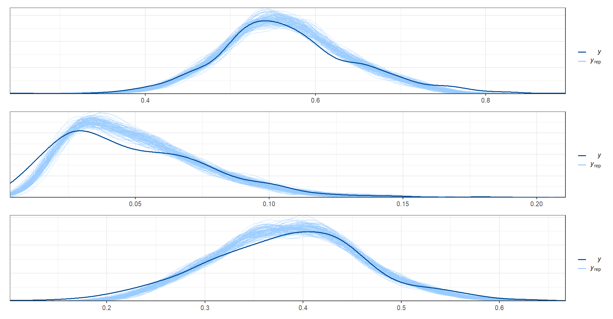
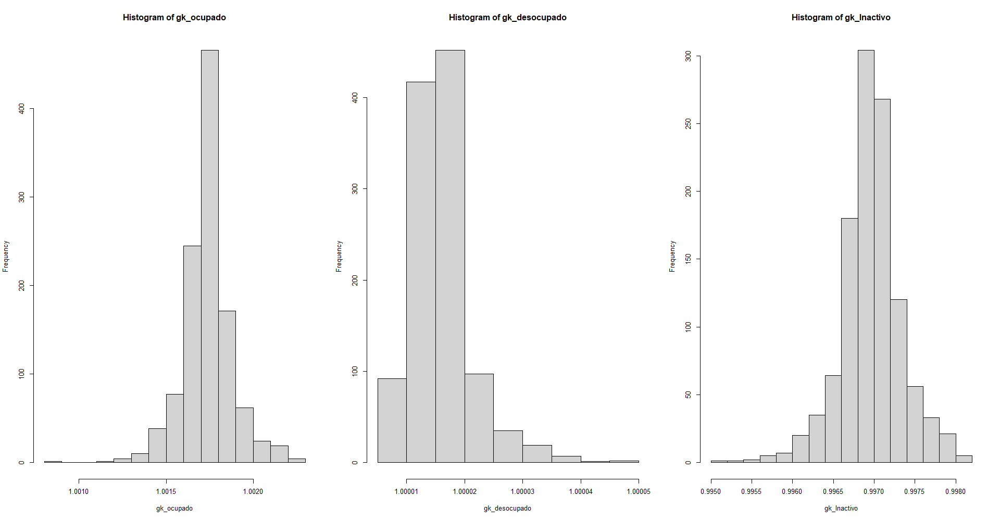

# Día 4 - Sesión 2 - Definición del modelo multinomial de efectos aleatorios correlacionados. 

La Estimación del modelo de área de respuesta multinomial es una técnica estadística utilizada para analizar datos provenientes de encuestas que involucran múltiples categorías de respuesta y están diseñadas a nivel de áreas geográficas. Esta técnica es una extensión del modelo de área de respuesta binomial, el cual se utiliza para analizar encuestas con dos posibles respuestas.

El Modelo multinomial logístico es un tipo de modelo de regresión utilizado para analizar datos de respuesta categóricos que tienen más de dos categorías. Este modelo es una extensión del modelo de regresión logística binaria, el cual se utiliza para analizar datos de respuesta binaria. Recordemos las expresiones del modelo múltinomial. 


Sea $\boldsymbol{\theta}=\left(p_{1},p_{2}, p_{3}\right)^{T}=\left(\frac{N_{i1}}{N_{i}},\frac{N_{i2}}{N_{i}}\frac{N_{i3}}{N_{i}}\right)^{T}$, entonces el modelo multinomial para el i-ésimo dominio estaría dado por:

$$
\left(\tilde{y}_{i1},\tilde{y}_{i2},\tilde{y}_{i3}\right)\mid\hat{n}_{i},\boldsymbol{\theta}_{i}\sim multinomial\left(\hat{n}_{i},\boldsymbol{\theta}_{i}\right)
$$ 
Ahora, puede escribir $p_{ik}$ como :

$\ln\left(\frac{p_{i2}}{p_{i1}}\right)=\boldsymbol{X}_{i}^{T}\beta_{2} + u_{i2}$ y
$\ln\left(\frac{p_{i3}}{p_{i1}}\right)=\boldsymbol{X}_{i}^{T}\beta_{3}+ u_{i3}$


Dada la restricción $1 = p_{i1} + p_{i2} + p_{i3}$ entonces 
$$p_{i1} + p_{i1}(e^{\boldsymbol{X}_{i}^{T}\boldsymbol{\beta_{2}}}+  u_{i2})+p_{i1}(e^{\boldsymbol{X}_{i}^{T}\boldsymbol{\beta}_{3}} + u_{i3})$$ de donde se sigue que 

$$
p_{i1}=\frac{1}{1+e^{\boldsymbol{X}_{i}^{T}\boldsymbol{\beta_{2}}}+ u_{i2}+e^{\boldsymbol{X_{i}}^{T}\boldsymbol{\beta_{2}}}+ u_{i3}}
$$

Las expresiones para $p_{i2}$ y $p_{i3}$ estarían dadas por: 

$$
p_{i2}=\frac{e^{\boldsymbol{X}_{i}^{T}\boldsymbol{\beta}_{2}} + u_{i2}}{1+e^{\boldsymbol{X}_{i}^{T}\boldsymbol{\beta_{2}}}+ u_{i2}+e^{\boldsymbol{X_{i}}^{T}\boldsymbol{\beta_{2}}}+ u_{i3}}
$$

$$
p_{i3}=\frac{e^{\boldsymbol{X}_{i}^{T}\boldsymbol{\beta}_{3}}+ u_{i3}}{1+e^{\boldsymbol{X}_{i}^{T}\boldsymbol{\beta_{2}}}+ u_{i2}+e^{\boldsymbol{X_{i}}^{T}\boldsymbol{\beta_{3}}}+ u_{i3}}
$$

**dado la naturaleza de la variable, se puede suponer que $cor(u_{i2},u_{i3})\ne 0$**


## Lectura de las estimaciones directas 

En la sección anterior se realizó el cálculo de estimaciones directas para los distintos dominio y se aplicaron criterios de selección para conservar aquellos dominios que contaran con suficientes observaciones y una varianza estimada adecuada. Tras este proceso de selección, se obtuvieron un total de 413 dominios. Es importante destacar que la elección de estos criterios es fundamental para asegurar la calidad de las estimaciones obtenidas. A continuación, presentamos una lista con los 10 primeros dominios seleccionados.


```r
indicador_dam1 <- readRDS("Recursos/Día4/Sesion2/Data/base_modelo.Rds")
tba(head(indicador_dam1,10))
```

<table class="table table-striped lightable-classic" style="width: auto !important; margin-left: auto; margin-right: auto; font-family: Arial Narrow; width: auto !important; margin-left: auto; margin-right: auto;">
 <thead>
  <tr>
   <th style="text-align:left;"> dam2 </th>
   <th style="text-align:right;"> n_upm </th>
   <th style="text-align:right;"> n_ocupado </th>
   <th style="text-align:right;"> n_desocupado </th>
   <th style="text-align:right;"> n_inactivo </th>
   <th style="text-align:right;"> Ocupado </th>
   <th style="text-align:right;"> Ocupado_se </th>
   <th style="text-align:right;"> Ocupado_var </th>
   <th style="text-align:right;"> Ocupado_deff </th>
   <th style="text-align:right;"> Desocupado </th>
   <th style="text-align:right;"> Desocupado_se </th>
   <th style="text-align:right;"> Desocupado_var </th>
   <th style="text-align:right;"> Desocupado_deff </th>
   <th style="text-align:right;"> Inactivo </th>
   <th style="text-align:right;"> Inactivo_se </th>
   <th style="text-align:right;"> Inactivo_var </th>
   <th style="text-align:right;"> Inactivo_deff </th>
  </tr>
 </thead>
<tbody>
  <tr>
   <td style="text-align:left;"> 05001 </td>
   <td style="text-align:right;"> 806 </td>
   <td style="text-align:right;"> 13447 </td>
   <td style="text-align:right;"> 1805 </td>
   <td style="text-align:right;"> 8453 </td>
   <td style="text-align:right;"> 0.5772 </td>
   <td style="text-align:right;"> 0.0039 </td>
   <td style="text-align:right;"> 0.0000 </td>
   <td style="text-align:right;"> 1.5169 </td>
   <td style="text-align:right;"> 0.0775 </td>
   <td style="text-align:right;"> 0.0022 </td>
   <td style="text-align:right;"> 0e+00 </td>
   <td style="text-align:right;"> 1.6507 </td>
   <td style="text-align:right;"> 0.3453 </td>
   <td style="text-align:right;"> 0.0038 </td>
   <td style="text-align:right;"> 0.0000 </td>
   <td style="text-align:right;"> 1.5436 </td>
  </tr>
  <tr>
   <td style="text-align:left;"> 05002 </td>
   <td style="text-align:right;"> 10 </td>
   <td style="text-align:right;"> 102 </td>
   <td style="text-align:right;"> 7 </td>
   <td style="text-align:right;"> 118 </td>
   <td style="text-align:right;"> 0.4618 </td>
   <td style="text-align:right;"> 0.0202 </td>
   <td style="text-align:right;"> 0.0004 </td>
   <td style="text-align:right;"> 0.3739 </td>
   <td style="text-align:right;"> 0.0293 </td>
   <td style="text-align:right;"> 0.0083 </td>
   <td style="text-align:right;"> 1e-04 </td>
   <td style="text-align:right;"> 0.5478 </td>
   <td style="text-align:right;"> 0.5089 </td>
   <td style="text-align:right;"> 0.0186 </td>
   <td style="text-align:right;"> 0.0003 </td>
   <td style="text-align:right;"> 0.3127 </td>
  </tr>
  <tr>
   <td style="text-align:left;"> 05031 </td>
   <td style="text-align:right;"> 7 </td>
   <td style="text-align:right;"> 89 </td>
   <td style="text-align:right;"> 8 </td>
   <td style="text-align:right;"> 69 </td>
   <td style="text-align:right;"> 0.5307 </td>
   <td style="text-align:right;"> 0.0405 </td>
   <td style="text-align:right;"> 0.0016 </td>
   <td style="text-align:right;"> 1.0904 </td>
   <td style="text-align:right;"> 0.0626 </td>
   <td style="text-align:right;"> 0.0308 </td>
   <td style="text-align:right;"> 9e-04 </td>
   <td style="text-align:right;"> 2.6768 </td>
   <td style="text-align:right;"> 0.4066 </td>
   <td style="text-align:right;"> 0.0373 </td>
   <td style="text-align:right;"> 0.0014 </td>
   <td style="text-align:right;"> 0.9557 </td>
  </tr>
  <tr>
   <td style="text-align:left;"> 05034 </td>
   <td style="text-align:right;"> 6 </td>
   <td style="text-align:right;"> 100 </td>
   <td style="text-align:right;"> 3 </td>
   <td style="text-align:right;"> 82 </td>
   <td style="text-align:right;"> 0.5666 </td>
   <td style="text-align:right;"> 0.0322 </td>
   <td style="text-align:right;"> 0.0010 </td>
   <td style="text-align:right;"> 0.7805 </td>
   <td style="text-align:right;"> 0.0204 </td>
   <td style="text-align:right;"> 0.0076 </td>
   <td style="text-align:right;"> 1e-04 </td>
   <td style="text-align:right;"> 0.5345 </td>
   <td style="text-align:right;"> 0.4130 </td>
   <td style="text-align:right;"> 0.0327 </td>
   <td style="text-align:right;"> 0.0011 </td>
   <td style="text-align:right;"> 0.8153 </td>
  </tr>
  <tr>
   <td style="text-align:left;"> 05045 </td>
   <td style="text-align:right;"> 13 </td>
   <td style="text-align:right;"> 196 </td>
   <td style="text-align:right;"> 33 </td>
   <td style="text-align:right;"> 175 </td>
   <td style="text-align:right;"> 0.4808 </td>
   <td style="text-align:right;"> 0.0368 </td>
   <td style="text-align:right;"> 0.0014 </td>
   <td style="text-align:right;"> 2.1892 </td>
   <td style="text-align:right;"> 0.0920 </td>
   <td style="text-align:right;"> 0.0188 </td>
   <td style="text-align:right;"> 4e-04 </td>
   <td style="text-align:right;"> 1.7104 </td>
   <td style="text-align:right;"> 0.4272 </td>
   <td style="text-align:right;"> 0.0322 </td>
   <td style="text-align:right;"> 0.0010 </td>
   <td style="text-align:right;"> 1.7154 </td>
  </tr>
  <tr>
   <td style="text-align:left;"> 05079 </td>
   <td style="text-align:right;"> 6 </td>
   <td style="text-align:right;"> 71 </td>
   <td style="text-align:right;"> 14 </td>
   <td style="text-align:right;"> 74 </td>
   <td style="text-align:right;"> 0.4434 </td>
   <td style="text-align:right;"> 0.0460 </td>
   <td style="text-align:right;"> 0.0021 </td>
   <td style="text-align:right;"> 1.3676 </td>
   <td style="text-align:right;"> 0.0882 </td>
   <td style="text-align:right;"> 0.0130 </td>
   <td style="text-align:right;"> 2e-04 </td>
   <td style="text-align:right;"> 0.3359 </td>
   <td style="text-align:right;"> 0.4683 </td>
   <td style="text-align:right;"> 0.0521 </td>
   <td style="text-align:right;"> 0.0027 </td>
   <td style="text-align:right;"> 1.7387 </td>
  </tr>
  <tr>
   <td style="text-align:left;"> 05088 </td>
   <td style="text-align:right;"> 129 </td>
   <td style="text-align:right;"> 2169 </td>
   <td style="text-align:right;"> 321 </td>
   <td style="text-align:right;"> 1406 </td>
   <td style="text-align:right;"> 0.5647 </td>
   <td style="text-align:right;"> 0.0082 </td>
   <td style="text-align:right;"> 0.0001 </td>
   <td style="text-align:right;"> 1.0658 </td>
   <td style="text-align:right;"> 0.0827 </td>
   <td style="text-align:right;"> 0.0047 </td>
   <td style="text-align:right;"> 0e+00 </td>
   <td style="text-align:right;"> 1.1399 </td>
   <td style="text-align:right;"> 0.3526 </td>
   <td style="text-align:right;"> 0.0079 </td>
   <td style="text-align:right;"> 0.0001 </td>
   <td style="text-align:right;"> 1.0680 </td>
  </tr>
  <tr>
   <td style="text-align:left;"> 05093 </td>
   <td style="text-align:right;"> 6 </td>
   <td style="text-align:right;"> 81 </td>
   <td style="text-align:right;"> 1 </td>
   <td style="text-align:right;"> 55 </td>
   <td style="text-align:right;"> 0.5998 </td>
   <td style="text-align:right;"> 0.0415 </td>
   <td style="text-align:right;"> 0.0017 </td>
   <td style="text-align:right;"> 0.9791 </td>
   <td style="text-align:right;"> 0.0091 </td>
   <td style="text-align:right;"> 0.0088 </td>
   <td style="text-align:right;"> 1e-04 </td>
   <td style="text-align:right;"> 1.1823 </td>
   <td style="text-align:right;"> 0.3911 </td>
   <td style="text-align:right;"> 0.0455 </td>
   <td style="text-align:right;"> 0.0021 </td>
   <td style="text-align:right;"> 1.1878 </td>
  </tr>
  <tr>
   <td style="text-align:left;"> 05120 </td>
   <td style="text-align:right;"> 6 </td>
   <td style="text-align:right;"> 66 </td>
   <td style="text-align:right;"> 6 </td>
   <td style="text-align:right;"> 76 </td>
   <td style="text-align:right;"> 0.4384 </td>
   <td style="text-align:right;"> 0.0249 </td>
   <td style="text-align:right;"> 0.0006 </td>
   <td style="text-align:right;"> 0.3721 </td>
   <td style="text-align:right;"> 0.0300 </td>
   <td style="text-align:right;"> 0.0115 </td>
   <td style="text-align:right;"> 1e-04 </td>
   <td style="text-align:right;"> 0.6732 </td>
   <td style="text-align:right;"> 0.5316 </td>
   <td style="text-align:right;"> 0.0285 </td>
   <td style="text-align:right;"> 0.0008 </td>
   <td style="text-align:right;"> 0.4811 </td>
  </tr>
  <tr>
   <td style="text-align:left;"> 05129 </td>
   <td style="text-align:right;"> 17 </td>
   <td style="text-align:right;"> 273 </td>
   <td style="text-align:right;"> 22 </td>
   <td style="text-align:right;"> 201 </td>
   <td style="text-align:right;"> 0.5574 </td>
   <td style="text-align:right;"> 0.0145 </td>
   <td style="text-align:right;"> 0.0002 </td>
   <td style="text-align:right;"> 0.4255 </td>
   <td style="text-align:right;"> 0.0439 </td>
   <td style="text-align:right;"> 0.0090 </td>
   <td style="text-align:right;"> 1e-04 </td>
   <td style="text-align:right;"> 0.9649 </td>
   <td style="text-align:right;"> 0.3987 </td>
   <td style="text-align:right;"> 0.0191 </td>
   <td style="text-align:right;"> 0.0004 </td>
   <td style="text-align:right;"> 0.7575 </td>
  </tr>
</tbody>
</table>

## Modelo programando en `STAN`

El código se divide en varios bloques:

  1.    El primer bloque especifica las funciones que se utilizarán en el modelo. En este caso, solo hay una función llamada `pred_theta`, que toma una matriz de covariables, un número de categorías y una matriz de parámetros beta y devuelve una matriz de parámetros `theta`.

  2.    El segundo bloque define los datos de entrada que se utilizarán en el modelo. Se especifica el número de dominios, categorías y regresores, y se proporcionan las matrices de datos observados y covariables observadas.

  3.    El tercer bloque especifica los parámetros del modelo. En este caso, se incluyen la matriz de parámetros beta, las desviaciones estándar de los efectos aleatorios, **la matriz de correlación de los efectos aleatorios** y la matriz de efectos aleatorios.

  4.    El cuarto bloque transforma los parámetros para asegurar que los efectos aleatorios tengan la matriz de correlación deseada y calcula los parámetros `theta`.

  5.    El quinto bloque define el modelo. En este caso, se incluye una distribución previa para los parámetros beta, las desviaciones estándar y la matriz de correlación, así como la verosimilitud de la distribución multinomial para los datos observados.

  6.    El sexto bloque genera las cantidades posteriores a partir de los parámetros estimados. En este caso, se incluye la matriz de parámetros theta para los datos de predicción y la matriz de correlación de los efectos aleatorios. 


```r
functions {
  matrix pred_theta(matrix Xp, int p, matrix beta){
  int D1 = rows(Xp);
  real num1[D1, p];
  real den1[D1];
  matrix[D1,p] theta_p;
  
  for(d in 1:D1){
    num1[d, 1] = 1;
    num1[d, 2] = exp(Xp[d, ] * beta[1, ]' ) ;
    num1[d, 3] = exp(Xp[d, ] * beta[2, ]' ) ;
    
    den1[d] = sum(num1[d, ]);
  }
  
  for(d in 1:D1){
    for(i in 2:p){
    theta_p[d, i] = num1[d, i]/den1[d];
    }
    theta_p[d, 1] = 1/den1[d];
   }

  return theta_p  ;
  }
  
}

data {
  int<lower=1> D; // número de dominios 
  int<lower=1> P; // categorías
  int<lower=1> K; // cantidad de regresores
  int hat_y[D, P]; // matriz de datos
  matrix[D, K] X_obs; // matriz de covariables
  int<lower=1> D1; // número de dominios 
  matrix[D1, K] X_pred; // matriz de covariables
}
  

parameters {
  matrix[P-1, K] beta;// matriz de parámetros 
  vector<lower=0>[P-1] sigma_u;       // random effects standard deviations
  // declare L_u to be the Choleski factor of a 2x2 correlation matrix
  cholesky_factor_corr[P-1] L_u;
  matrix[P-1, D] z_u;                  
}

transformed parameters {
  simplex[P] theta[D];// vector de parámetros;
  real num[D, P];
  real den[D];
  // this transform random effects so that they have the correlation
  // matrix specified by the correlation matrix above
  matrix[P-1, D] u; // random effect matrix
  u = diag_pre_multiply(sigma_u, L_u) * z_u;
  
  for(d in 1:D){
    num[d, 1] = 1;
    num[d, 2] = exp(X_obs[d, ] * beta[1, ]' + u[1, d]) ;
    num[d, 3] = exp(X_obs[d, ] * beta[2, ]' + u[2, d]) ;
    
    den[d] = sum(num[d, ]);
  }
  
  for(d in 1:D){
    for(p in 2:P){
    theta[d, p] = num[d, p]/den[d];
    }
    theta[d, 1] = 1/den[d];
  }
}

model {
  L_u ~ lkj_corr_cholesky(1); // LKJ prior for the correlation matrix
  to_vector(z_u) ~ normal(0, 10000);
  // sigma_u ~ cauchy(0, 50);
  sigma_u ~ inv_gamma(0.0001, 0.0001);
  
  for(p in 2:P){
    for(k in 1:K){
      beta[p-1, k] ~ normal(0, 10000);
    }
    }
  
  for(d in 1:D){
    target += multinomial_lpmf(hat_y[d, ] | theta[d, ]); 
  }
}

  
generated quantities {
  matrix[D1,P] theta_pred;
  matrix[2, 2] Omega;
  Omega = L_u * L_u'; // so that it return the correlation matrix
  
 theta_pred = pred_theta(X_pred, P, beta);
}
```

## Preparando insumos para `STAN`

  1.    Lectura y adecuación de covariables
  

```r
statelevel_predictors_df <-
  readRDS('Recursos/Día4/Sesion2/Data/statelevel_predictors_df_dam2.rds') 
## Estandarizando las variables para controlar el efecto de la escala. 
statelevel_predictors_df %<>%
  mutate_at(vars("luces_nocturnas", 
                 "cubrimiento_cultivo",
                 "cubrimiento_urbano",
                 "modificacion_humana",
                 "accesibilidad_hospitales",
                 "accesibilidad_hosp_caminado"),
            function(x)as.numeric(scale(x)))
```
  
  2.    Seleccionar las variables del modelo y crear matriz de covariables.
  

```r
names_cov <-
  c(
    "dam2",
    "tasa_desocupacion",
    "hacinamiento",
    "piso_tierra",
    "luces_nocturnas",
    "cubrimiento_cultivo",
    "modificacion_humana"
  )
X_pred <-
  anti_join(statelevel_predictors_df %>% select(all_of(names_cov)),
            indicador_dam1 %>% select(dam2))
```

  En el bloque de código se identifican que dominios serán los predichos.  

```r
X_pred %>% select(dam2) %>% 
  saveRDS(file = "Recursos/Día4/Sesion2/Data/dam_pred.rds")
```

  Creando la matriz de covariables para los dominios no observados (`X_pred`) y los observados (`X_obs`)
  

```r
## Obteniendo la matrix 
X_pred %<>%
  data.frame() %>%
  select(-dam2)  %>%  as.matrix()

## Identificando los dominios para realizar estimación del modelo

X_obs <- inner_join(indicador_dam1 %>% select(dam2, id_orden),
                    statelevel_predictors_df %>% select(all_of(names_cov))) %>%
  arrange(id_orden) %>%
  data.frame() %>%
  select(-dam2, -id_orden)  %>%  as.matrix()
```
  
  3. Calculando el n_efectivo y el $\tilde{y}$ 
  

```r
D <- nrow(indicador_dam1)
P <- 3 # Ocupado, desocupado, inactivo.
Y_tilde <- matrix(NA, D, P)
n_tilde <- matrix(NA, D, P)
Y_hat <- matrix(NA, D, P)

# n efectivos ocupado
n_tilde[,1] <- (indicador_dam1$Ocupado*(1 - indicador_dam1$Ocupado))/indicador_dam1$Ocupado_var
Y_tilde[,1] <- n_tilde[,1]* indicador_dam1$Ocupado


# n efectivos desocupado
n_tilde[,2] <- (indicador_dam1$Desocupado*(1 - indicador_dam1$Desocupado))/indicador_dam1$Desocupado_var
Y_tilde[,2] <- n_tilde[,2]* indicador_dam1$Desocupado

# n efectivos Inactivo
n_tilde[,3] <- (indicador_dam1$Inactivo*(1 - indicador_dam1$Inactivo))/indicador_dam1$Inactivo_var
Y_tilde[,3] <- n_tilde[,3]* indicador_dam1$Inactivo
```

  4. Compilando el modelo 


```r
X1_obs <- cbind(matrix(1,nrow = D,ncol = 1),X_obs)
K = ncol(X1_obs)
D1 <- nrow(X_pred)
X1_pred <- cbind(matrix(1,nrow = D1,ncol = 1),X_pred)

sample_data <- list(D = D,
                    P = P,
                    K = K,
                    hat_y = Y_hat,
                    X_obs = X1_obs,
                    X_pred = X1_pred,
                    D1 = D1)


library(rstan)
fit_mcmc2 <- stan(
  file = "Recursos/Día4/Sesion2/Data/modelosStan/01 Multinomial_simple_pred.stan",  # Stan program
  data = sample_data,    # named list of data
  verbose = TRUE,
  warmup = 1000,          # number of warmup iterations per chain
  iter = 2000,            # total number of iterations per chain
  cores = 4,              # number of cores (could use one per chain)
)

saveRDS(fit_mcmc2,
        "Recursos/Día4/Sesion2/Data/fit_multinomial_cor.Rds")
```


## Validación del modelo 

La validación de un modelo es esencial para evaluar su capacidad para predecir de manera precisa y confiable los resultados futuros. En el caso de un modelo de área con respuesta multinomial, la validación se enfoca en medir la precisión del modelo para predecir las diferentes categorías de respuesta. El objetivo principal de la validación es determinar si el modelo es capaz de generalizar bien a datos no vistos y proporcionar predicciones precisas. Esto implica comparar las predicciones del modelo con los datos observados y utilizar métricas de evaluación para medir el rendimiento del modelo. La validación del modelo es esencial para garantizar la calidad de las predicciones y la confiabilidad del modelo para su uso en aplicaciones futuras.


```r
infile <- paste0("Recursos/Día4/Sesion2/Data/fit_multinomial_cor.Rds")
fit <- readRDS(infile)

theta_dir <- indicador_dam1 %>%  
  transmute(dam2,
    n = n_desocupado + n_ocupado + n_inactivo,
            Ocupado, Desocupado, Inactivo) 

color_scheme_set("brightblue")
theme_set(theme_bw(base_size = 15))
y_pred_B <- as.array(fit, pars = "theta") %>%
  as_draws_matrix()
  
rowsrandom <- sample(nrow(y_pred_B), 100)

theta_1<-  grep(pattern = "1]",x = colnames(y_pred_B),value = TRUE)
theta_2<-  grep(pattern = "2]",x = colnames(y_pred_B),value = TRUE)
theta_3<-  grep(pattern = "3]",x = colnames(y_pred_B),value = TRUE)
y_pred1 <- y_pred_B[rowsrandom,theta_1 ]
y_pred2 <- y_pred_B[rowsrandom,theta_2 ]
y_pred3 <- y_pred_B[rowsrandom,theta_3 ]

ppc_dens_overlay(y = as.numeric(theta_dir$Ocupado), y_pred1)/
  ppc_dens_overlay(y = as.numeric(theta_dir$Desocupado), y_pred2)/
  ppc_dens_overlay(y = as.numeric(theta_dir$Inactivo), y_pred3)
```




La matriz de correlación de los efectos aleatorios. 


```r
omega <- summary(fit,"Omega")$summary
tba(omega)
```

<table class="table table-striped lightable-classic" style="width: auto !important; margin-left: auto; margin-right: auto; font-family: Arial Narrow; width: auto !important; margin-left: auto; margin-right: auto;">
 <thead>
  <tr>
   <th style="text-align:left;">   </th>
   <th style="text-align:right;"> mean </th>
   <th style="text-align:right;"> se_mean </th>
   <th style="text-align:right;"> sd </th>
   <th style="text-align:right;"> 2.5% </th>
   <th style="text-align:right;"> 25% </th>
   <th style="text-align:right;"> 50% </th>
   <th style="text-align:right;"> 75% </th>
   <th style="text-align:right;"> 97.5% </th>
   <th style="text-align:right;"> n_eff </th>
   <th style="text-align:right;"> Rhat </th>
  </tr>
 </thead>
<tbody>
  <tr>
   <td style="text-align:left;"> Omega[1,1] </td>
   <td style="text-align:right;"> 1.0000 </td>
   <td style="text-align:right;"> NaN </td>
   <td style="text-align:right;"> 0.0000 </td>
   <td style="text-align:right;"> 1.0000 </td>
   <td style="text-align:right;"> 1.0000 </td>
   <td style="text-align:right;"> 1.0000 </td>
   <td style="text-align:right;"> 1.0000 </td>
   <td style="text-align:right;"> 1.0000 </td>
   <td style="text-align:right;"> NaN </td>
   <td style="text-align:right;"> NaN </td>
  </tr>
  <tr>
   <td style="text-align:left;"> Omega[1,2] </td>
   <td style="text-align:right;"> 0.3113 </td>
   <td style="text-align:right;"> 0.0035 </td>
   <td style="text-align:right;"> 0.0632 </td>
   <td style="text-align:right;"> 0.1833 </td>
   <td style="text-align:right;"> 0.2703 </td>
   <td style="text-align:right;"> 0.3119 </td>
   <td style="text-align:right;"> 0.3553 </td>
   <td style="text-align:right;"> 0.4289 </td>
   <td style="text-align:right;"> 328.6787 </td>
   <td style="text-align:right;"> 1.0138 </td>
  </tr>
  <tr>
   <td style="text-align:left;"> Omega[2,1] </td>
   <td style="text-align:right;"> 0.3113 </td>
   <td style="text-align:right;"> 0.0035 </td>
   <td style="text-align:right;"> 0.0632 </td>
   <td style="text-align:right;"> 0.1833 </td>
   <td style="text-align:right;"> 0.2703 </td>
   <td style="text-align:right;"> 0.3119 </td>
   <td style="text-align:right;"> 0.3553 </td>
   <td style="text-align:right;"> 0.4289 </td>
   <td style="text-align:right;"> 328.6787 </td>
   <td style="text-align:right;"> 1.0138 </td>
  </tr>
  <tr>
   <td style="text-align:left;"> Omega[2,2] </td>
   <td style="text-align:right;"> 1.0000 </td>
   <td style="text-align:right;"> 0.0000 </td>
   <td style="text-align:right;"> 0.0000 </td>
   <td style="text-align:right;"> 1.0000 </td>
   <td style="text-align:right;"> 1.0000 </td>
   <td style="text-align:right;"> 1.0000 </td>
   <td style="text-align:right;"> 1.0000 </td>
   <td style="text-align:right;"> 1.0000 </td>
   <td style="text-align:right;"> 3935.2880 </td>
   <td style="text-align:right;"> 0.9990 </td>
  </tr>
</tbody>
</table>


## Estimación de los parámetros. 

El código crea dos matrices, `theta_obs_ordenado` y `theta_pred_ordenado`, que contienen las estimaciones medias de los parámetros del modelo de respuesta multinomial con covariables para los datos de observación y predicción, respectivamente. La función `matrix()` se utiliza para dar formato a los datos con una matriz `nrow` x `ncol`, y se asignan nombres de columna apropiados a la matriz resultante utilizando `colnames()`. Luego se convierten las matrices en marcos de datos (`as.data.frame()`) y se unen mediante `full_join()` para crear una única tabla que contenga todas las estimaciones de los parámetros para los datos de observación y predicción, junto con la información del indicador de área (theta_dir). El resultado final es un marco de datos llamado estimaciones_obs.


```r
dam_pred <- readRDS("Recursos/Día4/Sesion2/Data/dam_pred.rds")
P <- 3 
D <- nrow(indicador_dam1)
D1 <- nrow(dam_pred)
## Estimación del modelo. 
theta_obs <- summary(fit, pars = "theta")$summary[, "mean"]
theta_pred <- summary(fit, pars = "theta_pred")$summary[, "mean"]

## Ordenando la matrix de theta 
theta_obs_ordenado <- matrix(theta_obs, 
                             nrow = D,
                             ncol = P,byrow = TRUE) 

colnames(theta_obs_ordenado) <- c("Ocupado_mod", "Desocupado_mod", "Inactivo_mod")
theta_obs_ordenado%<>% as.data.frame()
theta_obs_ordenado <- cbind(dam2 = indicador_dam1$dam2,
                            theta_obs_ordenado)

theta_pred_ordenado <- matrix(theta_pred, 
                             nrow = D1,
                             ncol = P,byrow = TRUE)

colnames(theta_pred_ordenado) <- c("Ocupado_mod", "Desocupado_mod", "Inactivo_mod")
theta_pred_ordenado%<>% as.data.frame()
theta_pred_ordenado <- cbind(dam2 = dam_pred$dam2, theta_pred_ordenado)
```

## Estimación del desviación estárdar y el coeficiente de valiación 

Este bloque de código corresponde al cálculo de las desviaciones estándar (sd) y coeficientes de variación (cv) de los parámetros `theta` para los datos observados y predichos. En primer lugar, se utiliza la función `summary()` del paquete `rstan` para extraer los valores de `sd` de los parámetros `theta` observados y predichos, respectivamente, a partir del modelo (`fit`) que contiene la información de la estimación de los parámetros de la distribución Bayesiana. Luego, se organizan los valores de sd en una matriz ordenada por `dam2` y se les asignan los nombres correspondientes. Con esta matriz, se calcula otra matriz que contiene los coeficientes de variación para los parámetros `theta` observados (`theta_obs_ordenado_cv`). De manera similar, se construyen matrices ordenadas por `dam2` para los valores de sd y cv de los parámetros theta predichos (`theta_pred_ordenado_sd` y `theta_pred_ordenado_cv`, respectivamente).


```r
theta_obs_sd <- summary(fit, pars = "theta")$summary[, "sd"]
theta_pred_sd <- summary(fit, pars = "theta_pred")$summary[, "sd"]

theta_obs_ordenado_sd <- matrix(theta_obs_sd, 
                             nrow = D,
                             ncol = P,byrow = TRUE) 

colnames(theta_obs_ordenado_sd) <- c("Ocupado_mod_sd", "Desocupado_mod_sd", "Inactivo_mod_sd")
theta_obs_ordenado_sd%<>% as.data.frame()
theta_obs_ordenado_sd <- cbind(dam2 = indicador_dam1$dam2,
                            theta_obs_ordenado_sd)
theta_obs_ordenado_cv <- theta_obs_ordenado_sd[,-1]/theta_obs_ordenado[,-1]

colnames(theta_obs_ordenado_cv) <- c("Ocupado_mod_cv", "Desocupado_mod_cv", "Inactivo_mod_cv")

theta_obs_ordenado_cv <- cbind(dam2 = indicador_dam1$dam2,
                               theta_obs_ordenado_cv)

theta_pred_ordenado_sd <- matrix(theta_pred_sd, 
                              nrow = D1,
                              ncol = P,byrow = TRUE)

colnames(theta_pred_ordenado_sd) <- c("Ocupado_mod_sd", "Desocupado_mod_sd", "Inactivo_mod_sd")
theta_pred_ordenado_sd%<>% as.data.frame()
theta_pred_ordenado_sd <- cbind(dam2 = dam_pred$dam2, theta_pred_ordenado_sd)

theta_pred_ordenado_cv <- theta_pred_ordenado_sd[,-1]/theta_pred_ordenado[,-1]

colnames(theta_pred_ordenado_cv) <- c("Ocupado_mod_cv", "Desocupado_mod_cv", "Inactivo_mod_cv")

theta_pred_ordenado_cv <- cbind(dam2 = dam_pred$dam2, theta_pred_ordenado_cv)
```

El último paso es realizar la consolidación de la bases obtenidas para la estimación puntual, desviación estándar y coeficiente de variación. 


```r
theta_obs_ordenado <- full_join(theta_obs_ordenado,theta_obs_ordenado_sd) %>% 
  full_join(theta_obs_ordenado_cv)

theta_pred_ordenado <- full_join(theta_pred_ordenado,theta_pred_ordenado_sd) %>% 
  full_join(theta_pred_ordenado_cv)


estimaciones <- full_join(indicador_dam1,
                              bind_rows(theta_obs_ordenado, theta_pred_ordenado))

saveRDS(object = estimaciones, file = "Recursos/Día4/Sesion2/Data/estimaciones.rds")
tba(head(estimaciones,10))
```

<table class="table table-striped lightable-classic" style="width: auto !important; margin-left: auto; margin-right: auto; font-family: Arial Narrow; width: auto !important; margin-left: auto; margin-right: auto;">
 <thead>
  <tr>
   <th style="text-align:left;"> dam2 </th>
   <th style="text-align:right;"> n_upm </th>
   <th style="text-align:right;"> n_ocupado </th>
   <th style="text-align:right;"> n_desocupado </th>
   <th style="text-align:right;"> n_inactivo </th>
   <th style="text-align:right;"> Ocupado </th>
   <th style="text-align:right;"> Ocupado_se </th>
   <th style="text-align:right;"> Ocupado_var </th>
   <th style="text-align:right;"> Ocupado_deff </th>
   <th style="text-align:right;"> Desocupado </th>
   <th style="text-align:right;"> Desocupado_se </th>
   <th style="text-align:right;"> Desocupado_var </th>
   <th style="text-align:right;"> Desocupado_deff </th>
   <th style="text-align:right;"> Inactivo </th>
   <th style="text-align:right;"> Inactivo_se </th>
   <th style="text-align:right;"> Inactivo_var </th>
   <th style="text-align:right;"> Inactivo_deff </th>
   <th style="text-align:right;"> Ocupado_mod </th>
   <th style="text-align:right;"> Desocupado_mod </th>
   <th style="text-align:right;"> Inactivo_mod </th>
   <th style="text-align:right;"> Ocupado_mod_sd </th>
   <th style="text-align:right;"> Desocupado_mod_sd </th>
   <th style="text-align:right;"> Inactivo_mod_sd </th>
   <th style="text-align:right;"> Ocupado_mod_cv </th>
   <th style="text-align:right;"> Desocupado_mod_cv </th>
   <th style="text-align:right;"> Inactivo_mod_cv </th>
  </tr>
 </thead>
<tbody>
  <tr>
   <td style="text-align:left;"> 05001 </td>
   <td style="text-align:right;"> 806 </td>
   <td style="text-align:right;"> 13447 </td>
   <td style="text-align:right;"> 1805 </td>
   <td style="text-align:right;"> 8453 </td>
   <td style="text-align:right;"> 0.5772 </td>
   <td style="text-align:right;"> 0.0039 </td>
   <td style="text-align:right;"> 0.0000 </td>
   <td style="text-align:right;"> 1.5169 </td>
   <td style="text-align:right;"> 0.0775 </td>
   <td style="text-align:right;"> 0.0022 </td>
   <td style="text-align:right;"> 0e+00 </td>
   <td style="text-align:right;"> 1.6507 </td>
   <td style="text-align:right;"> 0.3453 </td>
   <td style="text-align:right;"> 0.0038 </td>
   <td style="text-align:right;"> 0.0000 </td>
   <td style="text-align:right;"> 1.5436 </td>
   <td style="text-align:right;"> 0.5773 </td>
   <td style="text-align:right;"> 0.0775 </td>
   <td style="text-align:right;"> 0.3452 </td>
   <td style="text-align:right;"> 0.0041 </td>
   <td style="text-align:right;"> 0.0021 </td>
   <td style="text-align:right;"> 0.0039 </td>
   <td style="text-align:right;"> 0.0070 </td>
   <td style="text-align:right;"> 0.0273 </td>
   <td style="text-align:right;"> 0.0112 </td>
  </tr>
  <tr>
   <td style="text-align:left;"> 05002 </td>
   <td style="text-align:right;"> 10 </td>
   <td style="text-align:right;"> 102 </td>
   <td style="text-align:right;"> 7 </td>
   <td style="text-align:right;"> 118 </td>
   <td style="text-align:right;"> 0.4618 </td>
   <td style="text-align:right;"> 0.0202 </td>
   <td style="text-align:right;"> 0.0004 </td>
   <td style="text-align:right;"> 0.3739 </td>
   <td style="text-align:right;"> 0.0293 </td>
   <td style="text-align:right;"> 0.0083 </td>
   <td style="text-align:right;"> 1e-04 </td>
   <td style="text-align:right;"> 0.5478 </td>
   <td style="text-align:right;"> 0.5089 </td>
   <td style="text-align:right;"> 0.0186 </td>
   <td style="text-align:right;"> 0.0003 </td>
   <td style="text-align:right;"> 0.3127 </td>
   <td style="text-align:right;"> 0.4677 </td>
   <td style="text-align:right;"> 0.0320 </td>
   <td style="text-align:right;"> 0.5003 </td>
   <td style="text-align:right;"> 0.0195 </td>
   <td style="text-align:right;"> 0.0065 </td>
   <td style="text-align:right;"> 0.0195 </td>
   <td style="text-align:right;"> 0.0417 </td>
   <td style="text-align:right;"> 0.2031 </td>
   <td style="text-align:right;"> 0.0389 </td>
  </tr>
  <tr>
   <td style="text-align:left;"> 05031 </td>
   <td style="text-align:right;"> 7 </td>
   <td style="text-align:right;"> 89 </td>
   <td style="text-align:right;"> 8 </td>
   <td style="text-align:right;"> 69 </td>
   <td style="text-align:right;"> 0.5307 </td>
   <td style="text-align:right;"> 0.0405 </td>
   <td style="text-align:right;"> 0.0016 </td>
   <td style="text-align:right;"> 1.0904 </td>
   <td style="text-align:right;"> 0.0626 </td>
   <td style="text-align:right;"> 0.0308 </td>
   <td style="text-align:right;"> 9e-04 </td>
   <td style="text-align:right;"> 2.6768 </td>
   <td style="text-align:right;"> 0.4066 </td>
   <td style="text-align:right;"> 0.0373 </td>
   <td style="text-align:right;"> 0.0014 </td>
   <td style="text-align:right;"> 0.9557 </td>
   <td style="text-align:right;"> 0.5368 </td>
   <td style="text-align:right;"> 0.0581 </td>
   <td style="text-align:right;"> 0.4050 </td>
   <td style="text-align:right;"> 0.0344 </td>
   <td style="text-align:right;"> 0.0152 </td>
   <td style="text-align:right;"> 0.0336 </td>
   <td style="text-align:right;"> 0.0641 </td>
   <td style="text-align:right;"> 0.2611 </td>
   <td style="text-align:right;"> 0.0830 </td>
  </tr>
  <tr>
   <td style="text-align:left;"> 05034 </td>
   <td style="text-align:right;"> 6 </td>
   <td style="text-align:right;"> 100 </td>
   <td style="text-align:right;"> 3 </td>
   <td style="text-align:right;"> 82 </td>
   <td style="text-align:right;"> 0.5666 </td>
   <td style="text-align:right;"> 0.0322 </td>
   <td style="text-align:right;"> 0.0010 </td>
   <td style="text-align:right;"> 0.7805 </td>
   <td style="text-align:right;"> 0.0204 </td>
   <td style="text-align:right;"> 0.0076 </td>
   <td style="text-align:right;"> 1e-04 </td>
   <td style="text-align:right;"> 0.5345 </td>
   <td style="text-align:right;"> 0.4130 </td>
   <td style="text-align:right;"> 0.0327 </td>
   <td style="text-align:right;"> 0.0011 </td>
   <td style="text-align:right;"> 0.8153 </td>
   <td style="text-align:right;"> 0.5628 </td>
   <td style="text-align:right;"> 0.0316 </td>
   <td style="text-align:right;"> 0.4056 </td>
   <td style="text-align:right;"> 0.0296 </td>
   <td style="text-align:right;"> 0.0092 </td>
   <td style="text-align:right;"> 0.0295 </td>
   <td style="text-align:right;"> 0.0526 </td>
   <td style="text-align:right;"> 0.2904 </td>
   <td style="text-align:right;"> 0.0728 </td>
  </tr>
  <tr>
   <td style="text-align:left;"> 05045 </td>
   <td style="text-align:right;"> 13 </td>
   <td style="text-align:right;"> 196 </td>
   <td style="text-align:right;"> 33 </td>
   <td style="text-align:right;"> 175 </td>
   <td style="text-align:right;"> 0.4808 </td>
   <td style="text-align:right;"> 0.0368 </td>
   <td style="text-align:right;"> 0.0014 </td>
   <td style="text-align:right;"> 2.1892 </td>
   <td style="text-align:right;"> 0.0920 </td>
   <td style="text-align:right;"> 0.0188 </td>
   <td style="text-align:right;"> 4e-04 </td>
   <td style="text-align:right;"> 1.7104 </td>
   <td style="text-align:right;"> 0.4272 </td>
   <td style="text-align:right;"> 0.0322 </td>
   <td style="text-align:right;"> 0.0010 </td>
   <td style="text-align:right;"> 1.7154 </td>
   <td style="text-align:right;"> 0.4971 </td>
   <td style="text-align:right;"> 0.0782 </td>
   <td style="text-align:right;"> 0.4247 </td>
   <td style="text-align:right;"> 0.0313 </td>
   <td style="text-align:right;"> 0.0165 </td>
   <td style="text-align:right;"> 0.0308 </td>
   <td style="text-align:right;"> 0.0629 </td>
   <td style="text-align:right;"> 0.2109 </td>
   <td style="text-align:right;"> 0.0725 </td>
  </tr>
  <tr>
   <td style="text-align:left;"> 05079 </td>
   <td style="text-align:right;"> 6 </td>
   <td style="text-align:right;"> 71 </td>
   <td style="text-align:right;"> 14 </td>
   <td style="text-align:right;"> 74 </td>
   <td style="text-align:right;"> 0.4434 </td>
   <td style="text-align:right;"> 0.0460 </td>
   <td style="text-align:right;"> 0.0021 </td>
   <td style="text-align:right;"> 1.3676 </td>
   <td style="text-align:right;"> 0.0882 </td>
   <td style="text-align:right;"> 0.0130 </td>
   <td style="text-align:right;"> 2e-04 </td>
   <td style="text-align:right;"> 0.3359 </td>
   <td style="text-align:right;"> 0.4683 </td>
   <td style="text-align:right;"> 0.0521 </td>
   <td style="text-align:right;"> 0.0027 </td>
   <td style="text-align:right;"> 1.7387 </td>
   <td style="text-align:right;"> 0.4818 </td>
   <td style="text-align:right;"> 0.0782 </td>
   <td style="text-align:right;"> 0.4401 </td>
   <td style="text-align:right;"> 0.0367 </td>
   <td style="text-align:right;"> 0.0190 </td>
   <td style="text-align:right;"> 0.0359 </td>
   <td style="text-align:right;"> 0.0762 </td>
   <td style="text-align:right;"> 0.2432 </td>
   <td style="text-align:right;"> 0.0815 </td>
  </tr>
  <tr>
   <td style="text-align:left;"> 05088 </td>
   <td style="text-align:right;"> 129 </td>
   <td style="text-align:right;"> 2169 </td>
   <td style="text-align:right;"> 321 </td>
   <td style="text-align:right;"> 1406 </td>
   <td style="text-align:right;"> 0.5647 </td>
   <td style="text-align:right;"> 0.0082 </td>
   <td style="text-align:right;"> 0.0001 </td>
   <td style="text-align:right;"> 1.0658 </td>
   <td style="text-align:right;"> 0.0827 </td>
   <td style="text-align:right;"> 0.0047 </td>
   <td style="text-align:right;"> 0e+00 </td>
   <td style="text-align:right;"> 1.1399 </td>
   <td style="text-align:right;"> 0.3526 </td>
   <td style="text-align:right;"> 0.0079 </td>
   <td style="text-align:right;"> 0.0001 </td>
   <td style="text-align:right;"> 1.0680 </td>
   <td style="text-align:right;"> 0.5650 </td>
   <td style="text-align:right;"> 0.0824 </td>
   <td style="text-align:right;"> 0.3525 </td>
   <td style="text-align:right;"> 0.0082 </td>
   <td style="text-align:right;"> 0.0045 </td>
   <td style="text-align:right;"> 0.0080 </td>
   <td style="text-align:right;"> 0.0145 </td>
   <td style="text-align:right;"> 0.0551 </td>
   <td style="text-align:right;"> 0.0226 </td>
  </tr>
  <tr>
   <td style="text-align:left;"> 05093 </td>
   <td style="text-align:right;"> 6 </td>
   <td style="text-align:right;"> 81 </td>
   <td style="text-align:right;"> 1 </td>
   <td style="text-align:right;"> 55 </td>
   <td style="text-align:right;"> 0.5998 </td>
   <td style="text-align:right;"> 0.0415 </td>
   <td style="text-align:right;"> 0.0017 </td>
   <td style="text-align:right;"> 0.9791 </td>
   <td style="text-align:right;"> 0.0091 </td>
   <td style="text-align:right;"> 0.0088 </td>
   <td style="text-align:right;"> 1e-04 </td>
   <td style="text-align:right;"> 1.1823 </td>
   <td style="text-align:right;"> 0.3911 </td>
   <td style="text-align:right;"> 0.0455 </td>
   <td style="text-align:right;"> 0.0021 </td>
   <td style="text-align:right;"> 1.1878 </td>
   <td style="text-align:right;"> 0.5817 </td>
   <td style="text-align:right;"> 0.0276 </td>
   <td style="text-align:right;"> 0.3907 </td>
   <td style="text-align:right;"> 0.0373 </td>
   <td style="text-align:right;"> 0.0098 </td>
   <td style="text-align:right;"> 0.0365 </td>
   <td style="text-align:right;"> 0.0641 </td>
   <td style="text-align:right;"> 0.3561 </td>
   <td style="text-align:right;"> 0.0935 </td>
  </tr>
  <tr>
   <td style="text-align:left;"> 05120 </td>
   <td style="text-align:right;"> 6 </td>
   <td style="text-align:right;"> 66 </td>
   <td style="text-align:right;"> 6 </td>
   <td style="text-align:right;"> 76 </td>
   <td style="text-align:right;"> 0.4384 </td>
   <td style="text-align:right;"> 0.0249 </td>
   <td style="text-align:right;"> 0.0006 </td>
   <td style="text-align:right;"> 0.3721 </td>
   <td style="text-align:right;"> 0.0300 </td>
   <td style="text-align:right;"> 0.0115 </td>
   <td style="text-align:right;"> 1e-04 </td>
   <td style="text-align:right;"> 0.6732 </td>
   <td style="text-align:right;"> 0.5316 </td>
   <td style="text-align:right;"> 0.0285 </td>
   <td style="text-align:right;"> 0.0008 </td>
   <td style="text-align:right;"> 0.4811 </td>
   <td style="text-align:right;"> 0.4545 </td>
   <td style="text-align:right;"> 0.0302 </td>
   <td style="text-align:right;"> 0.5153 </td>
   <td style="text-align:right;"> 0.0249 </td>
   <td style="text-align:right;"> 0.0079 </td>
   <td style="text-align:right;"> 0.0249 </td>
   <td style="text-align:right;"> 0.0549 </td>
   <td style="text-align:right;"> 0.2607 </td>
   <td style="text-align:right;"> 0.0483 </td>
  </tr>
  <tr>
   <td style="text-align:left;"> 05129 </td>
   <td style="text-align:right;"> 17 </td>
   <td style="text-align:right;"> 273 </td>
   <td style="text-align:right;"> 22 </td>
   <td style="text-align:right;"> 201 </td>
   <td style="text-align:right;"> 0.5574 </td>
   <td style="text-align:right;"> 0.0145 </td>
   <td style="text-align:right;"> 0.0002 </td>
   <td style="text-align:right;"> 0.4255 </td>
   <td style="text-align:right;"> 0.0439 </td>
   <td style="text-align:right;"> 0.0090 </td>
   <td style="text-align:right;"> 1e-04 </td>
   <td style="text-align:right;"> 0.9649 </td>
   <td style="text-align:right;"> 0.3987 </td>
   <td style="text-align:right;"> 0.0191 </td>
   <td style="text-align:right;"> 0.0004 </td>
   <td style="text-align:right;"> 0.7575 </td>
   <td style="text-align:right;"> 0.5588 </td>
   <td style="text-align:right;"> 0.0450 </td>
   <td style="text-align:right;"> 0.3962 </td>
   <td style="text-align:right;"> 0.0153 </td>
   <td style="text-align:right;"> 0.0063 </td>
   <td style="text-align:right;"> 0.0151 </td>
   <td style="text-align:right;"> 0.0273 </td>
   <td style="text-align:right;"> 0.1402 </td>
   <td style="text-align:right;"> 0.0380 </td>
  </tr>
</tbody>
</table>

## Metodología de Benchmarking 

  1. Conteos de personas agregados por dam2, personas mayores de 15 años de edad. 
  

```r
conteo_pp_dam <- readRDS("Recursos/Día4/Sesion2/Data/censo_dam2.rds") %>%
  filter(edad > 1)  %>% 
  group_by(dam , dam2) %>% 
  summarise(pp_dam2 = sum(n),.groups = "drop") %>% 
mutate(pp_dam = sum(pp_dam2))
```

  2.    Estimación del parámetro `theta` al nivel que la encuesta sea representativa.
  

```r
Razon_empleo  <- readRDS("Recursos/Día4/Sesion2/0Recursos/tablas.rds")$tbla2
tba(Razon_empleo)
```

<table class="table table-striped lightable-classic" style="width: auto !important; margin-left: auto; margin-right: auto; font-family: Arial Narrow; width: auto !important; margin-left: auto; margin-right: auto;">
 <thead>
  <tr>
   <th style="text-align:right;"> Ocupado </th>
   <th style="text-align:right;"> Desocupado </th>
   <th style="text-align:right;"> Inactivo </th>
  </tr>
 </thead>
<tbody>
  <tr>
   <td style="text-align:right;"> 0.5779 </td>
   <td style="text-align:right;"> 0.0619 </td>
   <td style="text-align:right;"> 0.3602 </td>
  </tr>
</tbody>
</table>
  
  3.  Definir los pesos por dominios. 
  

```r
names_cov <-  "Nacional"
estimaciones_mod <- estimaciones %>% transmute(
  dam = substr(dam2,1,2),
  dam2,Ocupado_mod,Desocupado_mod,Inactivo_mod) %>% 
  inner_join(conteo_pp_dam ) %>% 
  mutate(wi = pp_dam2/pp_dam,
         Nacional = "1")
```
  
  4. Crear variables dummys 
  

```r
estimaciones_mod %<>%
  fastDummies::dummy_cols(select_columns = names_cov,
                          remove_selected_columns = FALSE)

Xdummy <- estimaciones_mod %>% select(matches("Nacional_")) %>% 
  mutate_at(vars(matches("_\\d")) ,
            list(Ocupado = function(x) x*estimaciones_mod$Ocupado_mod,
                 Desocupado = function(x) x*estimaciones_mod$Desocupado_mod,
                 Inactivo = function(x) x*estimaciones_mod$Inactivo_mod)) %>% 
  select((matches("Ocupado|Desocupado|Inactivo"))) 
```
  
  5.    Calcular el ponderador para cada nivel de la variable. 
  
#### Ocupado {-}
    

```r
library(sampling)
names_ocupado <- grep(pattern = "^O", x = colnames(Xdummy),value = TRUE)
gk_ocupado <- calib(Xs = Xdummy[,names_ocupado] %>% as.matrix(), 
            d =  estimaciones_mod$wi,
            total = Razon_empleo[names_ocupado] %>% as.matrix(),
            method="linear",max_iter = 5000,) 

checkcalibration(Xs = Xdummy[,names_ocupado] %>% as.matrix(), 
                 d =estimaciones_mod$wi,
                 total = Razon_empleo[names_ocupado] %>% as.matrix(),
                 g = gk_ocupado,)
```

#### Desocupado {-} 
    

```r
names_descupados <- grep(pattern = "^D", x = colnames(Xdummy),value = TRUE)

gk_desocupado <- calib(Xs = Xdummy[,names_descupados]%>% as.matrix(), 
                    d =  estimaciones_mod$wi,
                    total = Razon_empleo[names_descupados]%>% as.matrix(),
                    method="linear",max_iter = 5000,) 

checkcalibration(Xs = Xdummy[,names_descupados]%>% as.matrix(), 
                 d =estimaciones_mod$wi,
                 total = Razon_empleo[names_descupados]%>% as.matrix(),
                 g = gk_desocupado,)
```

#### Inactivo {-}


```r
names_inactivo <- grep(pattern = "^I", x = colnames(Xdummy),value = TRUE)

gk_Inactivo <- calib(Xs = Xdummy[,names_inactivo]%>% as.matrix(), 
                    d =  estimaciones_mod$wi,
                    total = Razon_empleo[names_inactivo]%>% as.matrix(),
                    method="linear",max_iter = 5000,) 

checkcalibration(Xs = Xdummy[,names_inactivo]%>% as.matrix(), 
                 d =estimaciones_mod$wi,
                 total = Razon_empleo[names_inactivo]%>% as.matrix(),
                 g = gk_Inactivo,)
```
  
  6.    Validar los resultados obtenidos. 
  

```r
par(mfrow = c(1,3))
hist(gk_ocupado)
hist(gk_desocupado)
hist(gk_Inactivo)
```





  7.    Estimaciones ajustadas por el ponderador
  

```r
estimacionesBench <- estimaciones_mod %>%
  mutate(gk_ocupado, gk_desocupado, gk_Inactivo) %>%
  transmute(
    dam,
    dam2,
    wi,gk_ocupado, gk_desocupado, gk_Inactivo,
    Ocupado_Bench = Ocupado_mod*gk_ocupado,
    Desocupado_Bench = Desocupado_mod*gk_desocupado,
    Inactivo_Bench = Inactivo_mod*gk_Inactivo
  )
```

  8.    Validación de resultados. 
  

```r
estimacionesBench %>%
  summarise(Ocupado_Bench = sum(wi*Ocupado_Bench),
            Desocupado_Bench = sum(wi*Desocupado_Bench),
            Inactivo_Bench = sum(wi*Inactivo_Bench)) %>% tba()
  
Razon_empleo %>% tba()
```

<table class="table table-striped lightable-classic" style="width: auto !important; margin-left: auto; margin-right: auto; font-family: Arial Narrow; width: auto !important; margin-left: auto; margin-right: auto;">
 <thead>
  <tr>
   <th style="text-align:right;"> Ocupado_Bench </th>
   <th style="text-align:right;"> Desocupado_Bench </th>
   <th style="text-align:right;"> Inactivo_Bench </th>
  </tr>
 </thead>
<tbody>
  <tr>
   <td style="text-align:right;"> 0.5779 </td>
   <td style="text-align:right;"> 0.0619 </td>
   <td style="text-align:right;"> 0.3602 </td>
  </tr>
</tbody>
</table>

<table class="table table-striped lightable-classic" style="width: auto !important; margin-left: auto; margin-right: auto; font-family: Arial Narrow; width: auto !important; margin-left: auto; margin-right: auto;">
 <thead>
  <tr>
   <th style="text-align:right;"> Ocupado </th>
   <th style="text-align:right;"> Desocupado </th>
   <th style="text-align:right;"> Inactivo </th>
  </tr>
 </thead>
<tbody>
  <tr>
   <td style="text-align:right;"> 0.5779 </td>
   <td style="text-align:right;"> 0.0619 </td>
   <td style="text-align:right;"> 0.3602 </td>
  </tr>
</tbody>
</table>


  9. Guardar resultados 
  

```r
estimaciones <- inner_join(estimaciones,estimacionesBench)
saveRDS(object = estimaciones, file = "Recursos/Día4/Sesion2/Data/estimaciones_Bench.rds")
```


## Mapas del mercado de trabajo.


```r
library(sp)
library(sf)
library(tmap)
ShapeSAE <- read_sf("Shape/COL_dam2.shp")

P1_empleo <- tm_shape(ShapeSAE %>%
                           inner_join(estimaciones))
brks_ocupado <- seq(0.2,0.8,0.1)
brks_desocupado <- seq(0,0.2,0.05)
brks_inactivo <- seq(0.17,0.62, 0.09)
```

### Ocupado {-}


```r
Mapa_ocupado <-
  P1_empleo +
  tm_fill("Ocupado_Bench",
          breaks = brks_ocupado,
          title = "Ocupado",
          palette = "-Blues") +
  tm_layout(
    legend.only = FALSE,
    legend.height = -0.5,
    legend.width = -0.5,
    asp = 1.5,
    legend.text.size = 3,
    legend.title.size = 3
  )
Mapa_ocupado
```


### Desocupado {-} 


```r
Mapa_desocupado <-
  P1_empleo + tm_fill(
    "Desocupado_Bench",
    breaks = brks_desocupado,
    title =  "Desocupado",
    palette = "YlOrRd"
  ) + tm_layout( 
    legend.only = FALSE,
    legend.height = -0.5,
    legend.width = -0.5,
    asp = 1.5,
    legend.text.size = 3,
    legend.title.size = 3)
Mapa_desocupado
```


### Inactivo {-} 


```r
Mapa_Inactivo <-
  P1_empleo + tm_fill(
      "Inactivo_Bench",
    title =  "Inactivo",
    breaks = brks_inactivo,
    palette = "YlGn"
  ) + tm_layout( 
    legend.only = FALSE,
    legend.height = -0.5,
    legend.width = -0.5,
    asp = 1.5,
    legend.text.size = 3,
    legend.title.size = 3)
```


    
  
