# Día 4 - Sesión 3- Estimación de uso de métodos de planificación familiar empleando modelos de unidad


Para los gobiernos y las organizaciones internacionales es muy importante conocer las condiciones de calidad de vida de las personas en lo que incluye la salud, por lo cual, evaluar la capacidad que estas tienen para cubrir sus necesidades de planificación familiar y de acceso a diferentes métodos modernos de planificicación; es fundamental para el diseño y formulación de políticas públicas. Por esta razón, el realizar mapas de uso de métodos de planificación familiar mediante metodologías adecuadas que permitan llegar a estimaciones precisas, se convierte en una herramienta preciada para identificar no solamente las áreas geográficas más vulnerables en términos salud sexual y reproductiva (departamentos, regiones, municipios, provincias, comunas o la división geográfica característica de cada país) sino también la situación de grupos o segmentos poblacionales de interés.


## Definiciones de los indicadores de interés.

-   Indicador D6 métodos de planificación

    Este indicador, alude a la tasa de prevalencia de uso de métodos anticonceptivos de mujeres sin importar el tipo de método ya sea moderno, tradicional o folclórico, la cual se compone por mujeres en edad fértil (entre 15 y 49 años) y sexualmente activas
    
-   Indicador D6m métodos modernos de planificación

    Este indicador, corresponde a la tasa de prevalencia que hace referencia al uso de métodos anticonceptivos de tipo moderno. la cual se compone por mujeres por mujeres en edad fértil (entre 15 y 49 años), sexualmente activas que hacen uso de algún método de tipo moderno.
    
-   Indicador NI necesidades insatisfechas

    La definición de este indicador, se entiende como la tasa de prevalencia de mujeres en edad de procrear que por algún motivo no son capaces de cubrir sus necesidades de planificación familiar con algún método anticonceptivo (moderno o tradicional). Esta se compone, por mujeres en edad fértil (entre 15 a 49 años), sexualmente activas y/o unidas que afirma no ser capaces de cubrir sus necesidades de planificación familiar con algún método anticonceptivo (tradicional y/o modernos) 
    
-   D7 (junto con necesidades insatisfechas)
    
    Este indicador, hace referencia a la proporción de mujeres en edad de procrear (15 a 49 años), sexualmente activas y/o unidas que han decidido por voluntad propia no tener hijos (adicionales) o posponer su siguiente hijo y para ello se encuentran utilizando métodos anticonceptivos modernos. 

## Estandarización de la encuesta

Se presentan las variables provenientes de la Encuesta Nacional de Salud Materno Infantil (ENSMI), que fueron empleadas para la construcción de los datos que son utilizadas en este estudio e incluidas en el ajuste del modelo.

### Tipo de vivienda {-}

  1. Las opciones 3 y 4 de la encuesta se colapsaron en la categoría “3. Tipo cuarto”, categoría asociada a la opción de respuesta 3 del censo.

  2. Las opciones 4 y 5 del censo se unieron en la categoría “4. Vivienda étnica”, mientras que la opción 5 de la encuesta se recodificó de la misma manera.

  3. La opción 6 del censo y de la encuesta se recodificaron en la categoría unificada “Otro (contenedor, carpa, embarcación, vagón, cueva, refugio natural, etc.)”.


### ¿Cuál es el material que predomina en las paredes exteriores de la vivienda en la que usted reside? {-}

  1.    En el censo se colapsaron las opciones de respuesta 1, 2 y 3, al igual que las opciones 1 y 2 de la encuesta en la categoría unificada “1. Ladrillo, bloque, material prefabricado, piedra, madera pulida, concreto vaciado”
  
  2.    En la encuesta se unieron las opciones de respuesta 3 y 4 en la categoría unificada “2. Adobe, tapia pisada o Bahareque”; en el censo se recodificó la opción 5 por esta categoría. 
  
  3.    La opción de respuesta 6 del censo y 5 de la encuesta se recodificaron en la categoría “3. Madera burda, tabla, tablón”
  
  4.    La opción 5 de la encuesta se recodificó en la categoría “4. Guadua”
  
  5.    La opción de respuesta 7, tanto del censo como de la encuesta, se recodificó en la categoría “5. Caña, esterilla, otro tipo de material vegetal”
  
  6.    La opción de respuesta 8, tanto del censo como de la encuesta, se recodificó en la categoría “6. Zinc, tela, cartón, latas, desechos, plástico”
  
  7.    La opción de respuesta 9, tanto del censo como de la encuesta, se recodificó en la categoría “7. Sin paredes”


### ¿Cuál es el material que predomina en los pisos de la vivienda que usted reside? {-}
  1.    En la encuesta se unieron las opciones de respuesta 5 y 6 en la categoría unificada “1. Mármol, parqué, madera pulida y lacada”
  
  2.    La opción 4 de la encuesta se recodificó en la categoría “2. Baldosa, vinilo, tableta, ladrillo, laminado”
  
  3.    La opción 7 de la encuesta se recodificó en la categoría “3. Alfombra”
  
  4.    La opción 2 de la encuesta se recodificó en la categoría “4. Cemento, gravilla”
  
  5.    La opción 3 de la encuesta se recodificó en la categoría “5. Madera burda, tabla, tablón, otro vegetal”
  
  6.    La opción 1 de la encuesta se recodificó en la categoría “6. Tierra, arena, barro”


### ¿De dónde obtiene principalmente su hogar el agua para preparar los alimentos? {-}

  1.    En la encuesta se unieron las opciones de respuesta 1 y 2 en la categoría unificada “1. ¿Acueducto público?”
  
  2.    En el censo se unieron las opciones de respuesta 2 y 3 en la categoría unificada “2. ¿Acueducto veredal o red de distribución comunitaria?”
  
  3.    La opción de respuesta 4 del censo y 3 de la encuesta se recodificaron en la categoría “3. ¿Pozo con bomba?”
  
  4.    La opción de respuesta 5 del censo y 4 de la encuesta se recodificaron en la categoría “4. ¿Pozo sin bomba, aljibe, jaguey o barreno?”
  
  5.    La opción de respuesta 6 del censo y 5 de la encuesta se recodificaron en la categoría “5. ¿Agua lluvia?”
  
  6.    La opción de respuesta 7 del censo y 6 de la encuesta se recodificaron en la categoría “6. ¿Río, quebrada, manantial, nacimiento?”
  
  7.    La opción de respuesta 8 del censo y 7 de la encuesta se recodificaron en la categoría “7. ¿Pila pública?”
  
  8.    La opción de respuesta 9 del censo y 8 de la encuesta se recodificaron en la categoría “8. ¿Carrotanque?”
  
  9.    La opción de respuesta 10 del censo y 9 de la encuesta se recodificaron en la categoría “9. ¿Aguatero?”
  
  10.   La opción de respuesta 11 del censo y 10 de la encuesta se recodificaron en la categoría “10. ¿Agua embotellada o en bolsa?”
  
  11.   En el censo se unieron las opciones de respuesta 11 y 12 en la categoría unificada “11. NS/NR”
  
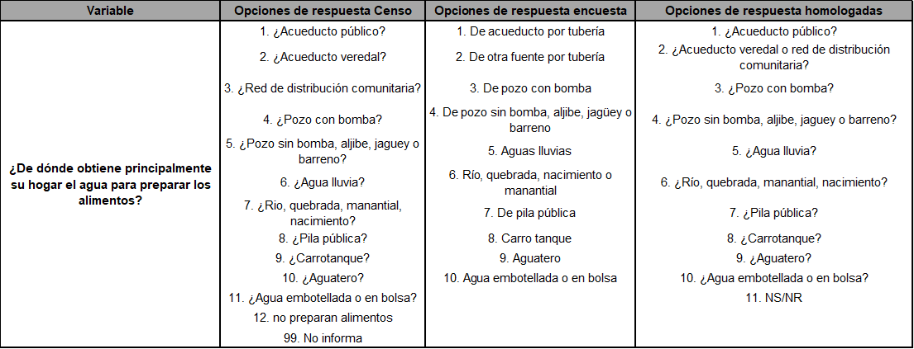


### ¿Cuál es el nivel educativo más alto alcanzado por ... y el último año o grado aprobado en ese nivel? {-}
  1.    La opción de respuesta 10 del censo se recodificó en la categoría “1. Ninguno”.
  
  2.    La opción de respuesta 1 del censo se recodificó en la categoría “2. Preescolar”.
  
  3.    La opción de respuesta 2 del censo se recodificó en la categoría “3. Básica primaria (1o - 5o)”
  
  4.    La opción de respuesta 3 del censo se recodificó en la categoría “4. Básica secundaria (6o - 9o)”
  
  5.    En el censo se unieron las opciones de respuesta 4, 5 y 6 en la categoría unificada “5. Media (10o - 13o)”
  
  6.    En el censo se unieron las opciones de respuesta 7, 8 y 9 en la categoría unificada “Superior o universitaria”
  
  7.    Las opciones de respuesta 99 y 9 del censo y la encuesta, respectivamente, se recodificaron en la categoría “No sabe, no informa”


### ¿En qué actividad ocupó ... la mayor parte del tiempo la semana pasada? {-}
  1.    En el censo se unieron las opciones de respuesta 1, 2 y 3 en la categoría unificada “1. Trabajando”
  
  2.    La opción de respuesta 4 en el censo se recodificó en la categoría “2. Buscando trabajo”
  
  3.    La opción de respuesta 6 en el censo se recodificó en la categoría “3. Estudiando”
  
  4.    La opción de respuesta 7 del censo se recodificó en la categoría “4. Oficios del hogar”
  
  5.    La opción de respuesta 8 del censo se recodificó en la categoría “5. Incapacitado permanente para trabajar”
  
  6.    En el censo se unieron las opciones de respuesta 5 y 9 en la categoría unificada “6. Otra actividad”
  
  7.    La opción de respuesta 0 del censo se recodificó en la categoría “7. No informa, No aplica”
  


### ¿Actualmente el estado civil de … es: {-}

  1.    En la encuesta, se unieron las opciones de respuesta 1 y 2 en la categoría unificada “1. Unión libre”
  2.    En la encuesta, la opción de respuesta 3 se recodificó en la categoría “2. Casado(a)”
  3.    En el censo se unieron las opciones de respuesta 3, 4 y 5 en la categoría unificada “3. Está separado (a) o divorciado (a)”; en la encuesta, se recodificó la opción de respuesta 4 en esta categoría unificada.
  4.    Las opciones de respuesta 6 y 5 del censo y la encuesta, respectivamente, se recodificaron en la categoría unificada “4. Está viudo (a)”
  5.    Las opciones de respuesta 7 y 6 del censo y la encuesta, respectivamente, se recodificaron en la categoría unificada “Está soltero (a)”
  6.    Las demás opciones del censo y la encuesta se clasificaron en la categoría “6. No Informa, No Aplica”

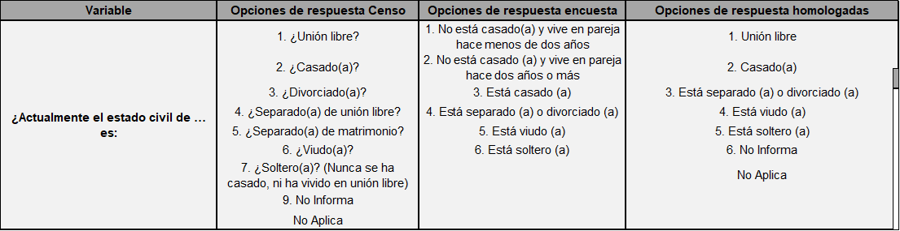

### Indicadores 

Empleando la variable V313 se creó una variable dicotómica que permite identificar las mujeres que indican estar utilizando actualmente algún método anticonceptivo (folclóricos, tradicionales y/o modernos).  


De forma similar se define la variable dummy para métodos de planificación familiar modernos (D6m)


Para la estimación de las mujeres con necesidades de planificación familiar insatisfechas (NI) se consideran aquellas que, deseando utilizar algún método de planificación familiar, no tienen acceso o no los utilizan por algún motivo. En la estimación de este indicador no se consideran las mujeres sexualmente activas ya que a nivel censal no son posibles de identificar. Por tal motivo, se define S'⊂S el subconjunto de mujeres que declaran tener una unión consensual o estar casadas.


`

El indicador de necesidades satisfechas de planificación por métodos modernos (D7) no se crea a partir de las variables originales de la encuesta, ya que es una razón entre los otros tres indicadores creados así:


$$
D7 = \frac{D6m}{D6 +NI}
$$


### 	Variables para el diseño muestral

-   Unidad primaria de muestreo - UPM
    
    Para la definifición de esta variable, se emplea la variable original de la encuesta “hv021”. 
    
-   Estrato

    Para la definifición de esta variable, se emplea la variable original de la encuesta “hv023”.
    
-   Factor ponderador - fexp

    El factor de expansión estaconsiganado en la variable  “v005”. Apartir de este de define el _factor ponderador_ el cual requiere que al valor de la variable se le multiplique una constante  la cual hace referencia al número de mujeres en edad fértil (15 a 49 años); y, a ese valor se divide por la suma de la variable(V005).  

La tabla resultante se muestra en la siguiente tabla. 


```r
encuesta_mrp <- readRDS("Recursos/Día4/Sesion3/UNFPA/D6/encuesta_mrp.rds") %>% 
  rename(dam2 = mpio)
tba(encuesta_mrp %>% head(10))
```

<table class="table table-striped lightable-classic" style="width: auto !important; margin-left: auto; margin-right: auto; font-family: Arial Narrow; width: auto !important; margin-left: auto; margin-right: auto;">
 <thead>
  <tr>
   <th style="text-align:left;"> dam2 </th>
   <th style="text-align:right;"> usametodo </th>
   <th style="text-align:right;"> usamoderno </th>
   <th style="text-align:right;"> necesInst </th>
   <th style="text-align:left;"> area </th>
   <th style="text-align:left;"> edad </th>
   <th style="text-align:left;"> etnia </th>
   <th style="text-align:left;"> anoest </th>
   <th style="text-align:left;"> unida </th>
   <th style="text-align:right;"> upm </th>
   <th style="text-align:right;"> estrato </th>
   <th style="text-align:right;"> fexp </th>
   <th style="text-align:right;"> pobreza </th>
  </tr>
 </thead>
<tbody>
  <tr>
   <td style="text-align:left;"> 44001 </td>
   <td style="text-align:right;"> 0 </td>
   <td style="text-align:right;"> 0 </td>
   <td style="text-align:right;"> 0 </td>
   <td style="text-align:left;"> 1 </td>
   <td style="text-align:left;"> 5 </td>
   <td style="text-align:left;"> 2 </td>
   <td style="text-align:left;"> 4 </td>
   <td style="text-align:left;"> 2 </td>
   <td style="text-align:right;"> 1 </td>
   <td style="text-align:right;"> 1 </td>
   <td style="text-align:right;"> 97.4251 </td>
   <td style="text-align:right;"> 0 </td>
  </tr>
  <tr>
   <td style="text-align:left;"> 44001 </td>
   <td style="text-align:right;"> 1 </td>
   <td style="text-align:right;"> 1 </td>
   <td style="text-align:right;"> 0 </td>
   <td style="text-align:left;"> 1 </td>
   <td style="text-align:left;"> 3 </td>
   <td style="text-align:left;"> 2 </td>
   <td style="text-align:left;"> 4 </td>
   <td style="text-align:left;"> 2 </td>
   <td style="text-align:right;"> 1 </td>
   <td style="text-align:right;"> 1 </td>
   <td style="text-align:right;"> 104.4266 </td>
   <td style="text-align:right;"> 1 </td>
  </tr>
  <tr>
   <td style="text-align:left;"> 44001 </td>
   <td style="text-align:right;"> 0 </td>
   <td style="text-align:right;"> 0 </td>
   <td style="text-align:right;"> 0 </td>
   <td style="text-align:left;"> 1 </td>
   <td style="text-align:left;"> 2 </td>
   <td style="text-align:left;"> 1 </td>
   <td style="text-align:left;"> 4 </td>
   <td style="text-align:left;"> 2 </td>
   <td style="text-align:right;"> 1 </td>
   <td style="text-align:right;"> 1 </td>
   <td style="text-align:right;"> 88.9573 </td>
   <td style="text-align:right;"> 0 </td>
  </tr>
  <tr>
   <td style="text-align:left;"> 44001 </td>
   <td style="text-align:right;"> 1 </td>
   <td style="text-align:right;"> 0 </td>
   <td style="text-align:right;"> 0 </td>
   <td style="text-align:left;"> 1 </td>
   <td style="text-align:left;"> 5 </td>
   <td style="text-align:left;"> 1 </td>
   <td style="text-align:left;"> 4 </td>
   <td style="text-align:left;"> 1 </td>
   <td style="text-align:right;"> 1 </td>
   <td style="text-align:right;"> 1 </td>
   <td style="text-align:right;"> 112.5635 </td>
   <td style="text-align:right;"> 1 </td>
  </tr>
  <tr>
   <td style="text-align:left;"> 44001 </td>
   <td style="text-align:right;"> 1 </td>
   <td style="text-align:right;"> 1 </td>
   <td style="text-align:right;"> 0 </td>
   <td style="text-align:left;"> 1 </td>
   <td style="text-align:left;"> 5 </td>
   <td style="text-align:left;"> 2 </td>
   <td style="text-align:left;"> 4 </td>
   <td style="text-align:left;"> 2 </td>
   <td style="text-align:right;"> 1 </td>
   <td style="text-align:right;"> 1 </td>
   <td style="text-align:right;"> 112.5635 </td>
   <td style="text-align:right;"> 1 </td>
  </tr>
  <tr>
   <td style="text-align:left;"> 44001 </td>
   <td style="text-align:right;"> 1 </td>
   <td style="text-align:right;"> 1 </td>
   <td style="text-align:right;"> 0 </td>
   <td style="text-align:left;"> 1 </td>
   <td style="text-align:left;"> 3 </td>
   <td style="text-align:left;"> 2 </td>
   <td style="text-align:left;"> 4 </td>
   <td style="text-align:left;"> 2 </td>
   <td style="text-align:right;"> 1 </td>
   <td style="text-align:right;"> 1 </td>
   <td style="text-align:right;"> 101.7686 </td>
   <td style="text-align:right;"> 1 </td>
  </tr>
  <tr>
   <td style="text-align:left;"> 44001 </td>
   <td style="text-align:right;"> 0 </td>
   <td style="text-align:right;"> 0 </td>
   <td style="text-align:right;"> 0 </td>
   <td style="text-align:left;"> 1 </td>
   <td style="text-align:left;"> 5 </td>
   <td style="text-align:left;"> 2 </td>
   <td style="text-align:left;"> 3 </td>
   <td style="text-align:left;"> 2 </td>
   <td style="text-align:right;"> 1 </td>
   <td style="text-align:right;"> 1 </td>
   <td style="text-align:right;"> 97.4251 </td>
   <td style="text-align:right;"> 0 </td>
  </tr>
  <tr>
   <td style="text-align:left;"> 44001 </td>
   <td style="text-align:right;"> 0 </td>
   <td style="text-align:right;"> 0 </td>
   <td style="text-align:right;"> 1 </td>
   <td style="text-align:left;"> 1 </td>
   <td style="text-align:left;"> 3 </td>
   <td style="text-align:left;"> 3 </td>
   <td style="text-align:left;"> 4 </td>
   <td style="text-align:left;"> 2 </td>
   <td style="text-align:right;"> 1 </td>
   <td style="text-align:right;"> 1 </td>
   <td style="text-align:right;"> 101.7686 </td>
   <td style="text-align:right;"> 0 </td>
  </tr>
  <tr>
   <td style="text-align:left;"> 44001 </td>
   <td style="text-align:right;"> 0 </td>
   <td style="text-align:right;"> 0 </td>
   <td style="text-align:right;"> 0 </td>
   <td style="text-align:left;"> 1 </td>
   <td style="text-align:left;"> 2 </td>
   <td style="text-align:left;"> 1 </td>
   <td style="text-align:left;"> 4 </td>
   <td style="text-align:left;"> 2 </td>
   <td style="text-align:right;"> 1 </td>
   <td style="text-align:right;"> 1 </td>
   <td style="text-align:right;"> 88.9573 </td>
   <td style="text-align:right;"> 0 </td>
  </tr>
  <tr>
   <td style="text-align:left;"> 44001 </td>
   <td style="text-align:right;"> 0 </td>
   <td style="text-align:right;"> 0 </td>
   <td style="text-align:right;"> 0 </td>
   <td style="text-align:left;"> 1 </td>
   <td style="text-align:left;"> 2 </td>
   <td style="text-align:left;"> 1 </td>
   <td style="text-align:left;"> 3 </td>
   <td style="text-align:left;"> 2 </td>
   <td style="text-align:right;"> 1 </td>
   <td style="text-align:right;"> 1 </td>
   <td style="text-align:right;"> 88.9573 </td>
   <td style="text-align:right;"> 0 </td>
  </tr>
</tbody>
</table>


## Censos de población y vivienda

Es necesario definir las variables del país con los que se desea trabajar. De acuerdo a esto, como primer paso se debe tener acceso al censo del país, para ello puede acceder desde el siguiente enlace <https://redatam.org/en/microdata> en el cual dispondrá de un archivo *.zip* con los microdatos del país. Ahora bien, para leer el conjunto de datos, es necesario emplear la función redatam.open de la librería `redatam`, la cual depende directamente del diccionario censal del software REDATAM, este es un archivo con extensión dicx y que debe encontrarse en la carpeta sobre los datos que se están leyendo. Así, es como se crea un objeto dentro de `R` que hace la respectiva unión del diccionario con los microdatos de la base de datos censal. La siguiente sintaxis muestra la lectura del diccionario en `R` y los cálculos iniciales

 


```r
library(redatam)
colombia <-  redatam.open( "Recursos/Día4/Sesion3/UNFPA/D6/Data/cpv2018col-cde.dicX")

CONTEOS <- redatam.query(colombia, "freq MUPIO.REDCODEN
                      by CLASE.AREA
                      by PERSONA.P_SEXO
                      by PERSONA.P_EDAD
                      by PERSONA.UnidasR
                      by PERSONA.EDUCA
                      by PERSONA.PBLOPER
                      ", tot.omit = FALSE)
# Eliminando totales de la tabla
CONTEOS2 <- CONTEOS %>% filter_at(vars(matches("_label")),all_vars(. !=  "__tot__"))

#### elimando las edades menores a 10 años 

CONTEOS2 <- CONTEOS2 %>%  filter(P_EDAD4_value >= 12)
```

Después de realizar algunas validaciones se estandarizan las variables como muestra el siguiente código.


```r
censo_mrp <- CONTEOS2 %>%
  transmute(
    dam2 = str_pad(
      string = REDCODEN1_value,
      width = 5,
      pad = "0"
    ),
    area = case_when(AREA2_value == 1 ~ "1", # 1 = Urbana
                     TRUE ~ "0"  # 0 = Rural),
                     sexo = as.character(P_SEXO3_value),
                     
                     edad = case_when(P_EDAD4_value %in% 0:14 ~  "1",# 5 a 14
                                      P_EDAD4_value %in% 15:20 ~ "2",# 15 a 20
                                      P_EDAD4_value %in% 21:30 ~ "3",# 21 a 30
                                      P_EDAD4_value %in% 31:39 ~ "4",# 31 a 39
                                      P_EDAD4_value %in% 40:49 ~ "5",# 40 a 49TRUE ~ "6"
                     ),
                     
                     anoest = case_when(EDUCA6_value == 98  ~ "98",# No aplica
                                        EDUCA6_value == 99  ~ "99",#NS/NR
                                        EDUCA6_value == 1   ~ "1",# Sin educacion
                                        EDUCA6_value == 2   ~ "2",# 1-6
                                        EDUCA6_value == 3   ~ "3",# 7-12
                                        EDUCA6_value == 4   ~ "4" ,# 12 o mas
                                        TRUE ~ "Error"
                     ),
                     etnia = case_when(PBLOPER7_value %in% c(1) ~ "1",#indigena
                                       PBLOPER7_value %in% c(2) ~ "2",#afro negro mulato
                                       TRUE ~ "3"  # Otro
                     ),
                     
                     unida = case_when(UnidasR5_value == 1 ~ "1", # Unida
                                       TRUE ~ "2" # Otro
                                       ), 
                     value
                     ) %>% group_by(dam2, area, sexo,
                                    edad, etnia, anoest, unida) %>%
      summarise(n = sum(value), .groups = "drop")
```

La tabla resultante se muestra en la siguiente tabla. 


```r
censo_mrp <- readRDS("Recursos/Día4/Sesion3/UNFPA/D6/censo_mrp.rds") 

tba(censo_mrp %>% head(10))
```

<table class="table table-striped lightable-classic" style="width: auto !important; margin-left: auto; margin-right: auto; font-family: Arial Narrow; width: auto !important; margin-left: auto; margin-right: auto;">
 <thead>
  <tr>
   <th style="text-align:left;"> dam2 </th>
   <th style="text-align:left;"> area </th>
   <th style="text-align:left;"> sexo </th>
   <th style="text-align:left;"> edad </th>
   <th style="text-align:left;"> etnia </th>
   <th style="text-align:left;"> anoest </th>
   <th style="text-align:left;"> unida </th>
   <th style="text-align:right;"> n </th>
  </tr>
 </thead>
<tbody>
  <tr>
   <td style="text-align:left;"> 05001 </td>
   <td style="text-align:left;"> 0 </td>
   <td style="text-align:left;"> 2 </td>
   <td style="text-align:left;"> 2 </td>
   <td style="text-align:left;"> 1 </td>
   <td style="text-align:left;"> 1 </td>
   <td style="text-align:left;"> 1 </td>
   <td style="text-align:right;"> 2 </td>
  </tr>
  <tr>
   <td style="text-align:left;"> 05001 </td>
   <td style="text-align:left;"> 0 </td>
   <td style="text-align:left;"> 2 </td>
   <td style="text-align:left;"> 2 </td>
   <td style="text-align:left;"> 1 </td>
   <td style="text-align:left;"> 2 </td>
   <td style="text-align:left;"> 1 </td>
   <td style="text-align:right;"> 2 </td>
  </tr>
  <tr>
   <td style="text-align:left;"> 05001 </td>
   <td style="text-align:left;"> 0 </td>
   <td style="text-align:left;"> 2 </td>
   <td style="text-align:left;"> 2 </td>
   <td style="text-align:left;"> 1 </td>
   <td style="text-align:left;"> 4 </td>
   <td style="text-align:left;"> 2 </td>
   <td style="text-align:right;"> 5 </td>
  </tr>
  <tr>
   <td style="text-align:left;"> 05001 </td>
   <td style="text-align:left;"> 0 </td>
   <td style="text-align:left;"> 2 </td>
   <td style="text-align:left;"> 2 </td>
   <td style="text-align:left;"> 2 </td>
   <td style="text-align:left;"> 2 </td>
   <td style="text-align:left;"> 1 </td>
   <td style="text-align:right;"> 2 </td>
  </tr>
  <tr>
   <td style="text-align:left;"> 05001 </td>
   <td style="text-align:left;"> 0 </td>
   <td style="text-align:left;"> 2 </td>
   <td style="text-align:left;"> 2 </td>
   <td style="text-align:left;"> 2 </td>
   <td style="text-align:left;"> 2 </td>
   <td style="text-align:left;"> 2 </td>
   <td style="text-align:right;"> 3 </td>
  </tr>
  <tr>
   <td style="text-align:left;"> 05001 </td>
   <td style="text-align:left;"> 0 </td>
   <td style="text-align:left;"> 2 </td>
   <td style="text-align:left;"> 2 </td>
   <td style="text-align:left;"> 2 </td>
   <td style="text-align:left;"> 3 </td>
   <td style="text-align:left;"> 1 </td>
   <td style="text-align:right;"> 2 </td>
  </tr>
  <tr>
   <td style="text-align:left;"> 05001 </td>
   <td style="text-align:left;"> 0 </td>
   <td style="text-align:left;"> 2 </td>
   <td style="text-align:left;"> 2 </td>
   <td style="text-align:left;"> 2 </td>
   <td style="text-align:left;"> 3 </td>
   <td style="text-align:left;"> 2 </td>
   <td style="text-align:right;"> 10 </td>
  </tr>
  <tr>
   <td style="text-align:left;"> 05001 </td>
   <td style="text-align:left;"> 0 </td>
   <td style="text-align:left;"> 2 </td>
   <td style="text-align:left;"> 2 </td>
   <td style="text-align:left;"> 2 </td>
   <td style="text-align:left;"> 99 </td>
   <td style="text-align:left;"> 2 </td>
   <td style="text-align:right;"> 2 </td>
  </tr>
  <tr>
   <td style="text-align:left;"> 05001 </td>
   <td style="text-align:left;"> 0 </td>
   <td style="text-align:left;"> 2 </td>
   <td style="text-align:left;"> 2 </td>
   <td style="text-align:left;"> 3 </td>
   <td style="text-align:left;"> 1 </td>
   <td style="text-align:left;"> 1 </td>
   <td style="text-align:right;"> 4 </td>
  </tr>
  <tr>
   <td style="text-align:left;"> 05001 </td>
   <td style="text-align:left;"> 0 </td>
   <td style="text-align:left;"> 2 </td>
   <td style="text-align:left;"> 2 </td>
   <td style="text-align:left;"> 3 </td>
   <td style="text-align:left;"> 1 </td>
   <td style="text-align:left;"> 2 </td>
   <td style="text-align:right;"> 23 </td>
  </tr>
</tbody>
</table>


## Imagenes satelitales como información auxiliar

En la actualidad los datos satelitales que se usan para los diferentes estudios realizados por CEPAL, se obtienen de la plataforma Google Earth Engine ; la cual, integra diferentes lenguajes de programación como Javascript, Python y R mediante el paquete rgee, recientemente vinculado (2021). Todas estas herramientas juntas, permiten obtener imágenes satelitales de los lugares de interés para integrar a la información que ya se tiene disponible y así mejorar la calidad de las estimaciones.

La información satelital empleada para el calculo de los indicadores es la siguiente: 


-   Luces nocturnas 
    
    En su nombre original “Nighttime Lights Time Series Version 4, Defense Meteorological Program Operational Linescan System”. Este es un sistema de datos de uso público, recopilados por la Agencia Meteorológica de la Fuerza Aérea de EE. UU. Pero el procesamiento de las imágenes y los datos es realizado por el Centro Nacional de Datos Geofísicos de la NOAA.

-   Cubrimiento urbano y cubrimiento cultivo
 
    En su nombre original “Copernicus Global Land Cover Layers: CGLS-LC100 Collection 3” Estos mapas se encuentran disponibles para los periodos 2015-2019 en todo el mundo. Este esquema de clasificación según Google, puede representar áreas de cobertura terrestre heterogénea mejor que el esquema de clasificación estándar y, como tal, se puede adaptar para el uso de diferentes aplicaciones, por ejemplo, monitoreo forestal, monitoreo de cultivos, biodiversidad y conservación, monitoreo ambiental y seguridad en África, modelado climático, entre muchos otros.

La base consolidada es se muestra a continuación:  


```r
statelevel_predictors_df <- readRDS("Recursos/Día4/Sesion3/UNFPA/D6/statelevel_predictors_df_dam2.rds")
tba(statelevel_predictors_df %>% head(10))
```

<table class="table table-striped lightable-classic" style="width: auto !important; margin-left: auto; margin-right: auto; font-family: Arial Narrow; width: auto !important; margin-left: auto; margin-right: auto;">
 <thead>
  <tr>
   <th style="text-align:left;"> dam </th>
   <th style="text-align:left;"> dam2 </th>
   <th style="text-align:right;"> area1 </th>
   <th style="text-align:right;"> sexo2 </th>
   <th style="text-align:right;"> edad2 </th>
   <th style="text-align:right;"> edad3 </th>
   <th style="text-align:right;"> edad4 </th>
   <th style="text-align:right;"> edad5 </th>
   <th style="text-align:right;"> etnia2 </th>
   <th style="text-align:right;"> anoest2 </th>
   <th style="text-align:right;"> anoest3 </th>
   <th style="text-align:right;"> anoest4 </th>
   <th style="text-align:right;"> etnia1 </th>
   <th style="text-align:right;"> tiene_acueducto </th>
   <th style="text-align:right;"> piso_tierra </th>
   <th style="text-align:right;"> alfabeta </th>
   <th style="text-align:right;"> hacinamiento </th>
   <th style="text-align:right;"> tasa_desocupacion </th>
   <th style="text-align:right;"> luces_nocturnas </th>
   <th style="text-align:right;"> cubrimiento_cultivo </th>
   <th style="text-align:right;"> cubrimiento_urbano </th>
   <th style="text-align:right;"> modificacion_humana </th>
   <th style="text-align:right;"> accesibilidad_hospitales </th>
   <th style="text-align:right;"> accesibilidad_hosp_caminado </th>
  </tr>
 </thead>
<tbody>
  <tr>
   <td style="text-align:left;"> 05 </td>
   <td style="text-align:left;"> 05001 </td>
   <td style="text-align:right;"> 0.9832 </td>
   <td style="text-align:right;"> 0.5299 </td>
   <td style="text-align:right;"> 0.2671 </td>
   <td style="text-align:right;"> 0.2201 </td>
   <td style="text-align:right;"> 0.2355 </td>
   <td style="text-align:right;"> 0.1060 </td>
   <td style="text-align:right;"> 0.0251 </td>
   <td style="text-align:right;"> 0.2598 </td>
   <td style="text-align:right;"> 0.4048 </td>
   <td style="text-align:right;"> 0.2287 </td>
   <td style="text-align:right;"> 0.0009 </td>
   <td style="text-align:right;"> 0.0354 </td>
   <td style="text-align:right;"> 0.0024 </td>
   <td style="text-align:right;"> 0.0258 </td>
   <td style="text-align:right;"> 0.0833 </td>
   <td style="text-align:right;"> 0.0062 </td>
   <td style="text-align:right;"> 46.0570 </td>
   <td style="text-align:right;"> 2.0996 </td>
   <td style="text-align:right;"> 29.9636 </td>
   <td style="text-align:right;"> 0.6882 </td>
   <td style="text-align:right;"> 9.4651 </td>
   <td style="text-align:right;"> 44.0778 </td>
  </tr>
  <tr>
   <td style="text-align:left;"> 05 </td>
   <td style="text-align:left;"> 05002 </td>
   <td style="text-align:right;"> 0.3953 </td>
   <td style="text-align:right;"> 0.4807 </td>
   <td style="text-align:right;"> 0.2229 </td>
   <td style="text-align:right;"> 0.1977 </td>
   <td style="text-align:right;"> 0.2497 </td>
   <td style="text-align:right;"> 0.1281 </td>
   <td style="text-align:right;"> 0.0035 </td>
   <td style="text-align:right;"> 0.5644 </td>
   <td style="text-align:right;"> 0.2393 </td>
   <td style="text-align:right;"> 0.0473 </td>
   <td style="text-align:right;"> 0.0001 </td>
   <td style="text-align:right;"> 0.3416 </td>
   <td style="text-align:right;"> 0.0160 </td>
   <td style="text-align:right;"> 0.1139 </td>
   <td style="text-align:right;"> 0.1395 </td>
   <td style="text-align:right;"> 0.0000 </td>
   <td style="text-align:right;"> 2.3771 </td>
   <td style="text-align:right;"> 1.3245 </td>
   <td style="text-align:right;"> 0.5746 </td>
   <td style="text-align:right;"> 0.3308 </td>
   <td style="text-align:right;"> 29.8317 </td>
   <td style="text-align:right;"> 117.6962 </td>
  </tr>
  <tr>
   <td style="text-align:left;"> 05 </td>
   <td style="text-align:left;"> 05004 </td>
   <td style="text-align:right;"> 0.3279 </td>
   <td style="text-align:right;"> 0.4576 </td>
   <td style="text-align:right;"> 0.2376 </td>
   <td style="text-align:right;"> 0.2075 </td>
   <td style="text-align:right;"> 0.2316 </td>
   <td style="text-align:right;"> 0.1218 </td>
   <td style="text-align:right;"> 0.0199 </td>
   <td style="text-align:right;"> 0.4470 </td>
   <td style="text-align:right;"> 0.3460 </td>
   <td style="text-align:right;"> 0.0723 </td>
   <td style="text-align:right;"> 0.0000 </td>
   <td style="text-align:right;"> 0.3694 </td>
   <td style="text-align:right;"> 0.0325 </td>
   <td style="text-align:right;"> 0.0787 </td>
   <td style="text-align:right;"> 0.1557 </td>
   <td style="text-align:right;"> 0.0000 </td>
   <td style="text-align:right;"> 0.0166 </td>
   <td style="text-align:right;"> 1.6378 </td>
   <td style="text-align:right;"> 0.1090 </td>
   <td style="text-align:right;"> 0.2359 </td>
   <td style="text-align:right;"> 190.7249 </td>
   <td style="text-align:right;"> 374.5716 </td>
  </tr>
  <tr>
   <td style="text-align:left;"> 05 </td>
   <td style="text-align:left;"> 05021 </td>
   <td style="text-align:right;"> 0.5770 </td>
   <td style="text-align:right;"> 0.5020 </td>
   <td style="text-align:right;"> 0.2191 </td>
   <td style="text-align:right;"> 0.1946 </td>
   <td style="text-align:right;"> 0.2357 </td>
   <td style="text-align:right;"> 0.1274 </td>
   <td style="text-align:right;"> 0.0031 </td>
   <td style="text-align:right;"> 0.5038 </td>
   <td style="text-align:right;"> 0.2727 </td>
   <td style="text-align:right;"> 0.0716 </td>
   <td style="text-align:right;"> 0.0000 </td>
   <td style="text-align:right;"> 0.2785 </td>
   <td style="text-align:right;"> 0.0255 </td>
   <td style="text-align:right;"> 0.0959 </td>
   <td style="text-align:right;"> 0.1025 </td>
   <td style="text-align:right;"> 0.0000 </td>
   <td style="text-align:right;"> 1.3175 </td>
   <td style="text-align:right;"> 0.2404 </td>
   <td style="text-align:right;"> 0.5571 </td>
   <td style="text-align:right;"> 0.2923 </td>
   <td style="text-align:right;"> 48.9781 </td>
   <td style="text-align:right;"> 198.3024 </td>
  </tr>
  <tr>
   <td style="text-align:left;"> 05 </td>
   <td style="text-align:left;"> 05030 </td>
   <td style="text-align:right;"> 0.4859 </td>
   <td style="text-align:right;"> 0.5063 </td>
   <td style="text-align:right;"> 0.2571 </td>
   <td style="text-align:right;"> 0.2047 </td>
   <td style="text-align:right;"> 0.2507 </td>
   <td style="text-align:right;"> 0.0997 </td>
   <td style="text-align:right;"> 0.0048 </td>
   <td style="text-align:right;"> 0.4130 </td>
   <td style="text-align:right;"> 0.3756 </td>
   <td style="text-align:right;"> 0.0828 </td>
   <td style="text-align:right;"> 0.0003 </td>
   <td style="text-align:right;"> 0.0775 </td>
   <td style="text-align:right;"> 0.0143 </td>
   <td style="text-align:right;"> 0.0844 </td>
   <td style="text-align:right;"> 0.1176 </td>
   <td style="text-align:right;"> 0.0000 </td>
   <td style="text-align:right;"> 14.6406 </td>
   <td style="text-align:right;"> 2.1799 </td>
   <td style="text-align:right;"> 4.1714 </td>
   <td style="text-align:right;"> 0.5169 </td>
   <td style="text-align:right;"> 20.6806 </td>
   <td style="text-align:right;"> 114.7760 </td>
  </tr>
  <tr>
   <td style="text-align:left;"> 05 </td>
   <td style="text-align:left;"> 05031 </td>
   <td style="text-align:right;"> 0.5766 </td>
   <td style="text-align:right;"> 0.4978 </td>
   <td style="text-align:right;"> 0.2695 </td>
   <td style="text-align:right;"> 0.1961 </td>
   <td style="text-align:right;"> 0.2047 </td>
   <td style="text-align:right;"> 0.0850 </td>
   <td style="text-align:right;"> 0.0050 </td>
   <td style="text-align:right;"> 0.4618 </td>
   <td style="text-align:right;"> 0.2981 </td>
   <td style="text-align:right;"> 0.0585 </td>
   <td style="text-align:right;"> 0.0001 </td>
   <td style="text-align:right;"> 0.4010 </td>
   <td style="text-align:right;"> 0.0970 </td>
   <td style="text-align:right;"> 0.1200 </td>
   <td style="text-align:right;"> 0.1417 </td>
   <td style="text-align:right;"> 0.0000 </td>
   <td style="text-align:right;"> 0.8686 </td>
   <td style="text-align:right;"> 0.1123 </td>
   <td style="text-align:right;"> 0.2894 </td>
   <td style="text-align:right;"> 0.2524 </td>
   <td style="text-align:right;"> 172.8254 </td>
   <td style="text-align:right;"> 566.6894 </td>
  </tr>
  <tr>
   <td style="text-align:left;"> 05 </td>
   <td style="text-align:left;"> 05034 </td>
   <td style="text-align:right;"> 0.5029 </td>
   <td style="text-align:right;"> 0.4815 </td>
   <td style="text-align:right;"> 0.2530 </td>
   <td style="text-align:right;"> 0.2052 </td>
   <td style="text-align:right;"> 0.2324 </td>
   <td style="text-align:right;"> 0.1042 </td>
   <td style="text-align:right;"> 0.0060 </td>
   <td style="text-align:right;"> 0.4731 </td>
   <td style="text-align:right;"> 0.2976 </td>
   <td style="text-align:right;"> 0.0634 </td>
   <td style="text-align:right;"> 0.0065 </td>
   <td style="text-align:right;"> 0.3435 </td>
   <td style="text-align:right;"> 0.0069 </td>
   <td style="text-align:right;"> 0.1089 </td>
   <td style="text-align:right;"> 0.1301 </td>
   <td style="text-align:right;"> 0.0000 </td>
   <td style="text-align:right;"> 2.9262 </td>
   <td style="text-align:right;"> 1.5261 </td>
   <td style="text-align:right;"> 0.4212 </td>
   <td style="text-align:right;"> 0.3640 </td>
   <td style="text-align:right;"> 154.5638 </td>
   <td style="text-align:right;"> 250.6593 </td>
  </tr>
  <tr>
   <td style="text-align:left;"> 05 </td>
   <td style="text-align:left;"> 05036 </td>
   <td style="text-align:right;"> 0.3931 </td>
   <td style="text-align:right;"> 0.4951 </td>
   <td style="text-align:right;"> 0.2447 </td>
   <td style="text-align:right;"> 0.1955 </td>
   <td style="text-align:right;"> 0.2435 </td>
   <td style="text-align:right;"> 0.1142 </td>
   <td style="text-align:right;"> 0.0054 </td>
   <td style="text-align:right;"> 0.4808 </td>
   <td style="text-align:right;"> 0.3010 </td>
   <td style="text-align:right;"> 0.0591 </td>
   <td style="text-align:right;"> 0.0006 </td>
   <td style="text-align:right;"> 0.1341 </td>
   <td style="text-align:right;"> 0.0227 </td>
   <td style="text-align:right;"> 0.1100 </td>
   <td style="text-align:right;"> 0.1561 </td>
   <td style="text-align:right;"> 0.0000 </td>
   <td style="text-align:right;"> 10.9347 </td>
   <td style="text-align:right;"> 1.0856 </td>
   <td style="text-align:right;"> 0.4777 </td>
   <td style="text-align:right;"> 0.4690 </td>
   <td style="text-align:right;"> 14.8265 </td>
   <td style="text-align:right;"> 52.4699 </td>
  </tr>
  <tr>
   <td style="text-align:left;"> 05 </td>
   <td style="text-align:left;"> 05038 </td>
   <td style="text-align:right;"> 0.2256 </td>
   <td style="text-align:right;"> 0.4927 </td>
   <td style="text-align:right;"> 0.2659 </td>
   <td style="text-align:right;"> 0.1984 </td>
   <td style="text-align:right;"> 0.2049 </td>
   <td style="text-align:right;"> 0.0904 </td>
   <td style="text-align:right;"> 0.0050 </td>
   <td style="text-align:right;"> 0.5162 </td>
   <td style="text-align:right;"> 0.2696 </td>
   <td style="text-align:right;"> 0.0281 </td>
   <td style="text-align:right;"> 0.0000 </td>
   <td style="text-align:right;"> 0.2768 </td>
   <td style="text-align:right;"> 0.1011 </td>
   <td style="text-align:right;"> 0.1544 </td>
   <td style="text-align:right;"> 0.2247 </td>
   <td style="text-align:right;"> 0.0000 </td>
   <td style="text-align:right;"> 1.6735 </td>
   <td style="text-align:right;"> 2.0588 </td>
   <td style="text-align:right;"> 0.2453 </td>
   <td style="text-align:right;"> 0.3152 </td>
   <td style="text-align:right;"> 31.4797 </td>
   <td style="text-align:right;"> 157.8460 </td>
  </tr>
  <tr>
   <td style="text-align:left;"> 05 </td>
   <td style="text-align:left;"> 05040 </td>
   <td style="text-align:right;"> 0.4858 </td>
   <td style="text-align:right;"> 0.4826 </td>
   <td style="text-align:right;"> 0.2859 </td>
   <td style="text-align:right;"> 0.1982 </td>
   <td style="text-align:right;"> 0.1678 </td>
   <td style="text-align:right;"> 0.0641 </td>
   <td style="text-align:right;"> 0.0168 </td>
   <td style="text-align:right;"> 0.4928 </td>
   <td style="text-align:right;"> 0.2738 </td>
   <td style="text-align:right;"> 0.0361 </td>
   <td style="text-align:right;"> 0.0117 </td>
   <td style="text-align:right;"> 0.4961 </td>
   <td style="text-align:right;"> 0.0824 </td>
   <td style="text-align:right;"> 0.1253 </td>
   <td style="text-align:right;"> 0.1948 </td>
   <td style="text-align:right;"> 0.0000 </td>
   <td style="text-align:right;"> 0.5635 </td>
   <td style="text-align:right;"> 0.0442 </td>
   <td style="text-align:right;"> 0.1234 </td>
   <td style="text-align:right;"> 0.2251 </td>
   <td style="text-align:right;"> 184.8276 </td>
   <td style="text-align:right;"> 549.8350 </td>
  </tr>
</tbody>
</table>


##	Modelo MRP

De acuerdo con este modelo, como lo expone Gutiérrez y otros (2022), la probabilidad de hacer uso de métodos de planificación para la $i$-ésima persona en el $j$-ésimo post-estrato, puede ser definido para cada unidad de la encuesta. El modelo pretende establecer la relación entre la expectativa $\rho_{di}$  de la variable dicotómica con las covariables de información auxiliar disponibles para ser incluidas. El procedimiento correspondiente a este proceso, modela el logaritmo del cociente entre la probabilidad de usar algún método anticonceptivo a su complemento en relación al conjunto de covariables a nivel de unidad, $x_{ji}$, y los efectos aleatorios $u_d$

$$
\ln(\frac{ρ_{ji}}{1-ρ_{ji}} ) = x_{ji}^t \beta + u_d.
$$

Los coeficientes $\beta$ hacen referencia a los efectos fijos de las variables $x_{ji}^T$  sobre las probabilidades de que la $i$-ésima persona haga uso de métodos anticonceptivos. Ahora, es posible asumir distribuciones no informativas para $\beta$ y $\sigma_u^2$. 

$$
\begin{eqnarray*}
\beta  & \sim & N(0,1000) \\
\sigma_u^2 & \sim & IG(0.001,0.001) 
\end{eqnarray*}
$$


## Estimación del modelo para D6

Se debe cargar el archivo `encuesta_mrp.rds` y el archivo `statelevel_predictors_df.rds` creado previamente. A continuaciones preparamos los datos para el indicador *D6*


```r
byAgrega <- c( "dam2", "area", "edad", "etnia",  
               "anoest", "unida")  

encuesta_df_agg <-
  encuesta_mrp %>%
  group_by_at(all_of(byAgrega)) %>%
  summarise(n = n(),
            pobres = sum(usametodo), #D6
            nopobres = n - pobres, .groups = "drop") 

encuesta_df_agg %<>% inner_join(statelevel_predictors_df,   by = "dam2") 
tba(encuesta_df_agg %>% head(10))
```

<table class="table table-striped lightable-classic" style="width: auto !important; margin-left: auto; margin-right: auto; font-family: Arial Narrow; width: auto !important; margin-left: auto; margin-right: auto;">
 <thead>
  <tr>
   <th style="text-align:left;"> dam2 </th>
   <th style="text-align:left;"> area </th>
   <th style="text-align:left;"> edad </th>
   <th style="text-align:left;"> etnia </th>
   <th style="text-align:left;"> anoest </th>
   <th style="text-align:left;"> unida </th>
   <th style="text-align:right;"> n </th>
   <th style="text-align:right;"> pobres </th>
   <th style="text-align:right;"> nopobres </th>
   <th style="text-align:left;"> dam </th>
   <th style="text-align:right;"> area1 </th>
   <th style="text-align:right;"> sexo2 </th>
   <th style="text-align:right;"> edad2 </th>
   <th style="text-align:right;"> edad3 </th>
   <th style="text-align:right;"> edad4 </th>
   <th style="text-align:right;"> edad5 </th>
   <th style="text-align:right;"> etnia2 </th>
   <th style="text-align:right;"> anoest2 </th>
   <th style="text-align:right;"> anoest3 </th>
   <th style="text-align:right;"> anoest4 </th>
   <th style="text-align:right;"> etnia1 </th>
   <th style="text-align:right;"> tiene_acueducto </th>
   <th style="text-align:right;"> piso_tierra </th>
   <th style="text-align:right;"> alfabeta </th>
   <th style="text-align:right;"> hacinamiento </th>
   <th style="text-align:right;"> tasa_desocupacion </th>
   <th style="text-align:right;"> luces_nocturnas </th>
   <th style="text-align:right;"> cubrimiento_cultivo </th>
   <th style="text-align:right;"> cubrimiento_urbano </th>
   <th style="text-align:right;"> modificacion_humana </th>
   <th style="text-align:right;"> accesibilidad_hospitales </th>
   <th style="text-align:right;"> accesibilidad_hosp_caminado </th>
  </tr>
 </thead>
<tbody>
  <tr>
   <td style="text-align:left;"> 05001 </td>
   <td style="text-align:left;"> 0 </td>
   <td style="text-align:left;"> 2 </td>
   <td style="text-align:left;"> 3 </td>
   <td style="text-align:left;"> 3 </td>
   <td style="text-align:left;"> 1 </td>
   <td style="text-align:right;"> 1 </td>
   <td style="text-align:right;"> 1 </td>
   <td style="text-align:right;"> 0 </td>
   <td style="text-align:left;"> 05 </td>
   <td style="text-align:right;"> 0.9832 </td>
   <td style="text-align:right;"> 0.5299 </td>
   <td style="text-align:right;"> 0.2671 </td>
   <td style="text-align:right;"> 0.2201 </td>
   <td style="text-align:right;"> 0.2355 </td>
   <td style="text-align:right;"> 0.106 </td>
   <td style="text-align:right;"> 0.0251 </td>
   <td style="text-align:right;"> 0.2598 </td>
   <td style="text-align:right;"> 0.4048 </td>
   <td style="text-align:right;"> 0.2287 </td>
   <td style="text-align:right;"> 9e-04 </td>
   <td style="text-align:right;"> 0.0354 </td>
   <td style="text-align:right;"> 0.0024 </td>
   <td style="text-align:right;"> 0.0258 </td>
   <td style="text-align:right;"> 0.0833 </td>
   <td style="text-align:right;"> 0.0062 </td>
   <td style="text-align:right;"> 46.057 </td>
   <td style="text-align:right;"> 2.0996 </td>
   <td style="text-align:right;"> 29.9636 </td>
   <td style="text-align:right;"> 0.6882 </td>
   <td style="text-align:right;"> 9.4651 </td>
   <td style="text-align:right;"> 44.0778 </td>
  </tr>
  <tr>
   <td style="text-align:left;"> 05001 </td>
   <td style="text-align:left;"> 0 </td>
   <td style="text-align:left;"> 2 </td>
   <td style="text-align:left;"> 3 </td>
   <td style="text-align:left;"> 3 </td>
   <td style="text-align:left;"> 2 </td>
   <td style="text-align:right;"> 3 </td>
   <td style="text-align:right;"> 3 </td>
   <td style="text-align:right;"> 0 </td>
   <td style="text-align:left;"> 05 </td>
   <td style="text-align:right;"> 0.9832 </td>
   <td style="text-align:right;"> 0.5299 </td>
   <td style="text-align:right;"> 0.2671 </td>
   <td style="text-align:right;"> 0.2201 </td>
   <td style="text-align:right;"> 0.2355 </td>
   <td style="text-align:right;"> 0.106 </td>
   <td style="text-align:right;"> 0.0251 </td>
   <td style="text-align:right;"> 0.2598 </td>
   <td style="text-align:right;"> 0.4048 </td>
   <td style="text-align:right;"> 0.2287 </td>
   <td style="text-align:right;"> 9e-04 </td>
   <td style="text-align:right;"> 0.0354 </td>
   <td style="text-align:right;"> 0.0024 </td>
   <td style="text-align:right;"> 0.0258 </td>
   <td style="text-align:right;"> 0.0833 </td>
   <td style="text-align:right;"> 0.0062 </td>
   <td style="text-align:right;"> 46.057 </td>
   <td style="text-align:right;"> 2.0996 </td>
   <td style="text-align:right;"> 29.9636 </td>
   <td style="text-align:right;"> 0.6882 </td>
   <td style="text-align:right;"> 9.4651 </td>
   <td style="text-align:right;"> 44.0778 </td>
  </tr>
  <tr>
   <td style="text-align:left;"> 05001 </td>
   <td style="text-align:left;"> 0 </td>
   <td style="text-align:left;"> 3 </td>
   <td style="text-align:left;"> 3 </td>
   <td style="text-align:left;"> 3 </td>
   <td style="text-align:left;"> 1 </td>
   <td style="text-align:right;"> 1 </td>
   <td style="text-align:right;"> 1 </td>
   <td style="text-align:right;"> 0 </td>
   <td style="text-align:left;"> 05 </td>
   <td style="text-align:right;"> 0.9832 </td>
   <td style="text-align:right;"> 0.5299 </td>
   <td style="text-align:right;"> 0.2671 </td>
   <td style="text-align:right;"> 0.2201 </td>
   <td style="text-align:right;"> 0.2355 </td>
   <td style="text-align:right;"> 0.106 </td>
   <td style="text-align:right;"> 0.0251 </td>
   <td style="text-align:right;"> 0.2598 </td>
   <td style="text-align:right;"> 0.4048 </td>
   <td style="text-align:right;"> 0.2287 </td>
   <td style="text-align:right;"> 9e-04 </td>
   <td style="text-align:right;"> 0.0354 </td>
   <td style="text-align:right;"> 0.0024 </td>
   <td style="text-align:right;"> 0.0258 </td>
   <td style="text-align:right;"> 0.0833 </td>
   <td style="text-align:right;"> 0.0062 </td>
   <td style="text-align:right;"> 46.057 </td>
   <td style="text-align:right;"> 2.0996 </td>
   <td style="text-align:right;"> 29.9636 </td>
   <td style="text-align:right;"> 0.6882 </td>
   <td style="text-align:right;"> 9.4651 </td>
   <td style="text-align:right;"> 44.0778 </td>
  </tr>
  <tr>
   <td style="text-align:left;"> 05001 </td>
   <td style="text-align:left;"> 0 </td>
   <td style="text-align:left;"> 3 </td>
   <td style="text-align:left;"> 3 </td>
   <td style="text-align:left;"> 3 </td>
   <td style="text-align:left;"> 2 </td>
   <td style="text-align:right;"> 1 </td>
   <td style="text-align:right;"> 1 </td>
   <td style="text-align:right;"> 0 </td>
   <td style="text-align:left;"> 05 </td>
   <td style="text-align:right;"> 0.9832 </td>
   <td style="text-align:right;"> 0.5299 </td>
   <td style="text-align:right;"> 0.2671 </td>
   <td style="text-align:right;"> 0.2201 </td>
   <td style="text-align:right;"> 0.2355 </td>
   <td style="text-align:right;"> 0.106 </td>
   <td style="text-align:right;"> 0.0251 </td>
   <td style="text-align:right;"> 0.2598 </td>
   <td style="text-align:right;"> 0.4048 </td>
   <td style="text-align:right;"> 0.2287 </td>
   <td style="text-align:right;"> 9e-04 </td>
   <td style="text-align:right;"> 0.0354 </td>
   <td style="text-align:right;"> 0.0024 </td>
   <td style="text-align:right;"> 0.0258 </td>
   <td style="text-align:right;"> 0.0833 </td>
   <td style="text-align:right;"> 0.0062 </td>
   <td style="text-align:right;"> 46.057 </td>
   <td style="text-align:right;"> 2.0996 </td>
   <td style="text-align:right;"> 29.9636 </td>
   <td style="text-align:right;"> 0.6882 </td>
   <td style="text-align:right;"> 9.4651 </td>
   <td style="text-align:right;"> 44.0778 </td>
  </tr>
  <tr>
   <td style="text-align:left;"> 05001 </td>
   <td style="text-align:left;"> 0 </td>
   <td style="text-align:left;"> 4 </td>
   <td style="text-align:left;"> 3 </td>
   <td style="text-align:left;"> 3 </td>
   <td style="text-align:left;"> 1 </td>
   <td style="text-align:right;"> 1 </td>
   <td style="text-align:right;"> 1 </td>
   <td style="text-align:right;"> 0 </td>
   <td style="text-align:left;"> 05 </td>
   <td style="text-align:right;"> 0.9832 </td>
   <td style="text-align:right;"> 0.5299 </td>
   <td style="text-align:right;"> 0.2671 </td>
   <td style="text-align:right;"> 0.2201 </td>
   <td style="text-align:right;"> 0.2355 </td>
   <td style="text-align:right;"> 0.106 </td>
   <td style="text-align:right;"> 0.0251 </td>
   <td style="text-align:right;"> 0.2598 </td>
   <td style="text-align:right;"> 0.4048 </td>
   <td style="text-align:right;"> 0.2287 </td>
   <td style="text-align:right;"> 9e-04 </td>
   <td style="text-align:right;"> 0.0354 </td>
   <td style="text-align:right;"> 0.0024 </td>
   <td style="text-align:right;"> 0.0258 </td>
   <td style="text-align:right;"> 0.0833 </td>
   <td style="text-align:right;"> 0.0062 </td>
   <td style="text-align:right;"> 46.057 </td>
   <td style="text-align:right;"> 2.0996 </td>
   <td style="text-align:right;"> 29.9636 </td>
   <td style="text-align:right;"> 0.6882 </td>
   <td style="text-align:right;"> 9.4651 </td>
   <td style="text-align:right;"> 44.0778 </td>
  </tr>
  <tr>
   <td style="text-align:left;"> 05001 </td>
   <td style="text-align:left;"> 0 </td>
   <td style="text-align:left;"> 4 </td>
   <td style="text-align:left;"> 3 </td>
   <td style="text-align:left;"> 4 </td>
   <td style="text-align:left;"> 1 </td>
   <td style="text-align:right;"> 1 </td>
   <td style="text-align:right;"> 0 </td>
   <td style="text-align:right;"> 1 </td>
   <td style="text-align:left;"> 05 </td>
   <td style="text-align:right;"> 0.9832 </td>
   <td style="text-align:right;"> 0.5299 </td>
   <td style="text-align:right;"> 0.2671 </td>
   <td style="text-align:right;"> 0.2201 </td>
   <td style="text-align:right;"> 0.2355 </td>
   <td style="text-align:right;"> 0.106 </td>
   <td style="text-align:right;"> 0.0251 </td>
   <td style="text-align:right;"> 0.2598 </td>
   <td style="text-align:right;"> 0.4048 </td>
   <td style="text-align:right;"> 0.2287 </td>
   <td style="text-align:right;"> 9e-04 </td>
   <td style="text-align:right;"> 0.0354 </td>
   <td style="text-align:right;"> 0.0024 </td>
   <td style="text-align:right;"> 0.0258 </td>
   <td style="text-align:right;"> 0.0833 </td>
   <td style="text-align:right;"> 0.0062 </td>
   <td style="text-align:right;"> 46.057 </td>
   <td style="text-align:right;"> 2.0996 </td>
   <td style="text-align:right;"> 29.9636 </td>
   <td style="text-align:right;"> 0.6882 </td>
   <td style="text-align:right;"> 9.4651 </td>
   <td style="text-align:right;"> 44.0778 </td>
  </tr>
  <tr>
   <td style="text-align:left;"> 05001 </td>
   <td style="text-align:left;"> 0 </td>
   <td style="text-align:left;"> 4 </td>
   <td style="text-align:left;"> 3 </td>
   <td style="text-align:left;"> 4 </td>
   <td style="text-align:left;"> 2 </td>
   <td style="text-align:right;"> 1 </td>
   <td style="text-align:right;"> 1 </td>
   <td style="text-align:right;"> 0 </td>
   <td style="text-align:left;"> 05 </td>
   <td style="text-align:right;"> 0.9832 </td>
   <td style="text-align:right;"> 0.5299 </td>
   <td style="text-align:right;"> 0.2671 </td>
   <td style="text-align:right;"> 0.2201 </td>
   <td style="text-align:right;"> 0.2355 </td>
   <td style="text-align:right;"> 0.106 </td>
   <td style="text-align:right;"> 0.0251 </td>
   <td style="text-align:right;"> 0.2598 </td>
   <td style="text-align:right;"> 0.4048 </td>
   <td style="text-align:right;"> 0.2287 </td>
   <td style="text-align:right;"> 9e-04 </td>
   <td style="text-align:right;"> 0.0354 </td>
   <td style="text-align:right;"> 0.0024 </td>
   <td style="text-align:right;"> 0.0258 </td>
   <td style="text-align:right;"> 0.0833 </td>
   <td style="text-align:right;"> 0.0062 </td>
   <td style="text-align:right;"> 46.057 </td>
   <td style="text-align:right;"> 2.0996 </td>
   <td style="text-align:right;"> 29.9636 </td>
   <td style="text-align:right;"> 0.6882 </td>
   <td style="text-align:right;"> 9.4651 </td>
   <td style="text-align:right;"> 44.0778 </td>
  </tr>
  <tr>
   <td style="text-align:left;"> 05001 </td>
   <td style="text-align:left;"> 0 </td>
   <td style="text-align:left;"> 5 </td>
   <td style="text-align:left;"> 3 </td>
   <td style="text-align:left;"> 2 </td>
   <td style="text-align:left;"> 1 </td>
   <td style="text-align:right;"> 5 </td>
   <td style="text-align:right;"> 5 </td>
   <td style="text-align:right;"> 0 </td>
   <td style="text-align:left;"> 05 </td>
   <td style="text-align:right;"> 0.9832 </td>
   <td style="text-align:right;"> 0.5299 </td>
   <td style="text-align:right;"> 0.2671 </td>
   <td style="text-align:right;"> 0.2201 </td>
   <td style="text-align:right;"> 0.2355 </td>
   <td style="text-align:right;"> 0.106 </td>
   <td style="text-align:right;"> 0.0251 </td>
   <td style="text-align:right;"> 0.2598 </td>
   <td style="text-align:right;"> 0.4048 </td>
   <td style="text-align:right;"> 0.2287 </td>
   <td style="text-align:right;"> 9e-04 </td>
   <td style="text-align:right;"> 0.0354 </td>
   <td style="text-align:right;"> 0.0024 </td>
   <td style="text-align:right;"> 0.0258 </td>
   <td style="text-align:right;"> 0.0833 </td>
   <td style="text-align:right;"> 0.0062 </td>
   <td style="text-align:right;"> 46.057 </td>
   <td style="text-align:right;"> 2.0996 </td>
   <td style="text-align:right;"> 29.9636 </td>
   <td style="text-align:right;"> 0.6882 </td>
   <td style="text-align:right;"> 9.4651 </td>
   <td style="text-align:right;"> 44.0778 </td>
  </tr>
  <tr>
   <td style="text-align:left;"> 05001 </td>
   <td style="text-align:left;"> 1 </td>
   <td style="text-align:left;"> 2 </td>
   <td style="text-align:left;"> 1 </td>
   <td style="text-align:left;"> 4 </td>
   <td style="text-align:left;"> 1 </td>
   <td style="text-align:right;"> 1 </td>
   <td style="text-align:right;"> 0 </td>
   <td style="text-align:right;"> 1 </td>
   <td style="text-align:left;"> 05 </td>
   <td style="text-align:right;"> 0.9832 </td>
   <td style="text-align:right;"> 0.5299 </td>
   <td style="text-align:right;"> 0.2671 </td>
   <td style="text-align:right;"> 0.2201 </td>
   <td style="text-align:right;"> 0.2355 </td>
   <td style="text-align:right;"> 0.106 </td>
   <td style="text-align:right;"> 0.0251 </td>
   <td style="text-align:right;"> 0.2598 </td>
   <td style="text-align:right;"> 0.4048 </td>
   <td style="text-align:right;"> 0.2287 </td>
   <td style="text-align:right;"> 9e-04 </td>
   <td style="text-align:right;"> 0.0354 </td>
   <td style="text-align:right;"> 0.0024 </td>
   <td style="text-align:right;"> 0.0258 </td>
   <td style="text-align:right;"> 0.0833 </td>
   <td style="text-align:right;"> 0.0062 </td>
   <td style="text-align:right;"> 46.057 </td>
   <td style="text-align:right;"> 2.0996 </td>
   <td style="text-align:right;"> 29.9636 </td>
   <td style="text-align:right;"> 0.6882 </td>
   <td style="text-align:right;"> 9.4651 </td>
   <td style="text-align:right;"> 44.0778 </td>
  </tr>
  <tr>
   <td style="text-align:left;"> 05001 </td>
   <td style="text-align:left;"> 1 </td>
   <td style="text-align:left;"> 2 </td>
   <td style="text-align:left;"> 2 </td>
   <td style="text-align:left;"> 2 </td>
   <td style="text-align:left;"> 2 </td>
   <td style="text-align:right;"> 1 </td>
   <td style="text-align:right;"> 1 </td>
   <td style="text-align:right;"> 0 </td>
   <td style="text-align:left;"> 05 </td>
   <td style="text-align:right;"> 0.9832 </td>
   <td style="text-align:right;"> 0.5299 </td>
   <td style="text-align:right;"> 0.2671 </td>
   <td style="text-align:right;"> 0.2201 </td>
   <td style="text-align:right;"> 0.2355 </td>
   <td style="text-align:right;"> 0.106 </td>
   <td style="text-align:right;"> 0.0251 </td>
   <td style="text-align:right;"> 0.2598 </td>
   <td style="text-align:right;"> 0.4048 </td>
   <td style="text-align:right;"> 0.2287 </td>
   <td style="text-align:right;"> 9e-04 </td>
   <td style="text-align:right;"> 0.0354 </td>
   <td style="text-align:right;"> 0.0024 </td>
   <td style="text-align:right;"> 0.0258 </td>
   <td style="text-align:right;"> 0.0833 </td>
   <td style="text-align:right;"> 0.0062 </td>
   <td style="text-align:right;"> 46.057 </td>
   <td style="text-align:right;"> 2.0996 </td>
   <td style="text-align:right;"> 29.9636 </td>
   <td style="text-align:right;"> 0.6882 </td>
   <td style="text-align:right;"> 9.4651 </td>
   <td style="text-align:right;"> 44.0778 </td>
  </tr>
</tbody>
</table>


Con la información ordenada ajustamos el siguiente modelo 


```r
library(rstan)
library(rstantools)
library(rstanarm)
fit <- stan_glmer(
  cbind(pobres, nopobres) ~  (1 | dam2) +
    (1 | edad) +
    (1 | etnia) +
    (1 | area:anoest) +
    (1 | edad:anoest) +
    tasa_desocupacion +
    luces_nocturnas +
    cubrimiento_cultivo +
    cubrimiento_urbano +
    unida,
  family = binomial(link = "logit"),         
                 data = encuesta_df_agg,
                  verbose = TRUE,
                 cores = 7,
                 chains = 4,
                 iter = 1000
  )

saveRDS(fit, "Recursos/Día4/Sesion3/UNFPA/D6/fit_bayes.rds")
```
El resultado del modelo es el siguiente. 

```r
fit<-readRDS("Recursos/Día4/Sesion3/UNFPA/D6/fit_bayes.rds")
tba(coef(fit)$dam2 %>% head(10))
```

<table class="table table-striped lightable-classic" style="width: auto !important; margin-left: auto; margin-right: auto; font-family: Arial Narrow; width: auto !important; margin-left: auto; margin-right: auto;">
 <thead>
  <tr>
   <th style="text-align:left;">   </th>
   <th style="text-align:right;"> (Intercept) </th>
   <th style="text-align:right;"> tasa_desocupacion </th>
   <th style="text-align:right;"> luces_nocturnas </th>
   <th style="text-align:right;"> cubrimiento_cultivo </th>
   <th style="text-align:right;"> cubrimiento_urbano </th>
   <th style="text-align:right;"> unida2 </th>
  </tr>
 </thead>
<tbody>
  <tr>
   <td style="text-align:left;"> 05001 </td>
   <td style="text-align:right;"> 1.2740 </td>
   <td style="text-align:right;"> 16.5374 </td>
   <td style="text-align:right;"> 0.0162 </td>
   <td style="text-align:right;"> -0.0016 </td>
   <td style="text-align:right;"> -0.0166 </td>
   <td style="text-align:right;"> -1.3263 </td>
  </tr>
  <tr>
   <td style="text-align:left;"> 05002 </td>
   <td style="text-align:right;"> 1.2280 </td>
   <td style="text-align:right;"> 16.5374 </td>
   <td style="text-align:right;"> 0.0162 </td>
   <td style="text-align:right;"> -0.0016 </td>
   <td style="text-align:right;"> -0.0166 </td>
   <td style="text-align:right;"> -1.3263 </td>
  </tr>
  <tr>
   <td style="text-align:left;"> 05045 </td>
   <td style="text-align:right;"> 1.3864 </td>
   <td style="text-align:right;"> 16.5374 </td>
   <td style="text-align:right;"> 0.0162 </td>
   <td style="text-align:right;"> -0.0016 </td>
   <td style="text-align:right;"> -0.0166 </td>
   <td style="text-align:right;"> -1.3263 </td>
  </tr>
  <tr>
   <td style="text-align:left;"> 05051 </td>
   <td style="text-align:right;"> 1.1071 </td>
   <td style="text-align:right;"> 16.5374 </td>
   <td style="text-align:right;"> 0.0162 </td>
   <td style="text-align:right;"> -0.0016 </td>
   <td style="text-align:right;"> -0.0166 </td>
   <td style="text-align:right;"> -1.3263 </td>
  </tr>
  <tr>
   <td style="text-align:left;"> 05059 </td>
   <td style="text-align:right;"> 1.1469 </td>
   <td style="text-align:right;"> 16.5374 </td>
   <td style="text-align:right;"> 0.0162 </td>
   <td style="text-align:right;"> -0.0016 </td>
   <td style="text-align:right;"> -0.0166 </td>
   <td style="text-align:right;"> -1.3263 </td>
  </tr>
  <tr>
   <td style="text-align:left;"> 05079 </td>
   <td style="text-align:right;"> 1.0885 </td>
   <td style="text-align:right;"> 16.5374 </td>
   <td style="text-align:right;"> 0.0162 </td>
   <td style="text-align:right;"> -0.0016 </td>
   <td style="text-align:right;"> -0.0166 </td>
   <td style="text-align:right;"> -1.3263 </td>
  </tr>
  <tr>
   <td style="text-align:left;"> 05088 </td>
   <td style="text-align:right;"> 1.0871 </td>
   <td style="text-align:right;"> 16.5374 </td>
   <td style="text-align:right;"> 0.0162 </td>
   <td style="text-align:right;"> -0.0016 </td>
   <td style="text-align:right;"> -0.0166 </td>
   <td style="text-align:right;"> -1.3263 </td>
  </tr>
  <tr>
   <td style="text-align:left;"> 05129 </td>
   <td style="text-align:right;"> 1.2386 </td>
   <td style="text-align:right;"> 16.5374 </td>
   <td style="text-align:right;"> 0.0162 </td>
   <td style="text-align:right;"> -0.0016 </td>
   <td style="text-align:right;"> -0.0166 </td>
   <td style="text-align:right;"> -1.3263 </td>
  </tr>
  <tr>
   <td style="text-align:left;"> 05134 </td>
   <td style="text-align:right;"> 1.0533 </td>
   <td style="text-align:right;"> 16.5374 </td>
   <td style="text-align:right;"> 0.0162 </td>
   <td style="text-align:right;"> -0.0016 </td>
   <td style="text-align:right;"> -0.0166 </td>
   <td style="text-align:right;"> -1.3263 </td>
  </tr>
  <tr>
   <td style="text-align:left;"> 05154 </td>
   <td style="text-align:right;"> 1.0646 </td>
   <td style="text-align:right;"> 16.5374 </td>
   <td style="text-align:right;"> 0.0162 </td>
   <td style="text-align:right;"> -0.0016 </td>
   <td style="text-align:right;"> -0.0166 </td>
   <td style="text-align:right;"> -1.3263 </td>
  </tr>
</tbody>
</table>

### Validación del modelo 


```r
library(posterior)
library(bayesplot)
posterior <- as.array(fit)
parameters <- dimnames(posterior)$parameters
# var_names <- grep(pattern = "area",x = parameters,value = TRUE)
 var_names <- c("luces_nocturnas", "cubrimiento_cultivo",
                "cubrimiento_urbano", "unida2"  )
mcmc_areas(fit, pars = var_names)
```

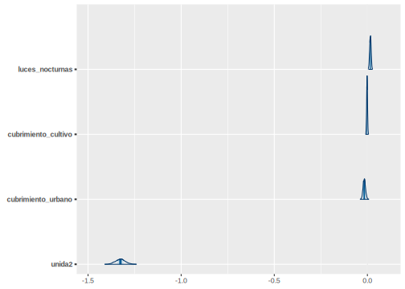


```r
mcmc_trace(fit,pars = var_names)
```

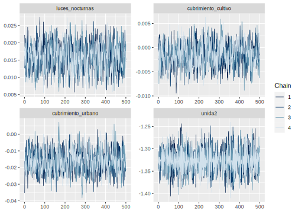


```r
encuesta_mrp2 <- inner_join(encuesta_mrp, statelevel_predictors_df)
y_pred_B <- posterior_epred(fit, newdata = encuesta_mrp2)
rowsrandom <- sample(nrow(y_pred_B), 100)
y_pred2 <- y_pred_B[rowsrandom, ]
ppc_dens_overlay(y = as.numeric(encuesta_mrp2$usametodo), y_pred2) 
```


### Predicción en el censo


```r
poststrat_df <- censo_mrp %>%  
            group_by_at(byAgrega) %>%
            summarise(n = sum(n), .groups = "drop")

poststrat_df <- left_join(poststrat_df, statelevel_predictors_df,   by = "dam2")

epred_mat <- posterior_epred(fit, newdata = poststrat_df, 
                     type = "response", allow.new.levels = TRUE)
```


Asignar la predicción a la base de `poststrat_df`


```r
poststrat_df$epred_mat <- colMeans(epred_mat)
```


### Metodología de Benchmarking

1.  Validarse los nombres de las covariables disponibles en censo y encuesta, que deben ser las mismas con las que se han venido trabajando, para este caso resultaron 


```r
names_cov <- c("area" ,  "etnia" , "edad" , "unida" )
```

2. Calcular las estimaciones para cada una de las variables de la base de datos de `encuesta_mrp` utilizando el indicador de interés. 


```r
encuesta_mrp %<>% mutate(pobreza = usametodo, 
                         dam = substr(dam2,1,2))

paso <- sapply(names_cov, function(byi){
    encuesta_mrp %>% 
    group_by_at(all_of(byi)) %>% 
    summarise(Nhat = sum(fexp),
              t_pobreza = sum(pobreza*fexp),
              medias = weighted.mean(pobreza,fexp))
})

col_names <- names(unlist(paso["t_pobreza",])) 

data.frame( Categoría = unlist(paso["area",]),
           Total = unlist(paso["t_pobreza",]),
           Hat_Media = unlist(paso["medias",])) %>% slice(1:10) %>% 
  tba()
```

<table class="table table-striped lightable-classic" style="width: auto !important; margin-left: auto; margin-right: auto; font-family: Arial Narrow; width: auto !important; margin-left: auto; margin-right: auto;">
 <thead>
  <tr>
   <th style="text-align:left;">   </th>
   <th style="text-align:left;"> Categoría </th>
   <th style="text-align:right;"> Total </th>
   <th style="text-align:right;"> Hat_Media </th>
  </tr>
 </thead>
<tbody>
  <tr>
   <td style="text-align:left;"> area1 </td>
   <td style="text-align:left;"> 0 </td>
   <td style="text-align:right;"> 1621354.9 </td>
   <td style="text-align:right;"> 0.6426 </td>
  </tr>
  <tr>
   <td style="text-align:left;"> area2 </td>
   <td style="text-align:left;"> 1 </td>
   <td style="text-align:right;"> 6369090.8 </td>
   <td style="text-align:right;"> 0.6510 </td>
  </tr>
  <tr>
   <td style="text-align:left;"> etnia1 </td>
   <td style="text-align:left;"> 1 </td>
   <td style="text-align:right;"> 388109.0 </td>
   <td style="text-align:right;"> 0.5720 </td>
  </tr>
  <tr>
   <td style="text-align:left;"> etnia2 </td>
   <td style="text-align:left;"> 2 </td>
   <td style="text-align:right;"> 680752.8 </td>
   <td style="text-align:right;"> 0.6340 </td>
  </tr>
  <tr>
   <td style="text-align:left;"> etnia3 </td>
   <td style="text-align:left;"> 3 </td>
   <td style="text-align:right;"> 6921583.9 </td>
   <td style="text-align:right;"> 0.6558 </td>
  </tr>
  <tr>
   <td style="text-align:left;"> edad1 </td>
   <td style="text-align:left;"> 2 </td>
   <td style="text-align:right;"> 852596.8 </td>
   <td style="text-align:right;"> 0.3413 </td>
  </tr>
  <tr>
   <td style="text-align:left;"> edad2 </td>
   <td style="text-align:left;"> 3 </td>
   <td style="text-align:right;"> 2680194.2 </td>
   <td style="text-align:right;"> 0.6968 </td>
  </tr>
  <tr>
   <td style="text-align:left;"> edad3 </td>
   <td style="text-align:left;"> 4 </td>
   <td style="text-align:right;"> 2337250.5 </td>
   <td style="text-align:right;"> 0.7702 </td>
  </tr>
  <tr>
   <td style="text-align:left;"> edad4 </td>
   <td style="text-align:left;"> 5 </td>
   <td style="text-align:right;"> 2120404.0 </td>
   <td style="text-align:right;"> 0.7244 </td>
  </tr>
  <tr>
   <td style="text-align:left;"> unida1 </td>
   <td style="text-align:left;"> 1 </td>
   <td style="text-align:right;"> 5273609.1 </td>
   <td style="text-align:right;"> 0.8096 </td>
  </tr>
</tbody>
</table>

3.    Crear variables dummys en `poststrat_df` y multiplicar cada variable por la predicción `epred_mat`


```r
poststrat_df %<>%
  fastDummies::dummy_cols(select_columns = names_cov,   remove_selected_columns = FALSE)
poststrat_df %<>% 
       mutate_at(vars(matches("_\\d$")) ,~.*poststrat_df$epred_mat)
tba( poststrat_df %>% select(starts_with("edad"),epred_mat) %>% head(10))
```


4. Con la función `calib` se procede a calcular los $g_k$, verificando que el proceso se haya realizado con éxito y exista convergencia


```r
library(sampling)
poststrat_df$gk <- calib(
  Xs = poststrat_df %>% select(matches("_\\d{,2}$")), ## Variable dummys 
  d = poststrat_df$n,                            ## Conteos en el post-estrato
  total = unlist(paso["t_pobreza",]),            ## Valores objetivo
  method="logit")                                ## Método empleado

checkcalibration(Xs = poststrat_df %>% 
                 select(matches("_\\d{,2}$")), 
                 d = poststrat_df$n,
                 total = unlist(paso["t_pobreza",]),
                 g = poststrat_df$gk)
```

```
## $message
## [1] "the calibration is done"
## 
## $result
## [1] TRUE
## 
## $value
## [1] 1e-06
```

5. Realizar validación sobre los resultados obtenidos. 


```r
hist(poststrat_df$gk)
```

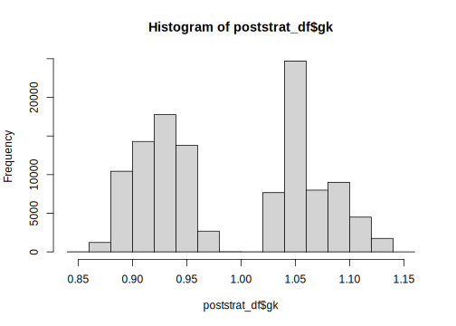

Continuando con la validación se define define la columna `pobreza2`


```r
poststrat_df %<>%
  mutate(pobreza2 = epred_mat *gk,
         pobreza2 = ifelse(pobreza2>1, 1, pobreza2),
         pobreza2 = ifelse(pobreza2<0, 0, pobreza2)) 
```

Paso seguido realizamos el calculo de los totales calibrados. 

```r
temp <- map_df(names_cov ,~ poststrat_df %>% 
              group_by_at(all_of(.x)) %>%
              summarise(
              Nhat = sum(n),
              t_pobreza = sum(n*pobreza2)) %>% 
              transmute(
                Cal_Media = t_pobreza/Nhat,
                Variable = paste0(.x, get(.x) ))) 

data.frame( Categoría = unlist(paso["area",]),
            Hat_Media = unlist(paso["medias",])) %>% 
  cbind(temp) %>% head(10) %>% tba()
```

<table class="table table-striped lightable-classic" style="width: auto !important; margin-left: auto; margin-right: auto; font-family: Arial Narrow; width: auto !important; margin-left: auto; margin-right: auto;">
 <thead>
  <tr>
   <th style="text-align:left;">   </th>
   <th style="text-align:left;"> Categoría </th>
   <th style="text-align:right;"> Hat_Media </th>
   <th style="text-align:right;"> Cal_Media </th>
   <th style="text-align:left;"> Variable </th>
  </tr>
 </thead>
<tbody>
  <tr>
   <td style="text-align:left;"> area1 </td>
   <td style="text-align:left;"> 0 </td>
   <td style="text-align:right;"> 0.6426 </td>
   <td style="text-align:right;"> 0.6351 </td>
   <td style="text-align:left;"> area0 </td>
  </tr>
  <tr>
   <td style="text-align:left;"> area2 </td>
   <td style="text-align:left;"> 1 </td>
   <td style="text-align:right;"> 0.6510 </td>
   <td style="text-align:right;"> 0.6491 </td>
   <td style="text-align:left;"> area1 </td>
  </tr>
  <tr>
   <td style="text-align:left;"> etnia1 </td>
   <td style="text-align:left;"> 1 </td>
   <td style="text-align:right;"> 0.5720 </td>
   <td style="text-align:right;"> 0.5634 </td>
   <td style="text-align:left;"> etnia1 </td>
  </tr>
  <tr>
   <td style="text-align:left;"> etnia2 </td>
   <td style="text-align:left;"> 2 </td>
   <td style="text-align:right;"> 0.6340 </td>
   <td style="text-align:right;"> 0.6268 </td>
   <td style="text-align:left;"> etnia2 </td>
  </tr>
  <tr>
   <td style="text-align:left;"> etnia3 </td>
   <td style="text-align:left;"> 3 </td>
   <td style="text-align:right;"> 0.6558 </td>
   <td style="text-align:right;"> 0.6536 </td>
   <td style="text-align:left;"> etnia3 </td>
  </tr>
  <tr>
   <td style="text-align:left;"> edad1 </td>
   <td style="text-align:left;"> 2 </td>
   <td style="text-align:right;"> 0.3413 </td>
   <td style="text-align:right;"> 0.3391 </td>
   <td style="text-align:left;"> edad2 </td>
  </tr>
  <tr>
   <td style="text-align:left;"> edad2 </td>
   <td style="text-align:left;"> 3 </td>
   <td style="text-align:right;"> 0.6968 </td>
   <td style="text-align:right;"> 0.6944 </td>
   <td style="text-align:left;"> edad3 </td>
  </tr>
  <tr>
   <td style="text-align:left;"> edad3 </td>
   <td style="text-align:left;"> 4 </td>
   <td style="text-align:right;"> 0.7702 </td>
   <td style="text-align:right;"> 0.7670 </td>
   <td style="text-align:left;"> edad4 </td>
  </tr>
  <tr>
   <td style="text-align:left;"> edad4 </td>
   <td style="text-align:left;"> 5 </td>
   <td style="text-align:right;"> 0.7244 </td>
   <td style="text-align:right;"> 0.7204 </td>
   <td style="text-align:left;"> edad5 </td>
  </tr>
  <tr>
   <td style="text-align:left;"> unida1 </td>
   <td style="text-align:left;"> 1 </td>
   <td style="text-align:right;"> 0.8096 </td>
   <td style="text-align:right;"> 0.8585 </td>
   <td style="text-align:left;"> unida1 </td>
  </tr>
</tbody>
</table>

También es posible hacer validaciones visuales. 


```r
library(survey)
library(srvyr)
library(patchwork)
source("Recursos/Día4/Sesion3/0Recursos/funciones_mrp.R")

poststrat_df %<>% mutate(yk_lmer = epred_mat,   yk_bench = pobreza2)

diseno <- encuesta_mrp %>%
  mutate(yk_dir = pobreza,
         dam = substr(dam2,1,2)) %>% 
  as_survey_design(weights = fexp)

bynames <- c("area", "edad", "dam", "etnia")
plot_uni <- map(
  .x = setNames(bynames, bynames),
  ~ plot_compare2(
    sample_diseno = diseno,
    poststrat = poststrat_df,
    by1 = .x
  )
)

plot_uni$dam$Plot$plot1/

(plot_uni$edad$Plot$plot1 +
plot_uni$area$Plot$plot1+ plot_uni$etnia$Plot$plot1)
```


### Estimación y mapa del indicador. 

Después de todos el proceso de estandarización, creación de variables covariables, estimación del modelo y validaciones realizadas, la estimación puntual se reduce a operaciones algebraicas simples. 


```r
poststrat_df2 <-  poststrat_df %>% filter(anoest != "99")

dat_dam2 <- poststrat_df2 %>% group_by(dam2) %>%
    summarise(
      Benchmarking_estimate = sum(n * pobreza2) / sum(n),
      .groups = "drop"
    )
```

En este paso validamos que las estimaciones no superen el valor de 1 o sean menores o iguales a creo. 

```r
dat_dam2 %>% summarise(Validar = sum(Benchmarking_estimate >= 1 |                     Benchmarking_estimate < 0  ))
```


<table>
 <thead>
  <tr>
   <th style="text-align:right;"> Validar </th>
  </tr>
 </thead>
<tbody>
  <tr>
   <td style="text-align:right;"> 0 </td>
  </tr>
</tbody>
</table>

El cuadrado medio del error lo obtenemos con la función `Aux_Agregado` que hemos usado previamente. 


```r
mrp_cme <-
  Aux_Agregado(poststrat = poststrat_df,
             epredmat = epred_mat,
             byMap = "dam2") %>% 
  select(-mrp_estimate)

dat_dam2 <- dat_dam2 %>% left_join(mrp_cme) %>% 
  mutate(mrp_cv = mrp_estimate_se/Benchmarking_estimate*100) %>% 
  arrange(desc(mrp_cv))
tba(dat_dam2 %>% slice(1:10))
```

<table class="table table-striped lightable-classic" style="width: auto !important; margin-left: auto; margin-right: auto; font-family: Arial Narrow; width: auto !important; margin-left: auto; margin-right: auto;">
 <thead>
  <tr>
   <th style="text-align:left;"> dam2 </th>
   <th style="text-align:right;"> Benchmarking_estimate </th>
   <th style="text-align:right;"> mrp_estimate_se </th>
   <th style="text-align:right;"> mrp_cv </th>
  </tr>
 </thead>
<tbody>
  <tr>
   <td style="text-align:left;"> 52354 </td>
   <td style="text-align:right;"> 0.5545 </td>
   <td style="text-align:right;"> 0.0665 </td>
   <td style="text-align:right;"> 11.9972 </td>
  </tr>
  <tr>
   <td style="text-align:left;"> 97511 </td>
   <td style="text-align:right;"> 0.3266 </td>
   <td style="text-align:right;"> 0.0391 </td>
   <td style="text-align:right;"> 11.9696 </td>
  </tr>
  <tr>
   <td style="text-align:left;"> 52320 </td>
   <td style="text-align:right;"> 0.5534 </td>
   <td style="text-align:right;"> 0.0658 </td>
   <td style="text-align:right;"> 11.8920 </td>
  </tr>
  <tr>
   <td style="text-align:left;"> 52215 </td>
   <td style="text-align:right;"> 0.5411 </td>
   <td style="text-align:right;"> 0.0641 </td>
   <td style="text-align:right;"> 11.8418 </td>
  </tr>
  <tr>
   <td style="text-align:left;"> 52506 </td>
   <td style="text-align:right;"> 0.5721 </td>
   <td style="text-align:right;"> 0.0669 </td>
   <td style="text-align:right;"> 11.6874 </td>
  </tr>
  <tr>
   <td style="text-align:left;"> 52317 </td>
   <td style="text-align:right;"> 0.5653 </td>
   <td style="text-align:right;"> 0.0657 </td>
   <td style="text-align:right;"> 11.6244 </td>
  </tr>
  <tr>
   <td style="text-align:left;"> 52022 </td>
   <td style="text-align:right;"> 0.5693 </td>
   <td style="text-align:right;"> 0.0661 </td>
   <td style="text-align:right;"> 11.6069 </td>
  </tr>
  <tr>
   <td style="text-align:left;"> 52565 </td>
   <td style="text-align:right;"> 0.5509 </td>
   <td style="text-align:right;"> 0.0636 </td>
   <td style="text-align:right;"> 11.5405 </td>
  </tr>
  <tr>
   <td style="text-align:left;"> 52699 </td>
   <td style="text-align:right;"> 0.5609 </td>
   <td style="text-align:right;"> 0.0632 </td>
   <td style="text-align:right;"> 11.2701 </td>
  </tr>
  <tr>
   <td style="text-align:left;"> 91263 </td>
   <td style="text-align:right;"> 0.5416 </td>
   <td style="text-align:right;"> 0.0609 </td>
   <td style="text-align:right;"> 11.2383 </td>
  </tr>
</tbody>
</table>


### Mapas para el indicador D6


```r
library(sp)
library(sf)
library(tmap)

ShapeSAE <- read_sf("Recursos/Día4/Sesion3/Shape/COL_dam2.shp")


P1_ingresolp <- tm_shape(ShapeSAE %>%    left_join(dat_dam2,  by = "dam2"))

brks_lp <- c(0, 0.1, 0.2, 0.3, 0.4, 0.5, 0.6, 0.7, 1)
tmap_options(check.and.fix = TRUE)
Mapa_lp <-
  P1_ingresolp + tm_polygons(
    "Benchmarking_estimate",
    breaks = brks_lp,
    title = "D6",
    palette = "-YlOrRd"
  ) + tm_layout(asp = 0)

tmap_save(
  Mapa_lp,
  "UNFPA/D6/Estados2.jpeg",
  width = 6920,
  height = 4080,
  asp = 0
)
Mapa_lp
```


## Estimación del indicador D6m (Uso de métodos anticonceptivos) 

El procedimiento descrito previamente se repite para los indicadores *D6m* y *NI*. 

Lectura de insumos 


```r
encuesta_mrp <- readRDS("Recursos/Día4/Sesion3/UNFPA/D6m/encuesta_mrp.rds")  %>% 
  rename(dam2 = mpio)
statelevel_predictors_df <- readRDS("Recursos/Día4/Sesion3/UNFPA/D6m/statelevel_predictors_df_dam2.rds")
censo_mrp <- readRDS("Recursos/Día4/Sesion3/UNFPA/D6m/censo_mrp.rds")
fit <- readRDS("Recursos/Día4/Sesion3/UNFPA/D6m/fit_bayes.rds")
```

Por el proceso de estandarizado realizado es renombrado el indicador _usamoderno_ como _probreza_, el modelo contemplado para el indicador es:  


```r
fit$call
```

```
## stan_glmer(formula = cbind(pobres, nopobres) ~ (1 | dam2) + (1 | 
##     edad) + (1 | etnia) + (1 | area:anoest) + (1 | edad:anoest) + 
##     tasa_desocupacion + luces_nocturnas + cubrimiento_cultivo + 
##     cubrimiento_urbano + unida, data = encuesta_df_agg, family = binomial(link = "logit"), 
##     verbose = TRUE, cores = 7, chains = 4, iter = 1000)
```

El resultado del modelo es el siguiente. 

```r
tba(coef(fit)$dam2 %>% head(10))
```

<table class="table table-striped lightable-classic" style="width: auto !important; margin-left: auto; margin-right: auto; font-family: Arial Narrow; width: auto !important; margin-left: auto; margin-right: auto;">
 <thead>
  <tr>
   <th style="text-align:left;">   </th>
   <th style="text-align:right;"> (Intercept) </th>
   <th style="text-align:right;"> tasa_desocupacion </th>
   <th style="text-align:right;"> luces_nocturnas </th>
   <th style="text-align:right;"> cubrimiento_cultivo </th>
   <th style="text-align:right;"> cubrimiento_urbano </th>
   <th style="text-align:right;"> unida2 </th>
  </tr>
 </thead>
<tbody>
  <tr>
   <td style="text-align:left;"> 05001 </td>
   <td style="text-align:right;"> 1.0034 </td>
   <td style="text-align:right;"> 19.362 </td>
   <td style="text-align:right;"> 0.016 </td>
   <td style="text-align:right;"> -0.0017 </td>
   <td style="text-align:right;"> -0.0184 </td>
   <td style="text-align:right;"> -1.1321 </td>
  </tr>
  <tr>
   <td style="text-align:left;"> 05002 </td>
   <td style="text-align:right;"> 0.8199 </td>
   <td style="text-align:right;"> 19.362 </td>
   <td style="text-align:right;"> 0.016 </td>
   <td style="text-align:right;"> -0.0017 </td>
   <td style="text-align:right;"> -0.0184 </td>
   <td style="text-align:right;"> -1.1321 </td>
  </tr>
  <tr>
   <td style="text-align:left;"> 05045 </td>
   <td style="text-align:right;"> 1.0810 </td>
   <td style="text-align:right;"> 19.362 </td>
   <td style="text-align:right;"> 0.016 </td>
   <td style="text-align:right;"> -0.0017 </td>
   <td style="text-align:right;"> -0.0184 </td>
   <td style="text-align:right;"> -1.1321 </td>
  </tr>
  <tr>
   <td style="text-align:left;"> 05051 </td>
   <td style="text-align:right;"> 0.8866 </td>
   <td style="text-align:right;"> 19.362 </td>
   <td style="text-align:right;"> 0.016 </td>
   <td style="text-align:right;"> -0.0017 </td>
   <td style="text-align:right;"> -0.0184 </td>
   <td style="text-align:right;"> -1.1321 </td>
  </tr>
  <tr>
   <td style="text-align:left;"> 05059 </td>
   <td style="text-align:right;"> 0.8794 </td>
   <td style="text-align:right;"> 19.362 </td>
   <td style="text-align:right;"> 0.016 </td>
   <td style="text-align:right;"> -0.0017 </td>
   <td style="text-align:right;"> -0.0184 </td>
   <td style="text-align:right;"> -1.1321 </td>
  </tr>
  <tr>
   <td style="text-align:left;"> 05079 </td>
   <td style="text-align:right;"> 0.7799 </td>
   <td style="text-align:right;"> 19.362 </td>
   <td style="text-align:right;"> 0.016 </td>
   <td style="text-align:right;"> -0.0017 </td>
   <td style="text-align:right;"> -0.0184 </td>
   <td style="text-align:right;"> -1.1321 </td>
  </tr>
  <tr>
   <td style="text-align:left;"> 05088 </td>
   <td style="text-align:right;"> 0.8656 </td>
   <td style="text-align:right;"> 19.362 </td>
   <td style="text-align:right;"> 0.016 </td>
   <td style="text-align:right;"> -0.0017 </td>
   <td style="text-align:right;"> -0.0184 </td>
   <td style="text-align:right;"> -1.1321 </td>
  </tr>
  <tr>
   <td style="text-align:left;"> 05129 </td>
   <td style="text-align:right;"> 1.0017 </td>
   <td style="text-align:right;"> 19.362 </td>
   <td style="text-align:right;"> 0.016 </td>
   <td style="text-align:right;"> -0.0017 </td>
   <td style="text-align:right;"> -0.0184 </td>
   <td style="text-align:right;"> -1.1321 </td>
  </tr>
  <tr>
   <td style="text-align:left;"> 05134 </td>
   <td style="text-align:right;"> 0.7613 </td>
   <td style="text-align:right;"> 19.362 </td>
   <td style="text-align:right;"> 0.016 </td>
   <td style="text-align:right;"> -0.0017 </td>
   <td style="text-align:right;"> -0.0184 </td>
   <td style="text-align:right;"> -1.1321 </td>
  </tr>
  <tr>
   <td style="text-align:left;"> 05154 </td>
   <td style="text-align:right;"> 0.8572 </td>
   <td style="text-align:right;"> 19.362 </td>
   <td style="text-align:right;"> 0.016 </td>
   <td style="text-align:right;"> -0.0017 </td>
   <td style="text-align:right;"> -0.0184 </td>
   <td style="text-align:right;"> -1.1321 </td>
  </tr>
</tbody>
</table>

### Validación del modelo 


```r
library(posterior)
library(bayesplot)
posterior <- as.array(fit)
mcmc_areas(fit, pars = var_names)
```

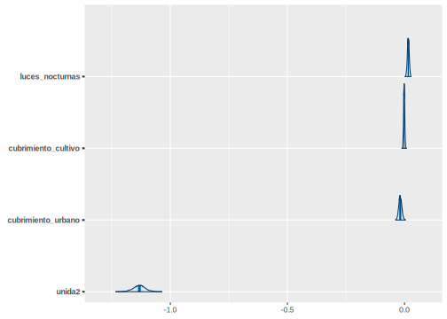


```r
mcmc_trace(fit,pars = var_names)
```

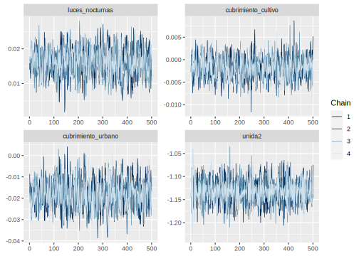


```r
encuesta_mrp2 <- inner_join(encuesta_mrp, statelevel_predictors_df)
y_pred_B <- posterior_epred(fit, newdata = encuesta_mrp2)
rowsrandom <- sample(nrow(y_pred_B), 100)
y_pred2 <- y_pred_B[rowsrandom, ]
ppc_dens_overlay(y = as.numeric(encuesta_mrp2$usamoderno), y_pred2) 
```


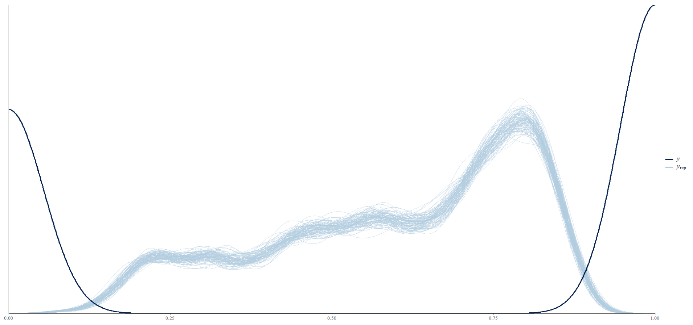

### Predicción en el censo


```r
 byAgrega <- c("dam2", "area", "edad", "etnia",
               "anoest", "unida")

poststrat_df <- censo_mrp %>%  
            group_by_at(byAgrega) %>%
            summarise(n = sum(n), .groups = "drop")

poststrat_df <- left_join(poststrat_df, statelevel_predictors_df)

epred_mat <- posterior_epred(fit, newdata = poststrat_df, 
                     type = "response", allow.new.levels = TRUE)
```

Asignar la predicción a la base de `poststrat_df`


```r
poststrat_df$epred_mat <- colMeans(epred_mat)
```


### Metodología Benchmarking

1.  Validarse los nombres de las covariables disponibles en censo y encuesta, que deben ser las mismas con las que se han venido trabajando, para este caso resultaron 


```r
names_cov <- c("area" , "etnia", "edad" , "unida")
```

2. Calcular las estimaciones para cada una de las variables de la base de datos de `encuesta_mrp` utilizando el indicador de interés. 


```r
encuesta_mrp %<>% mutate(pobreza = usamoderno)

paso <- sapply(names_cov, function(byi){
    encuesta_mrp %>% 
    group_by_at(all_of(byi)) %>% 
    summarise(Nhat = sum(fexp),
              t_pobreza = sum(pobreza*fexp),
              medias = weighted.mean(pobreza,fexp))
})

data.frame( Categoría = unlist(paso["area",]),
           Total = unlist(paso["t_pobreza",]),
           Hat_Media = unlist(paso["medias",])) %>% head(10) %>% 
  tba()
```

<table class="table table-striped lightable-classic" style="width: auto !important; margin-left: auto; margin-right: auto; font-family: Arial Narrow; width: auto !important; margin-left: auto; margin-right: auto;">
 <thead>
  <tr>
   <th style="text-align:left;">   </th>
   <th style="text-align:left;"> Categoría </th>
   <th style="text-align:right;"> Total </th>
   <th style="text-align:right;"> Hat_Media </th>
  </tr>
 </thead>
<tbody>
  <tr>
   <td style="text-align:left;"> area1 </td>
   <td style="text-align:left;"> 0 </td>
   <td style="text-align:right;"> 1519271.0 </td>
   <td style="text-align:right;"> 0.6021 </td>
  </tr>
  <tr>
   <td style="text-align:left;"> area2 </td>
   <td style="text-align:left;"> 1 </td>
   <td style="text-align:right;"> 6042104.9 </td>
   <td style="text-align:right;"> 0.6176 </td>
  </tr>
  <tr>
   <td style="text-align:left;"> etnia1 </td>
   <td style="text-align:left;"> 1 </td>
   <td style="text-align:right;"> 356669.0 </td>
   <td style="text-align:right;"> 0.5256 </td>
  </tr>
  <tr>
   <td style="text-align:left;"> etnia2 </td>
   <td style="text-align:left;"> 2 </td>
   <td style="text-align:right;"> 645136.1 </td>
   <td style="text-align:right;"> 0.6008 </td>
  </tr>
  <tr>
   <td style="text-align:left;"> etnia3 </td>
   <td style="text-align:left;"> 3 </td>
   <td style="text-align:right;"> 6559570.8 </td>
   <td style="text-align:right;"> 0.6215 </td>
  </tr>
  <tr>
   <td style="text-align:left;"> edad1 </td>
   <td style="text-align:left;"> 2 </td>
   <td style="text-align:right;"> 804761.1 </td>
   <td style="text-align:right;"> 0.3221 </td>
  </tr>
  <tr>
   <td style="text-align:left;"> edad2 </td>
   <td style="text-align:left;"> 3 </td>
   <td style="text-align:right;"> 2557478.3 </td>
   <td style="text-align:right;"> 0.6649 </td>
  </tr>
  <tr>
   <td style="text-align:left;"> edad3 </td>
   <td style="text-align:left;"> 4 </td>
   <td style="text-align:right;"> 2210122.9 </td>
   <td style="text-align:right;"> 0.7283 </td>
  </tr>
  <tr>
   <td style="text-align:left;"> edad4 </td>
   <td style="text-align:left;"> 5 </td>
   <td style="text-align:right;"> 1989013.6 </td>
   <td style="text-align:right;"> 0.6796 </td>
  </tr>
  <tr>
   <td style="text-align:left;"> unida1 </td>
   <td style="text-align:left;"> 1 </td>
   <td style="text-align:right;"> 4946711.0 </td>
   <td style="text-align:right;"> 0.7594 </td>
  </tr>
</tbody>
</table>

3.    Crear variables dummys en `poststrat_df` y multiplicar cada variable por la predicción `epred_mat`


```r
poststrat_df %<>%
  fastDummies::dummy_cols(select_columns = names_cov,   remove_selected_columns = FALSE)
poststrat_df %<>% 
       mutate_at(vars(matches("_\\d$")) ,~.*poststrat_df$epred_mat)
```


4. Con la función `calib` se procede a calcular los $g_k$, verificando que el proceso se haya realizado con éxito y exista convergencia


```r
library(sampling)

poststrat_df$gk <- calib(
  Xs = poststrat_df %>% select(matches("_\\d{,2}$")), ## Variable dummys 
  d = poststrat_df$n,                            ## Conteos en el post-estrato
  total = unlist(paso["t_pobreza",]),            ## Valores objetivo
  method="logit")                                ## Método empleado

checkcalibration(Xs = poststrat_df %>% 
                 select(matches("_\\d{,2}$")), 
                 d = poststrat_df$n,
                 total = unlist(paso["t_pobreza",]),
                 g = poststrat_df$gk)
```

```
## $message
## [1] "the calibration is done"
## 
## $result
## [1] TRUE
## 
## $value
## [1] 1e-06
```

5. Realizar validación sobre los resultados obtenidos. 


```r
hist(poststrat_df$gk)
```

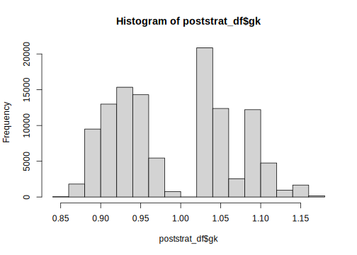

Continuando con la validación se define define la columna `pobreza2`


```r
poststrat_df %<>%
  mutate(pobreza2 = epred_mat *gk,
         pobreza2 = ifelse(pobreza2>1, 1, pobreza2),
         pobreza2 = ifelse(pobreza2<0, 0, pobreza2)) 
```

Paso seguido realizamos el calculo de los totales calibrados. 

```r
temp <- map_df(names_cov ,~ poststrat_df %>% 
              group_by_at(all_of(.x)) %>%
              summarise(
              Nhat = sum(n),
              t_pobreza = sum(n*pobreza2)) %>% 
              transmute(
                Cal_Media = t_pobreza/Nhat,
                Variable = paste0(.x, get(.x) ))) 

data.frame( Categoría = unlist(paso["area",]),
            Hat_Media = unlist(paso["medias",])) %>% 
  cbind(temp) %>% head(10) %>% tba()
```

<table class="table table-striped lightable-classic" style="width: auto !important; margin-left: auto; margin-right: auto; font-family: Arial Narrow; width: auto !important; margin-left: auto; margin-right: auto;">
 <thead>
  <tr>
   <th style="text-align:left;">   </th>
   <th style="text-align:left;"> Categoría </th>
   <th style="text-align:right;"> Hat_Media </th>
   <th style="text-align:right;"> Cal_Media </th>
   <th style="text-align:left;"> Variable </th>
  </tr>
 </thead>
<tbody>
  <tr>
   <td style="text-align:left;"> area1 </td>
   <td style="text-align:left;"> 0 </td>
   <td style="text-align:right;"> 0.6021 </td>
   <td style="text-align:right;"> 0.5951 </td>
   <td style="text-align:left;"> area0 </td>
  </tr>
  <tr>
   <td style="text-align:left;"> area2 </td>
   <td style="text-align:left;"> 1 </td>
   <td style="text-align:right;"> 0.6176 </td>
   <td style="text-align:right;"> 0.6158 </td>
   <td style="text-align:left;"> area1 </td>
  </tr>
  <tr>
   <td style="text-align:left;"> etnia1 </td>
   <td style="text-align:left;"> 1 </td>
   <td style="text-align:right;"> 0.5256 </td>
   <td style="text-align:right;"> 0.5178 </td>
   <td style="text-align:left;"> etnia1 </td>
  </tr>
  <tr>
   <td style="text-align:left;"> etnia2 </td>
   <td style="text-align:left;"> 2 </td>
   <td style="text-align:right;"> 0.6008 </td>
   <td style="text-align:right;"> 0.5940 </td>
   <td style="text-align:left;"> etnia2 </td>
  </tr>
  <tr>
   <td style="text-align:left;"> etnia3 </td>
   <td style="text-align:left;"> 3 </td>
   <td style="text-align:right;"> 0.6215 </td>
   <td style="text-align:right;"> 0.6194 </td>
   <td style="text-align:left;"> etnia3 </td>
  </tr>
  <tr>
   <td style="text-align:left;"> edad1 </td>
   <td style="text-align:left;"> 2 </td>
   <td style="text-align:right;"> 0.3221 </td>
   <td style="text-align:right;"> 0.3201 </td>
   <td style="text-align:left;"> edad2 </td>
  </tr>
  <tr>
   <td style="text-align:left;"> edad2 </td>
   <td style="text-align:left;"> 3 </td>
   <td style="text-align:right;"> 0.6649 </td>
   <td style="text-align:right;"> 0.6627 </td>
   <td style="text-align:left;"> edad3 </td>
  </tr>
  <tr>
   <td style="text-align:left;"> edad3 </td>
   <td style="text-align:left;"> 4 </td>
   <td style="text-align:right;"> 0.7283 </td>
   <td style="text-align:right;"> 0.7252 </td>
   <td style="text-align:left;"> edad4 </td>
  </tr>
  <tr>
   <td style="text-align:left;"> edad4 </td>
   <td style="text-align:left;"> 5 </td>
   <td style="text-align:right;"> 0.6796 </td>
   <td style="text-align:right;"> 0.6758 </td>
   <td style="text-align:left;"> edad5 </td>
  </tr>
  <tr>
   <td style="text-align:left;"> unida1 </td>
   <td style="text-align:left;"> 1 </td>
   <td style="text-align:right;"> 0.7594 </td>
   <td style="text-align:right;"> 0.8053 </td>
   <td style="text-align:left;"> unida1 </td>
  </tr>
</tbody>
</table>

También es posible hacer validaciones visuales. 


```r
library(survey)
library(srvyr)
library(patchwork)
source("Recursos/Día4/Sesion3/0Recursos/funciones_mrp.R")

poststrat_df %<>% mutate(yk_lmer = epred_mat,   yk_bench = pobreza2)


diseno <- encuesta_mrp %>%
  mutate(yk_dir = pobreza,
         dam = substr(dam2,1,2)) %>% 
  as_survey_design(weights = fexp)

bynames <- c("area", "edad", "dam", "etnia")
plot_uni <- map(
  .x = setNames(bynames, bynames),
  ~ plot_compare2(
    sample_diseno = diseno,
    poststrat = poststrat_df,
    by1 = .x
  )
)

plot_uni$dam$Plot$plot1/

(plot_uni$edad$Plot$plot1 +
plot_uni$area$Plot$plot1+ plot_uni$etnia$Plot$plot1)
```


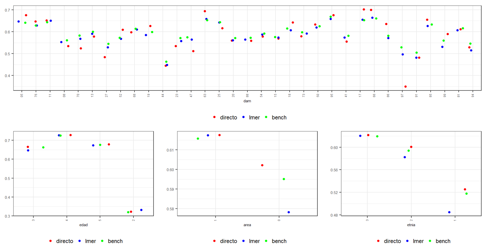

### Estimación y mapa del indicador D6m. 

Después de todos el proceso de estandarización, creación de variables covariables, estimación del modelo y validaciones realizadas, la estimación puntual se reduce a operaciones algebraicas simples. 


```r
poststrat_df2 <-  poststrat_df %>% filter(anoest != "99")

dat_dam2 <- poststrat_df2 %>% group_by(dam2) %>%
    summarise(
      Benchmarking_estimate = sum(n * pobreza2) / sum(n),
      .groups = "drop"
    )
```


El cuadrado medio del error lo obtenemos con la función `Aux_Agregado` que hemos usado previamente. 


```r
mrp_cme <-
  Aux_Agregado(poststrat = poststrat_df,
             epredmat = epred_mat,
             byMap = "dam2") %>% 
  select(-mrp_estimate)

dat_dam2 <- dat_dam2 %>% left_join(mrp_cme) %>% 
  mutate(mrp_cv = mrp_estimate_se/Benchmarking_estimate*100) %>% 
  arrange(desc(mrp_cv))

tba(dat_dam2 %>% slice(1:10))
```

<table class="table table-striped lightable-classic" style="width: auto !important; margin-left: auto; margin-right: auto; font-family: Arial Narrow; width: auto !important; margin-left: auto; margin-right: auto;">
 <thead>
  <tr>
   <th style="text-align:left;"> dam2 </th>
   <th style="text-align:right;"> Benchmarking_estimate </th>
   <th style="text-align:right;"> mrp_estimate_se </th>
   <th style="text-align:right;"> mrp_cv </th>
  </tr>
 </thead>
<tbody>
  <tr>
   <td style="text-align:left;"> 97511 </td>
   <td style="text-align:right;"> 0.2607 </td>
   <td style="text-align:right;"> 0.0361 </td>
   <td style="text-align:right;"> 13.8310 </td>
  </tr>
  <tr>
   <td style="text-align:left;"> 52354 </td>
   <td style="text-align:right;"> 0.5225 </td>
   <td style="text-align:right;"> 0.0672 </td>
   <td style="text-align:right;"> 12.8652 </td>
  </tr>
  <tr>
   <td style="text-align:left;"> 52320 </td>
   <td style="text-align:right;"> 0.5193 </td>
   <td style="text-align:right;"> 0.0665 </td>
   <td style="text-align:right;"> 12.8089 </td>
  </tr>
  <tr>
   <td style="text-align:left;"> 52215 </td>
   <td style="text-align:right;"> 0.5038 </td>
   <td style="text-align:right;"> 0.0644 </td>
   <td style="text-align:right;"> 12.7764 </td>
  </tr>
  <tr>
   <td style="text-align:left;"> 52317 </td>
   <td style="text-align:right;"> 0.5245 </td>
   <td style="text-align:right;"> 0.0666 </td>
   <td style="text-align:right;"> 12.7015 </td>
  </tr>
  <tr>
   <td style="text-align:left;"> 52506 </td>
   <td style="text-align:right;"> 0.5374 </td>
   <td style="text-align:right;"> 0.0680 </td>
   <td style="text-align:right;"> 12.6588 </td>
  </tr>
  <tr>
   <td style="text-align:left;"> 52022 </td>
   <td style="text-align:right;"> 0.5299 </td>
   <td style="text-align:right;"> 0.0670 </td>
   <td style="text-align:right;"> 12.6490 </td>
  </tr>
  <tr>
   <td style="text-align:left;"> 91430 </td>
   <td style="text-align:right;"> 0.5016 </td>
   <td style="text-align:right;"> 0.0625 </td>
   <td style="text-align:right;"> 12.4616 </td>
  </tr>
  <tr>
   <td style="text-align:left;"> 52565 </td>
   <td style="text-align:right;"> 0.5200 </td>
   <td style="text-align:right;"> 0.0643 </td>
   <td style="text-align:right;"> 12.3592 </td>
  </tr>
  <tr>
   <td style="text-align:left;"> 15223 </td>
   <td style="text-align:right;"> 0.5219 </td>
   <td style="text-align:right;"> 0.0645 </td>
   <td style="text-align:right;"> 12.3547 </td>
  </tr>
</tbody>
</table>


### Mapas para el indicador D6m


```r
library(sp)
library(sf)
library(tmap)
ShapeSAE <- read_sf("Recursos/Día4/Sesion3/Shape/COL_dam2.shp")

P1_ingresolp <- tm_shape(ShapeSAE %>%    left_join(dat_dam2,  by = "dam2"))

brks_lp <- c(0, 0.1, 0.2, 0.3, 0.4, 0.5, 0.6, 0.7, 1)
tmap_options(check.and.fix = TRUE)
Mapa_lp <-
  P1_ingresolp + tm_polygons(
    "Benchmarking_estimate",
    breaks = brks_lp,
    title = "D6m",
    palette = "-YlOrRd"
  ) + tm_layout(asp = 0)

tmap_save(
  Mapa_lp,
  "Recursos/Día4/Sesion3/UNFPA/D6m/Estados2.jpeg",
  width = 6920,
  height = 4080,
  asp = 0
)
Mapa_lp
```


## Estimación del indicador NI (Necesidades Insatisfechas) 

Lectura de insumos 


```r
encuesta_mrp <- readRDS("Recursos/Día4/Sesion3/UNFPA/NI/encuesta_mrp.rds") %>% 
  rename(dam2 = mpio)
statelevel_predictors_df <- readRDS("Recursos/Día4/Sesion3/UNFPA/NI/statelevel_predictors_df_dam2.rds")
censo_mrp <- readRDS("Recursos/Día4/Sesion3/UNFPA/NI/censo_mrp.rds")
fit <- readRDS("Recursos/Día4/Sesion3/UNFPA/NI/fit_bayes.rds")
```

Por el proceso de estandarizado realizado es renombrado el indicador _necesInst_ como _probreza_, el modelo contemplado para el indicador es:  


```r
fit$call
```

```
## stan_glmer(formula = cbind(pobres, nopobres) ~ (1 | dam2) + (1 | 
##     edad) + (1 | etnia) + (1 | area:anoest) + (1 | edad:anoest) + 
##     tasa_desocupacion + luces_nocturnas + cubrimiento_cultivo + 
##     cubrimiento_urbano + unida, data = encuesta_df_agg, family = binomial(link = "logit"), 
##     verbose = TRUE, cores = 7, chains = 4, iter = 1000)
```

El resultado del modelo es el siguiente. 

```r
tba(coef(fit)$dam2 %>% head(10))
```

<table class="table table-striped lightable-classic" style="width: auto !important; margin-left: auto; margin-right: auto; font-family: Arial Narrow; width: auto !important; margin-left: auto; margin-right: auto;">
 <thead>
  <tr>
   <th style="text-align:left;">   </th>
   <th style="text-align:right;"> (Intercept) </th>
   <th style="text-align:right;"> tasa_desocupacion </th>
   <th style="text-align:right;"> luces_nocturnas </th>
   <th style="text-align:right;"> cubrimiento_cultivo </th>
   <th style="text-align:right;"> cubrimiento_urbano </th>
   <th style="text-align:right;"> unida2 </th>
  </tr>
 </thead>
<tbody>
  <tr>
   <td style="text-align:left;"> 05001 </td>
   <td style="text-align:right;"> -2.0367 </td>
   <td style="text-align:right;"> -9.805 </td>
   <td style="text-align:right;"> -0.006 </td>
   <td style="text-align:right;"> -0.0102 </td>
   <td style="text-align:right;"> 0.0086 </td>
   <td style="text-align:right;"> -0.6534 </td>
  </tr>
  <tr>
   <td style="text-align:left;"> 05002 </td>
   <td style="text-align:right;"> -2.2247 </td>
   <td style="text-align:right;"> -9.805 </td>
   <td style="text-align:right;"> -0.006 </td>
   <td style="text-align:right;"> -0.0102 </td>
   <td style="text-align:right;"> 0.0086 </td>
   <td style="text-align:right;"> -0.6534 </td>
  </tr>
  <tr>
   <td style="text-align:left;"> 05045 </td>
   <td style="text-align:right;"> -2.3102 </td>
   <td style="text-align:right;"> -9.805 </td>
   <td style="text-align:right;"> -0.006 </td>
   <td style="text-align:right;"> -0.0102 </td>
   <td style="text-align:right;"> 0.0086 </td>
   <td style="text-align:right;"> -0.6534 </td>
  </tr>
  <tr>
   <td style="text-align:left;"> 05051 </td>
   <td style="text-align:right;"> -2.0963 </td>
   <td style="text-align:right;"> -9.805 </td>
   <td style="text-align:right;"> -0.006 </td>
   <td style="text-align:right;"> -0.0102 </td>
   <td style="text-align:right;"> 0.0086 </td>
   <td style="text-align:right;"> -0.6534 </td>
  </tr>
  <tr>
   <td style="text-align:left;"> 05059 </td>
   <td style="text-align:right;"> -2.0905 </td>
   <td style="text-align:right;"> -9.805 </td>
   <td style="text-align:right;"> -0.006 </td>
   <td style="text-align:right;"> -0.0102 </td>
   <td style="text-align:right;"> 0.0086 </td>
   <td style="text-align:right;"> -0.6534 </td>
  </tr>
  <tr>
   <td style="text-align:left;"> 05079 </td>
   <td style="text-align:right;"> -2.0638 </td>
   <td style="text-align:right;"> -9.805 </td>
   <td style="text-align:right;"> -0.006 </td>
   <td style="text-align:right;"> -0.0102 </td>
   <td style="text-align:right;"> 0.0086 </td>
   <td style="text-align:right;"> -0.6534 </td>
  </tr>
  <tr>
   <td style="text-align:left;"> 05088 </td>
   <td style="text-align:right;"> -1.8973 </td>
   <td style="text-align:right;"> -9.805 </td>
   <td style="text-align:right;"> -0.006 </td>
   <td style="text-align:right;"> -0.0102 </td>
   <td style="text-align:right;"> 0.0086 </td>
   <td style="text-align:right;"> -0.6534 </td>
  </tr>
  <tr>
   <td style="text-align:left;"> 05129 </td>
   <td style="text-align:right;"> -2.0657 </td>
   <td style="text-align:right;"> -9.805 </td>
   <td style="text-align:right;"> -0.006 </td>
   <td style="text-align:right;"> -0.0102 </td>
   <td style="text-align:right;"> 0.0086 </td>
   <td style="text-align:right;"> -0.6534 </td>
  </tr>
  <tr>
   <td style="text-align:left;"> 05134 </td>
   <td style="text-align:right;"> -2.2877 </td>
   <td style="text-align:right;"> -9.805 </td>
   <td style="text-align:right;"> -0.006 </td>
   <td style="text-align:right;"> -0.0102 </td>
   <td style="text-align:right;"> 0.0086 </td>
   <td style="text-align:right;"> -0.6534 </td>
  </tr>
  <tr>
   <td style="text-align:left;"> 05154 </td>
   <td style="text-align:right;"> -2.1144 </td>
   <td style="text-align:right;"> -9.805 </td>
   <td style="text-align:right;"> -0.006 </td>
   <td style="text-align:right;"> -0.0102 </td>
   <td style="text-align:right;"> 0.0086 </td>
   <td style="text-align:right;"> -0.6534 </td>
  </tr>
</tbody>
</table>

### Validación del modelo 


```r
library(posterior)
library(bayesplot)
posterior <- as.array(fit)
mcmc_areas(fit, pars = var_names)
```

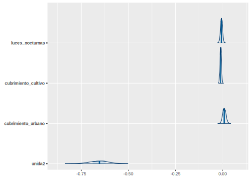


```r
mcmc_trace(fit,pars = var_names)
```

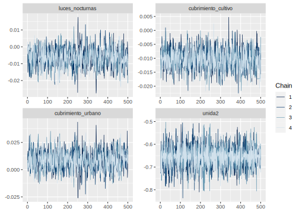


```r
encuesta_mrp2 <- inner_join(encuesta_mrp, statelevel_predictors_df)
y_pred_B <- posterior_epred(fit, newdata = encuesta_mrp2)
rowsrandom <- sample(nrow(y_pred_B), 100)
y_pred2 <- y_pred_B[rowsrandom, ]
ppc_dens_overlay(y = as.numeric(encuesta_mrp2$necesInst), y_pred2) 
```


### Predicción en el censo


```r
poststrat_df <- censo_mrp %>%  
            group_by_at(byAgrega) %>%
            summarise(n = sum(n), .groups = "drop")

poststrat_df <- left_join(poststrat_df, statelevel_predictors_df)

epred_mat <- posterior_epred(fit, newdata = poststrat_df, 
                     type = "response", allow.new.levels = TRUE)
```

Asignar la predicción a la base de `poststrat_df`


```r
poststrat_df$epred_mat <- colMeans(epred_mat)
```


### Metodología de Benchmarking

1.  Validarse los nombres de las covariables disponibles en censo y encuesta, que deben ser las mismas con las que se han venido trabajando, para este caso resultaron 


```r
names_cov <- c("area",  "etnia", "edad" , "unida" )
```

2. Calcular las estimaciones para cada una de las variables de la base de datos de `encuesta_mrp` utilizando el indicador de interés. 


```r
encuesta_mrp %<>% mutate(pobreza = necesInst)

paso <- sapply(names_cov, function(byi){
    encuesta_mrp %>% 
    group_by_at(all_of(byi)) %>% 
    summarise(Nhat = sum(fexp),
              t_pobreza = sum(pobreza*fexp),
              medias = weighted.mean(pobreza,fexp))
})

data.frame( Categoría = unlist(paso["area",]),
           Total = unlist(paso["t_pobreza",]),
           Hat_Media = unlist(paso["medias",])) %>% 
  head(10) %>% tba()
```

<table class="table table-striped lightable-classic" style="width: auto !important; margin-left: auto; margin-right: auto; font-family: Arial Narrow; width: auto !important; margin-left: auto; margin-right: auto;">
 <thead>
  <tr>
   <th style="text-align:left;">   </th>
   <th style="text-align:left;"> Categoría </th>
   <th style="text-align:right;"> Total </th>
   <th style="text-align:right;"> Hat_Media </th>
  </tr>
 </thead>
<tbody>
  <tr>
   <td style="text-align:left;"> area1 </td>
   <td style="text-align:left;"> 0 </td>
   <td style="text-align:right;"> 190593.78 </td>
   <td style="text-align:right;"> 0.0755 </td>
  </tr>
  <tr>
   <td style="text-align:left;"> area2 </td>
   <td style="text-align:left;"> 1 </td>
   <td style="text-align:right;"> 527643.13 </td>
   <td style="text-align:right;"> 0.0539 </td>
  </tr>
  <tr>
   <td style="text-align:left;"> etnia1 </td>
   <td style="text-align:left;"> 1 </td>
   <td style="text-align:right;"> 61766.89 </td>
   <td style="text-align:right;"> 0.0910 </td>
  </tr>
  <tr>
   <td style="text-align:left;"> etnia2 </td>
   <td style="text-align:left;"> 2 </td>
   <td style="text-align:right;"> 77274.24 </td>
   <td style="text-align:right;"> 0.0720 </td>
  </tr>
  <tr>
   <td style="text-align:left;"> etnia3 </td>
   <td style="text-align:left;"> 3 </td>
   <td style="text-align:right;"> 579195.78 </td>
   <td style="text-align:right;"> 0.0549 </td>
  </tr>
  <tr>
   <td style="text-align:left;"> edad1 </td>
   <td style="text-align:left;"> 2 </td>
   <td style="text-align:right;"> 174822.54 </td>
   <td style="text-align:right;"> 0.0700 </td>
  </tr>
  <tr>
   <td style="text-align:left;"> edad2 </td>
   <td style="text-align:left;"> 3 </td>
   <td style="text-align:right;"> 291849.88 </td>
   <td style="text-align:right;"> 0.0759 </td>
  </tr>
  <tr>
   <td style="text-align:left;"> edad3 </td>
   <td style="text-align:left;"> 4 </td>
   <td style="text-align:right;"> 132394.00 </td>
   <td style="text-align:right;"> 0.0436 </td>
  </tr>
  <tr>
   <td style="text-align:left;"> edad4 </td>
   <td style="text-align:left;"> 5 </td>
   <td style="text-align:right;"> 119170.49 </td>
   <td style="text-align:right;"> 0.0407 </td>
  </tr>
  <tr>
   <td style="text-align:left;"> unida1 </td>
   <td style="text-align:left;"> 1 </td>
   <td style="text-align:right;"> 435117.28 </td>
   <td style="text-align:right;"> 0.0668 </td>
  </tr>
</tbody>
</table>

3.    Crear variables dummys en `poststrat_df` y multiplicar cada variable por la predicción `epred_mat`


```r
poststrat_df %<>%
  fastDummies::dummy_cols(select_columns = names_cov,   remove_selected_columns = FALSE)
poststrat_df %<>% 
       mutate_at(vars(matches("_\\d$")) ,~.*poststrat_df$epred_mat)
```


4. Con la función `calib` se procede a calcular los $g_k$, verificando que el proceso se haya realizado con éxito y exista convergencia


```r
library(sampling)

poststrat_df$gk <- calib(
  Xs = poststrat_df %>% select(matches("_\\d{,2}$")), ## Variable dummys 
  d = poststrat_df$n,                            ## Conteos en el post-estrato
  total = unlist(paso["t_pobreza",]),            ## Valores objetivo
  method="logit")                                ## Método empleado

checkcalibration(Xs = poststrat_df %>% 
                 select(matches("_\\d{,2}$")), 
                 d = poststrat_df$n,
                 total = unlist(paso["t_pobreza",]),
                 g = poststrat_df$gk)
```

```
## $message
## [1] "the calibration is done"
## 
## $result
## [1] TRUE
## 
## $value
## [1] 1e-06
```

5. Realizar validación sobre los resultados obtenidos. 


```r
hist(poststrat_df$gk)
```

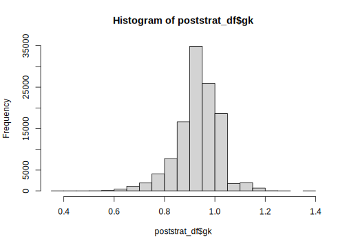

Continuando con la validación se define define la columna `pobreza2`


```r
poststrat_df %<>%
  mutate(pobreza2 = epred_mat *gk,
         pobreza2 = ifelse(pobreza2>1, 1, pobreza2),
         pobreza2 = ifelse(pobreza2<0, 0, pobreza2)) 
```

Paso seguido realizamos el calculo de los totales calibrados. 

```r
temp <- map_df(names_cov ,~ poststrat_df %>% 
              group_by_at(all_of(.x)) %>%
              summarise(
              Nhat = sum(n),
              t_pobreza = sum(n*pobreza2)) %>% 
              transmute(
                Cal_Media = t_pobreza/Nhat,
                Variable = paste0(.x, get(.x) ))) 

data.frame( Categoría = unlist(paso["area",]),
            Hat_Media = unlist(paso["medias",])) %>% 
  cbind(temp) %>% head(10) %>% tba()
```

<table class="table table-striped lightable-classic" style="width: auto !important; margin-left: auto; margin-right: auto; font-family: Arial Narrow; width: auto !important; margin-left: auto; margin-right: auto;">
 <thead>
  <tr>
   <th style="text-align:left;">   </th>
   <th style="text-align:left;"> Categoría </th>
   <th style="text-align:right;"> Hat_Media </th>
   <th style="text-align:right;"> Cal_Media </th>
   <th style="text-align:left;"> Variable </th>
  </tr>
 </thead>
<tbody>
  <tr>
   <td style="text-align:left;"> area1 </td>
   <td style="text-align:left;"> 0 </td>
   <td style="text-align:right;"> 0.0755 </td>
   <td style="text-align:right;"> 0.0747 </td>
   <td style="text-align:left;"> area0 </td>
  </tr>
  <tr>
   <td style="text-align:left;"> area2 </td>
   <td style="text-align:left;"> 1 </td>
   <td style="text-align:right;"> 0.0539 </td>
   <td style="text-align:right;"> 0.0538 </td>
   <td style="text-align:left;"> area1 </td>
  </tr>
  <tr>
   <td style="text-align:left;"> etnia1 </td>
   <td style="text-align:left;"> 1 </td>
   <td style="text-align:right;"> 0.0910 </td>
   <td style="text-align:right;"> 0.0897 </td>
   <td style="text-align:left;"> etnia1 </td>
  </tr>
  <tr>
   <td style="text-align:left;"> etnia2 </td>
   <td style="text-align:left;"> 2 </td>
   <td style="text-align:right;"> 0.0720 </td>
   <td style="text-align:right;"> 0.0711 </td>
   <td style="text-align:left;"> etnia2 </td>
  </tr>
  <tr>
   <td style="text-align:left;"> etnia3 </td>
   <td style="text-align:left;"> 3 </td>
   <td style="text-align:right;"> 0.0549 </td>
   <td style="text-align:right;"> 0.0547 </td>
   <td style="text-align:left;"> etnia3 </td>
  </tr>
  <tr>
   <td style="text-align:left;"> edad1 </td>
   <td style="text-align:left;"> 2 </td>
   <td style="text-align:right;"> 0.0700 </td>
   <td style="text-align:right;"> 0.0695 </td>
   <td style="text-align:left;"> edad2 </td>
  </tr>
  <tr>
   <td style="text-align:left;"> edad2 </td>
   <td style="text-align:left;"> 3 </td>
   <td style="text-align:right;"> 0.0759 </td>
   <td style="text-align:right;"> 0.0756 </td>
   <td style="text-align:left;"> edad3 </td>
  </tr>
  <tr>
   <td style="text-align:left;"> edad3 </td>
   <td style="text-align:left;"> 4 </td>
   <td style="text-align:right;"> 0.0436 </td>
   <td style="text-align:right;"> 0.0434 </td>
   <td style="text-align:left;"> edad4 </td>
  </tr>
  <tr>
   <td style="text-align:left;"> edad4 </td>
   <td style="text-align:left;"> 5 </td>
   <td style="text-align:right;"> 0.0407 </td>
   <td style="text-align:right;"> 0.0405 </td>
   <td style="text-align:left;"> edad5 </td>
  </tr>
  <tr>
   <td style="text-align:left;"> unida1 </td>
   <td style="text-align:left;"> 1 </td>
   <td style="text-align:right;"> 0.0668 </td>
   <td style="text-align:right;"> 0.0708 </td>
   <td style="text-align:left;"> unida1 </td>
  </tr>
</tbody>
</table>

También es posible hacer validaciones visuales. 


```r
library(survey)
library(srvyr)
library(patchwork)
source("Recursos/Día4/Sesion3/0Recursos/funciones_mrp.R")

poststrat_df %<>% mutate(yk_lmer = epred_mat,   yk_bench = pobreza2)

diseno <- encuesta_mrp %>%
  mutate(yk_dir = pobreza,
         dam = substr(dam2,1,2)) %>% 
  as_survey_design(weights = fexp)

bynames <- c("area", "edad", "dam", "etnia")
plot_uni <- map(
  .x = setNames(bynames, bynames),
  ~ plot_compare2(
    sample_diseno = diseno,
    poststrat = poststrat_df,
    by1 = .x
  )
)

plot_uni$dam$Plot$plot1/

(plot_uni$edad$Plot$plot1 +
plot_uni$area$Plot$plot1+ plot_uni$etnia$Plot$plot1)
```


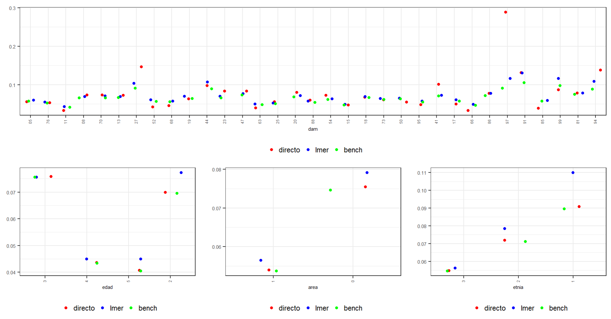

### Estimación y mapa del indicador. 

Después de todos el proceso de estandarización, creación de variables covariables, estimación del modelo y validaciones realizadas, la estimación puntual se reduce a operaciones algebraicas simples. 


```r
poststrat_df2 <-  poststrat_df %>% filter(anoest != "99")

dat_dam2 <- poststrat_df2 %>% group_by(dam2) %>%
    summarise(
      Benchmarking_estimate = sum(n * pobreza2) / sum(n),
      .groups = "drop"
    )
```


El cuadrado medio del error lo obtenemos con la función `Aux_Agregado` que hemos usado previamente. 


```r
mrp_cme <-
  Aux_Agregado(poststrat = poststrat_df,
             epredmat = epred_mat,
             byMap = "dam2") %>% 
  select(-mrp_estimate)

dat_dam2 <- dat_dam2 %>% left_join(mrp_cme) %>% 
  mutate(mrp_cv = mrp_estimate_se/Benchmarking_estimate*100) %>% 
  arrange(desc(mrp_cv))

tba(dat_dam2 %>% slice(1:10))
```

<table class="table table-striped lightable-classic" style="width: auto !important; margin-left: auto; margin-right: auto; font-family: Arial Narrow; width: auto !important; margin-left: auto; margin-right: auto;">
 <thead>
  <tr>
   <th style="text-align:left;"> dam2 </th>
   <th style="text-align:right;"> Benchmarking_estimate </th>
   <th style="text-align:right;"> mrp_estimate_se </th>
   <th style="text-align:right;"> mrp_cv </th>
  </tr>
 </thead>
<tbody>
  <tr>
   <td style="text-align:left;"> 52022 </td>
   <td style="text-align:right;"> 0.0479 </td>
   <td style="text-align:right;"> 0.0187 </td>
   <td style="text-align:right;"> 38.9611 </td>
  </tr>
  <tr>
   <td style="text-align:left;"> 15476 </td>
   <td style="text-align:right;"> 0.0342 </td>
   <td style="text-align:right;"> 0.0133 </td>
   <td style="text-align:right;"> 38.7280 </td>
  </tr>
  <tr>
   <td style="text-align:left;"> 15835 </td>
   <td style="text-align:right;"> 0.0369 </td>
   <td style="text-align:right;"> 0.0142 </td>
   <td style="text-align:right;"> 38.5526 </td>
  </tr>
  <tr>
   <td style="text-align:left;"> 15500 </td>
   <td style="text-align:right;"> 0.0358 </td>
   <td style="text-align:right;"> 0.0138 </td>
   <td style="text-align:right;"> 38.4971 </td>
  </tr>
  <tr>
   <td style="text-align:left;"> 52317 </td>
   <td style="text-align:right;"> 0.0535 </td>
   <td style="text-align:right;"> 0.0204 </td>
   <td style="text-align:right;"> 38.1757 </td>
  </tr>
  <tr>
   <td style="text-align:left;"> 52506 </td>
   <td style="text-align:right;"> 0.0376 </td>
   <td style="text-align:right;"> 0.0143 </td>
   <td style="text-align:right;"> 38.0635 </td>
  </tr>
  <tr>
   <td style="text-align:left;"> 19573 </td>
   <td style="text-align:right;"> 0.0422 </td>
   <td style="text-align:right;"> 0.0160 </td>
   <td style="text-align:right;"> 37.9832 </td>
  </tr>
  <tr>
   <td style="text-align:left;"> 15367 </td>
   <td style="text-align:right;"> 0.0389 </td>
   <td style="text-align:right;"> 0.0147 </td>
   <td style="text-align:right;"> 37.7739 </td>
  </tr>
  <tr>
   <td style="text-align:left;"> 19845 </td>
   <td style="text-align:right;"> 0.0430 </td>
   <td style="text-align:right;"> 0.0162 </td>
   <td style="text-align:right;"> 37.6584 </td>
  </tr>
  <tr>
   <td style="text-align:left;"> 27073 </td>
   <td style="text-align:right;"> 0.0925 </td>
   <td style="text-align:right;"> 0.0347 </td>
   <td style="text-align:right;"> 37.5371 </td>
  </tr>
</tbody>
</table>

### Mapas para el indicador NI


```r
library(sp)
library(sf)
library(tmap)

ShapeSAE <- read_sf("Recursos/Día4/Sesion3/Shape/COL_dam2.shp")

P1_ingresolp <- tm_shape(ShapeSAE %>%    left_join(dat_dam2,  by = "dam2"))

tmap_options(check.and.fix = TRUE)
Mapa_lp <-
  P1_ingresolp + tm_polygons(
    "Benchmarking_estimate",
    title = "NI",
    palette = "YlOrRd"
  ) + tm_layout(asp = 0)

tmap_save(
  Mapa_lp,
  "Recursos/Día4/Sesion3/UNFPA/NI/Estados2.jpeg",
  width = 6920,
  height = 4080,
  asp = 0
)
Mapa_lp
```


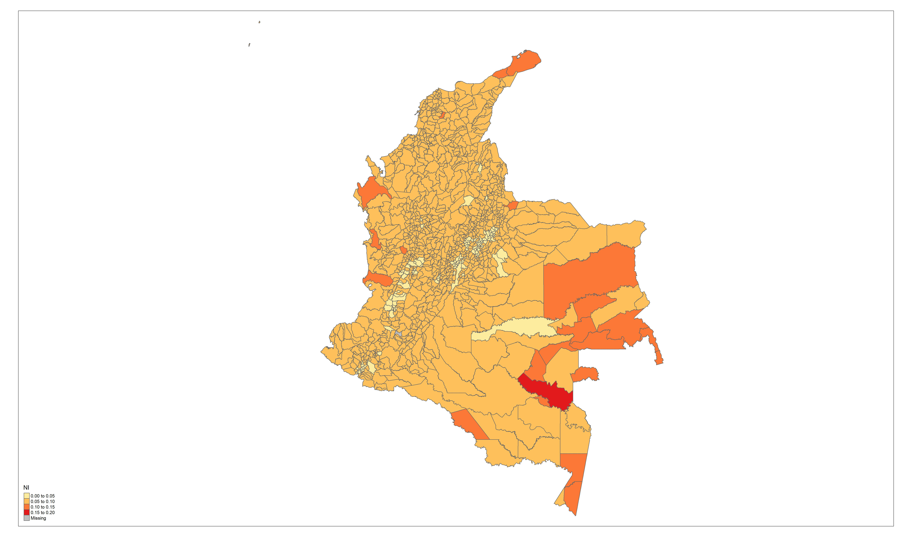

# Día 4 - Sesión 4- Estimación del indicador D7  

Este indicador, hace referencia a la proporción de mujeres en edad de procrear (15 a 49 años), sexualmente activas y/o unidas que han decidido por voluntad propia no tener hijos (adicionales) o posponer su siguiente hijo y para ello se encuentran utilizando métodos anticonceptivos modernos. 

Lectura de insumos 


```r
encuesta_mrp <- readRDS("Recursos/Día4/Sesion3/UNFPA/NI/encuesta_mrp.rds") %>% 
  rename(dam2 = mpio)
censo_mrp <- readRDS("Recursos/Día4/Sesion3/UNFPA/NI/censo_mrp.rds")
statelevel_predictors_df <- readRDS("Recursos/Día4/Sesion3/UNFPA/NI/statelevel_predictors_df_dam2.rds")

fit_mrp_logit_D6  <- readRDS("Recursos/Día4/Sesion3/UNFPA/D6/fit_bayes.rds")
fit_mrp_logit_D6m <- readRDS("Recursos/Día4/Sesion3/UNFPA/D6m/fit_bayes.rds")
fit_mrp_logit_NI  <- readRDS("Recursos/Día4/Sesion3/UNFPA/NI/fit_bayes.rds")
```

## Predicción en el censo


```r
poststrat_df <- censo_mrp %>%  
            group_by_at(byAgrega) %>%
            summarise(n = sum(n), .groups = "drop")

poststrat_df <- left_join(poststrat_df, statelevel_predictors_df,   by = "dam2")
```

Ahora debemos hacer la predicción sobre la base _poststrat_df_ con los tres modelos 

```r
### Creando epredmat Para D6
epred_mat_D6 <- posterior_epred(fit_mrp_logit_D6, newdata = poststrat_df, 
                     type = "response", allow.new.levels = TRUE)

### Creando epredmat Para D6m
epred_mat_D6m <- posterior_epred(fit_mrp_logit_D6m, newdata = poststrat_df,  type = "response", allow.new.levels = TRUE)

### Creando epredmat Para NI
epred_mat_NI <- posterior_epred(fit_mrp_logit_NI, newdata = poststrat_df,  type = "response", allow.new.levels = TRUE)
```

El indicador  *D7* se construye a partir de las predicciones 

```r
epred_mat_D7<- (epred_mat_D6m /(epred_mat_D6 + epred_mat_NI))
```

## Estimación y mapa del indicador. 

Después de todos el proceso de estandarización, creación de variables covariables, estimación del modelo y validaciones realizadas, la estimación puntual se reduce a operaciones algebraicas simples. 


```r
poststrat_df2 <-  poststrat_df %>% filter(anoest != "99")

dat_dam2 <- Aux_Agregado(poststrat = poststrat_df,
                 epredmat = epred_mat_D7,
                 byMap = "dam2") %>% 
  mutate(mrp_cv = mrp_estimate_se/mrp_estimate *100)

dat_dam2 %>% arrange(desc(mrp_cv)) %>% head(10) %>% tba()
```

<table class="table table-striped lightable-classic" style="width: auto !important; margin-left: auto; margin-right: auto; font-family: Arial Narrow; width: auto !important; margin-left: auto; margin-right: auto;">
 <thead>
  <tr>
   <th style="text-align:left;"> dam2 </th>
   <th style="text-align:right;"> mrp_estimate </th>
   <th style="text-align:right;"> mrp_estimate_se </th>
   <th style="text-align:right;"> mrp_cv </th>
  </tr>
 </thead>
<tbody>
  <tr>
   <td style="text-align:left;"> 91460 </td>
   <td style="text-align:right;"> 0.7447 </td>
   <td style="text-align:right;"> 0.1528 </td>
   <td style="text-align:right;"> 20.5164 </td>
  </tr>
  <tr>
   <td style="text-align:left;"> 52022 </td>
   <td style="text-align:right;"> 0.8425 </td>
   <td style="text-align:right;"> 0.1717 </td>
   <td style="text-align:right;"> 20.3786 </td>
  </tr>
  <tr>
   <td style="text-align:left;"> 52317 </td>
   <td style="text-align:right;"> 0.8285 </td>
   <td style="text-align:right;"> 0.1682 </td>
   <td style="text-align:right;"> 20.3028 </td>
  </tr>
  <tr>
   <td style="text-align:left;"> 91263 </td>
   <td style="text-align:right;"> 0.7578 </td>
   <td style="text-align:right;"> 0.1537 </td>
   <td style="text-align:right;"> 20.2748 </td>
  </tr>
  <tr>
   <td style="text-align:left;"> 52215 </td>
   <td style="text-align:right;"> 0.7841 </td>
   <td style="text-align:right;"> 0.1578 </td>
   <td style="text-align:right;"> 20.1266 </td>
  </tr>
  <tr>
   <td style="text-align:left;"> 52320 </td>
   <td style="text-align:right;"> 0.8797 </td>
   <td style="text-align:right;"> 0.1768 </td>
   <td style="text-align:right;"> 20.1027 </td>
  </tr>
  <tr>
   <td style="text-align:left;"> 52506 </td>
   <td style="text-align:right;"> 0.8949 </td>
   <td style="text-align:right;"> 0.1798 </td>
   <td style="text-align:right;"> 20.0952 </td>
  </tr>
  <tr>
   <td style="text-align:left;"> 52354 </td>
   <td style="text-align:right;"> 0.8910 </td>
   <td style="text-align:right;"> 0.1788 </td>
   <td style="text-align:right;"> 20.0690 </td>
  </tr>
  <tr>
   <td style="text-align:left;"> 91430 </td>
   <td style="text-align:right;"> 0.7083 </td>
   <td style="text-align:right;"> 0.1395 </td>
   <td style="text-align:right;"> 19.6924 </td>
  </tr>
  <tr>
   <td style="text-align:left;"> 15835 </td>
   <td style="text-align:right;"> 0.8956 </td>
   <td style="text-align:right;"> 0.1746 </td>
   <td style="text-align:right;"> 19.4928 </td>
  </tr>
</tbody>
</table>

## Mapas para el indicador D7


```r
library(sp)
library(sf)
library(tmap)

ShapeSAE <- read_sf("Recursos/Día4/Sesion3/Shape/COL_dam2.shp")

P1_ingresolp <- tm_shape(ShapeSAE %>% 
                           left_join(dat_dam2,  by = "dam2"))

brks_lp <- c(0, 0.20,  0.4, 0.6,  0.8 , 1)
tmap_options(check.and.fix = TRUE)
Mapa_lp <-
  P1_ingresolp + tm_polygons(
    "mrp_estimate",
    breaks = brks_lp,
    title = "D7",
    palette = "-YlOrRd"
  ) + tm_layout(asp = 0)

tmap_save(
  Mapa_lp,
  "UNFPA/D7/Estados2.jpeg",
  width = 6920,
  height = 4080,
  asp = 0
)
Mapa_lp
```


