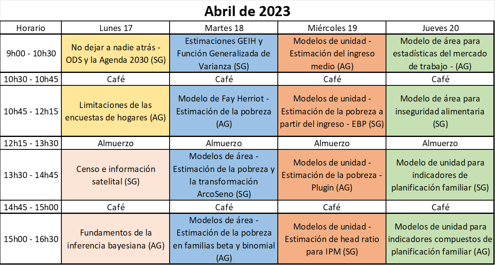

--- 
title: "Desagregación de datos en encuestas de hogares: metodologías bayesianas para modelos de estimación en áreas pequeñas"
author: "Andrés Gutiérrez^[Experto Regional en Estadísticas Sociales - Comisión Económica para América Latina y el Caribe (CEPAL) -  andres.gutierrez@cepal.org], Stalyn Guerrero^[Consultor - Comisión Económica para América Latina y el Caribe (CEPAL), guerrerostalyn@gmail.com]"
date: "2023-03-20"
documentclass: book
# bibliography: [CEPAL.bib]
biblio-style: apalike
link-citations: yes
colorlinks: yes
lot: yes
lof: yes
fontsize: 12pt
geometry: margin = 3cm
header-includes: \usepackage[spanish, spanishkw, onelanguage, linesnumbered]{algorithm2e}
github-repo: psirusteam/HHS-Handbook
description: "Taller de instalación de capacidades en SAE."
knit: "bookdown::render_book"
lang: es
linkcolor: blue
output:
  pdf_document:
    toc: true
    toc_depth: 3
    keep_tex: true
    latex_engine: xelatex
  gitbook:
    df_print: kable
    css: "style.css"
---

# Agenda {-}

# No dejar a nadie atrás - ODS y la Agenda 2030 

[Ver presentación](https://github.com/psirusteam/2023COLsae/blob/main/Recursos/D%C3%ADa1/Sesion1y2/SAE-0%2C-SDGs-and-Surveys.pdf)

# Limitaciones de las encuestas de hogares

[Ver presentación](https://github.com/psirusteam/2023COLsae/blob/main/Recursos/D%C3%ADa1/Sesion1y2/SAE-0%2C-SDGs-and-Surveys.pdf)
